Easy-level frontend interview questions covering HTML, CSS, JavaScript, React, and Vue fundamentals.

## Q1: What is the DOM and how does it work?

**Answer**:


**DOM (Document Object Model)**: Tree-like representation of HTML document that JavaScript can manipulate.

### DOM Manipulation

```javascript
// Select elements
const element = document.getElementById('myId');
const elements = document.querySelectorAll('.myClass');

// Modify content
element.textContent = 'New text';
element.innerHTML = '<strong>Bold text</strong>';

// Modify attributes
element.setAttribute('class', 'new-class');
element.style.color = 'red';

// Create and append
const newDiv = document.createElement('div');
newDiv.textContent = 'Hello';
document.body.appendChild(newDiv);
```

---

## Q2: Explain the CSS Box Model.

**Answer**:


### Visual Representation

```mermaid
graph TB
    subgraph Margin
        subgraph Border
            subgraph Padding
                A[Content<br/>Width × Height]
            end
        end
    end
    
    style A fill:#87CEEB
```



```css
.box {
  width: 200px;           /* Content width */
  height: 100px;          /* Content height */
  padding: 20px;          /* Space inside border */
  border: 5px solid black; /* Border */
  margin: 10px;           /* Space outside border */
}

/* Total width = 200 + 20*2 + 5*2 + 10*2 = 270px */
```

**Box-sizing**:
```css
/* Default: content-box */
.box { box-sizing: content-box; }
/* Width = content only */

/* Better: border-box */
.box { box-sizing: border-box; }
/* Width = content + padding + border */
```

---

## Q3: What is event bubbling and capturing?

**Answer**:


### Event Flow


```javascript
// Bubbling (default)
element.addEventListener('click', handler);

// Capturing
element.addEventListener('click', handler, true);

// Stop propagation
function handler(event) {
  event.stopPropagation(); // Stop bubbling/capturing
  event.preventDefault();   // Prevent default action
}
```

**Example**:
```html
<div id="parent">
  <button id="child">Click me</button>
</div>

<script>
document.getElementById('parent').addEventListener('click', () => {
  console.log('Parent clicked');
});

document.getElementById('child').addEventListener('click', (e) => {
  console.log('Child clicked');
  // e.stopPropagation(); // Uncomment to stop bubbling
});

// Output: "Child clicked", "Parent clicked"
</script>
```

---

## Q4: What are React components and props?

**Answer**:


### Function Component

```javascript
// Function component
function Welcome(props) {
  return <h1>Hello, {props.name}!</h1>;
}

// Arrow function
const Welcome = ({ name }) => {
  return <h1>Hello, {name}!</h1>;
};

// Usage
<Welcome name="Alice" />
```

### Props Flow


```javascript
function App() {
  return (
    <div>
      <Welcome name="Alice" age={25} />
      <Welcome name="Bob" age={30} />
    </div>
  );
}

function Welcome({ name, age }) {
  return (
    <div>
      <h1>Hello, {name}!</h1>
      <p>Age: {age}</p>
    </div>
  );
}
```

**Props are read-only** - components cannot modify their props.

---

## Q5: What is React state and how do you use useState?

**Answer**:


### useState Hook

```javascript
import { useState } from 'react';

function Counter() {
  // Declare state variable
  const [count, setCount] = useState(0);
  //     ^state  ^setter    ^initial value
  
  return (
    <div>
      <p>Count: {count}</p>
      <button onClick={() => setCount(count + 1)}>
        Increment
      </button>
      <button onClick={() => setCount(count - 1)}>
        Decrement
      </button>
      <button onClick={() => setCount(0)}>
        Reset
      </button>
    </div>
  );
}
```

### State Updates


```javascript
// Multiple state variables
function Form() {
  const [name, setName] = useState('');
  const [age, setAge] = useState(0);
  const [email, setEmail] = useState('');
  
  return (
    <form>
      <input 
        value={name} 
        onChange={(e) => setName(e.target.value)} 
      />
      <input 
        type="number"
        value={age} 
        onChange={(e) => setAge(Number(e.target.value))} 
      />
      <input 
        type="email"
        value={email} 
        onChange={(e) => setEmail(e.target.value)} 
      />
    </form>
  );
}
```

---

## Q6: What is Vue.js and how does it differ from React?

**Answer**:


### Vue vs React


### Vue Component

```vue
<template>
  <div>
    <h1>{{ message }}</h1>
    <button @click="increment">Count: {{ count }}</button>
  </div>
</template>

<script>
export default {
  data() {
    return {
      message: 'Hello Vue!',
      count: 0
    }
  },
  methods: {
    increment() {
      this.count++;
    }
  }
}
</script>

<style scoped>
h1 {
  color: blue;
}
</style>
```

### React Component (Equivalent)

```javascript
import { useState } from 'react';

function MyComponent() {
  const [message] = useState('Hello React!');
  const [count, setCount] = useState(0);
  
  const increment = () => setCount(count + 1);
  
  return (
    <div>
      <h1 style={{ color: 'blue' }}>{message}</h1>
      <button onClick={increment}>Count: {count}</button>
    </div>
  );
}
```

---

## Q7: What are Vue directives?

**Answer**:


### Common Directives

```vue
<template>
  <!-- v-if: Conditional rendering -->
  <div v-if="isLoggedIn">
    Welcome back!
  </div>
  <div v-else>
    Please log in
  </div>
  
  <!-- v-show: Toggle visibility (CSS display) -->
  <div v-show="isVisible">
    This toggles visibility
  </div>
  
  <!-- v-for: List rendering -->
  <ul>
    <li v-for="item in items" :key="item.id">
      {{ item.name }}
    </li>
  </ul>
  
  <!-- v-bind (shorthand :) -->
  
  <div :class="{ active: isActive }"></div>
  
  <!-- v-on (shorthand @) -->
  <button @click="handleClick">Click me</button>
  <input @input="handleInput" />
  
  <!-- v-model: Two-way binding -->
  <input v-model="username" />
  <p>Username: {{ username }}</p>
</template>

<script>
export default {
  data() {
    return {
      isLoggedIn: false,
      isVisible: true,
      items: [
        { id: 1, name: 'Item 1' },
        { id: 2, name: 'Item 2' }
      ],
      imageUrl: '/path/to/image.jpg',
      imageAlt: 'Description',
      isActive: true,
      username: ''
    }
  },
  methods: {
    handleClick() {
      console.log('Clicked!');
    },
    handleInput(event) {
      console.log(event.target.value);
    }
  }
}
</script>
```

---

## Q8: What is the Virtual DOM?

**Answer**:


### How it Works


### Example

```javascript
// State changes
setState({ count: count + 1 });

// React creates new Virtual DOM
const newVDOM = {
  type: 'div',
  props: {
    children: [
      { type: 'p', props: { children: 'Count: 1' } }
    ]
  }
};

// Compare with old Virtual DOM
const oldVDOM = {
  type: 'div',
  props: {
    children: [
      { type: 'p', props: { children: 'Count: 0' } }
    ]
  }
};

// Only update the text node in real DOM
// Instead of re-rendering entire component
```

**Benefits**:
- Faster than direct DOM manipulation
- Batches multiple updates
- Cross-platform (React Native)

---

## Q9: What is component lifecycle in React?

**Answer**:


### useEffect Hook

```javascript
import { useState, useEffect } from 'react';

function Component() {
  const [count, setCount] = useState(0);
  
  // Runs after every render
  useEffect(() => {
    console.log('Component rendered');
  });
  
  // Runs once on mount (like componentDidMount)
  useEffect(() => {
    console.log('Component mounted');
    
    // Cleanup on unmount
    return () => {
      console.log('Component unmounted');
    };
  }, []); // Empty dependency array
  
  // Runs when count changes
  useEffect(() => {
    console.log('Count changed:', count);
  }, [count]); // Dependency array
  
  return <button onClick={() => setCount(count + 1)}>Count: {count}</button>;
}
```

### Lifecycle Flow


---

## Q10: What is Vue Composition API?

**Answer**:


### Options API vs Composition API

```vue
<!-- Options API (Traditional) -->
<script>
export default {
  data() {
    return {
      count: 0,
      message: 'Hello'
    }
  },
  methods: {
    increment() {
      this.count++;
    }
  },
  mounted() {
    console.log('Mounted');
  }
}
</script>
```

```vue
<!-- Composition API (Modern) -->
<script setup>
import { ref, onMounted } from 'vue';

const count = ref(0);
const message = ref('Hello');

function increment() {
  count.value++;
}

onMounted(() => {
  console.log('Mounted');
});
</script>

<template>
  <div>
    <p>{{ message }}</p>
    <button @click="increment">Count: {{ count }}</button>
  </div>
</template>
```

### Reactive References

```javascript
import { ref, reactive, computed } from 'vue';

// ref: For primitives
const count = ref(0);
console.log(count.value); // Access with .value
count.value++;

// reactive: For objects
const state = reactive({
  name: 'Alice',
  age: 25
});
console.log(state.name); // Direct access
state.age++;

// computed: Derived state
const doubled = computed(() => count.value * 2);
console.log(doubled.value);
```

**Benefits**:
- Better TypeScript support
- More flexible code organization
- Easier to reuse logic
- Better tree-shaking

---

## Summary

Key frontend concepts:
- **DOM**: Tree structure, manipulation
- **CSS Box Model**: Content, padding, border, margin
- **Event Propagation**: Bubbling and capturing
- **React Components**: Function components, props
- **React State**: useState hook, re-rendering
- **Vue.js**: Template syntax, directives
- **Vue Directives**: v-if, v-for, v-model, v-bind, v-on
- **Virtual DOM**: Efficient updates, diffing
- **React Lifecycle**: useEffect hook, cleanup
- **Vue Composition API**: setup, ref, reactive

These fundamentals are essential for frontend development.

