Hard-level frontend interview questions covering advanced patterns, performance optimization, and complex architectures.

## Q1: Explain React Fiber architecture and reconciliation.

**Answer**:

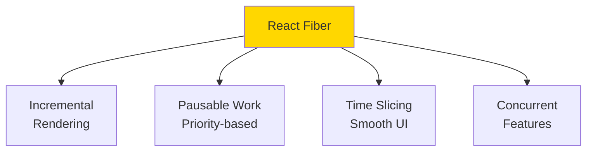

### Fiber Architecture

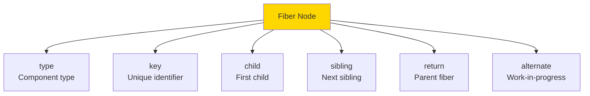

### Reconciliation Phases

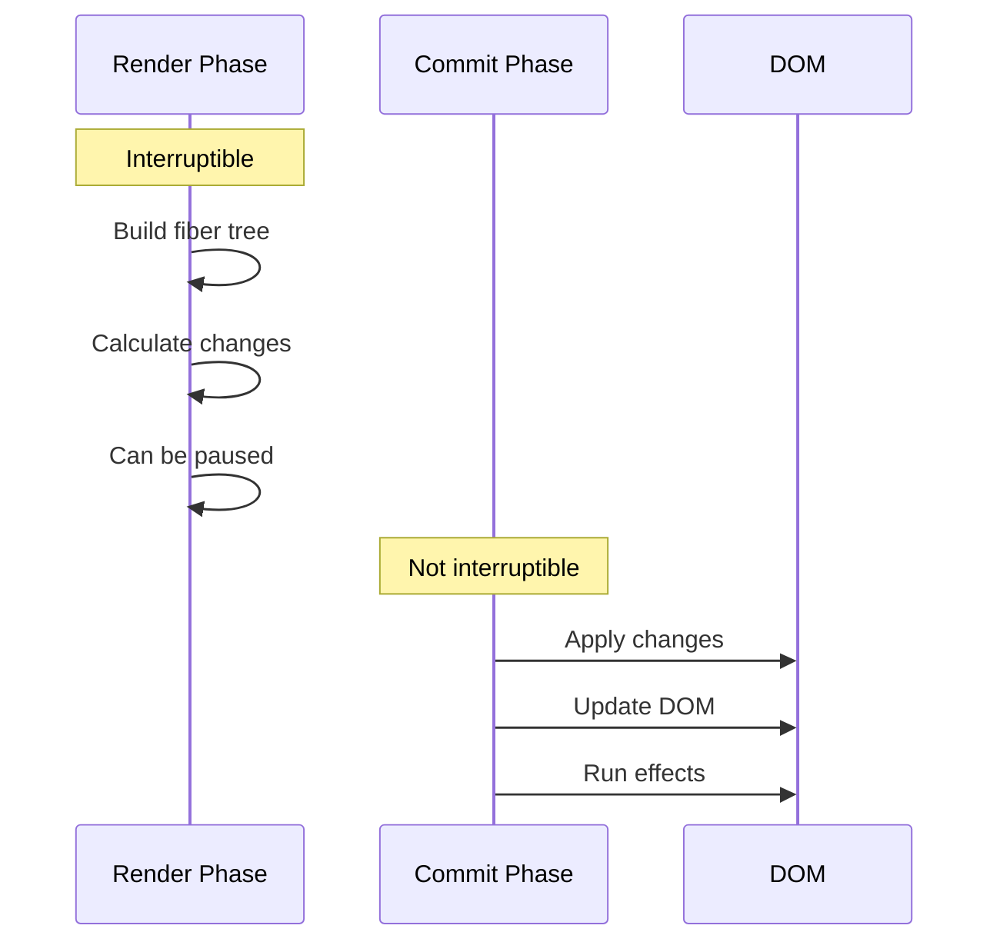

### Priority Levels

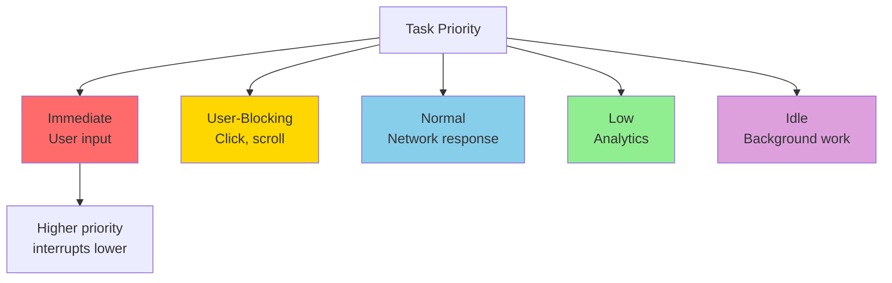

### Concurrent Features

```javascript
import { useTransition, useDeferredValue } from 'react';

function SearchResults() {
  const [query, setQuery] = useState('');
  const [isPending, startTransition] = useTransition();
  const deferredQuery = useDeferredValue(query);
  
  function handleChange(e) {
    // Urgent: Update input immediately
    setQuery(e.target.value);
    
    // Non-urgent: Update results (can be interrupted)
    startTransition(() => {
      // This update has lower priority
      // Can be interrupted by more urgent updates
    });
  }
  
  return (
    <div>
      <input value={query} onChange={handleChange} />
      {isPending && <Spinner />}
      <Results query={deferredQuery} />
    </div>
  );
}
```

**Key Concepts**:
- **Time Slicing**: Break work into chunks
- **Suspense**: Wait for async data
- **Concurrent Rendering**: Multiple versions of UI
- **Automatic Batching**: Batch multiple state updates

---

## Q2: Implement a custom React hook for complex async state management.

**Answer**:

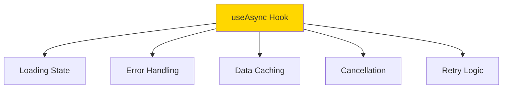

### Advanced useAsync Hook

```javascript
import { useState, useEffect, useCallback, useRef } from 'react';

function useAsync(asyncFunction, immediate = true) {
  const [status, setStatus] = useState('idle');
  const [data, setData] = useState(null);
  const [error, setError] = useState(null);
  
  // Memoize the async function
  const execute = useCallback((...params) => {
    setStatus('pending');
    setData(null);
    setError(null);
    
    return asyncFunction(...params)
      .then(response => {
        setData(response);
        setStatus('success');
        return response;
      })
      .catch(error => {
        setError(error);
        setStatus('error');
        throw error;
      });
  }, [asyncFunction]);
  
  useEffect(() => {
    if (immediate) {
      execute();
    }
  }, [execute, immediate]);
  
  return {
    execute,
    status,
    data,
    error,
    isIdle: status === 'idle',
    isPending: status === 'pending',
    isSuccess: status === 'success',
    isError: status === 'error'
  };
}
```

### With Cancellation

```javascript
function useAsyncWithCancel(asyncFunction, immediate = true) {
  const [status, setStatus] = useState('idle');
  const [data, setData] = useState(null);
  const [error, setError] = useState(null);
  const cancelRef = useRef(false);
  
  const execute = useCallback((...params) => {
    cancelRef.current = false;
    setStatus('pending');
    setData(null);
    setError(null);
    
    return asyncFunction(...params)
      .then(response => {
        if (!cancelRef.current) {
          setData(response);
          setStatus('success');
        }
        return response;
      })
      .catch(error => {
        if (!cancelRef.current) {
          setError(error);
          setStatus('error');
        }
        throw error;
      });
  }, [asyncFunction]);
  
  const cancel = useCallback(() => {
    cancelRef.current = true;
  }, []);
  
  useEffect(() => {
    if (immediate) {
      execute();
    }
    return cancel; // Cleanup on unmount
  }, [execute, immediate, cancel]);
  
  return { execute, cancel, status, data, error };
}
```

### With Retry and Cache

```javascript
function useAsyncAdvanced(asyncFunction, options = {}) {
  const {
    immediate = true,
    retries = 3,
    retryDelay = 1000,
    cacheKey = null,
    cacheTime = 5 * 60 * 1000 // 5 minutes
  } = options;
  
  const [status, setStatus] = useState('idle');
  const [data, setData] = useState(null);
  const [error, setError] = useState(null);
  const [retryCount, setRetryCount] = useState(0);
  const cacheRef = useRef(new Map());
  const cancelRef = useRef(false);
  
  const execute = useCallback(async (...params) => {
    // Check cache
    if (cacheKey) {
      const cached = cacheRef.current.get(cacheKey);
      if (cached && Date.now() - cached.timestamp < cacheTime) {
        setData(cached.data);
        setStatus('success');
        return cached.data;
      }
    }
    
    cancelRef.current = false;
    setStatus('pending');
    setError(null);
    
    let attempt = 0;
    while (attempt <= retries) {
      try {
        const response = await asyncFunction(...params);
        
        if (cancelRef.current) return;
        
        // Cache result
        if (cacheKey) {
          cacheRef.current.set(cacheKey, {
            data: response,
            timestamp: Date.now()
          });
        }
        
        setData(response);
        setStatus('success');
        setRetryCount(0);
        return response;
      } catch (err) {
        if (cancelRef.current) return;
        
        attempt++;
        if (attempt > retries) {
          setError(err);
          setStatus('error');
          throw err;
        }
        
        setRetryCount(attempt);
        await new Promise(resolve => setTimeout(resolve, retryDelay * attempt));
      }
    }
  }, [asyncFunction, retries, retryDelay, cacheKey, cacheTime]);
  
  const cancel = useCallback(() => {
    cancelRef.current = true;
  }, []);
  
  const reset = useCallback(() => {
    setStatus('idle');
    setData(null);
    setError(null);
    setRetryCount(0);
  }, []);
  
  useEffect(() => {
    if (immediate) {
      execute();
    }
    return cancel;
  }, [execute, immediate, cancel]);
  
  return {
    execute,
    cancel,
    reset,
    status,
    data,
    error,
    retryCount,
    isIdle: status === 'idle',
    isPending: status === 'pending',
    isSuccess: status === 'success',
    isError: status === 'error'
  };
}
```

### Usage

```javascript
function UserProfile({ userId }) {
  const fetchUser = useCallback(
    () => fetch(`/api/users/${userId}`).then(r => r.json()),
    [userId]
  );
  
  const { data, error, isPending, execute, retryCount } = useAsyncAdvanced(
    fetchUser,
    {
      immediate: true,
      retries: 3,
      retryDelay: 1000,
      cacheKey: `user-${userId}`,
      cacheTime: 5 * 60 * 1000
    }
  );
  
  if (isPending) return <div>Loading... {retryCount > 0 && `(Retry ${retryCount})`}</div>;
  if (error) return <div>Error: {error.message} <button onClick={execute}>Retry</button></div>;
  if (!data) return null;
  
  return <div>{data.name}</div>;
}
```

---

## Q3: Explain Vue 3 reactivity system internals (Proxy-based).

**Answer**:

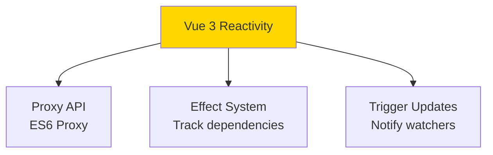

### Reactivity Implementation

```javascript
// Simplified Vue 3 reactivity implementation

let activeEffect = null;
const targetMap = new WeakMap();

function reactive(target) {
  return new Proxy(target, {
    get(target, key, receiver) {
      // Track dependency
      track(target, key);
      return Reflect.get(target, key, receiver);
    },
    set(target, key, value, receiver) {
      const result = Reflect.set(target, key, value, receiver);
      // Trigger updates
      trigger(target, key);
      return result;
    }
  });
}

function track(target, key) {
  if (!activeEffect) return;
  
  let depsMap = targetMap.get(target);
  if (!depsMap) {
    targetMap.set(target, (depsMap = new Map()));
  }
  
  let dep = depsMap.get(key);
  if (!dep) {
    depsMap.set(key, (dep = new Set()));
  }
  
  dep.add(activeEffect);
}

function trigger(target, key) {
  const depsMap = targetMap.get(target);
  if (!depsMap) return;
  
  const dep = depsMap.get(key);
  if (dep) {
    dep.forEach(effect => effect());
  }
}

function effect(fn) {
  activeEffect = fn;
  fn();
  activeEffect = null;
}
```

### Dependency Tracking

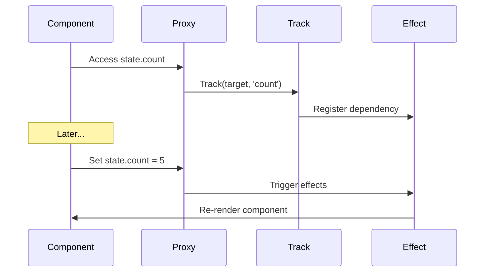

### ref vs reactive

```javascript
import { ref, reactive, effect } from 'vue';

// ref: For primitives
const count = ref(0);
console.log(count.value); // Access with .value

effect(() => {
  console.log('Count is:', count.value);
});

count.value++; // Triggers effect

// reactive: For objects
const state = reactive({
  count: 0,
  nested: {
    value: 10
  }
});

effect(() => {
  console.log('State count:', state.count);
  console.log('Nested value:', state.nested.value);
});

state.count++; // Triggers effect
state.nested.value++; // Triggers effect (deep reactivity)
```

### Computed Implementation

```javascript
function computed(getter) {
  let value;
  let dirty = true;
  
  const effectFn = effect(getter, {
    lazy: true,
    scheduler() {
      dirty = true;
    }
  });
  
  return {
    get value() {
      if (dirty) {
        value = effectFn();
        dirty = false;
      }
      return value;
    }
  };
}
```

---

## Q4: Implement server-side rendering (SSR) with hydration.

**Answer**:

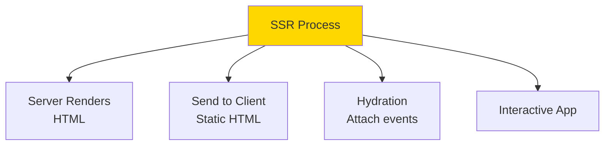

### SSR Flow

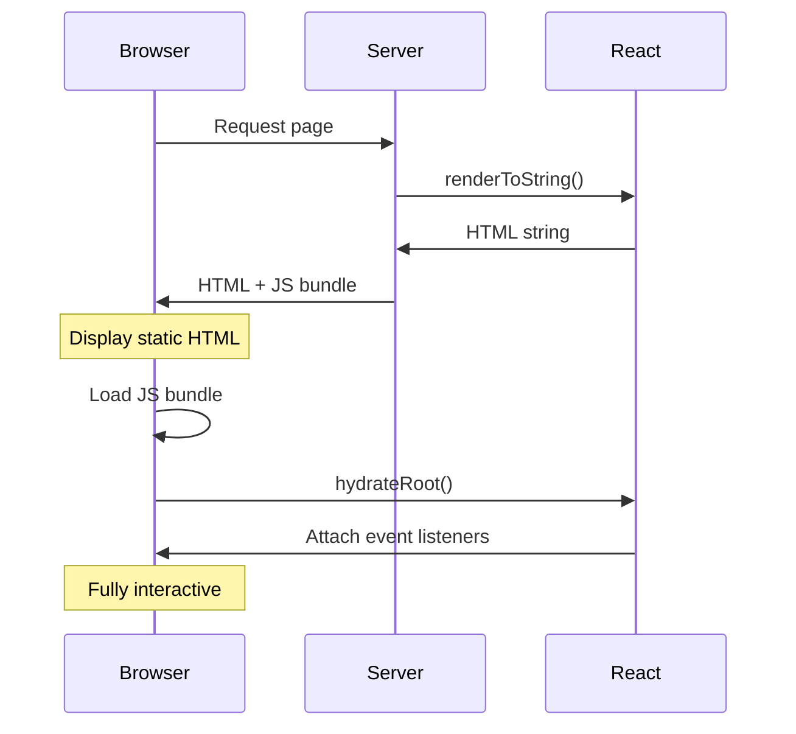

### React SSR Implementation

```javascript
// server.js
import express from 'express';
import React from 'react';
import { renderToString } from 'react-dom/server';
import App from './App';

const app = express();

app.get('*', (req, res) => {
  const html = renderToString(<App url={req.url} />);
  
  res.send(`
    <!DOCTYPE html>
    <html>
      <head>
        <title>SSR App</title>
        <link rel="stylesheet" href="/styles.css">
      </head>
      <body>
        <div id="root">${html}</div>
        <script src="/bundle.js"></script>
      </body>
    </html>
  `);
});

app.listen(3000);
```

```javascript
// client.js
import React from 'react';
import { hydrateRoot } from 'react-dom/client';
import App from './App';

// Hydrate instead of render
hydrateRoot(
  document.getElementById('root'),
  <App />
);
```

### Data Fetching with SSR

```javascript
// App.js
function App({ initialData }) {
  const [data, setData] = useState(initialData);
  
  useEffect(() => {
    // Only fetch on client if no initial data
    if (!initialData) {
      fetchData().then(setData);
    }
  }, []);
  
  return <div>{data?.title}</div>;
}

// server.js
app.get('*', async (req, res) => {
  // Fetch data on server
  const initialData = await fetchData();
  
  const html = renderToString(<App initialData={initialData} />);
  
  res.send(`
    <!DOCTYPE html>
    <html>
      <body>
        <div id="root">${html}</div>
        <script>
          window.__INITIAL_DATA__ = ${JSON.stringify(initialData)};
        </script>
        <script src="/bundle.js"></script>
      </body>
    </html>
  `);
});

// client.js
hydrateRoot(
  document.getElementById('root'),
  <App initialData={window.__INITIAL_DATA__} />
);
```

### Hydration Mismatch

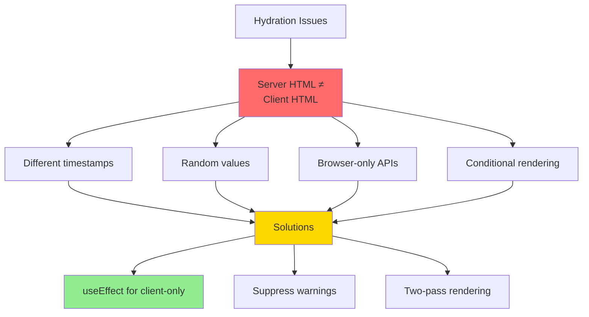

```javascript
// ❌ Causes hydration mismatch
function Component() {
  return <div>{new Date().toString()}</div>;
}

// ✅ Fix: Render on client only
function Component() {
  const [date, setDate] = useState(null);
  
  useEffect(() => {
    setDate(new Date().toString());
  }, []);
  
  return <div>{date || 'Loading...'}</div>;
}
```

---

## Q5: Implement optimistic UI updates with rollback.

**Answer**:

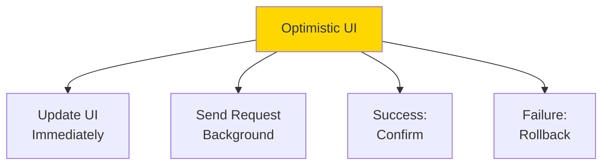

### Optimistic Update Pattern

```javascript
import { useState, useCallback } from 'react';

function useTodos() {
  const [todos, setTodos] = useState([]);
  const [history, setHistory] = useState([]);
  
  const addTodo = useCallback(async (text) => {
    const optimisticTodo = {
      id: `temp-${Date.now()}`,
      text,
      completed: false,
      optimistic: true
    };
    
    // Optimistic update
    setTodos(prev => [...prev, optimisticTodo]);
    setHistory(prev => [...prev, { action: 'add', todo: optimisticTodo }]);
    
    try {
      // API call
      const response = await fetch('/api/todos', {
        method: 'POST',
        body: JSON.stringify({ text })
      });
      const savedTodo = await response.json();
      
      // Replace optimistic with real
      setTodos(prev => prev.map(t => 
        t.id === optimisticTodo.id ? savedTodo : t
      ));
    } catch (error) {
      // Rollback on error
      setTodos(prev => prev.filter(t => t.id !== optimisticTodo.id));
      setHistory(prev => prev.slice(0, -1));
      throw error;
    }
  }, []);
  
  const updateTodo = useCallback(async (id, updates) => {
    const previousTodos = todos;
    
    // Optimistic update
    setTodos(prev => prev.map(t =>
      t.id === id ? { ...t, ...updates } : t
    ));
    
    try {
      await fetch(`/api/todos/${id}`, {
        method: 'PATCH',
        body: JSON.stringify(updates)
      });
    } catch (error) {
      // Rollback
      setTodos(previousTodos);
      throw error;
    }
  }, [todos]);
  
  const deleteTodo = useCallback(async (id) => {
    const deletedTodo = todos.find(t => t.id === id);
    
    // Optimistic delete
    setTodos(prev => prev.filter(t => t.id !== id));
    
    try {
      await fetch(`/api/todos/${id}`, { method: 'DELETE' });
    } catch (error) {
      // Rollback
      setTodos(prev => [...prev, deletedTodo]);
      throw error;
    }
  }, [todos]);
  
  return { todos, addTodo, updateTodo, deleteTodo };
}
```

### With React Query

```javascript
import { useMutation, useQueryClient } from '@tanstack/react-query';

function useTodosOptimistic() {
  const queryClient = useQueryClient();
  
  const addTodoMutation = useMutation({
    mutationFn: (newTodo) => fetch('/api/todos', {
      method: 'POST',
      body: JSON.stringify(newTodo)
    }).then(r => r.json()),
    
    onMutate: async (newTodo) => {
      // Cancel outgoing refetches
      await queryClient.cancelQueries(['todos']);
      
      // Snapshot previous value
      const previousTodos = queryClient.getQueryData(['todos']);
      
      // Optimistically update
      queryClient.setQueryData(['todos'], old => [
        ...old,
        { ...newTodo, id: `temp-${Date.now()}` }
      ]);
      
      // Return context with snapshot
      return { previousTodos };
    },
    
    onError: (err, newTodo, context) => {
      // Rollback to snapshot
      queryClient.setQueryData(['todos'], context.previousTodos);
    },
    
    onSettled: () => {
      // Refetch after error or success
      queryClient.invalidateQueries(['todos']);
    }
  });
  
  return addTodoMutation;
}
```

### Flow Diagram

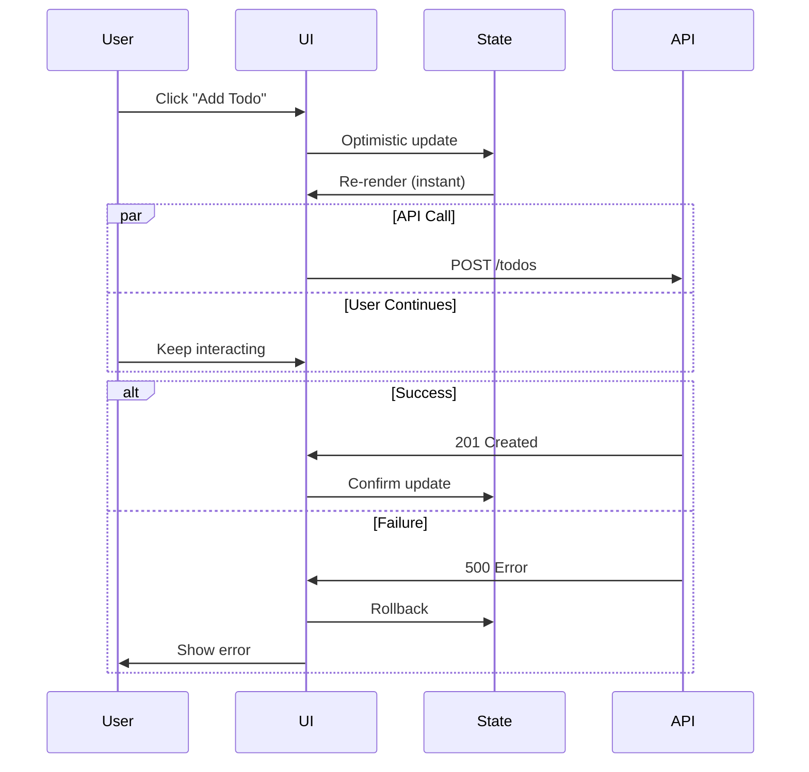

---

## Q6: Implement micro-frontend architecture.

**Answer**:

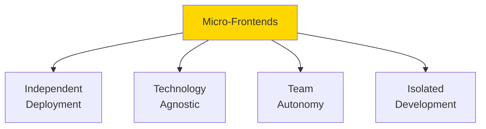

### Architecture Patterns

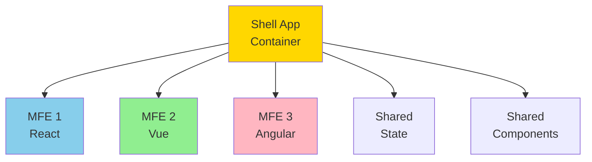

### Module Federation (Webpack 5)

```javascript
// shell/webpack.config.js
module.exports = {
  plugins: [
    new ModuleFederationPlugin({
      name: 'shell',
      remotes: {
        mfe1: 'mfe1@http://localhost:3001/remoteEntry.js',
        mfe2: 'mfe2@http://localhost:3002/remoteEntry.js'
      },
      shared: {
        react: { singleton: true },
        'react-dom': { singleton: true }
      }
    })
  ]
};

// mfe1/webpack.config.js
module.exports = {
  plugins: [
    new ModuleFederationPlugin({
      name: 'mfe1',
      filename: 'remoteEntry.js',
      exposes: {
        './Dashboard': './src/Dashboard',
        './Profile': './src/Profile'
      },
      shared: {
        react: { singleton: true },
        'react-dom': { singleton: true }
      }
    })
  ]
};
```

### Shell Application

```javascript
// shell/App.js
import React, { lazy, Suspense } from 'react';

const Dashboard = lazy(() => import('mfe1/Dashboard'));
const Profile = lazy(() => import('mfe1/Profile'));
const Settings = lazy(() => import('mfe2/Settings'));

function App() {
  return (
    <div>
      <nav>
        <Link to="/dashboard">Dashboard</Link>
        <Link to="/profile">Profile</Link>
        <Link to="/settings">Settings</Link>
      </nav>
      
      <Suspense fallback={<div>Loading...</div>}>
        <Routes>
          <Route path="/dashboard" element={<Dashboard />} />
          <Route path="/profile" element={<Profile />} />
          <Route path="/settings" element={<Settings />} />
        </Routes>
      </Suspense>
    </div>
  );
}
```

### Communication Between MFEs

```javascript
// Shared event bus
class EventBus {
  constructor() {
    this.events = {};
  }
  
  on(event, callback) {
    if (!this.events[event]) {
      this.events[event] = [];
    }
    this.events[event].push(callback);
  }
  
  off(event, callback) {
    if (this.events[event]) {
      this.events[event] = this.events[event].filter(cb => cb !== callback);
    }
  }
  
  emit(event, data) {
    if (this.events[event]) {
      this.events[event].forEach(callback => callback(data));
    }
  }
}

export const eventBus = new EventBus();

// MFE 1
eventBus.emit('user:login', { userId: 123 });

// MFE 2
eventBus.on('user:login', (data) => {
  console.log('User logged in:', data.userId);
});
```

### Shared State

```javascript
// Shared store
import { create } from 'zustand';

export const useSharedStore = create((set) => ({
  user: null,
  setUser: (user) => set({ user }),
  
  theme: 'light',
  setTheme: (theme) => set({ theme })
}));

// Use in any MFE
function MFE1Component() {
  const { user, setUser } = useSharedStore();
  return <div>{user?.name}</div>;
}
```

---

## Q7: Implement advanced performance optimization techniques.

**Answer**:

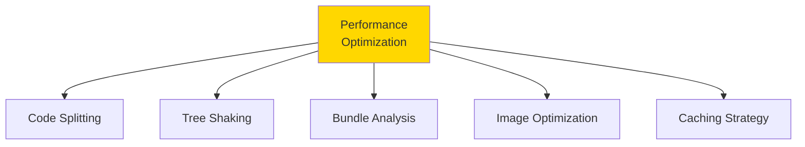

### Virtual Scrolling

```javascript
import { useVirtualizer } from '@tanstack/react-virtual';

function VirtualList({ items }) {
  const parentRef = useRef();
  
  const virtualizer = useVirtualizer({
    count: items.length,
    getScrollElement: () => parentRef.current,
    estimateSize: () => 50, // Estimated item height
    overscan: 5 // Render extra items for smooth scrolling
  });
  
  return (
    <div
      ref={parentRef}
      style={{ height: '400px', overflow: 'auto' }}
    >
      <div
        style={{
          height: `${virtualizer.getTotalSize()}px`,
          position: 'relative'
        }}
      >
        {virtualizer.getVirtualItems().map(virtualRow => (
          <div
            key={virtualRow.index}
            style={{
              position: 'absolute',
              top: 0,
              left: 0,
              width: '100%',
              height: `${virtualRow.size}px`,
              transform: `translateY(${virtualRow.start}px)`
            }}
          >
            {items[virtualRow.index].name}
          </div>
        ))}
      </div>
    </div>
  );
}
```

### Intersection Observer for Lazy Loading

```javascript
function LazyImage({ src, alt }) {
  const [isLoaded, setIsLoaded] = useState(false);
  const [isInView, setIsInView] = useState(false);
  const imgRef = useRef();
  
  useEffect(() => {
    const observer = new IntersectionObserver(
      ([entry]) => {
        if (entry.isIntersecting) {
          setIsInView(true);
          observer.disconnect();
        }
      },
      { rootMargin: '50px' } // Start loading 50px before visible
    );
    
    if (imgRef.current) {
      observer.observe(imgRef.current);
    }
    
    return () => observer.disconnect();
  }, []);
  
  return (
    <div ref={imgRef} style={{ minHeight: '200px' }}>
      {isInView && (
         setIsLoaded(true)}
          style={{ opacity: isLoaded ? 1 : 0, transition: 'opacity 0.3s' }}
        />
      )}
    </div>
  );
}
```

### Web Workers for Heavy Computation

```javascript
// worker.js
self.addEventListener('message', (e) => {
  const { data, action } = e.data;
  
  if (action === 'process') {
    // Heavy computation
    const result = data.map(item => {
      // Complex processing
      return processItem(item);
    });
    
    self.postMessage({ result });
  }
});

// Component
function HeavyComputation() {
  const [result, setResult] = useState(null);
  const workerRef = useRef();
  
  useEffect(() => {
    workerRef.current = new Worker('/worker.js');
    
    workerRef.current.onmessage = (e) => {
      setResult(e.data.result);
    };
    
    return () => workerRef.current.terminate();
  }, []);
  
  const handleProcess = (data) => {
    workerRef.current.postMessage({ action: 'process', data });
  };
  
  return <div>{/* UI */}</div>;
}
```

### Request Deduplication

```javascript
const requestCache = new Map();

function dedupeRequest(key, fetcher) {
  if (requestCache.has(key)) {
    return requestCache.get(key);
  }
  
  const promise = fetcher()
    .then(data => {
      requestCache.delete(key);
      return data;
    })
    .catch(error => {
      requestCache.delete(key);
      throw error;
    });
  
  requestCache.set(key, promise);
  return promise;
}

// Usage
function useUser(userId) {
  return useQuery(['user', userId], () =>
    dedupeRequest(`user-${userId}`, () =>
      fetch(`/api/users/${userId}`).then(r => r.json())
    )
  );
}
```

---

## Q8: Implement advanced form handling with validation.

**Answer**:

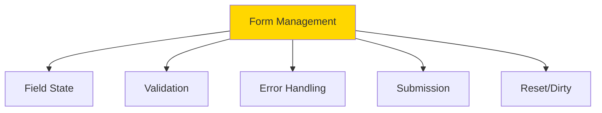

### Custom useForm Hook

```javascript
import { useState, useCallback } from 'react';

function useForm(initialValues, validationSchema) {
  const [values, setValues] = useState(initialValues);
  const [errors, setErrors] = useState({});
  const [touched, setTouched] = useState({});
  const [isSubmitting, setIsSubmitting] = useState(false);
  
  const validate = useCallback((fieldName, value) => {
    if (!validationSchema[fieldName]) return null;
    
    const rules = validationSchema[fieldName];
    
    for (const rule of rules) {
      const error = rule(value, values);
      if (error) return error;
    }
    
    return null;
  }, [validationSchema, values]);
  
  const validateAll = useCallback(() => {
    const newErrors = {};
    
    Object.keys(validationSchema).forEach(fieldName => {
      const error = validate(fieldName, values[fieldName]);
      if (error) {
        newErrors[fieldName] = error;
      }
    });
    
    setErrors(newErrors);
    return Object.keys(newErrors).length === 0;
  }, [validate, validationSchema, values]);
  
  const handleChange = useCallback((name, value) => {
    setValues(prev => ({ ...prev, [name]: value }));
    
    // Validate on change if already touched
    if (touched[name]) {
      const error = validate(name, value);
      setErrors(prev => ({
        ...prev,
        [name]: error
      }));
    }
  }, [touched, validate]);
  
  const handleBlur = useCallback((name) => {
    setTouched(prev => ({ ...prev, [name]: true }));
    
    const error = validate(name, values[name]);
    setErrors(prev => ({
      ...prev,
      [name]: error
    }));
  }, [validate, values]);
  
  const handleSubmit = useCallback(async (onSubmit) => {
    setIsSubmitting(true);
    
    const isValid = validateAll();
    if (!isValid) {
      setIsSubmitting(false);
      return;
    }
    
    try {
      await onSubmit(values);
    } catch (error) {
      console.error(error);
    } finally {
      setIsSubmitting(false);
    }
  }, [validateAll, values]);
  
  const reset = useCallback(() => {
    setValues(initialValues);
    setErrors({});
    setTouched({});
  }, [initialValues]);
  
  return {
    values,
    errors,
    touched,
    isSubmitting,
    handleChange,
    handleBlur,
    handleSubmit,
    reset
  };
}
```

### Validation Rules

```javascript
const required = (message = 'Required') => (value) => {
  return value ? null : message;
};

const minLength = (min, message) => (value) => {
  return value && value.length >= min ? null : message || `Min length: ${min}`;
};

const email = (message = 'Invalid email') => (value) => {
  const emailRegex = /^[^\s@]+@[^\s@]+\.[^\s@]+$/;
  return emailRegex.test(value) ? null : message;
};

const match = (fieldName, message) => (value, allValues) => {
  return value === allValues[fieldName] ? null : message;
};

// Usage
const validationSchema = {
  email: [required(), email()],
  password: [required(), minLength(8, 'Password must be at least 8 characters')],
  confirmPassword: [
    required(),
    match('password', 'Passwords must match')
  ]
};

function SignupForm() {
  const form = useForm(
    { email: '', password: '', confirmPassword: '' },
    validationSchema
  );
  
  return (
    <form onSubmit={(e) => {
      e.preventDefault();
      form.handleSubmit(async (values) => {
        await fetch('/api/signup', {
          method: 'POST',
          body: JSON.stringify(values)
        });
      });
    }}>
      <input
        name="email"
        value={form.values.email}
        onChange={(e) => form.handleChange('email', e.target.value)}
        onBlur={() => form.handleBlur('email')}
      />
      {form.touched.email && form.errors.email && (
        <span>{form.errors.email}</span>
      )}
      
      {/* Other fields... */}
      
      <button type="submit" disabled={form.isSubmitting}>
        {form.isSubmitting ? 'Submitting...' : 'Submit'}
      </button>
    </form>
  );
}
```

---

## Q9: Implement advanced state machines with XState.

**Answer**:

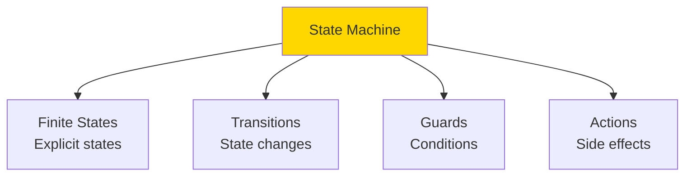

### Authentication State Machine

```javascript
import { createMachine, interpret } from 'xstate';

const authMachine = createMachine({
  id: 'auth',
  initial: 'idle',
  context: {
    user: null,
    error: null,
    retries: 0
  },
  states: {
    idle: {
      on: {
        LOGIN: 'loading'
      }
    },
    loading: {
      invoke: {
        src: 'loginUser',
        onDone: {
          target: 'authenticated',
          actions: 'setUser'
        },
        onError: [
          {
            target: 'error',
            cond: 'maxRetriesReached',
            actions: 'setError'
          },
          {
            target: 'loading',
            actions: 'incrementRetries'
          }
        ]
      }
    },
    authenticated: {
      on: {
        LOGOUT: {
          target: 'idle',
          actions: 'clearUser'
        },
        REFRESH: 'refreshing'
      }
    },
    refreshing: {
      invoke: {
        src: 'refreshToken',
        onDone: {
          target: 'authenticated',
          actions: 'setUser'
        },
        onError: {
          target: 'idle',
          actions: 'clearUser'
        }
      }
    },
    error: {
      on: {
        RETRY: {
          target: 'loading',
          actions: 'resetRetries'
        },
        CANCEL: 'idle'
      }
    }
  }
}, {
  actions: {
    setUser: (context, event) => {
      context.user = event.data;
    },
    clearUser: (context) => {
      context.user = null;
    },
    setError: (context, event) => {
      context.error = event.data;
    },
    incrementRetries: (context) => {
      context.retries++;
    },
    resetRetries: (context) => {
      context.retries = 0;
    }
  },
  guards: {
    maxRetriesReached: (context) => context.retries >= 3
  },
  services: {
    loginUser: async (context, event) => {
      const response = await fetch('/api/login', {
        method: 'POST',
        body: JSON.stringify(event.credentials)
      });
      return response.json();
    },
    refreshToken: async () => {
      const response = await fetch('/api/refresh');
      return response.json();
    }
  }
});
```

### Using with React

```javascript
import { useMachine } from '@xstate/react';

function AuthComponent() {
  const [state, send] = useMachine(authMachine);
  
  const handleLogin = (credentials) => {
    send({ type: 'LOGIN', credentials });
  };
  
  return (
    <div>
      {state.matches('idle') && (
        <LoginForm onSubmit={handleLogin} />
      )}
      
      {state.matches('loading') && (
        <div>Loading... (Attempt {state.context.retries + 1})</div>
      )}
      
      {state.matches('authenticated') && (
        <div>
          Welcome, {state.context.user.name}!
          <button onClick={() => send('LOGOUT')}>Logout</button>
        </div>
      )}
      
      {state.matches('error') && (
        <div>
          Error: {state.context.error}
          <button onClick={() => send('RETRY')}>Retry</button>
          <button onClick={() => send('CANCEL')}>Cancel</button>
        </div>
      )}
    </div>
  );
}
```

---

## Q10: Implement real-time collaborative editing.

**Answer**:

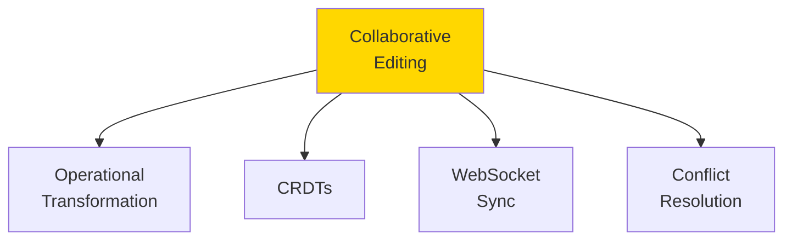

### Operational Transformation

```javascript
// Simple OT implementation
class Operation {
  constructor(type, position, content) {
    this.type = type; // 'insert' or 'delete'
    this.position = position;
    this.content = content;
  }
  
  transform(other) {
    if (this.type === 'insert' && other.type === 'insert') {
      if (this.position < other.position) {
        return other;
      } else {
        return new Operation(
          other.type,
          other.position + this.content.length,
          other.content
        );
      }
    }
    
    if (this.type === 'delete' && other.type === 'insert') {
      if (this.position < other.position) {
        return new Operation(
          other.type,
          other.position - this.content.length,
          other.content
        );
      }
      return other;
    }
    
    // More transformation rules...
    return other;
  }
}

function useCollaborativeEditor(documentId) {
  const [content, setContent] = useState('');
  const [pendingOps, setPendingOps] = useState([]);
  const wsRef = useRef();
  
  useEffect(() => {
    wsRef.current = new WebSocket(`ws://localhost:3000/doc/${documentId}`);
    
    wsRef.current.onmessage = (event) => {
      const { type, operation } = JSON.parse(event.data);
      
      if (type === 'operation') {
        // Transform against pending operations
        let transformedOp = operation;
        pendingOps.forEach(pending => {
          transformedOp = pending.transform(transformedOp);
        });
        
        // Apply operation
        applyOperation(transformedOp);
      }
    };
    
    return () => wsRef.current.close();
  }, [documentId]);
  
  const handleChange = (newContent) => {
    const op = calculateOperation(content, newContent);
    
    // Apply locally
    setContent(newContent);
    
    // Send to server
    wsRef.current.send(JSON.stringify({
      type: 'operation',
      operation: op
    }));
    
    // Track pending
    setPendingOps(prev => [...prev, op]);
  };
  
  return { content, handleChange };
}
```

### CRDT Implementation

```javascript
// Simplified CRDT for text editing
class CRDT {
  constructor() {
    this.chars = [];
    this.siteId = Math.random().toString(36);
    this.clock = 0;
  }
  
  insert(position, char) {
    const id = {
      site: this.siteId,
      clock: this.clock++,
      position
    };
    
    this.chars.splice(position, 0, { id, char });
    return { type: 'insert', id, char };
  }
  
  delete(position) {
    const deleted = this.chars.splice(position, 1)[0];
    return { type: 'delete', id: deleted.id };
  }
  
  applyRemote(operation) {
    if (operation.type === 'insert') {
      const position = this.findPosition(operation.id);
      this.chars.splice(position, 0, {
        id: operation.id,
        char: operation.char
      });
    } else if (operation.type === 'delete') {
      const position = this.chars.findIndex(c => 
        c.id.site === operation.id.site &&
        c.id.clock === operation.id.clock
      );
      if (position !== -1) {
        this.chars.splice(position, 1);
      }
    }
  }
  
  toString() {
    return this.chars.map(c => c.char).join('');
  }
}
```

---

## Summary

Hard frontend topics:
- **React Fiber**: Incremental rendering, time slicing, concurrent features
- **Custom Hooks**: Advanced async state management with retry and caching
- **Vue 3 Reactivity**: Proxy-based reactivity, effect system
- **SSR & Hydration**: Server-side rendering, data fetching, hydration mismatch
- **Optimistic UI**: Immediate updates with rollback on failure
- **Micro-Frontends**: Module federation, independent deployment
- **Performance**: Virtual scrolling, lazy loading, web workers, deduplication
- **Advanced Forms**: Custom form hook, validation, error handling
- **State Machines**: XState, finite states, transitions, guards
- **Collaborative Editing**: Operational transformation, CRDTs, real-time sync

These advanced concepts enable building production-grade, scalable frontend applications.

