Medium-level frontend interview questions covering advanced React, Vue, state management, and performance optimization.

## Q1: Explain React Context API and when to use it.

**Answer**:

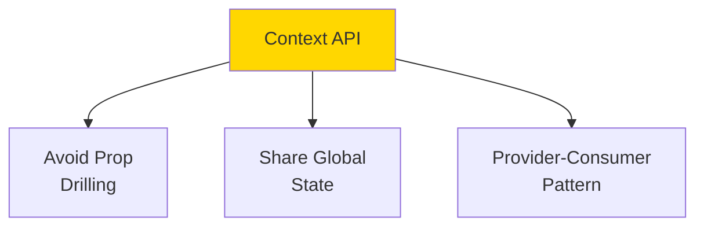

### Prop Drilling Problem

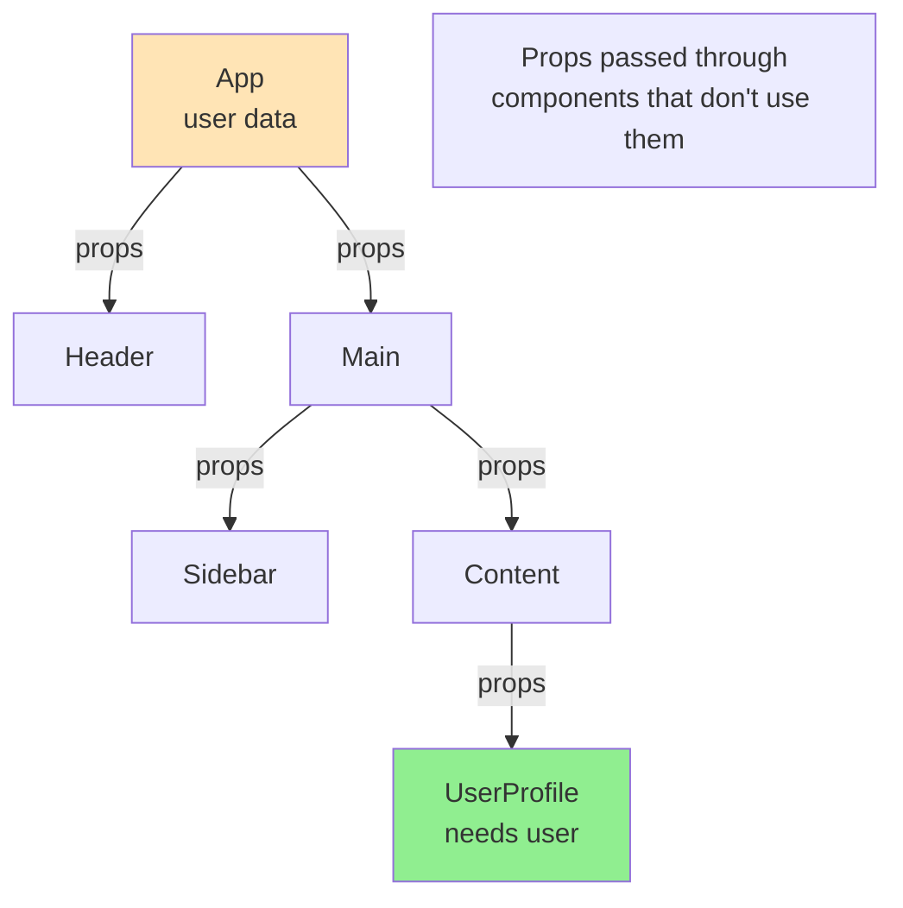

### Context Solution

```javascript
import { createContext, useContext, useState } from 'react';

// Create context
const UserContext = createContext();

// Provider component
function App() {
  const [user, setUser] = useState({ name: 'Alice', role: 'admin' });
  
  return (
    <UserContext.Provider value={{ user, setUser }}>
      <Header />
      <Main />
    </UserContext.Provider>
  );
}

// Consumer component (deep in tree)
function UserProfile() {
  const { user, setUser } = useContext(UserContext);
  
  return (
    <div>
      <h1>{user.name}</h1>
      <p>Role: {user.role}</p>
      <button onClick={() => setUser({ ...user, name: 'Bob' })}>
        Change Name
      </button>
    </div>
  );
}
```

### Context Flow

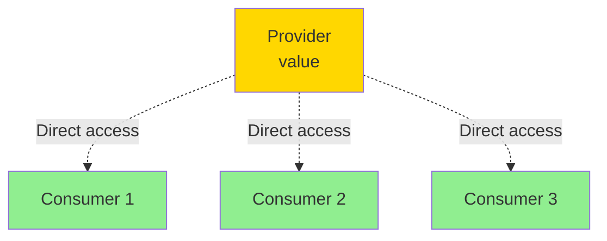

**When to Use**:
- Theme (dark/light mode)
- User authentication
- Language/localization
- Global settings

**When NOT to Use**:
- Frequently changing data (causes re-renders)
- Complex state logic (use Redux/Zustand)

---

## Q2: What is React useCallback and useMemo?

**Answer**:

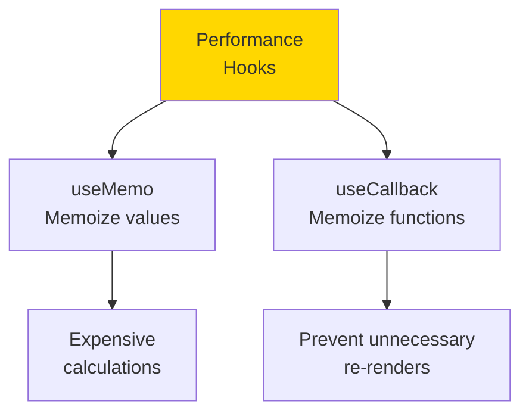

### useMemo

```javascript
import { useState, useMemo } from 'react';

function ExpensiveComponent({ items }) {
  const [count, setCount] = useState(0);
  
  // Without useMemo: Recalculates on every render
  // const total = items.reduce((sum, item) => sum + item.price, 0);
  
  // With useMemo: Only recalculates when items change
  const total = useMemo(() => {
    console.log('Calculating total...');
    return items.reduce((sum, item) => sum + item.price, 0);
  }, [items]); // Dependency array
  
  return (
    <div>
      <p>Total: ${total}</p>
      <button onClick={() => setCount(count + 1)}>
        Count: {count}
      </button>
    </div>
  );
}
```

### useCallback

```javascript
import { useState, useCallback } from 'react';
import { memo } from 'react';

// Child component (memoized)
const Button = memo(({ onClick, children }) => {
  console.log('Button rendered');
  return <button onClick={onClick}>{children}</button>;
});

function Parent() {
  const [count, setCount] = useState(0);
  const [other, setOther] = useState(0);
  
  // Without useCallback: New function on every render
  // const increment = () => setCount(count + 1);
  
  // With useCallback: Same function reference
  const increment = useCallback(() => {
    setCount(c => c + 1);
  }, []); // Empty deps: function never changes
  
  return (
    <div>
      <p>Count: {count}</p>
      <Button onClick={increment}>Increment</Button>
      <button onClick={() => setOther(other + 1)}>
        Other: {other}
      </button>
    </div>
  );
}
```

### When to Use

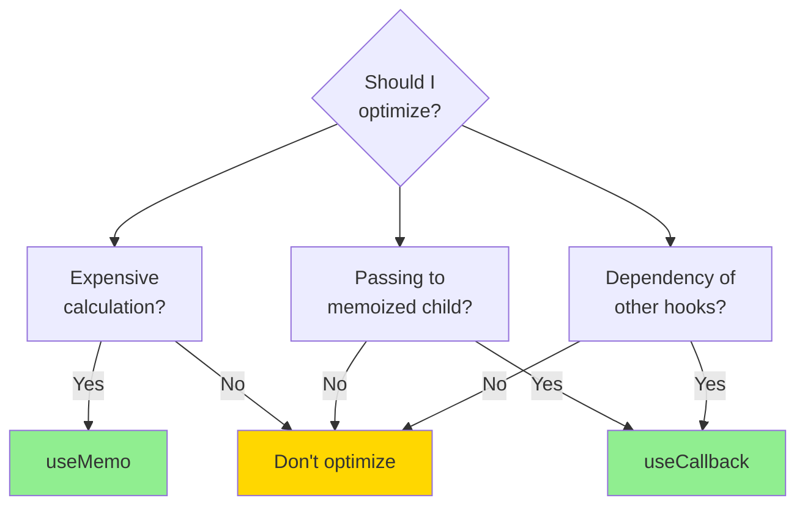

---

## Q3: Explain Vue Vuex state management.

**Answer**:

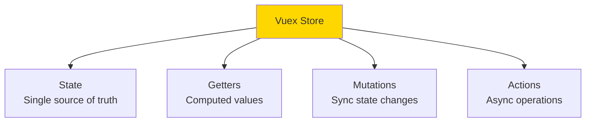

### Vuex Architecture

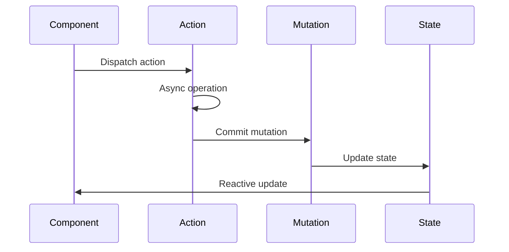

### Vuex Store

```javascript
import { createStore } from 'vuex';

const store = createStore({
  // State
  state() {
    return {
      count: 0,
      user: null,
      items: []
    }
  },
  
  // Getters (like computed properties)
  getters: {
    doubleCount(state) {
      return state.count * 2;
    },
    itemCount(state) {
      return state.items.length;
    }
  },
  
  // Mutations (synchronous)
  mutations: {
    increment(state) {
      state.count++;
    },
    setUser(state, user) {
      state.user = user;
    },
    addItem(state, item) {
      state.items.push(item);
    }
  },
  
  // Actions (asynchronous)
  actions: {
    async fetchUser({ commit }, userId) {
      const response = await fetch(`/api/users/${userId}`);
      const user = await response.json();
      commit('setUser', user);
    },
    
    incrementAsync({ commit }) {
      setTimeout(() => {
        commit('increment');
      }, 1000);
    }
  }
});
```

### Using in Components

```vue
<template>
  <div>
    <p>Count: {{ count }}</p>
    <p>Double: {{ doubleCount }}</p>
    <button @click="increment">Increment</button>
    <button @click="incrementAsync">Increment Async</button>
  </div>
</template>

<script>
import { mapState, mapGetters, mapMutations, mapActions } from 'vuex';

export default {
  computed: {
    ...mapState(['count']),
    ...mapGetters(['doubleCount'])
  },
  methods: {
    ...mapMutations(['increment']),
    ...mapActions(['incrementAsync'])
  }
}
</script>
```

---

## Q4: What is React useReducer and when to use it?

**Answer**:

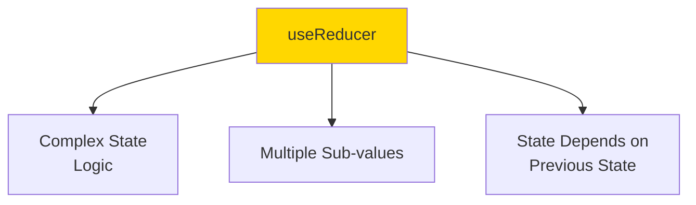

### Reducer Pattern

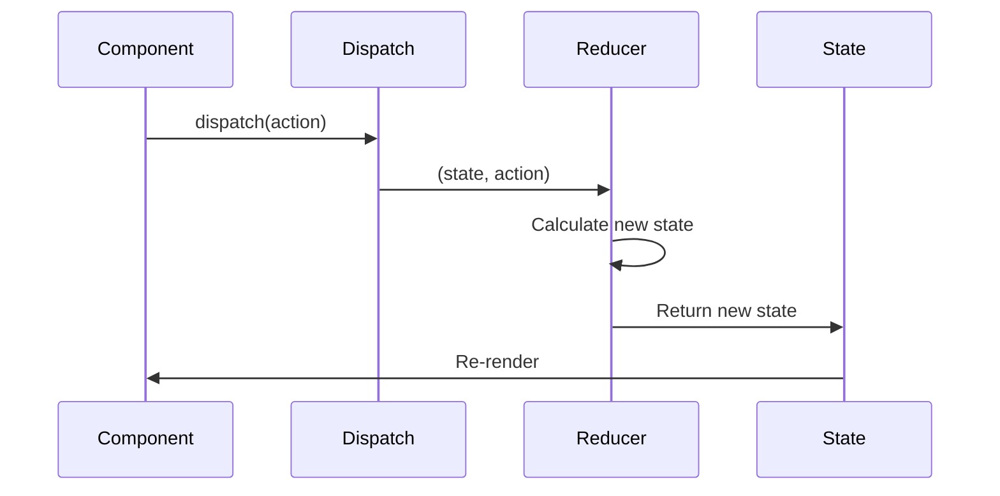

### useReducer Example

```javascript
import { useReducer } from 'react';

// Reducer function
function reducer(state, action) {
  switch (action.type) {
    case 'increment':
      return { count: state.count + 1 };
    case 'decrement':
      return { count: state.count - 1 };
    case 'reset':
      return { count: 0 };
    case 'set':
      return { count: action.payload };
    default:
      throw new Error(`Unknown action: ${action.type}`);
  }
}

function Counter() {
  const [state, dispatch] = useReducer(reducer, { count: 0 });
  
  return (
    <div>
      <p>Count: {state.count}</p>
      <button onClick={() => dispatch({ type: 'increment' })}>+</button>
      <button onClick={() => dispatch({ type: 'decrement' })}>-</button>
      <button onClick={() => dispatch({ type: 'reset' })}>Reset</button>
      <button onClick={() => dispatch({ type: 'set', payload: 10 })}>
        Set to 10
      </button>
    </div>
  );
}
```

### Complex State Example

```javascript
function todoReducer(state, action) {
  switch (action.type) {
    case 'add':
      return {
        ...state,
        todos: [...state.todos, { id: Date.now(), text: action.text, done: false }]
      };
    case 'toggle':
      return {
        ...state,
        todos: state.todos.map(todo =>
          todo.id === action.id ? { ...todo, done: !todo.done } : todo
        )
      };
    case 'delete':
      return {
        ...state,
        todos: state.todos.filter(todo => todo.id !== action.id)
      };
    case 'setFilter':
      return { ...state, filter: action.filter };
    default:
      return state;
  }
}

function TodoApp() {
  const [state, dispatch] = useReducer(todoReducer, {
    todos: [],
    filter: 'all'
  });
  
  // ... component implementation
}
```

**useState vs useReducer**:

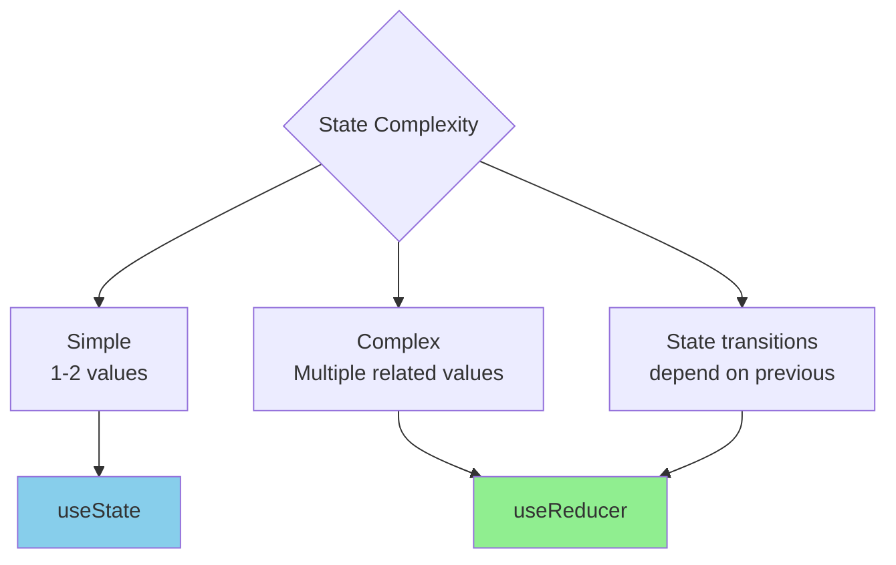

---

## Q5: Explain Vue composables (reusable composition functions).

**Answer**:

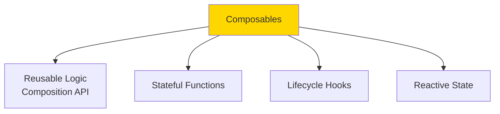

### Creating a Composable

```javascript
// useCounter.js
import { ref, computed } from 'vue';

export function useCounter(initialValue = 0) {
  const count = ref(initialValue);
  const doubled = computed(() => count.value * 2);
  
  function increment() {
    count.value++;
  }
  
  function decrement() {
    count.value--;
  }
  
  function reset() {
    count.value = initialValue;
  }
  
  return {
    count,
    doubled,
    increment,
    decrement,
    reset
  };
}
```

### Using Composables

```vue
<script setup>
import { useCounter } from './useCounter';

const { count, doubled, increment, decrement, reset } = useCounter(10);
</script>

<template>
  <div>
    <p>Count: {{ count }}</p>
    <p>Doubled: {{ doubled }}</p>
    <button @click="increment">+</button>
    <button @click="decrement">-</button>
    <button @click="reset">Reset</button>
  </div>
</template>
```

### Advanced Composable

```javascript
// useFetch.js
import { ref, watchEffect } from 'vue';

export function useFetch(url) {
  const data = ref(null);
  const error = ref(null);
  const loading = ref(false);
  
  async function fetchData() {
    loading.value = true;
    error.value = null;
    
    try {
      const response = await fetch(url.value);
      data.value = await response.json();
    } catch (e) {
      error.value = e;
    } finally {
      loading.value = false;
    }
  }
  
  // Re-fetch when URL changes
  watchEffect(() => {
    fetchData();
  });
  
  return { data, error, loading, refetch: fetchData };
}
```

```vue
<script setup>
import { ref } from 'vue';
import { useFetch } from './useFetch';

const userId = ref(1);
const url = computed(() => `/api/users/${userId.value}`);
const { data, error, loading, refetch } = useFetch(url);
</script>

<template>
  <div>
    <div v-if="loading">Loading...</div>
    <div v-else-if="error">Error: {{ error.message }}</div>
    <div v-else-if="data">
      <h1>{{ data.name }}</h1>
      <p>{{ data.email }}</p>
    </div>
    <button @click="refetch">Refresh</button>
  </div>
</template>
```

---

## Q6: What is React reconciliation and the key prop?

**Answer**:

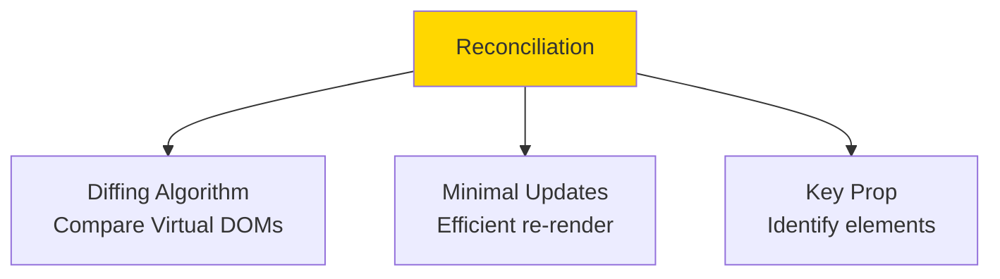

### Without Keys

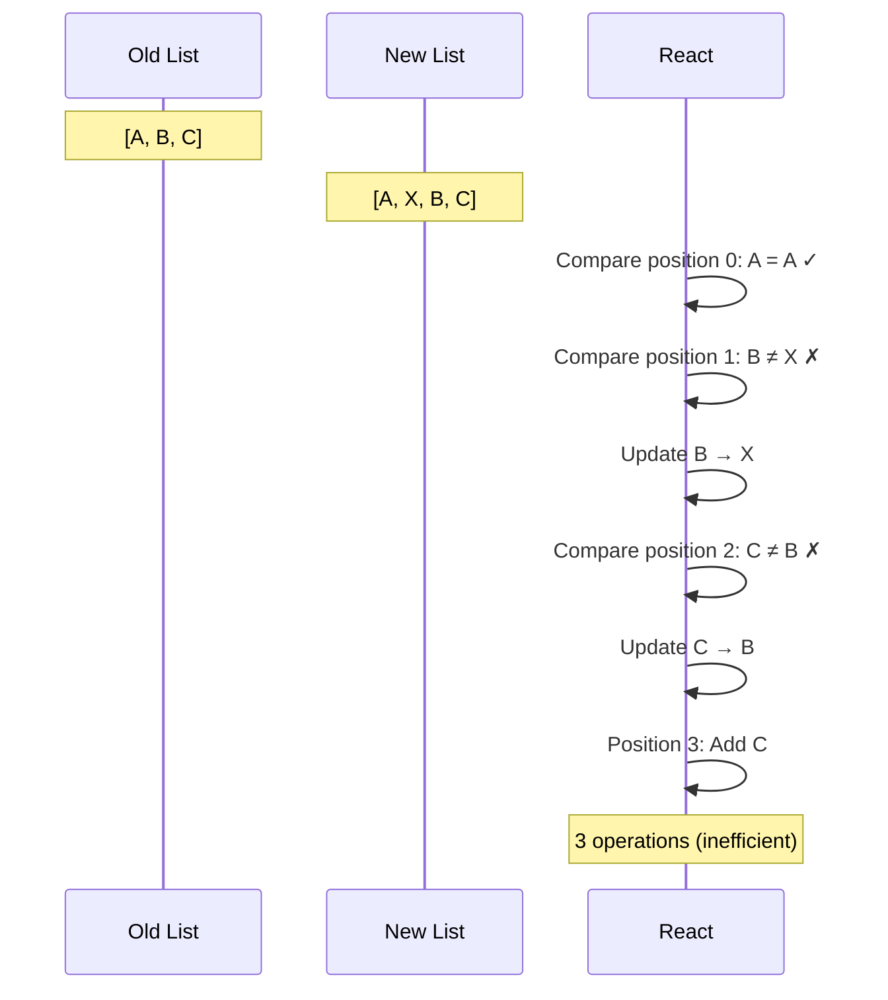

### With Keys

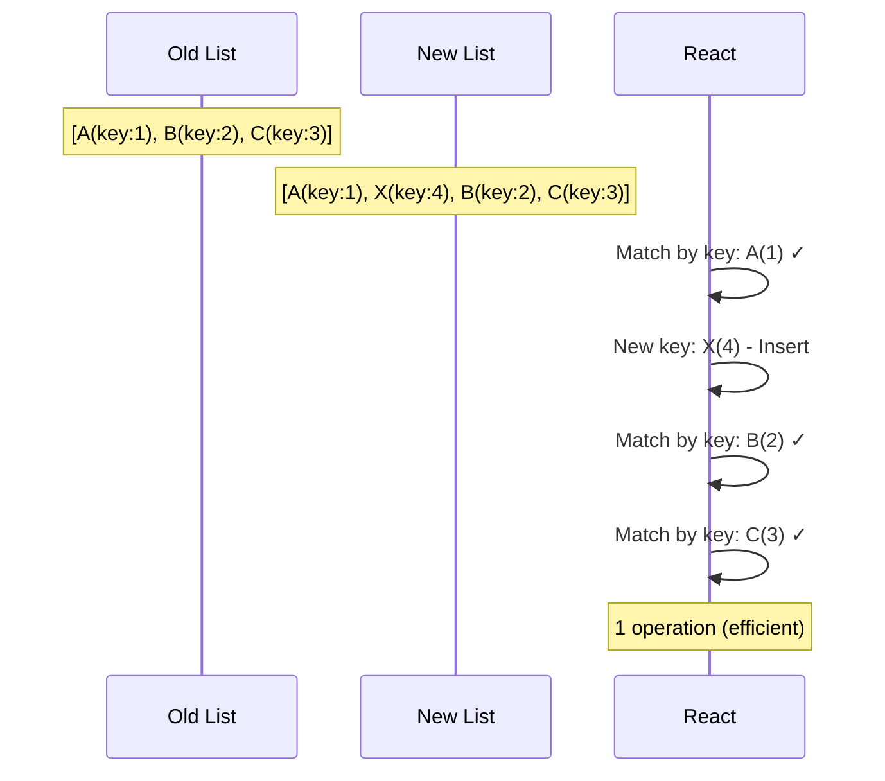

### Key Prop Usage

```javascript
// ❌ Bad: Using index as key
function BadList({ items }) {
  return (
    <ul>
      {items.map((item, index) => (
        <li key={index}>{item.name}</li>
      ))}
    </ul>
  );
}

// ✅ Good: Using unique ID as key
function GoodList({ items }) {
  return (
    <ul>
      {items.map(item => (
        <li key={item.id}>{item.name}</li>
      ))}
    </ul>
  );
}
```

**Problems with Index as Key**:

```javascript
// Initial: [A, B, C]
<li key={0}>A <input /></li>
<li key={1}>B <input /></li>
<li key={2}>C <input /></li>

// After deleting A: [B, C]
<li key={0}>B <input /></li>  // Was key={1}, now key={0}
<li key={1}>C <input /></li>  // Was key={2}, now key={1}

// Input states get mixed up!
```

---

## Q7: Explain CSS-in-JS and styled-components.

**Answer**:

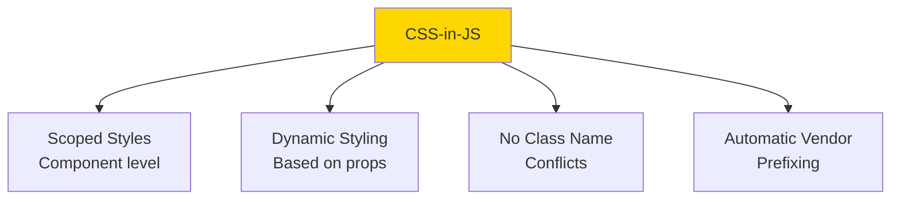

### styled-components

```javascript
import styled from 'styled-components';

// Create styled component
const Button = styled.button`
  background: ${props => props.primary ? 'blue' : 'gray'};
  color: white;
  padding: 10px 20px;
  border: none;
  border-radius: 4px;
  cursor: pointer;
  
  &:hover {
    opacity: 0.8;
  }
  
  &:disabled {
    opacity: 0.5;
    cursor: not-allowed;
  }
`;

const Container = styled.div`
  max-width: 1200px;
  margin: 0 auto;
  padding: 20px;
`;

// Usage
function App() {
  return (
    <Container>
      <Button primary>Primary Button</Button>
      <Button>Secondary Button</Button>
      <Button disabled>Disabled Button</Button>
    </Container>
  );
}
```

### Dynamic Styling

```javascript
const Card = styled.div`
  padding: 20px;
  background: ${props => props.theme.background};
  color: ${props => props.theme.text};
  border: 1px solid ${props => props.theme.border};
  border-radius: 8px;
  
  ${props => props.elevated && `
    box-shadow: 0 4px 6px rgba(0, 0, 0, 0.1);
  `}
  
  ${props => props.size === 'large' && `
    padding: 40px;
    font-size: 1.2rem;
  `}
`;

// Usage
<Card elevated size="large">
  Content
</Card>
```

### Theming

```javascript
import { ThemeProvider } from 'styled-components';

const lightTheme = {
  background: '#ffffff',
  text: '#000000',
  border: '#cccccc'
};

const darkTheme = {
  background: '#1a1a1a',
  text: '#ffffff',
  border: '#444444'
};

function App() {
  const [isDark, setIsDark] = useState(false);
  
  return (
    <ThemeProvider theme={isDark ? darkTheme : lightTheme}>
      <Card>Themed content</Card>
      <button onClick={() => setIsDark(!isDark)}>
        Toggle Theme
      </button>
    </ThemeProvider>
  );
}
```

---

## Q8: What are React Portals?

**Answer**:

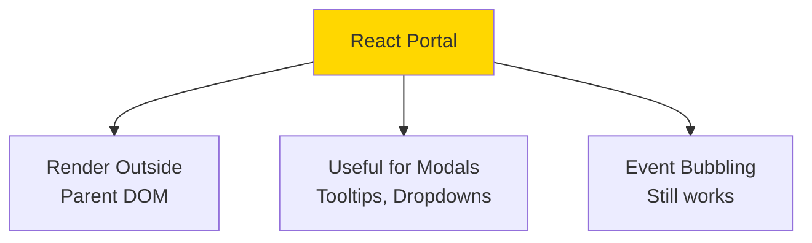

### Portal Usage

```javascript
import { createPortal } from 'react-dom';

function Modal({ isOpen, onClose, children }) {
  if (!isOpen) return null;
  
  // Render into document.body instead of parent
  return createPortal(
    <div className="modal-overlay" onClick={onClose}>
      <div className="modal-content" onClick={e => e.stopPropagation()}>
        {children}
        <button onClick={onClose}>Close</button>
      </div>
    </div>,
    document.body // Target container
  );
}

function App() {
  const [isOpen, setIsOpen] = useState(false);
  
  return (
    <div style={{ overflow: 'hidden', position: 'relative' }}>
      <h1>My App</h1>
      <button onClick={() => setIsOpen(true)}>Open Modal</button>
      
      <Modal isOpen={isOpen} onClose={() => setIsOpen(false)}>
        <h2>Modal Content</h2>
        <p>This renders outside the parent DOM hierarchy</p>
      </Modal>
    </div>
  );
}
```

### DOM Structure

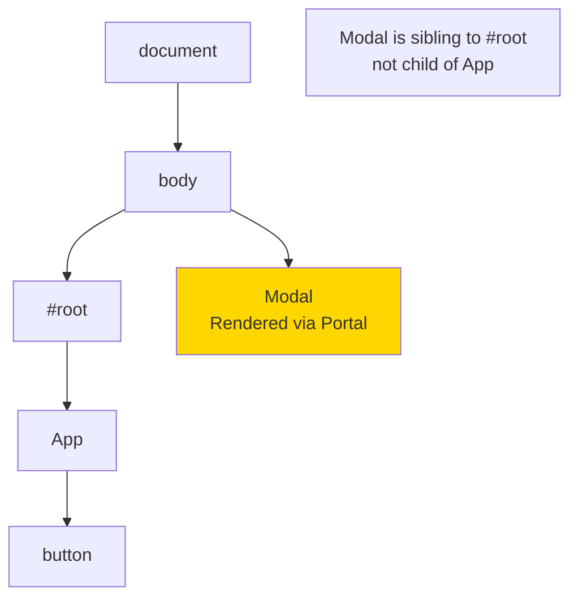

**Why Use Portals**:
- Escape `overflow: hidden` or `z-index` constraints
- Render modals at document root
- Tooltips that extend beyond parent
- Dropdowns that need to overlay everything

---

## Q9: Explain Vue watchers vs computed properties.

**Answer**:

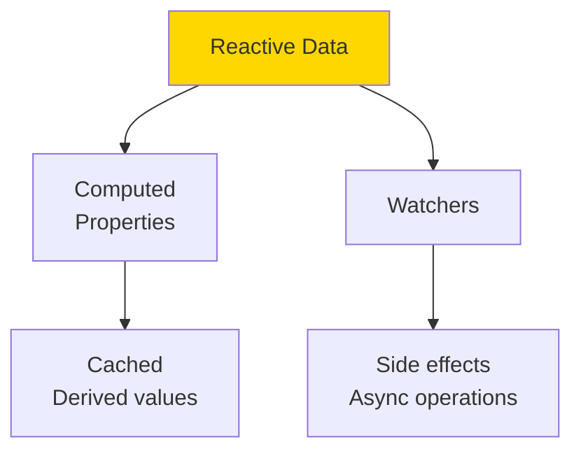

### Computed Properties

```vue
<script setup>
import { ref, computed } from 'vue';

const firstName = ref('John');
const lastName = ref('Doe');

// Computed: Cached, only recalculates when dependencies change
const fullName = computed(() => {
  console.log('Computing full name');
  return `${firstName.value} ${lastName.value}`;
});

// Computed with getter and setter
const fullNameEditable = computed({
  get() {
    return `${firstName.value} ${lastName.value}`;
  },
  set(value) {
    const parts = value.split(' ');
    firstName.value = parts[0];
    lastName.value = parts[1];
  }
});
</script>

<template>
  <div>
    <input v-model="firstName" />
    <input v-model="lastName" />
    <p>Full name: {{ fullName }}</p>
    <input v-model="fullNameEditable" />
  </div>
</template>
```

### Watchers

```vue
<script setup>
import { ref, watch, watchEffect } from 'vue';

const searchQuery = ref('');
const results = ref([]);
const loading = ref(false);

// Watch: React to changes, perform side effects
watch(searchQuery, async (newQuery, oldQuery) => {
  console.log(`Query changed from "${oldQuery}" to "${newQuery}"`);
  
  if (newQuery.length < 3) {
    results.value = [];
    return;
  }
  
  loading.value = true;
  try {
    const response = await fetch(`/api/search?q=${newQuery}`);
    results.value = await response.json();
  } finally {
    loading.value = false;
  }
}, {
  immediate: false,  // Don't run on mount
  deep: false        // Don't watch nested properties
});

// watchEffect: Automatically tracks dependencies
watchEffect(() => {
  console.log(`Search query is: ${searchQuery.value}`);
  // Automatically re-runs when searchQuery changes
});
</script>
```

### When to Use Each

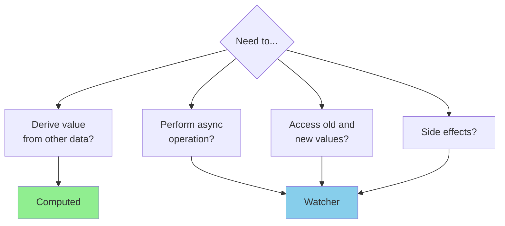

---

## Q10: What is code splitting and lazy loading in React?

**Answer**:

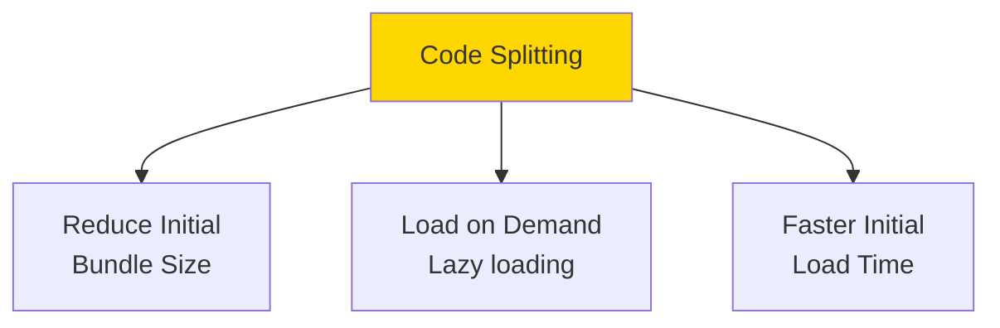

### React.lazy and Suspense

```javascript
import { lazy, Suspense } from 'react';

// Lazy load components
const Dashboard = lazy(() => import('./Dashboard'));
const Profile = lazy(() => import('./Profile'));
const Settings = lazy(() => import('./Settings'));

function App() {
  const [page, setPage] = useState('dashboard');
  
  return (
    <div>
      <nav>
        <button onClick={() => setPage('dashboard')}>Dashboard</button>
        <button onClick={() => setPage('profile')}>Profile</button>
        <button onClick={() => setPage('settings')}>Settings</button>
      </nav>
      
      <Suspense fallback={<div>Loading...</div>}>
        {page === 'dashboard' && <Dashboard />}
        {page === 'profile' && <Profile />}
        {page === 'settings' && <Settings />}
      </Suspense>
    </div>
  );
}
```

### Route-based Code Splitting

```javascript
import { BrowserRouter, Routes, Route } from 'react-router-dom';
import { lazy, Suspense } from 'react';

const Home = lazy(() => import('./pages/Home'));
const About = lazy(() => import('./pages/About'));
const Contact = lazy(() => import('./pages/Contact'));

function App() {
  return (
    <BrowserRouter>
      <Suspense fallback={<div>Loading page...</div>}>
        <Routes>
          <Route path="/" element={<Home />} />
          <Route path="/about" element={<About />} />
          <Route path="/contact" element={<Contact />} />
        </Routes>
      </Suspense>
    </BrowserRouter>
  );
}
```

### Loading Flow

```mermaid
sequenceDiagram
    participant U as User
    participant A as App
    participant S as Suspense
    participant C as Chunk
    
    U->>A: Navigate to /about
    A->>S: Render About (lazy)
    S->>S: Show fallback
    S->>C: Fetch about.chunk.js
    C->>S: Chunk loaded
    S->>A: Render About component
    A->>U: Show page
```

### Bundle Analysis

```mermaid
graph TB
    A[Without Code Splitting] --> B[main.js<br/>500 KB]
    
    C[With Code Splitting] --> D[main.js<br/>100 KB]
    C --> E[dashboard.chunk.js<br/>150 KB]
    C --> F[profile.chunk.js<br/>100 KB]
    C --> G[settings.chunk.js<br/>150 KB]
    
    style B fill:#FF6B6B
    style D fill:#90EE90
```

**Benefits**:
- Faster initial page load
- Better performance on slow networks
- Load features only when needed
- Improved user experience

---

## Summary

Medium frontend topics:
- **Context API**: Avoid prop drilling, global state
- **useCallback/useMemo**: Performance optimization, memoization
- **Vuex**: Centralized state management for Vue
- **useReducer**: Complex state logic, predictable updates
- **Vue Composables**: Reusable composition functions
- **Reconciliation**: React's diffing algorithm, key prop importance
- **CSS-in-JS**: Scoped styles, dynamic styling, theming
- **React Portals**: Render outside parent DOM hierarchy
- **Watchers vs Computed**: Side effects vs derived values
- **Code Splitting**: Lazy loading, route-based splitting

These concepts enable building scalable, performant frontend applications.

