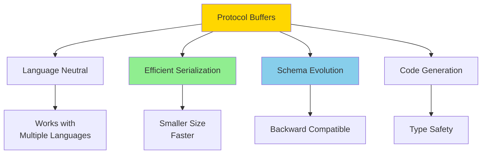

Easy-level Protocol Buffers interview questions covering basics, syntax, and fundamental concepts.

## Q1: What are Protocol Buffers and why use them?

**Answer**:

**Protocol Buffers (protobuf)** is a language-neutral, platform-neutral extensible mechanism for serializing structured data.



**Key Benefits**:
- **Efficiency**: Smaller size than JSON/XML (3-10x)
- **Speed**: Faster serialization/deserialization
- **Schema Evolution**: Backward and forward compatible
- **Language Support**: Works with many languages
- **Type Safety**: Strongly typed schemas

**Use Cases**:
- gRPC services
- Data storage
- Inter-service communication
- API contracts

**Documentation**: [Protocol Buffers Overview](https://protobuf.dev/overview/)

---

## Q2: How do you define a Protocol Buffer message?

**Answer**:

**Basic Message Definition**:
```protobuf
syntax = "proto3";

package example;

// Simple message
message Person {
  string name = 1;
  int32 age = 2;
  string email = 3;
}
```

**Key Components**:
- **syntax**: Protocol version (`proto2` or `proto3`)
- **package**: Namespace for message types
- **message**: Defines a data structure
- **Fields**: Data members with types and numbers

**Field Numbers**:
- Unique identifier for each field (1-536,870,911)
- Used in binary encoding (not field names)
- Cannot be changed once used
- Reserved numbers cannot be reused

**Example with Multiple Types**:
```protobuf
syntax = "proto3";

message User {
  int64 id = 1;
  string username = 2;
  string email = 3;
  bool is_active = 4;
  repeated string tags = 5;  // Array
  map<string, string> metadata = 6;  // Dictionary
}
```

**Documentation**: [Language Guide](https://protobuf.dev/programming-guides/proto3/)

---

## Q3: What are the basic data types in Protocol Buffers?

**Answer**:

**Scalar Types**:

| Type | Description | Default Value |
|------|-------------|---------------|
| `double` | 64-bit floating point | 0.0 |
| `float` | 32-bit floating point | 0.0 |
| `int32` | 32-bit signed integer | 0 |
| `int64` | 64-bit signed integer | 0 |
| `uint32` | 32-bit unsigned integer | 0 |
| `uint64` | 64-bit unsigned integer | 0 |
| `sint32` | 32-bit signed (ZigZag encoding) | 0 |
| `sint64` | 64-bit signed (ZigZag encoding) | 0 |
| `fixed32` | 32-bit unsigned (always 4 bytes) | 0 |
| `fixed64` | 64-bit unsigned (always 8 bytes) | 0 |
| `sfixed32` | 32-bit signed (always 4 bytes) | 0 |
| `sfixed64` | 64-bit signed (always 8 bytes) | 0 |
| `bool` | Boolean | false |
| `string` | UTF-8 string | "" |
| `bytes` | Arbitrary byte sequence | "" |

**Example**:
```protobuf
message DataTypes {
  double price = 1;
  float discount = 2;
  int32 quantity = 3;
  int64 timestamp = 4;
  bool in_stock = 5;
  string name = 6;
  bytes image_data = 7;
}
```

**When to Use**:
- **int32/int64**: General integers
- **sint32/sint64**: Negative numbers (better encoding)
- **fixed32/fixed64**: Large numbers (always same size)
- **string**: Text data
- **bytes**: Binary data (images, etc.)

**Documentation**: [Scalar Value Types](https://protobuf.dev/programming-guides/proto3/#scalar)

---

## Q4: How do you define repeated fields and maps?

**Answer**:

**Repeated Fields** (Arrays):
```protobuf
message ShoppingCart {
  int32 user_id = 1;
  repeated int32 item_ids = 2;  // Array of integers
  repeated string item_names = 3;  // Array of strings
  repeated Item items = 4;  // Array of messages
}

message Item {
  int32 id = 1;
  string name = 2;
  double price = 3;
}
```

**Maps** (Dictionaries):
```protobuf
message UserProfile {
  int64 user_id = 1;
  string username = 2;
  
  // Map: key -> value
  map<string, string> preferences = 3;
  map<int32, string> settings = 4;
  map<string, Item> inventory = 5;
}
```

**Key Restrictions**:
- Map keys can be: `int32`, `int64`, `uint32`, `uint64`, `sint32`, `sint64`, `fixed32`, `fixed64`, `sfixed32`, `sfixed64`, `bool`, `string`
- Map values can be any type except another map
- Maps cannot be `repeated`

**Usage Example**:
```protobuf
message Configuration {
  map<string, string> env_vars = 1;
  map<int32, Server> servers = 2;
}

message Server {
  string host = 1;
  int32 port = 2;
}
```

**Documentation**: [Repeated Fields](https://protobuf.dev/programming-guides/proto3/#specifying-field-rules)

---

## Q5: How do you use enums in Protocol Buffers?

**Answer**:

**Enum Definition**:
```protobuf
message Order {
  int64 id = 1;
  OrderStatus status = 2;
  PaymentMethod payment = 3;
}

enum OrderStatus {
  ORDER_STATUS_UNSPECIFIED = 0;  // Required: must start at 0
  ORDER_STATUS_PENDING = 1;
  ORDER_STATUS_PROCESSING = 2;
  ORDER_STATUS_SHIPPED = 3;
  ORDER_STATUS_DELIVERED = 4;
  ORDER_STATUS_CANCELLED = 5;
}

enum PaymentMethod {
  PAYMENT_METHOD_UNSPECIFIED = 0;
  PAYMENT_METHOD_CREDIT_CARD = 1;
  PAYMENT_METHOD_DEBIT_CARD = 2;
  PAYMENT_METHOD_PAYPAL = 3;
  PAYMENT_METHOD_CRYPTO = 4;
}
```

**Enum Rules**:
- First value must be 0 (used as default)
- Values must be unique within enum
- Use `_UNSPECIFIED` suffix for default (best practice)
- Enum values are 32-bit integers

**Aliases** (proto2 only):
```protobuf
enum Status {
  option allow_alias = true;
  UNKNOWN = 0;
  PENDING = 1;
  PROCESSING = 1;  // Alias for PENDING
}
```

**Documentation**: [Enums](https://protobuf.dev/programming-guides/proo3/#enum)

---

## Q6: How do you define nested messages?

**Answer**:

**Nested Messages**:
```protobuf
message User {
  int64 id = 1;
  string name = 2;
  
  // Nested message
  message Address {
    string street = 1;
    string city = 2;
    string state = 3;
    string zip_code = 4;
  }
  
  Address home_address = 3;
  Address work_address = 4;
  
  // Nested enum
  enum UserType {
    USER_TYPE_UNSPECIFIED = 0;
    USER_TYPE_ADMIN = 1;
    USER_TYPE_USER = 2;
    USER_TYPE_GUEST = 3;
  }
  
  UserType type = 5;
}
```

**Accessing Nested Types**:
```protobuf
// In another file or message
message Order {
  User.Address shipping_address = 1;
  User.UserType customer_type = 2;
}
```

**Benefits**:
- Logical grouping
- Namespace organization
- Prevents name conflicts

**Example**:
```protobuf
message Company {
  string name = 1;
  
  message Department {
    string name = 1;
    repeated Employee employees = 2;
    
    message Employee {
      int32 id = 1;
      string name = 2;
    }
  }
  
  repeated Department departments = 2;
}
```

---

## Q7: How do you compile Protocol Buffer files?

**Answer**:

**Modern Approach: Using `buf`**

`buf` is the modern build system for Protocol Buffers - think of it as "makefiles but for protobufs". It provides a better developer experience than using `protoc` directly.

**Install buf**:
```bash
# macOS
brew install bufbuild/buf/buf

# Linux
# Download from https://github.com/bufbuild/buf/releases
# Or use npm
npm install -g @bufbuild/buf

# Verify installation
buf --version
```

**Setup buf Project**:
```bash
# Initialize buf project
buf mod init

# This creates buf.yaml
```

**buf.yaml Configuration**:
```yaml
version: v1
name: buf.build/your-org/your-repo
deps:
  - buf.build/googleapis/googleapis
lint:
  use:
    - DEFAULT
breaking:
  use:
    - FILE
```

**Generate Code with buf**:
```bash
# Generate code for all languages
buf generate

# Generate with specific template
buf generate --template buf.gen.yaml
```

**buf.gen.yaml Template**:
```yaml
version: v1
plugins:
  - plugin: buf.build/protocolbuffers/python
    out: gen/python
  - plugin: buf.build/connectrpc/go
    out: gen/go
    opt:
      - paths=source_relative
  - plugin: buf.build/grpc/go
    out: gen/go
    opt:
      - paths=source_relative
```

**Additional buf Commands**:
```bash
# Lint proto files
buf lint

# Check for breaking changes
buf breaking --against '.git#branch=main'

# Format proto files
buf format -w

# Build and validate
buf build
```

**Legacy Approach: Using `protoc` Directly**

While `buf` is recommended, you can still use `protoc` directly:

**Install Protocol Compiler**:
```bash
# macOS
brew install protobuf

# Linux
apt-get install protobuf-compiler

# Or download from GitHub
# https://github.com/protocolbuffers/protobuf/releases
```

**Basic Compilation with protoc**:
```bash
# Compile to Python
protoc --python_out=. user.proto

# Compile to Java
protoc --java_out=. user.proto

# Compile to Go
protoc --go_out=. user.proto

# Compile to C++
protoc --cpp_out=. user.proto
```

**Multiple Languages with protoc**:
```bash
# Generate for multiple languages
protoc \
  --python_out=. \
  --java_out=. \
  --go_out=. \
  --cpp_out=. \
  user.proto
```

**With gRPC using protoc**:
```bash
# Generate gRPC code (Python)
protoc --python_out=. --grpc_out=. --plugin=protoc-gen-grpc=`which grpc_python_plugin` user.proto

# Generate gRPC code (Go)
protoc --go_out=. --go-grpc_out=. user.proto
```

**Why Use buf?**:
- **Simpler**: No need to manage complex `protoc` command lines
- **Linting**: Built-in linting and breaking change detection
- **Dependency Management**: Easy management of proto dependencies
- **CI/CD Integration**: Better integration with build systems
- **Consistency**: Ensures consistent code generation across team

**Documentation**: 
- [buf Documentation](https://buf.build/docs)
- [Protocol Compiler Installation](https://protobuf.dev/getting-started/)

---

## Q8: How do you use Protocol Buffers in Python?

**Answer**:

**Installation**:
```bash
pip install protobuf
```

**Generated Code Usage**:
```python
# After compiling: protoc --python_out=. user.proto
import user_pb2

# Create message
person = user_pb2.Person()
person.name = "John Doe"
person.age = 30
person.email = "john@example.com"

# Serialize to bytes
data = person.SerializeToString()

# Deserialize from bytes
new_person = user_pb2.Person()
new_person.ParseFromString(data)

print(new_person.name)  # "John Doe"
print(new_person.age)   # 30
```

**JSON Conversion**:
```python
import json
from google.protobuf.json_format import MessageToJson, Parse

# To JSON
json_str = MessageToJson(person)
print(json_str)
# {"name": "John Doe", "age": 30, "email": "john@example.com"}

# From JSON
person2 = user_pb2.Person()
Parse(json_str, person2)
```

**Repeated Fields**:
```python
cart = user_pb2.ShoppingCart()
cart.user_id = 123
cart.item_ids.append(1)
cart.item_ids.append(2)
cart.item_ids.append(3)

# Or extend
cart.item_ids.extend([4, 5, 6])
```

**Maps**:
```python
profile = user_pb2.UserProfile()
profile.user_id = 456
profile.preferences["theme"] = "dark"
profile.preferences["language"] = "en"
```

**Documentation**: [Python Generated Code](https://protobuf.dev/reference/python/python-generated/)

---

## Q9: How do you use Protocol Buffers in Go?

**Answer**:

**Installation**:
```bash
go get google.golang.org/protobuf/proto
go install google.golang.org/protobuf/cmd/protoc-gen-go@latest
```

**Generated Code Usage**:
```go
package main

import (
    "fmt"
    "log"
    "google.golang.org/protobuf/proto"
    pb "path/to/generated/user"
)

func main() {
    // Create message
    person := &pb.Person{
        Name:  "John Doe",
        Age:   30,
        Email: "john@example.com",
    }
    
    // Serialize
    data, err := proto.Marshal(person)
    if err != nil {
        log.Fatal(err)
    }
    
    // Deserialize
    newPerson := &pb.Person{}
    err = proto.Unmarshal(data, newPerson)
    if err != nil {
        log.Fatal(err)
    }
    
    fmt.Println(newPerson.Name)  // "John Doe"
    fmt.Println(newPerson.Age)   // 30
}
```

**Repeated Fields**:
```go
cart := &pb.ShoppingCart{
    UserId: 123,
    ItemIds: []int32{1, 2, 3},
}

// Append
cart.ItemIds = append(cart.ItemIds, 4)
```

**Maps**:
```go
profile := &pb.UserProfile{
    UserId: 456,
    Preferences: map[string]string{
        "theme":     "dark",
        "language":  "en",
    },
}
```

**Documentation**: [Go Generated Code](https://protobuf.dev/reference/go/go-generated/)

---

## Q10: What is the difference between proto2 and proto3?

**Answer**:

**Key Differences**:

| Feature | proto2 | proto3 |
|---------|--------|--------|
| **Required fields** | Yes | No |
| **Default values** | Explicit | Implicit (zero values) |
| **Field presence** | Has methods | No has methods |
| **Extensions** | Yes | No (use `Any` instead) |
| **Groups** | Yes | No |
| **Enum first value** | Can be any | Must be 0 |

**proto2 Example**:
```protobuf
syntax = "proto2";

message User {
  required string name = 1;  // Required field
  optional int32 age = 2;    // Optional field
  string email = 3;          // Optional by default
}
```

**proto3 Example**:
```protobuf
syntax = "proto3";

message User {
  string name = 1;   // Always optional (no required/optional keywords)
  int32 age = 2;     // Default: 0
  string email = 3;  // Default: ""
}
```

**Field Presence in proto3**:
```protobuf
// proto3: Use wrapper types for presence detection
import "google/protobuf/wrappers.proto";

message User {
  google.protobuf.StringValue name = 1;  // Can detect if set
  google.protobuf.Int32Value age = 2;    // Can detect if set
}
```

**Recommendation**: Use **proto3** for new projects (simpler, cleaner)

**Documentation**: [Language Guide - proto3](https://protobuf.dev/programming-guides/proto3/)

---

## Q11: How do you handle optional fields in proto3?

**Answer**:

**Problem**: In proto3, you cannot distinguish between a field set to its default value and a field that was never set.

**Solution 1: Use Wrapper Types**:
```protobuf
import "google/protobuf/wrappers.proto";

message User {
  google.protobuf.StringValue name = 1;      // Optional string
  google.protobuf.Int32Value age = 2;        // Optional int32
  google.protobuf.BoolValue is_active = 3;   // Optional bool
}
```

**Usage**:
```python
# Python
user = user_pb2.User()
user.name.value = "John"  # Set value
# user.name.value is None if not set

# Go
user := &pb.User{
    Name: &wrapperspb.StringValue{Value: "John"},
}
// user.Name == nil if not set
```

**Solution 2: Use `oneof`**:
```protobuf
message User {
  oneof name_oneof {
    string name = 1;
  }
  oneof age_oneof {
    int32 age = 2;
  }
}
```

**Solution 3: Use `optional` (proto3 feature)**:
```protobuf
message User {
  optional string name = 1;  // Has presence detection
  optional int32 age = 2;     // Has presence detection
}
```

**Documentation**: [Field Presence](https://protobuf.dev/programming-guides/field_presence/)

---

## Q12: How do you define and use `oneof` fields?

**Answer**:

**`oneof` Definition**:
```protobuf
message Payment {
  int64 order_id = 1;
  
  oneof payment_method {
    CreditCard credit_card = 2;
    PayPal paypal = 3;
    BankTransfer bank_transfer = 4;
    Cryptocurrency crypto = 5;
  }
}

message CreditCard {
  string card_number = 1;
  string expiry_date = 2;
  string cvv = 3;
}

message PayPal {
  string email = 1;
}

message BankTransfer {
  string account_number = 1;
  string routing_number = 2;
}

message Cryptocurrency {
  string wallet_address = 1;
  string currency = 2;
}
```

**Usage**:
```python
# Python
payment = payment_pb2.Payment()
payment.order_id = 12345

# Set one field (clears others)
payment.credit_card.card_number = "1234-5678-9012-3456"
payment.credit_card.expiry_date = "12/25"
payment.credit_card.cvv = "123"

# Check which field is set
if payment.HasField('credit_card'):
    print("Using credit card")
elif payment.HasField('paypal'):
    print("Using PayPal")
```

```go
// Go
payment := &pb.Payment{
    OrderId: 12345,
    PaymentMethod: &pb.Payment_CreditCard{
        CreditCard: &pb.CreditCard{
            CardNumber: "1234-5678-9012-3456",
            ExpiryDate: "12/25",
            Cvv:        "123",
        },
    },
}

// Check which field is set
switch pm := payment.PaymentMethod.(type) {
case *pb.Payment_CreditCard:
    fmt.Println("Using credit card:", pm.CreditCard.CardNumber)
case *pb.Payment_Paypal:
    fmt.Println("Using PayPal:", pm.Paypal.Email)
}
```

**Use Cases**:
- Union types
- Optional fields with presence
- Polymorphic data

**Documentation**: [Oneof](https://protobuf.dev/programming-guides/proto3/#oneof)

---

