Easy-level protocol and design interview questions covering fundamental concepts.

## Q1: What is a network protocol and why is it important?

**Answer**:

**Definition**: A set of rules and conventions for communication between network entities.

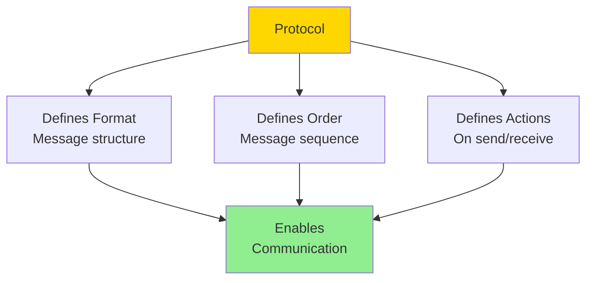

**Why Important**:
- Standardization: Different systems can communicate
- Interoperability: Works across vendors
- Reliability: Error handling, retransmission
- Security: Authentication, encryption

**Examples**:
- **HTTP**: Web communication
- **TCP**: Reliable data transfer
- **DNS**: Name resolution
- **SMTP**: Email delivery

---

## Q2: Explain the OSI model layers.

**Answer**:

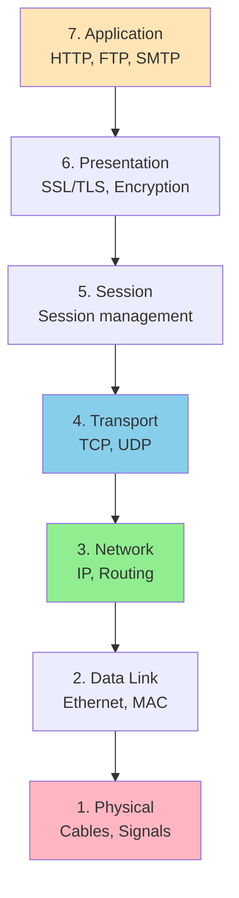

### Layer Responsibilities

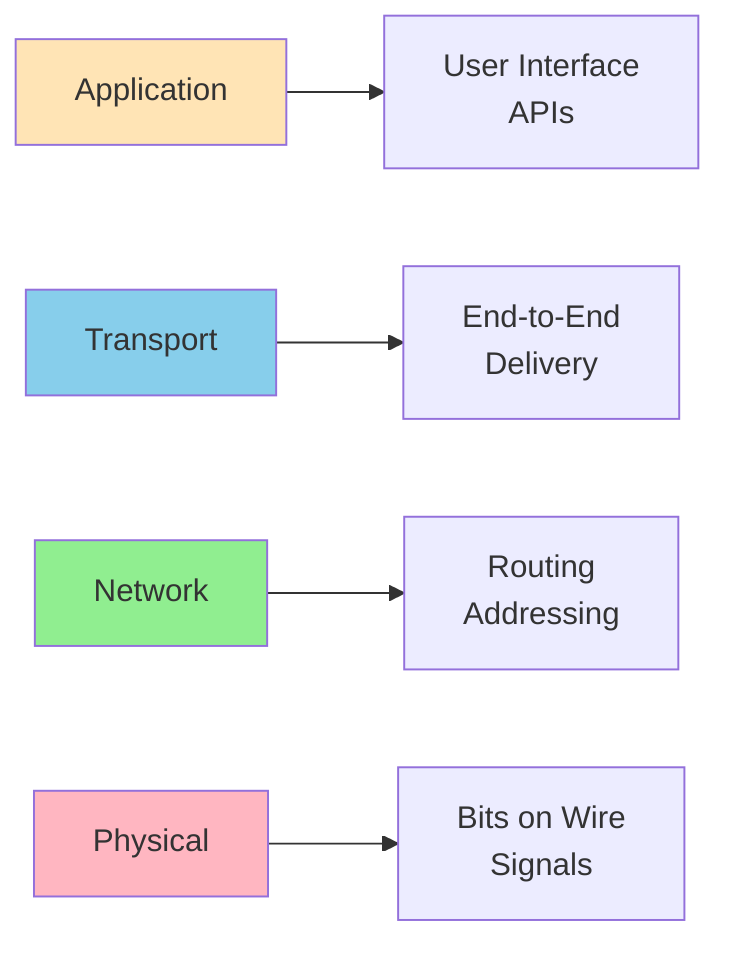

**Mnemonic**: "All People Seem To Need Data Processing"

---

## Q3: What's the difference between TCP and UDP?

**Answer**:

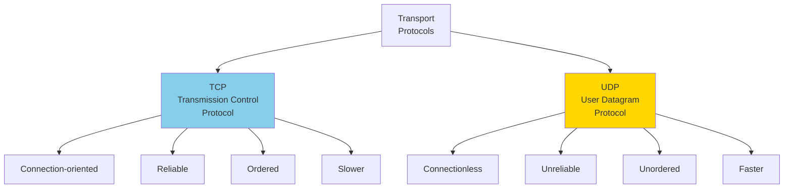

### TCP Three-Way Handshake

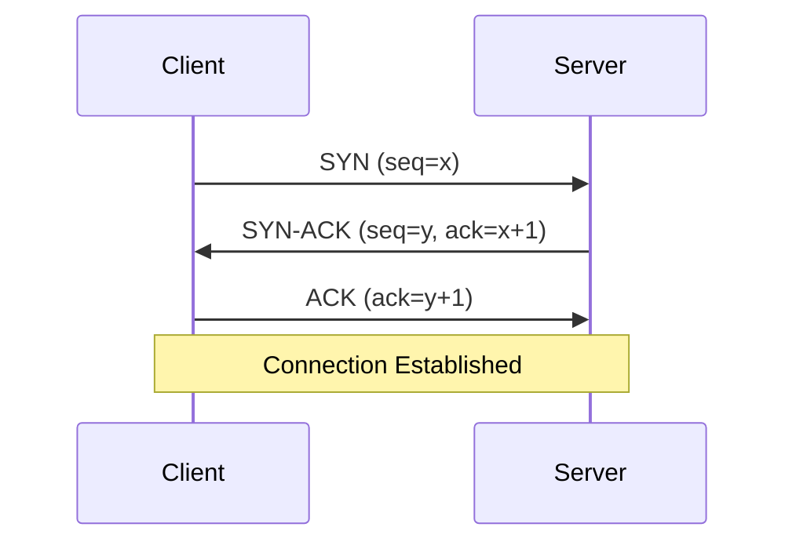

### When to Use Each

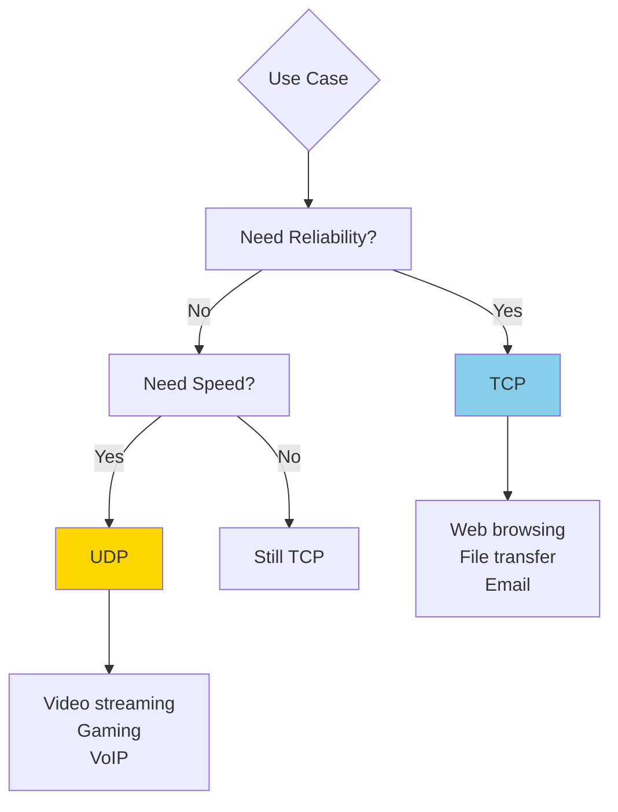

---

## Q4: Explain how DNS works.

**Answer**:

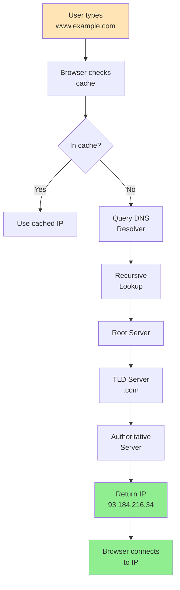

### DNS Hierarchy

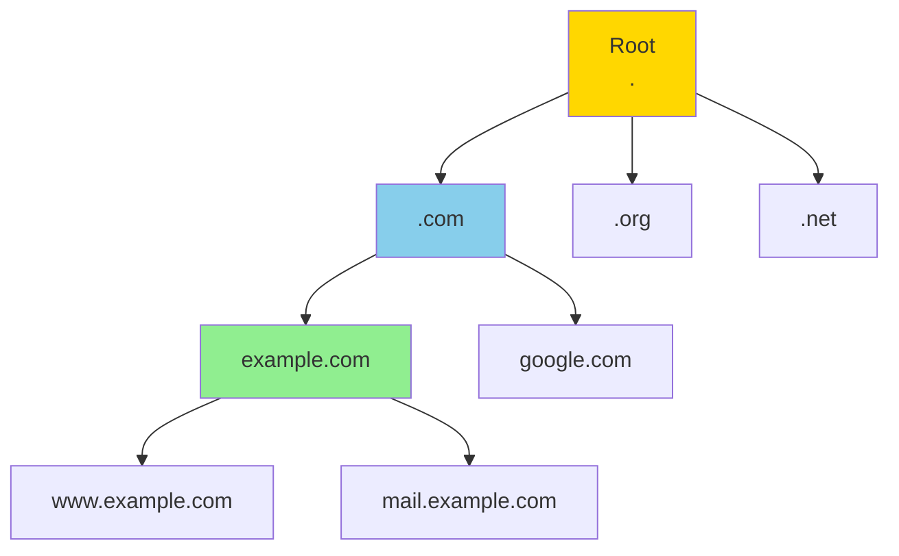

**DNS Record Types**:
- **A**: IPv4 address
- **AAAA**: IPv6 address
- **CNAME**: Alias to another name
- **MX**: Mail server
- **TXT**: Text data

---

## Q5: What is HTTP and how does it work?

**Answer**:

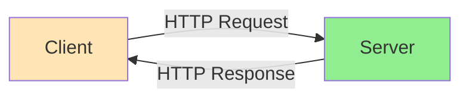

### HTTP Request

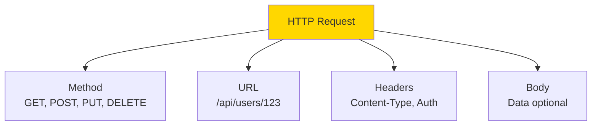

### HTTP Response

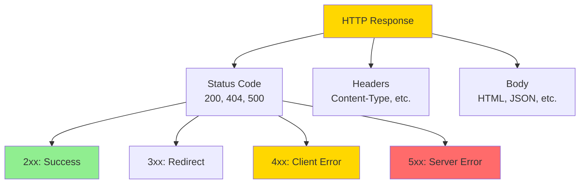

**Common Status Codes**:
- **200 OK**: Success
- **201 Created**: Resource created
- **400 Bad Request**: Invalid request
- **401 Unauthorized**: Authentication required
- **404 Not Found**: Resource doesn't exist
- **500 Internal Server Error**: Server error

---

## Q6: Explain REST API principles.

**Answer**:

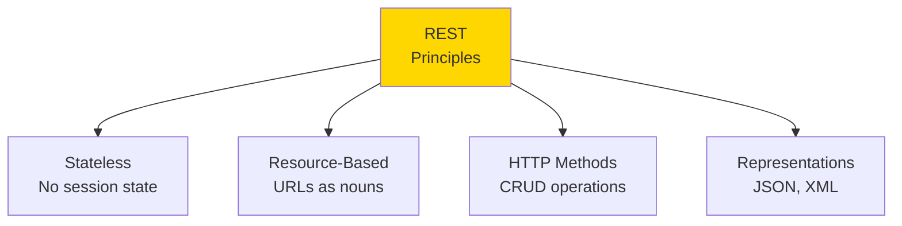

### RESTful URL Design

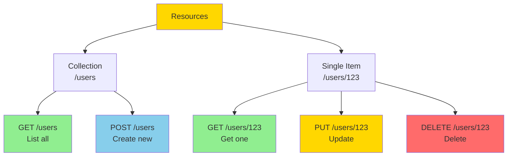

### HTTP Methods

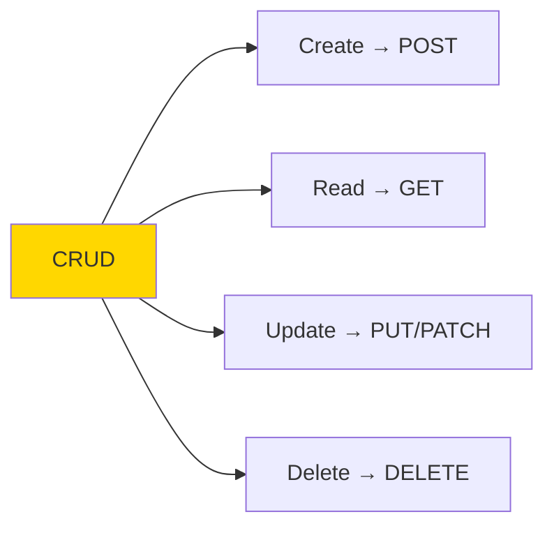

**Best Practices**:
- Use nouns, not verbs in URLs
- Use plural for collections
- Use HTTP status codes correctly
- Version your API
- Use pagination for large collections

---

## Q7: What is WebSocket and when to use it?

**Answer**:

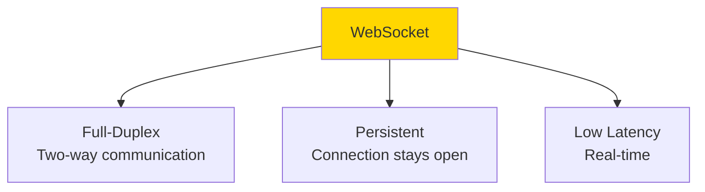

### HTTP vs WebSocket

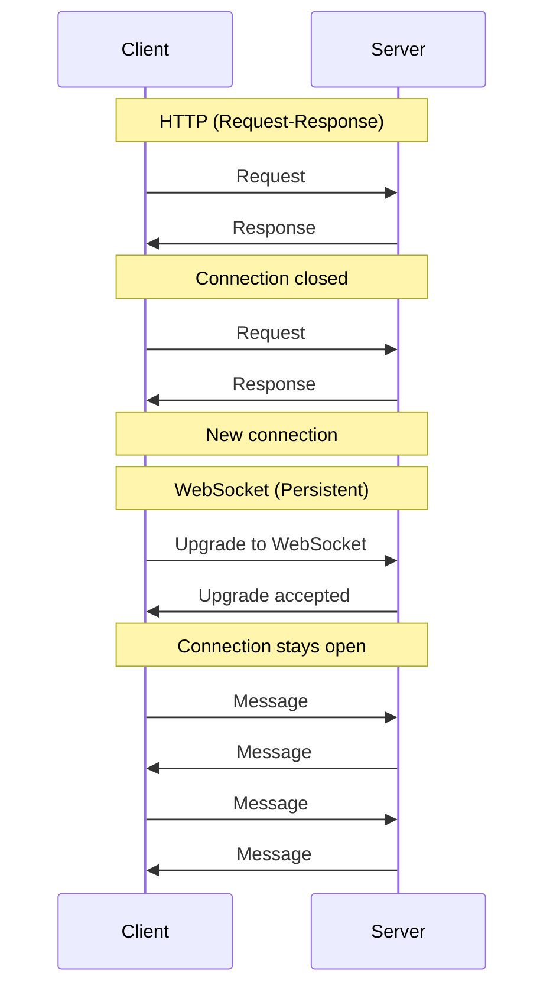

### Use Cases

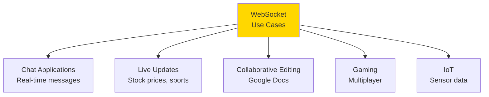

**When NOT to use**:
- Simple request-response
- Infrequent updates
- One-way communication (use SSE)

---

## Q8: Explain load balancing basics.

**Answer**:

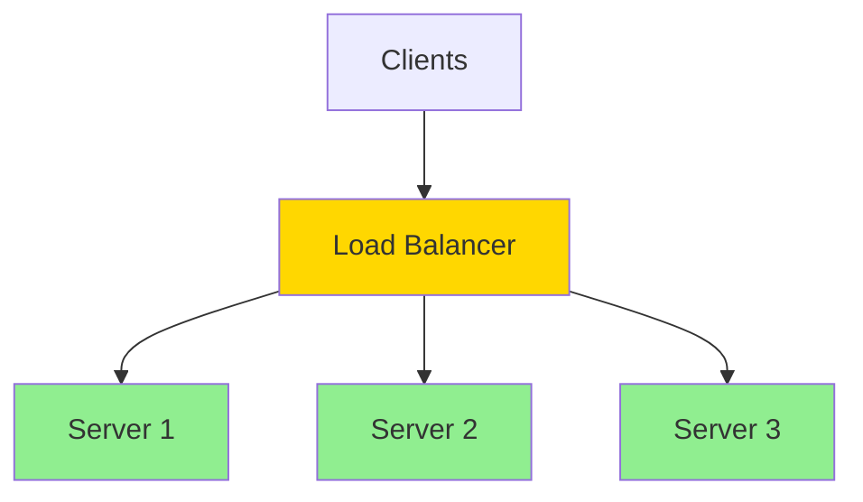

### Load Balancing Algorithms

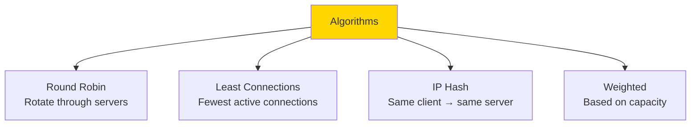

### Round Robin Example

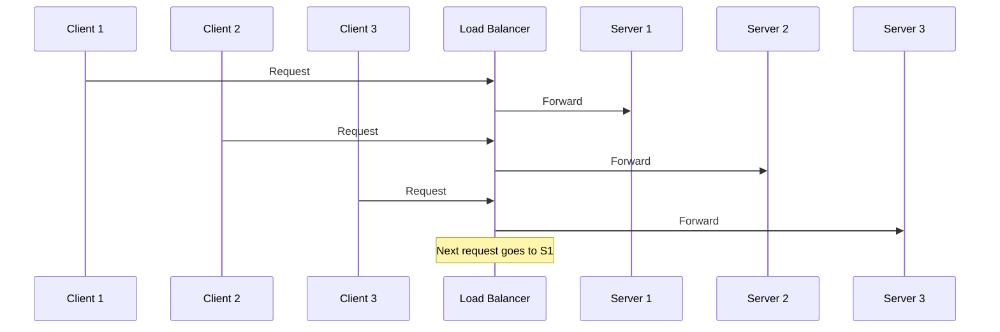

**Benefits**:
- High availability
- Scalability
- No single point of failure
- Better performance

---

## Q9: What is API versioning and why is it important?

**Answer**:

```mermaid
graph TB
    A[API Versioning] --> B[Breaking Changes<br/>Incompatible updates]
    A --> C[Backward Compatibility<br/>Support old clients]
    A --> D[Gradual Migration<br/>Transition period]
    
    style A fill:#FFD700
```

### Versioning Strategies

```mermaid
graph TB
    A[Versioning<br/>Methods] --> B1[URL Path<br/>/v1/users]
    A --> B2[Query Parameter<br/>/users?version=1]
    A --> B3[Header<br/>Accept: application/vnd.api+json;version=1]
    A --> B4[Subdomain<br/>v1.api.example.com]
    
    B1 --> C1[✓ Most Common<br/>✓ Clear<br/>✗ URL changes]
    B2 --> C2[✓ Same URL<br/>✗ Easy to forget]
    B3 --> C3[✓ Clean URLs<br/>✗ Less visible]
    B4 --> C4[✓ Separate infrastructure<br/>✗ Complex]
    
    style B1 fill:#90EE90
```

### Version Lifecycle

```mermaid
graph LR
    A[v1 Released] --> B[v2 Released<br/>v1 Deprecated]
    B --> C[v3 Released<br/>v1 Sunset<br/>v2 Deprecated]
    C --> D[v2 Sunset]
    
    style A fill:#90EE90
    style B fill:#FFD700
    style C fill:#FFD700
    style D fill:#FF6B6B
```

**Best Practices**:
- Version from day one
- Document breaking changes
- Give deprecation notice (6-12 months)
- Support at least 2 versions
- Use semantic versioning

---

## Q10: Explain basic authentication methods.

**Answer**:

```mermaid
graph TB
    A[Authentication<br/>Methods] --> B[Basic Auth]
    A --> C[API Keys]
    A --> D[OAuth 2.0]
    A --> E[JWT]
    
    style A fill:#FFD700
```

### Basic Authentication

```mermaid
sequenceDiagram
    participant C as Client
    participant S as Server
    
    C->>S: GET /api/users
    S->>C: 401 Unauthorized
    
    C->>S: GET /api/users<br/>Authorization: Basic base64(user:pass)
    S->>S: Verify credentials
    S->>C: 200 OK + Data
```

**Format**: `Authorization: Basic base64(username:password)`

**Pros**: Simple
**Cons**: Not secure without HTTPS, credentials in every request

### API Key

```mermaid
sequenceDiagram
    participant C as Client
    participant S as Server
    
    Note over C: Has API key: abc123xyz
    
    C->>S: GET /api/users<br/>X-API-Key: abc123xyz
    S->>S: Validate key
    S->>C: 200 OK + Data
```

**Pros**: Simple, revocable
**Cons**: Long-lived, no user context

### JWT (JSON Web Token)

```mermaid
sequenceDiagram
    participant C as Client
    participant S as Server
    
    C->>S: POST /login<br/>{username, password}
    S->>S: Verify credentials
    S->>C: JWT token
    
    Note over C: Store token
    
    C->>S: GET /api/users<br/>Authorization: Bearer <JWT>
    S->>S: Verify token signature
    S->>C: 200 OK + Data
```

**JWT Structure**: `header.payload.signature`

**Pros**: Stateless, contains claims, secure
**Cons**: Can't revoke easily, size

### Comparison

```mermaid
graph TB
    A{Security<br/>Needs} --> B[Low<br/>Internal tools]
    A --> C[Medium<br/>Public API]
    A --> D[High<br/>User data]
    
    B --> E[API Key]
    C --> F[API Key + HTTPS]
    D --> G[OAuth 2.0 + JWT]
    
    style E fill:#FFD700
    style F fill:#87CEEB
    style G fill:#90EE90
```

---

## Summary

Key protocol and design concepts:
- **Protocols**: Rules for communication
- **OSI Model**: 7-layer network model
- **TCP vs UDP**: Reliable vs fast
- **DNS**: Name to IP resolution
- **HTTP**: Web communication protocol
- **REST**: Resource-based API design
- **WebSocket**: Real-time two-way communication
- **Load Balancing**: Distribute traffic
- **API Versioning**: Manage changes
- **Authentication**: Verify identity

These fundamentals enable building networked systems.

