Hard-level protocol and design interview questions covering advanced distributed systems and protocol design.

## Q1: Design a custom protocol for real-time multiplayer gaming.

**Answer**:

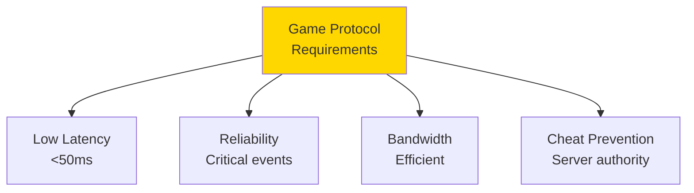
```mermaid
graph TB
    A[Game Protocol<br/>Requirements] --> B[Low Latency<br/><50ms]
    A --> C[Reliability<br/>Critical events]
    A --> D[Bandwidth<br/>Efficient]
    A --> E[Cheat Prevention<br/>Server authority]
    
    style A fill:#FFD700
```

### Protocol Design

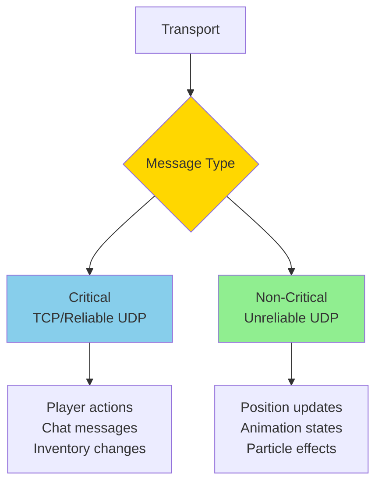
```mermaid
graph TB
    A[Transport] --> B{Message Type}
    
    B --> C1[Critical<br/>TCP/Reliable UDP]
    B --> C2[Non-Critical<br/>Unreliable UDP]
    
    C1 --> D1[Player actions<br/>Chat messages<br/>Inventory changes]
    
    C2 --> D2[Position updates<br/>Animation states<br/>Particle effects]
    
    style B fill:#FFD700
    style C1 fill:#87CEEB
    style C2 fill:#90EE90
```

### Message Format

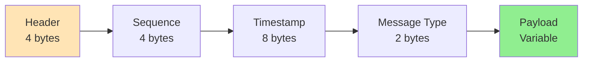
```mermaid
graph LR
    A[Header<br/>4 bytes] --> B[Sequence<br/>4 bytes]
    B --> C[Timestamp<br/>8 bytes]
    C --> D[Message Type<br/>2 bytes]
    D --> E[Payload<br/>Variable]
    
    style A fill:#FFE4B5
    style E fill:#90EE90
```

**Header Fields**:
- **Magic Number**: Protocol identifier
- **Version**: Protocol version
- **Flags**: Reliable, ordered, encrypted
- **Sequence**: For ordering and deduplication
- **Timestamp**: For latency calculation
- **Message Type**: Action, state, event
- **Player ID**: Source player
- **Payload**: Message-specific data

### Client-Server Architecture

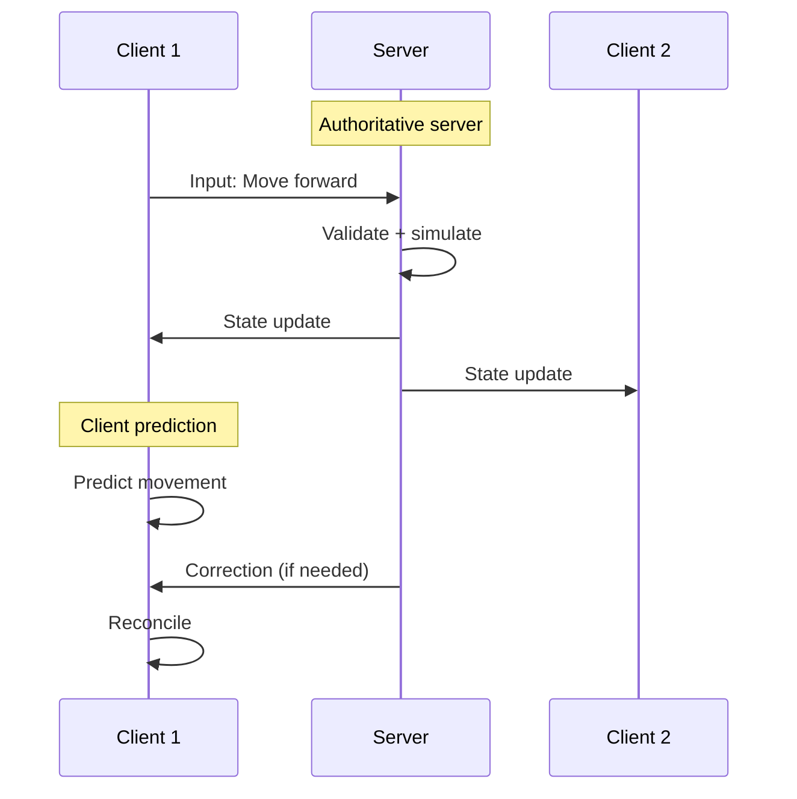
```mermaid
sequenceDiagram
    participant C1 as Client 1
    participant S as Server
    participant C2 as Client 2
    
    Note over S: Authoritative server
    
    C1->>S: Input: Move forward
    S->>S: Validate + simulate
    S->>C1: State update
    S->>C2: State update
    
    Note over C1: Client prediction
    C1->>C1: Predict movement
    
    S->>C1: Correction (if needed)
    C1->>C1: Reconcile
```

**Key Techniques**:
- **Client Prediction**: Immediate feedback
- **Server Reconciliation**: Correct mispredictions
- **Lag Compensation**: Rewind time for hit detection
- **Delta Compression**: Send only changes
- **Interest Management**: Only send relevant updates

---

## Q2: Explain Byzantine Fault Tolerance and PBFT.

**Answer**:

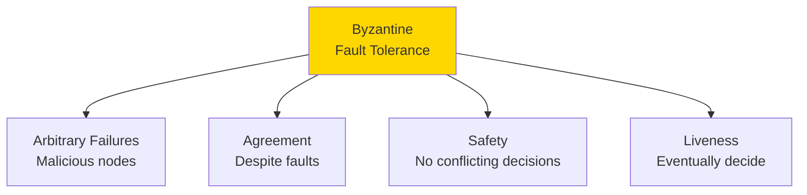
```mermaid
graph TB
    A[Byzantine<br/>Fault Tolerance] --> B[Arbitrary Failures<br/>Malicious nodes]
    A --> C[Agreement<br/>Despite faults]
    A --> D[Safety<br/>No conflicting decisions]
    A --> E[Liveness<br/>Eventually decide]
    
    style A fill:#FFD700
```

### Byzantine Generals Problem

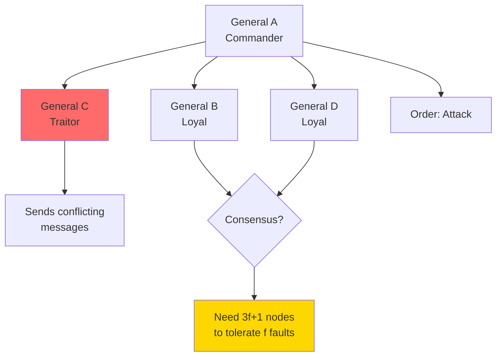
```mermaid
graph TB
    A[General A<br/>Commander] --> B[General B<br/>Loyal]
    A --> C[General C<br/>Traitor]
    A --> D[General D<br/>Loyal]
    
    A --> E[Order: Attack]
    
    C --> F[Sends conflicting<br/>messages]
    
    B --> G{Consensus?}
    D --> G
    
    G --> H[Need 3f+1 nodes<br/>to tolerate f faults]
    
    style C fill:#FF6B6B
    style H fill:#FFD700
```

### PBFT (Practical Byzantine Fault Tolerance)

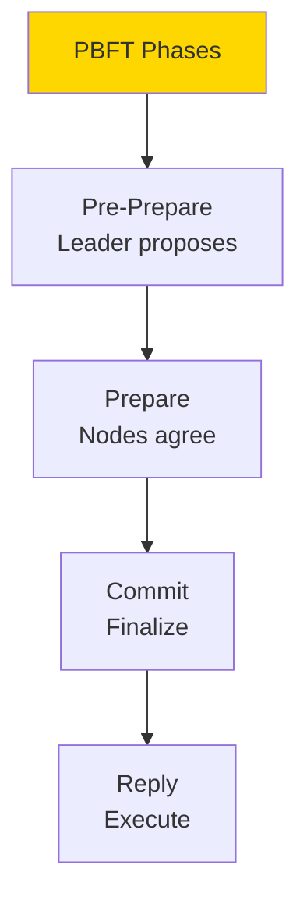
```mermaid
graph TB
    A[PBFT Phases] --> B[Pre-Prepare<br/>Leader proposes]
    B --> C[Prepare<br/>Nodes agree]
    C --> D[Commit<br/>Finalize]
    D --> E[Reply<br/>Execute]
    
    style A fill:#FFD700
```

### PBFT Protocol Flow

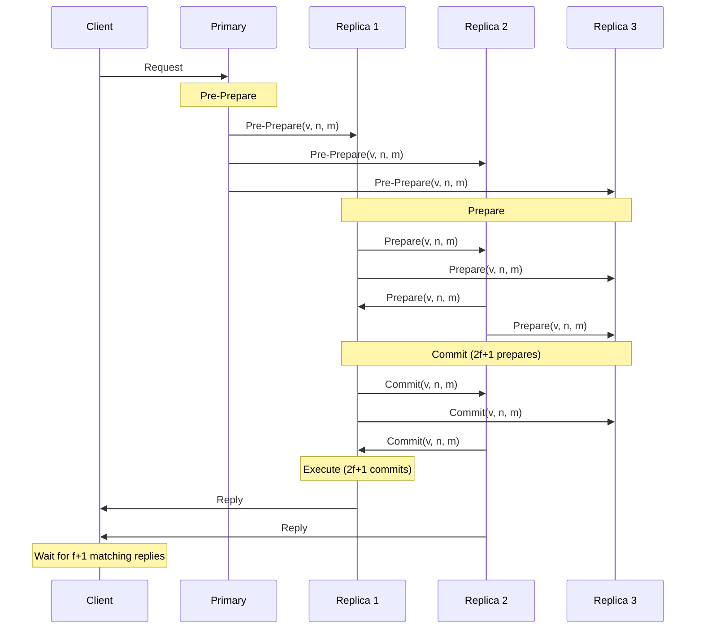
```mermaid
sequenceDiagram
    participant C as Client
    participant P as Primary
    participant R1 as Replica 1
    participant R2 as Replica 2
    participant R3 as Replica 3
    
    C->>P: Request
    
    Note over P: Pre-Prepare
    P->>R1: Pre-Prepare(v, n, m)
    P->>R2: Pre-Prepare(v, n, m)
    P->>R3: Pre-Prepare(v, n, m)
    
    Note over R1,R3: Prepare
    R1->>R2: Prepare(v, n, m)
    R1->>R3: Prepare(v, n, m)
    R2->>R1: Prepare(v, n, m)
    R2->>R3: Prepare(v, n, m)
    
    Note over R1,R3: Commit (2f+1 prepares)
    R1->>R2: Commit(v, n, m)
    R1->>R3: Commit(v, n, m)
    R2->>R1: Commit(v, n, m)
    
    Note over R1: Execute (2f+1 commits)
    R1->>C: Reply
    R2->>C: Reply
    
    Note over C: Wait for f+1 matching replies
```

**Requirements**:
- **N ≥ 3f + 1**: To tolerate f Byzantine faults
- **Quorum**: 2f + 1 nodes must agree
- **View Change**: Replace faulty primary

**Use Cases**:
- Blockchain consensus (Hyperledger Fabric)
- Distributed databases
- Critical infrastructure

---

## Q3: Design a distributed lock service (like Chubby/ZooKeeper).

**Answer**:

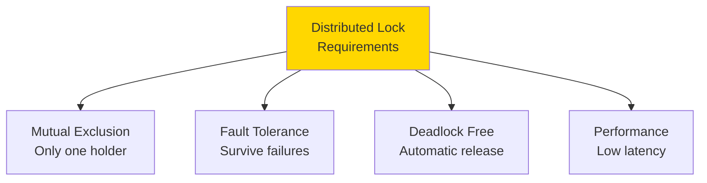
```mermaid
graph TB
    A[Distributed Lock<br/>Requirements] --> B[Mutual Exclusion<br/>Only one holder]
    A --> C[Fault Tolerance<br/>Survive failures]
    A --> D[Deadlock Free<br/>Automatic release]
    A --> E[Performance<br/>Low latency]
    
    style A fill:#FFD700
```

### Architecture

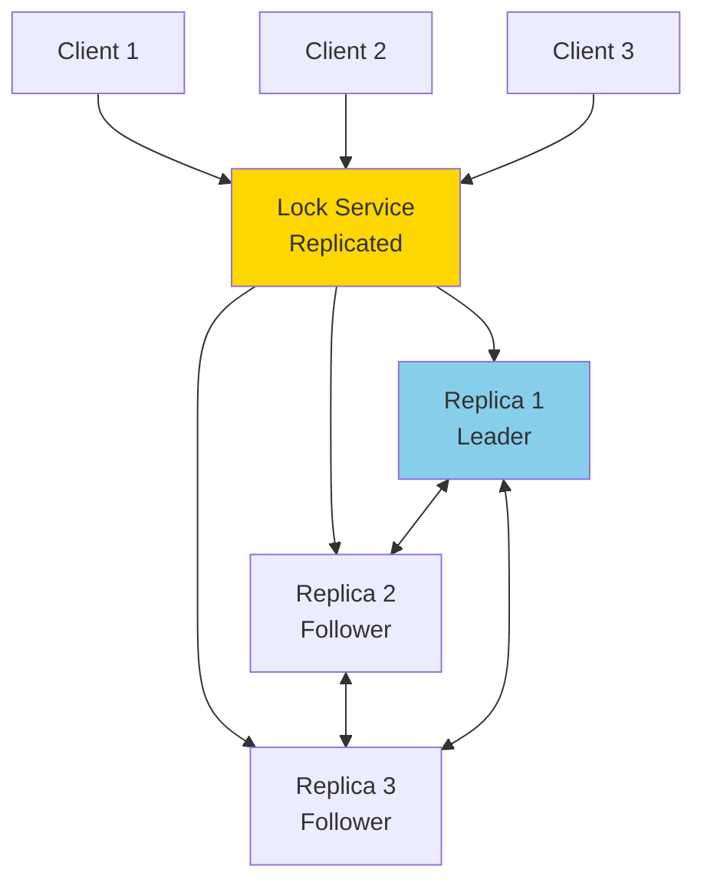
```mermaid
graph TB
    A[Client 1] --> L[Lock Service<br/>Replicated]
    B[Client 2] --> L
    C[Client 3] --> L
    
    L --> R1[Replica 1<br/>Leader]
    L --> R2[Replica 2<br/>Follower]
    L --> R3[Replica 3<br/>Follower]
    
    R1 <--> R2
    R2 <--> R3
    R1 <--> R3
    
    style L fill:#FFD700
    style R1 fill:#87CEEB
```

### Lock Acquisition

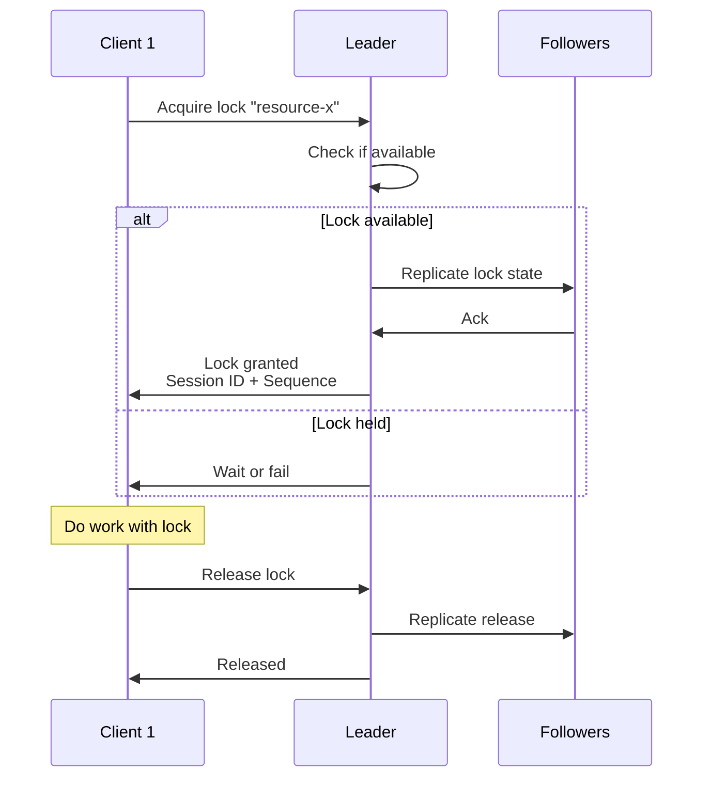
```mermaid
sequenceDiagram
    participant C1 as Client 1
    participant L as Leader
    participant F as Followers
    
    C1->>L: Acquire lock "resource-x"
    L->>L: Check if available
    
    alt Lock available
        L->>F: Replicate lock state
        F->>L: Ack
        L->>C1: Lock granted<br/>Session ID + Sequence
    else Lock held
        L->>C1: Wait or fail
    end
    
    Note over C1: Do work with lock
    
    C1->>L: Release lock
    L->>F: Replicate release
    L->>C1: Released
```

### Session Management

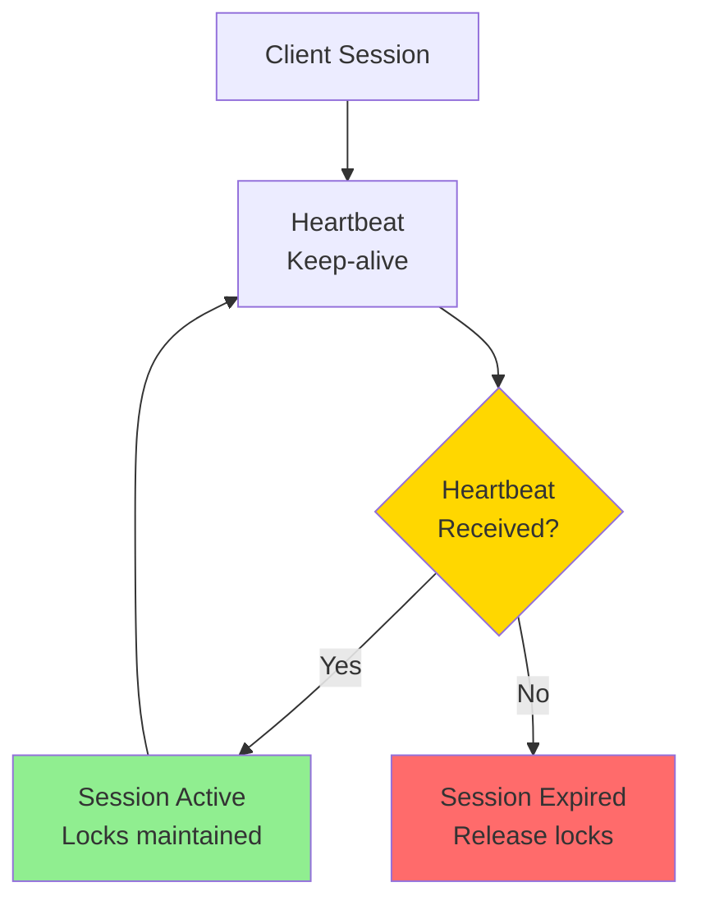
```mermaid
graph TB
    A[Client Session] --> B[Heartbeat<br/>Keep-alive]
    
    B --> C{Heartbeat<br/>Received?}
    
    C -->|Yes| D[Session Active<br/>Locks maintained]
    C -->|No| E[Session Expired<br/>Release locks]
    
    D --> B
    
    style C fill:#FFD700
    style D fill:#90EE90
    style E fill:#FF6B6B
```

### Lock Types

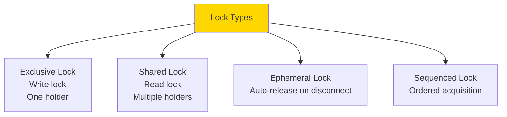
```mermaid
graph TB
    A[Lock Types] --> B1[Exclusive Lock<br/>Write lock<br/>One holder]
    A --> B2[Shared Lock<br/>Read lock<br/>Multiple holders]
    A --> B3[Ephemeral Lock<br/>Auto-release on disconnect]
    A --> B4[Sequenced Lock<br/>Ordered acquisition]
    
    style A fill:#FFD700
```

**Features**:
- **Advisory Locks**: Clients cooperate
- **Fencing Tokens**: Prevent stale lock holders
- **Watch Mechanism**: Notify on lock release
- **Lock Queuing**: Fair ordering

**Fencing Token**:

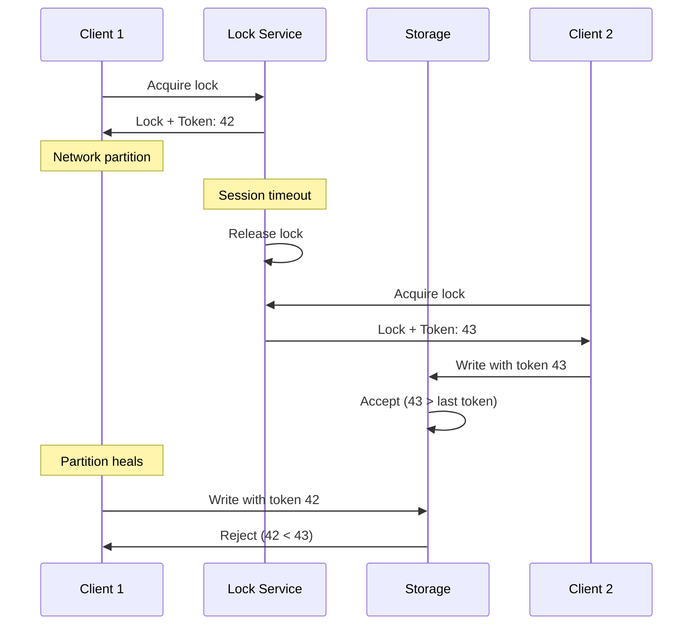
```mermaid
sequenceDiagram
    participant C1 as Client 1
    participant L as Lock Service
    participant S as Storage
    
    C1->>L: Acquire lock
    L->>C1: Lock + Token: 42
    
    Note over C1: Network partition
    
    Note over L: Session timeout
    L->>L: Release lock
    
    participant C2 as Client 2
    C2->>L: Acquire lock
    L->>C2: Lock + Token: 43
    
    C2->>S: Write with token 43
    S->>S: Accept (43 > last token)
    
    Note over C1: Partition heals
    C1->>S: Write with token 42
    S->>C1: Reject (42 < 43)
```

---

## Q4: Explain distributed transactions and 2PC/3PC.

**Answer**:

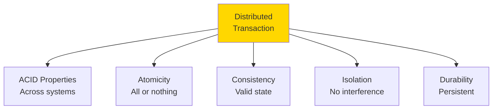
```mermaid
graph TB
    A[Distributed<br/>Transaction] --> B[ACID Properties<br/>Across systems]
    A --> C[Atomicity<br/>All or nothing]
    A --> D[Consistency<br/>Valid state]
    A --> E[Isolation<br/>No interference]
    A --> F[Durability<br/>Persistent]
    
    style A fill:#FFD700
```

### Two-Phase Commit (2PC)

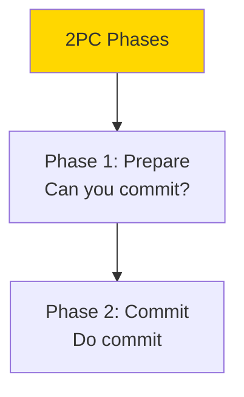
```mermaid
graph TB
    A[2PC Phases] --> B[Phase 1: Prepare<br/>Can you commit?]
    B --> C[Phase 2: Commit<br/>Do commit]
    
    style A fill:#FFD700
```

### 2PC Protocol

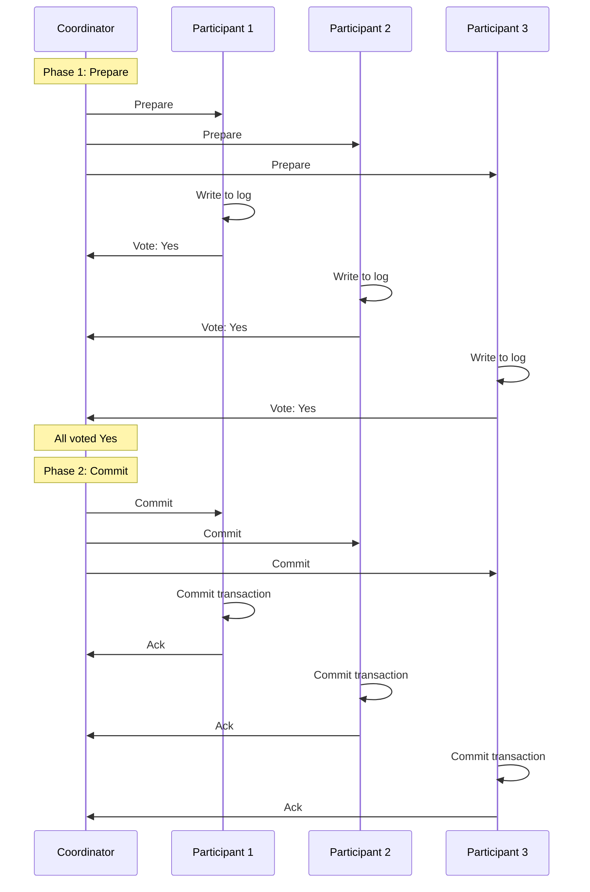
```mermaid
sequenceDiagram
    participant C as Coordinator
    participant P1 as Participant 1
    participant P2 as Participant 2
    participant P3 as Participant 3
    
    Note over C: Phase 1: Prepare
    C->>P1: Prepare
    C->>P2: Prepare
    C->>P3: Prepare
    
    P1->>P1: Write to log
    P1->>C: Vote: Yes
    
    P2->>P2: Write to log
    P2->>C: Vote: Yes
    
    P3->>P3: Write to log
    P3->>C: Vote: Yes
    
    Note over C: All voted Yes
    Note over C: Phase 2: Commit
    
    C->>P1: Commit
    C->>P2: Commit
    C->>P3: Commit
    
    P1->>P1: Commit transaction
    P1->>C: Ack
    
    P2->>P2: Commit transaction
    P2->>C: Ack
    
    P3->>P3: Commit transaction
    P3->>C: Ack
```

### 2PC Failure Scenario

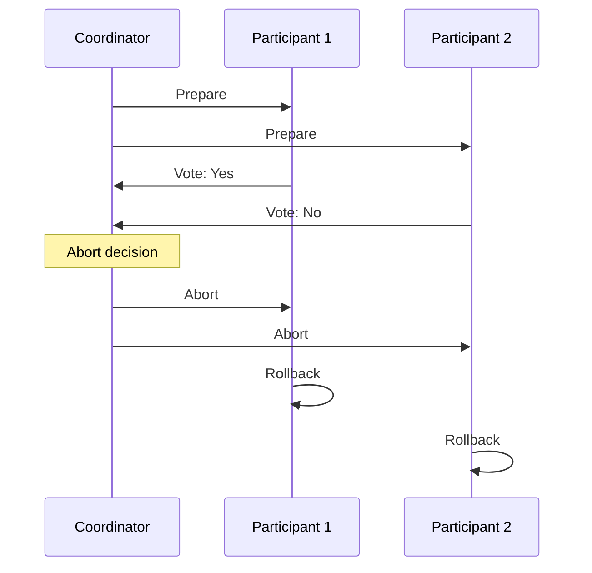
```mermaid
sequenceDiagram
    participant C as Coordinator
    participant P1 as Participant 1
    participant P2 as Participant 2
    
    C->>P1: Prepare
    C->>P2: Prepare
    
    P1->>C: Vote: Yes
    P2->>C: Vote: No
    
    Note over C: Abort decision
    
    C->>P1: Abort
    C->>P2: Abort
    
    P1->>P1: Rollback
    P2->>P2: Rollback
```

**2PC Problems**:
- **Blocking**: If coordinator fails after prepare
- **Single point of failure**: Coordinator
- **Not partition tolerant**

### Three-Phase Commit (3PC)

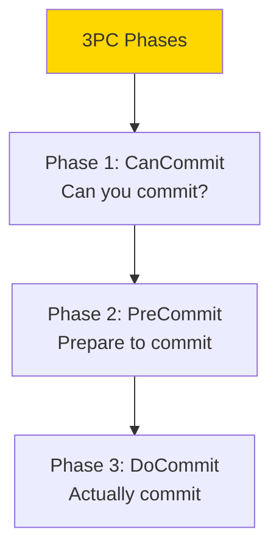
```mermaid
graph TB
    A[3PC Phases] --> B[Phase 1: CanCommit<br/>Can you commit?]
    B --> C[Phase 2: PreCommit<br/>Prepare to commit]
    C --> D[Phase 3: DoCommit<br/>Actually commit]
    
    style A fill:#FFD700
```

**3PC Advantages**:
- Non-blocking (with timeout)
- Can make progress during coordinator failure

**3PC Disadvantages**:
- More complex
- More latency
- Still not partition tolerant

### Saga Pattern (Alternative)

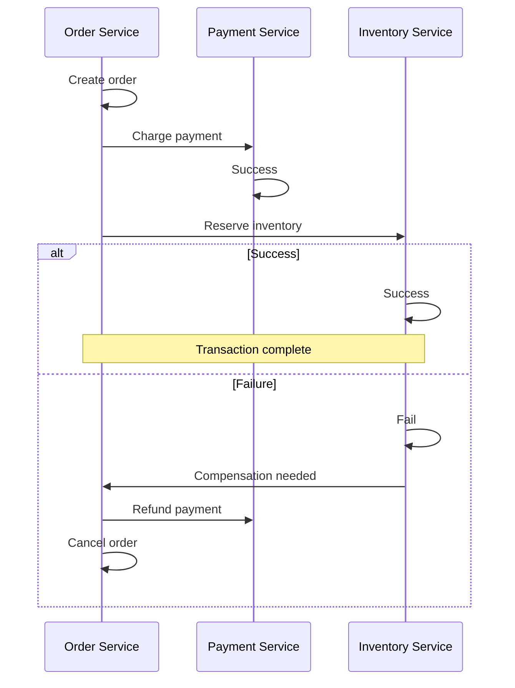
```mermaid
sequenceDiagram
    participant O as Order Service
    participant P as Payment Service
    participant I as Inventory Service
    
    O->>O: Create order
    O->>P: Charge payment
    P->>P: Success
    O->>I: Reserve inventory
    
    alt Success
        I->>I: Success
        Note over O,I: Transaction complete
    else Failure
        I->>I: Fail
        I->>O: Compensation needed
        O->>P: Refund payment
        O->>O: Cancel order
    end
```

**Saga**: Sequence of local transactions with compensating actions

---

## Q5: Design a content delivery network (CDN) protocol.

**Answer**:

```mermaid
graph TB
    A[CDN<br/>Requirements] --> B[Low Latency<br/>Edge caching]
    A --> C[High Availability<br/>Redundancy]
    A --> D[Cache Consistency<br/>Invalidation]
    A --> E[Load Distribution<br/>Geographic routing]
    
    style A fill:#FFD700
```

### CDN Architecture

```mermaid
graph TB
    A[Origin Server] --> B[CDN Network]
    
    B --> C1[Edge POP<br/>US West]
    B --> C2[Edge POP<br/>US East]
    B --> C3[Edge POP<br/>Europe]
    B --> C4[Edge POP<br/>Asia]
    
    U1[Users<br/>West Coast] --> C1
    U2[Users<br/>East Coast] --> C2
    U3[Users<br/>Europe] --> C3
    U4[Users<br/>Asia] --> C4
    
    style A fill:#FFD700
    style B fill:#87CEEB
```

### Request Flow

```mermaid
sequenceDiagram
    participant U as User
    participant DNS as DNS
    participant E as Edge Server
    participant O as Origin Server
    
    U->>DNS: Resolve cdn.example.com
    DNS->>DNS: GeoDNS lookup
    DNS->>U: IP of nearest edge
    
    U->>E: GET /image.jpg
    
    alt Cache Hit
        E->>E: Serve from cache
        E->>U: 200 OK + image
    else Cache Miss
        E->>O: GET /image.jpg
        O->>E: 200 OK + image
        E->>E: Cache image
        E->>U: 200 OK + image
    end
```

### Cache Invalidation

```mermaid
graph TB
    A[Invalidation<br/>Strategies] --> B1[TTL<br/>Time-based expiry]
    A --> B2[Purge<br/>Manual invalidation]
    A --> B3[Tag-based<br/>Group invalidation]
    A --> B4[Versioned URLs<br/>Immutable content]
    
    style A fill:#FFD700
```

**Purge Protocol**:

```mermaid
sequenceDiagram
    participant A as Admin
    participant C as Control Plane
    participant E1 as Edge 1
    participant E2 as Edge 2
    participant E3 as Edge 3
    
    A->>C: Purge /image.jpg
    
    C->>E1: Invalidate /image.jpg
    C->>E2: Invalidate /image.jpg
    C->>E3: Invalidate /image.jpg
    
    E1->>C: Ack
    E2->>C: Ack
    E3->>C: Ack
    
    C->>A: Purge complete
```

### Cache Hierarchy

```mermaid
graph TB
    A[User] --> B[Edge Cache<br/>Tier 1]
    
    B --> C{Cache Hit?}
    
    C -->|Yes| D[Serve]
    C -->|No| E[Regional Cache<br/>Tier 2]
    
    E --> F{Cache Hit?}
    
    F -->|Yes| G[Serve + Cache at Edge]
    F -->|No| H[Origin<br/>Tier 3]
    
    H --> I[Serve + Cache at Regional + Edge]
    
    style B fill:#87CEEB
    style E fill:#FFD700
    style H fill:#FFB6C1
```

**Advanced Features**:
- **Anycast**: Same IP, routed to nearest POP
- **Dynamic Content**: Edge compute (Cloudflare Workers)
- **Image Optimization**: On-the-fly resizing
- **DDoS Protection**: Absorb attacks at edge

---

## Q6: Explain QUIC protocol and HTTP/3.

**Answer**:

```mermaid
graph TB
    A[QUIC] --> B[UDP-based<br/>Not TCP]
    A --> C[Built-in TLS<br/>Encrypted]
    A --> D[Multiplexing<br/>No head-of-line blocking]
    A --> E[Connection Migration<br/>Survives IP change]
    
    style A fill:#FFD700
```

### TCP vs QUIC Handshake

```mermaid
sequenceDiagram
    participant C as Client
    participant S as Server
    
    Note over C,S: TCP + TLS (3 RTT)
    C->>S: TCP SYN
    S->>C: TCP SYN-ACK
    C->>S: TCP ACK
    C->>S: TLS ClientHello
    S->>C: TLS ServerHello
    C->>S: TLS Finished
    Note over C,S: Can send data
    
    Note over C,S: QUIC (1 RTT or 0-RTT)
    C->>S: QUIC Initial + TLS ClientHello
    S->>C: QUIC Handshake + TLS ServerHello
    Note over C,S: Can send data
```

### Head-of-Line Blocking

```mermaid
graph TB
    subgraph TCP["HTTP/2 over TCP"]
        A1[Stream 1] --> T[TCP]
        A2[Stream 2] --> T
        A3[Stream 3] --> T
        
        T --> B[Packet Lost]
        B --> C[All streams<br/>blocked]
    end
    
    subgraph QUIC["HTTP/3 over QUIC"]
        D1[Stream 1] --> Q1[QUIC Stream 1]
        D2[Stream 2] --> Q2[QUIC Stream 2]
        D3[Stream 3] --> Q3[QUIC Stream 3]
        
        Q2 --> E[Packet Lost]
        E --> F[Only Stream 2<br/>blocked]
    end
    
    style C fill:#FF6B6B
    style F fill:#90EE90
```

### Connection Migration

```mermaid
sequenceDiagram
    participant C as Client
    participant S as Server
    
    Note over C: WiFi IP: 192.168.1.5
    C->>S: Request (Connection ID: abc123)
    S->>C: Response
    
    Note over C: Switch to cellular
    Note over C: New IP: 10.0.0.5
    
    C->>S: Request (Connection ID: abc123)
    Note over S: Same connection ID, new IP
    S->>C: Response
    
    Note over C,S: Connection continues seamlessly
```

**QUIC Benefits**:
- Faster connection establishment
- Better performance on lossy networks
- Improved mobile experience
- Easier to deploy (UDP not blocked)

---

## Q7: Design a gossip protocol for distributed systems.

**Answer**:

```mermaid
graph TB
    A[Gossip Protocol] --> B[Epidemic Spread<br/>Like rumors]
    A --> C[Eventually Consistent<br/>All nodes converge]
    A --> D[Scalable<br/>O log N messages]
    A --> E[Fault Tolerant<br/>No single point]
    
    style A fill:#FFD700
```

### Gossip Algorithm

```mermaid
graph TB
    A[Node] --> B[Periodically<br/>Every T seconds]
    
    B --> C[Select random<br/>peer]
    
    C --> D[Exchange<br/>state]
    
    D --> E[Merge<br/>information]
    
    E --> B
    
    style A fill:#FFD700
```

### Information Spread

```mermaid
sequenceDiagram
    participant N1 as Node 1
    participant N2 as Node 2
    participant N3 as Node 3
    participant N4 as Node 4
    
    Note over N1: New info: X
    
    N1->>N2: Gossip X
    N2->>N2: Learn X
    
    N1->>N3: Gossip X
    N3->>N3: Learn X
    
    N2->>N4: Gossip X
    N4->>N4: Learn X
    
    N3->>N4: Gossip X
    Note over N4: Already know X
    
    Note over N1,N4: All nodes know X
```

### Gossip Variants

```mermaid
graph TB
    A[Gossip Types] --> B1[Push<br/>Send to others]
    A --> B2[Pull<br/>Request from others]
    A --> B3[Push-Pull<br/>Both directions]
    
    B1 --> C1[Fast spread<br/>More messages]
    B2 --> C2[Slower spread<br/>Fewer messages]
    B3 --> C3[Optimal<br/>Balance]
    
    style A fill:#FFD700
    style B3 fill:#90EE90
```

### Anti-Entropy

```mermaid
sequenceDiagram
    participant A as Node A
    participant B as Node B
    
    Note over A: State: {X:v1, Y:v2, Z:v3}
    Note over B: State: {X:v1, Y:v1, W:v2}
    
    A->>B: Digest: {X:v1, Y:v2, Z:v3}
    B->>B: Compare with local state
    B->>B: Y:v1 < Y:v2 (outdated)
    B->>B: Z missing
    B->>B: W not in A's digest
    
    B->>A: Request: Y, Z<br/>Send: W
    
    A->>B: Y:v2, Z:v3
    
    Note over A: State: {X:v1, Y:v2, Z:v3, W:v2}
    Note over B: State: {X:v1, Y:v2, Z:v3, W:v2}
```

**Use Cases**:
- Cluster membership (Consul, Cassandra)
- Failure detection
- Database replication
- Configuration propagation

**Trade-offs**:
- **Pros**: Scalable, fault-tolerant, simple
- **Cons**: Eventually consistent, message overhead, convergence time

---

## Q8: Explain vector clocks and conflict resolution.

**Answer**:

```mermaid
graph TB
    A[Vector Clocks] --> B[Causality Tracking<br/>Happened-before]
    A --> C[Conflict Detection<br/>Concurrent updates]
    A --> D[Distributed Systems<br/>No global time]
    
    style A fill:#FFD700
```

### Vector Clock Structure

```mermaid
graph LR
    A[Node A: 3, 1, 2] --> B[Counter for A]
    A --> C[Counter for B]
    A --> D[Counter for C]
    
    style A fill:#FFD700
```

**Format**: `[A:3, B:1, C:2]` = A has seen 3 events from A, 1 from B, 2 from C

### Vector Clock Evolution

```mermaid
sequenceDiagram
    participant A as Node A
    participant B as Node B
    participant C as Node C
    
    Note over A: [A:0, B:0, C:0]
    Note over B: [A:0, B:0, C:0]
    Note over C: [A:0, B:0, C:0]
    
    A->>A: Local event
    Note over A: [A:1, B:0, C:0]
    
    A->>B: Send message
    Note over B: Receive + merge
    Note over B: [A:1, B:1, C:0]
    
    B->>C: Send message
    Note over C: Receive + merge
    Note over C: [A:1, B:1, C:1]
    
    A->>A: Local event
    Note over A: [A:2, B:0, C:0]
    
    C->>A: Send message
    Note over A: Receive + merge
    Note over A: [A:3, B:1, C:1]
```

### Conflict Detection

```mermaid
graph TB
    A[Compare Clocks] --> B{Relationship}
    
    B --> C1[V1 < V2<br/>V1 happened before]
    B --> C2[V1 > V2<br/>V2 happened before]
    B --> C3[V1 || V2<br/>Concurrent]
    
    C1 --> D1[No conflict<br/>Use V2]
    C2 --> D2[No conflict<br/>Use V1]
    C3 --> D3[Conflict!<br/>Need resolution]
    
    style C3 fill:#FFD700
    style D3 fill:#FF6B6B
```

**Comparison Rules**:
- V1 < V2: All counters in V1 ≤ V2, at least one <
- V1 > V2: All counters in V1 ≥ V2, at least one >
- V1 || V2: Neither < nor >

### Conflict Resolution

```mermaid
graph TB
    A[Conflict<br/>Resolution] --> B1[Last Write Wins<br/>Timestamp]
    A --> B2[Application Logic<br/>Merge values]
    A --> B3[Keep Both<br/>Siblings]
    A --> B4[User Decides<br/>Manual resolution]
    
    B1 --> C1[Simple<br/>May lose data]
    B2 --> C2[Complex<br/>Preserves data]
    B3 --> C3[Eventual resolution<br/>Temporary]
    B4 --> C4[Accurate<br/>Slow]
    
    style A fill:#FFD700
```

**Example - Shopping Cart**:

```mermaid
sequenceDiagram
    participant U as User
    participant D1 as Device 1
    participant D2 as Device 2
    participant S as Server
    
    Note over D1: Cart: [A], Clock: [D1:1]
    Note over D2: Cart: [A], Clock: [D1:1]
    
    U->>D1: Add B
    Note over D1: Cart: [A,B], Clock: [D1:2]
    
    U->>D2: Add C
    Note over D2: Cart: [A,C], Clock: [D2:1]
    
    D1->>S: Sync [A,B], [D1:2]
    D2->>S: Sync [A,C], [D2:1]
    
    Note over S: Conflict detected!
    Note over S: [D1:2] || [D2:1]
    
    S->>S: Merge: [A,B,C]
    S->>S: Clock: [D1:2, D2:1]
    
    S->>D1: [A,B,C], [D1:2, D2:1]
    S->>D2: [A,B,C], [D1:2, D2:1]
```

**Use Cases**:
- Dynamo-style databases (Riak, Cassandra)
- Collaborative editing
- Distributed caches
- Mobile offline-first apps

---

## Q9: Design a distributed rate limiter.

**Answer**:

```mermaid
graph TB
    A[Distributed<br/>Rate Limiter] --> B[Global Limits<br/>Across all nodes]
    A --> C[Low Latency<br/>Fast decisions]
    A --> D[Consistency<br/>No over-limit]
    A --> E[Scalability<br/>Many nodes]
    
    style A fill:#FFD700
```

### Architecture Options

```mermaid
graph TB
    A[Approaches] --> B1[Centralized<br/>Single counter]
    A --> B2[Distributed<br/>Local counters]
    A --> B3[Hybrid<br/>Local + sync]
    
    B1 --> C1[✓ Accurate<br/>✗ Bottleneck]
    B2 --> C2[✓ Fast<br/>✗ Inaccurate]
    B3 --> C3[✓ Balanced<br/>✗ Complex]
    
    style B3 fill:#90EE90
```

### Centralized Approach

```mermaid
sequenceDiagram
    participant C1 as Client 1
    participant N1 as Node 1
    participant R as Redis
    participant N2 as Node 2
    participant C2 as Client 2
    
    C1->>N1: Request
    N1->>R: INCR user:123:count
    R->>N1: 1
    N1->>C1: Allow
    
    C2->>N2: Request
    N2->>R: INCR user:123:count
    R->>N2: 2
    N2->>C2: Allow
    
    Note over R: Count is accurate
```

**Pros**: Accurate, simple
**Cons**: Single point of failure, latency

### Distributed with Gossip

```mermaid
graph TB
    A[Node 1<br/>Local: 10] --> B[Gossip]
    C[Node 2<br/>Local: 15] --> B
    D[Node 3<br/>Local: 12] --> B
    
    B --> E[Aggregate<br/>Total: 37]
    
    E --> F{> Limit?}
    
    F -->|Yes| G[Reject new]
    F -->|No| H[Allow]
    
    style B fill:#FFD700
    style E fill:#87CEEB
```

**Pros**: No single point, scalable
**Cons**: Eventually consistent, may exceed limit temporarily

### Token Bucket with Redis

```mermaid
sequenceDiagram
    participant C as Client
    participant N as Node
    participant R as Redis
    
    C->>N: Request for user:123
    
    N->>R: EVAL token_bucket_script
    Note over R: Get last_refill, tokens
    Note over R: Calculate new tokens
    Note over R: tokens = min(capacity, tokens + elapsed * rate)
    
    alt tokens >= 1
        Note over R: tokens -= 1
        R->>N: tokens, allowed=true
        N->>C: 200 OK
    else tokens < 1
        R->>N: tokens, allowed=false
        N->>C: 429 Too Many Requests
    end
```

**Lua Script** (atomic):
```lua
local key = KEYS[1]
local capacity = tonumber(ARGV[1])
local rate = tonumber(ARGV[2])
local now = tonumber(ARGV[3])

local last_refill = redis.call('HGET', key, 'last_refill') or now
local tokens = redis.call('HGET', key, 'tokens') or capacity

local elapsed = now - last_refill
local new_tokens = math.min(capacity, tokens + elapsed * rate)

if new_tokens >= 1 then
  redis.call('HSET', key, 'tokens', new_tokens - 1)
  redis.call('HSET', key, 'last_refill', now)
  return {new_tokens - 1, 1}
else
  return {new_tokens, 0}
end
```

### Sliding Window with Redis

```mermaid
sequenceDiagram
    participant C as Client
    participant N as Node
    participant R as Redis (Sorted Set)
    
    C->>N: Request
    N->>R: ZADD user:123 timestamp timestamp
    N->>R: ZREMRANGEBYSCORE user:123 0 (now-window)
    N->>R: ZCARD user:123
    
    alt count <= limit
        R->>N: count
        N->>C: 200 OK
    else count > limit
        R->>N: count
        N->>C: 429 Too Many Requests
    end
```

**Trade-offs**:
- **Accuracy**: Centralized > Hybrid > Distributed
- **Latency**: Distributed < Hybrid < Centralized
- **Scalability**: Distributed > Hybrid > Centralized

---

## Q10: Explain consensus in blockchain (Proof of Work, Proof of Stake).

**Answer**:

```mermaid
graph TB
    A[Blockchain<br/>Consensus] --> B[Proof of Work<br/>PoW]
    A --> C[Proof of Stake<br/>PoS]
    A --> D[Delegated PoS<br/>DPoS]
    A --> E[Proof of Authority<br/>PoA]
    
    style A fill:#FFD700
```

### Proof of Work (Bitcoin)

```mermaid
graph TB
    A[Miner] --> B[Collect<br/>Transactions]
    B --> C[Create Block]
    C --> D[Find Nonce]
    
    D --> E{Hash < Target?}
    
    E -->|No| F[Try next nonce]
    F --> D
    
    E -->|Yes| G[Broadcast Block]
    
    G --> H[Network<br/>Validates]
    
    H --> I{Valid?}
    
    I -->|Yes| J[Add to chain<br/>Reward miner]
    I -->|No| K[Reject]
    
    style D fill:#FFD700
    style J fill:#90EE90
```

**Mining Process**:
$$\text{SHA256}(\text{SHA256}(\text{block header})) < \text{target}$$

```mermaid
sequenceDiagram
    participant M1 as Miner 1
    participant M2 as Miner 2
    participant N as Network
    
    Note over M1,M2: Both mining block 100
    
    M1->>M1: Try nonce 1
    M1->>M1: Try nonce 2
    M1->>M1: ...
    M1->>M1: Try nonce 1,234,567
    M1->>M1: Found! Hash < target
    
    M1->>N: Broadcast block 100
    N->>M2: New block 100
    
    M2->>M2: Validate block
    M2->>M2: Accept, start mining block 101
```

**PoW Characteristics**:
- **Security**: 51% attack expensive
- **Decentralized**: Anyone can mine
- **Energy**: High consumption
- **Finality**: Probabilistic (6 confirmations)

### Proof of Stake (Ethereum 2.0)

```mermaid
graph TB
    A[Validator] --> B[Stake ETH<br/>32 ETH minimum]
    
    B --> C[Selected to<br/>Propose Block]
    
    C --> D[Create Block]
    
    D --> E[Other Validators<br/>Attest]
    
    E --> F{2/3 Majority?}
    
    F -->|Yes| G[Finalize Block<br/>Reward validator]
    F -->|No| H[Not finalized]
    
    style C fill:#FFD700
    style G fill:#90EE90
```

### Validator Selection

```mermaid
graph TB
    A[Selection<br/>Algorithm] --> B[Random<br/>+ Stake Weight]
    
    B --> C[Higher Stake<br/>Higher Probability]
    
    C --> D[But not<br/>Deterministic]
    
    D --> E[Prevents<br/>Centralization]
    
    style A fill:#FFD700
```

**PoS Characteristics**:
- **Energy**: Low consumption
- **Security**: Slashing for misbehavior
- **Finality**: Faster (2 epochs ≈ 13 minutes)
- **Barrier**: Need stake to participate

### Slashing

```mermaid
sequenceDiagram
    participant V as Validator
    participant N as Network
    
    Note over V: Misbehavior detected
    
    alt Double signing
        V->>N: Sign block A
        V->>N: Sign conflicting block B
        N->>N: Detect double sign
        N->>V: Slash 1 ETH
    else Surround vote
        V->>N: Contradictory attestations
        N->>N: Detect surround
        N->>V: Slash 0.5 ETH
    end
    
    Note over V: Stake reduced
    Note over V: May be ejected if balance < 16 ETH
```

### Comparison

```mermaid
graph TB
    A{Consensus<br/>Mechanism} --> B[PoW]
    A --> C[PoS]
    
    B --> D1[✓ Battle-tested<br/>✓ Decentralized<br/>✗ Energy intensive<br/>✗ Slow finality]
    
    C --> D2[✓ Energy efficient<br/>✓ Fast finality<br/>✗ Nothing at stake<br/>✗ Rich get richer]
    
    style A fill:#FFD700
```

**Use Cases**:
- **PoW**: Bitcoin, Litecoin, Monero
- **PoS**: Ethereum 2.0, Cardano, Polkadot
- **DPoS**: EOS, Tron
- **PoA**: Private blockchains

---

## Summary

Hard protocol and design topics:
- **Game Protocol**: Low latency, client prediction, lag compensation
- **Byzantine Fault Tolerance**: PBFT, 3f+1 nodes
- **Distributed Locks**: Chubby/ZooKeeper, fencing tokens
- **Distributed Transactions**: 2PC/3PC, Saga pattern
- **CDN Protocol**: Edge caching, invalidation, anycast
- **QUIC/HTTP3**: UDP-based, 0-RTT, connection migration
- **Gossip Protocol**: Epidemic spread, anti-entropy
- **Vector Clocks**: Causality tracking, conflict detection
- **Distributed Rate Limiting**: Token bucket, sliding window
- **Blockchain Consensus**: PoW, PoS, trade-offs

These advanced concepts enable designing complex distributed systems and protocols.

