Medium-level protocol and design interview questions covering advanced networking and distributed systems concepts.

## Q1: Explain HTTP/2 improvements over HTTP/1.1.

**Answer**:

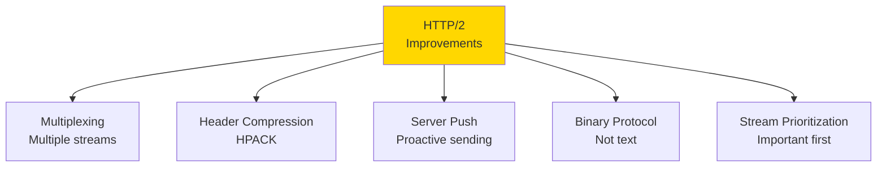
```mermaid
graph TB
    A[HTTP/2<br/>Improvements] --> B[Multiplexing<br/>Multiple streams]
    A --> C[Header Compression<br/>HPACK]
    A --> D[Server Push<br/>Proactive sending]
    A --> E[Binary Protocol<br/>Not text]
    A --> F[Stream Prioritization<br/>Important first]
    
    style A fill:#FFD700
```

### HTTP/1.1 vs HTTP/2

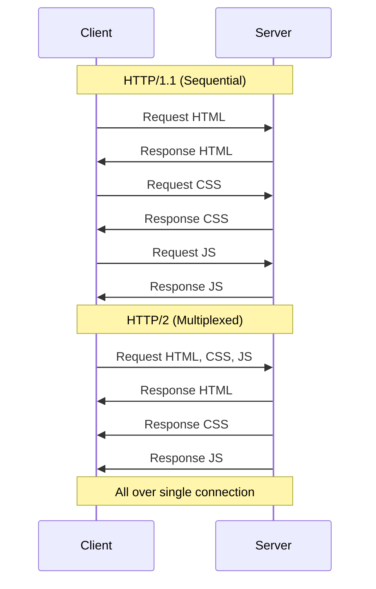
```mermaid
sequenceDiagram
    participant C as Client
    participant S as Server
    
    Note over C,S: HTTP/1.1 (Sequential)
    C->>S: Request HTML
    S->>C: Response HTML
    C->>S: Request CSS
    S->>C: Response CSS
    C->>S: Request JS
    S->>C: Response JS
    
    Note over C,S: HTTP/2 (Multiplexed)
    C->>S: Request HTML, CSS, JS
    S->>C: Response HTML
    S->>C: Response CSS
    S->>C: Response JS
    Note over C,S: All over single connection
```

### Multiplexing

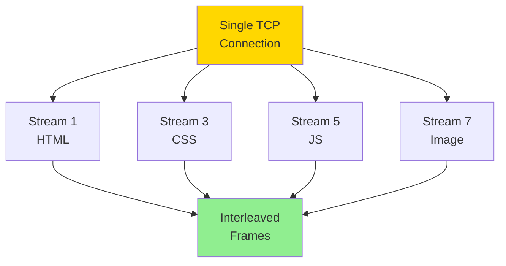
```mermaid
graph TB
    A[Single TCP<br/>Connection] --> B[Stream 1<br/>HTML]
    A --> C[Stream 3<br/>CSS]
    A --> D[Stream 5<br/>JS]
    A --> E[Stream 7<br/>Image]
    
    B --> F[Interleaved<br/>Frames]
    C --> F
    D --> F
    E --> F
    
    style A fill:#FFD700
    style F fill:#90EE90
```

**Benefits**:
- No head-of-line blocking
- Reduced latency
- Better bandwidth utilization
- Fewer connections

---

## Q2: Explain gRPC and Protocol Buffers.

**Answer**:

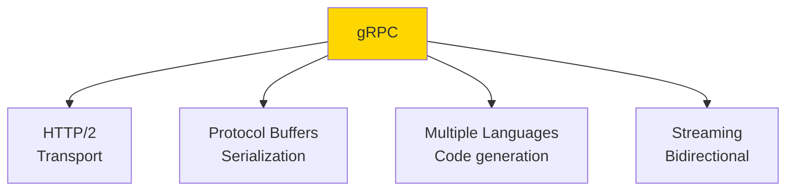
```mermaid
graph TB
    A[gRPC] --> B[HTTP/2<br/>Transport]
    A --> C[Protocol Buffers<br/>Serialization]
    A --> D[Multiple Languages<br/>Code generation]
    A --> E[Streaming<br/>Bidirectional]
    
    style A fill:#FFD700
```

### gRPC Communication Types

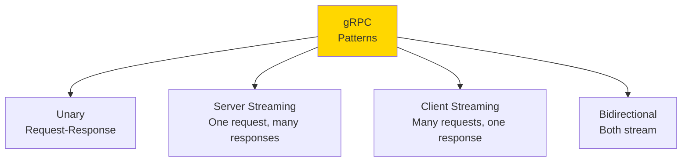
```mermaid
graph TB
    A[gRPC<br/>Patterns] --> B1[Unary<br/>Request-Response]
    A --> B2[Server Streaming<br/>One request, many responses]
    A --> B3[Client Streaming<br/>Many requests, one response]
    A --> B4[Bidirectional<br/>Both stream]
    
    style A fill:#FFD700
```

### Unary RPC

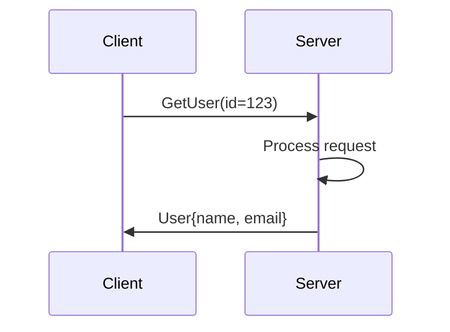
```mermaid
sequenceDiagram
    participant C as Client
    participant S as Server
    
    C->>S: GetUser(id=123)
    S->>S: Process request
    S->>C: User{name, email}
```

### Server Streaming

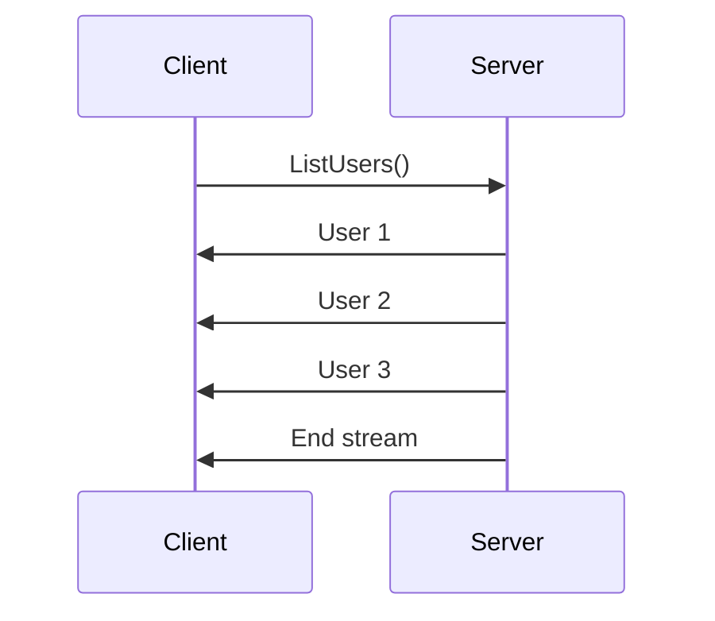
```mermaid
sequenceDiagram
    participant C as Client
    participant S as Server
    
    C->>S: ListUsers()
    S->>C: User 1
    S->>C: User 2
    S->>C: User 3
    S->>C: End stream
```

### Protocol Buffers

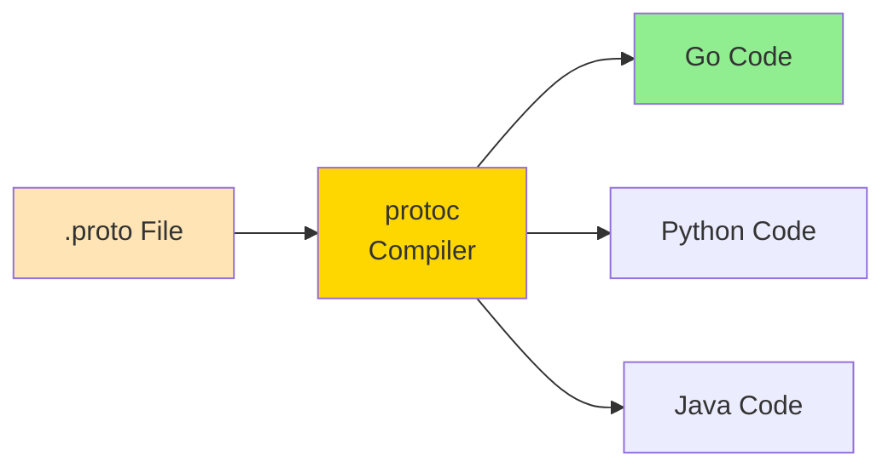
```mermaid
graph LR
    A[.proto File] --> B[protoc<br/>Compiler]
    B --> C1[Go Code]
    B --> C2[Python Code]
    B --> C3[Java Code]
    
    style A fill:#FFE4B5
    style B fill:#FFD700
    style C1 fill:#90EE90
```

**Advantages over REST/JSON**:
- Smaller payload (binary)
- Faster serialization
- Strong typing
- Backward compatibility
- Streaming support

---

## Q3: Explain distributed consensus (Raft/Paxos basics).

**Answer**:

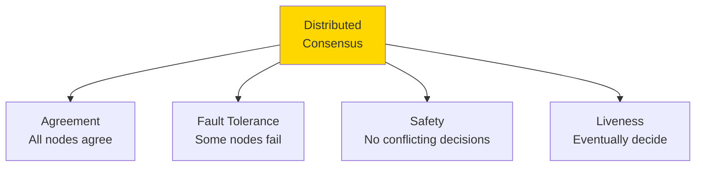
```mermaid
graph TB
    A[Distributed<br/>Consensus] --> B[Agreement<br/>All nodes agree]
    A --> C[Fault Tolerance<br/>Some nodes fail]
    A --> D[Safety<br/>No conflicting decisions]
    A --> E[Liveness<br/>Eventually decide]
    
    style A fill:#FFD700
```

### Raft Overview

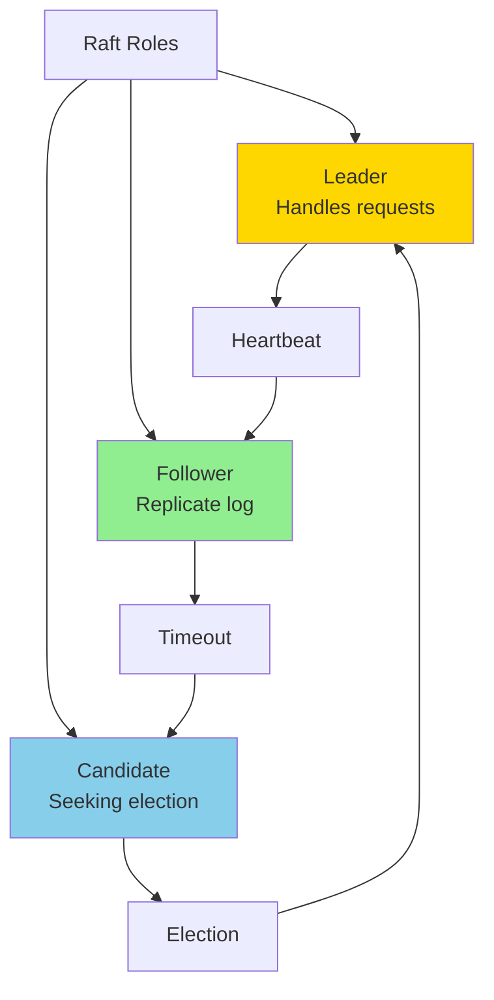
```mermaid
graph TB
    A[Raft Roles] --> B[Leader<br/>Handles requests]
    A --> C[Follower<br/>Replicate log]
    A --> D[Candidate<br/>Seeking election]
    
    C --> E[Timeout]
    E --> D
    D --> F[Election]
    F --> B
    B --> G[Heartbeat]
    G --> C
    
    style B fill:#FFD700
    style C fill:#90EE90
    style D fill:#87CEEB
```

### Leader Election

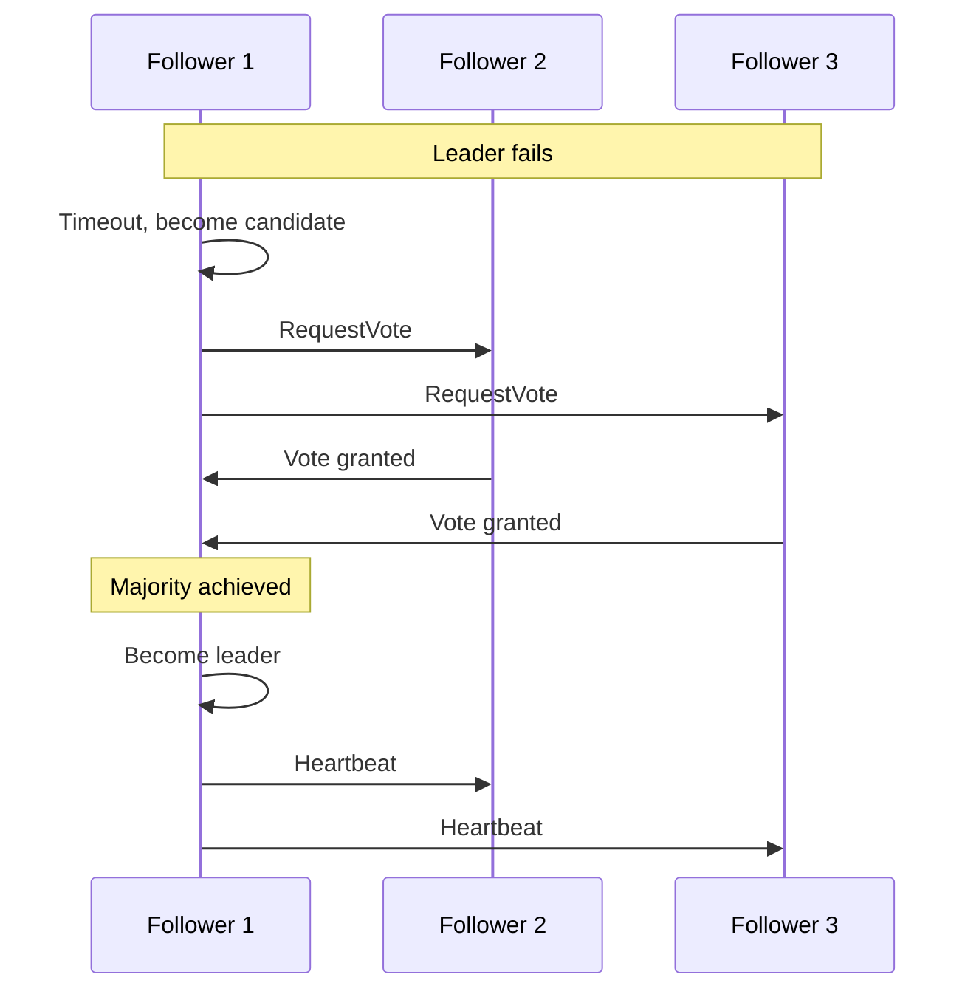
```mermaid
sequenceDiagram
    participant F1 as Follower 1
    participant F2 as Follower 2
    participant F3 as Follower 3
    
    Note over F1,F3: Leader fails
    
    F1->>F1: Timeout, become candidate
    F1->>F2: RequestVote
    F1->>F3: RequestVote
    
    F2->>F1: Vote granted
    F3->>F1: Vote granted
    
    Note over F1: Majority achieved
    F1->>F1: Become leader
    
    F1->>F2: Heartbeat
    F1->>F3: Heartbeat
```

### Log Replication

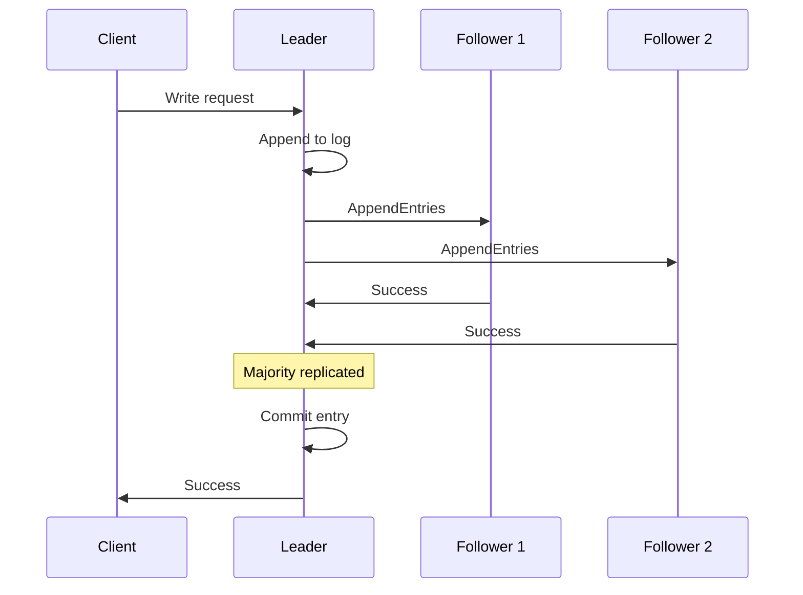
```mermaid
sequenceDiagram
    participant C as Client
    participant L as Leader
    participant F1 as Follower 1
    participant F2 as Follower 2
    
    C->>L: Write request
    L->>L: Append to log
    
    L->>F1: AppendEntries
    L->>F2: AppendEntries
    
    F1->>L: Success
    F2->>L: Success
    
    Note over L: Majority replicated
    L->>L: Commit entry
    L->>C: Success
```

**Use Cases**:
- Distributed databases (etcd, Consul)
- Coordination services
- Configuration management

---

## Q4: Explain message queues and pub/sub patterns.

**Answer**:

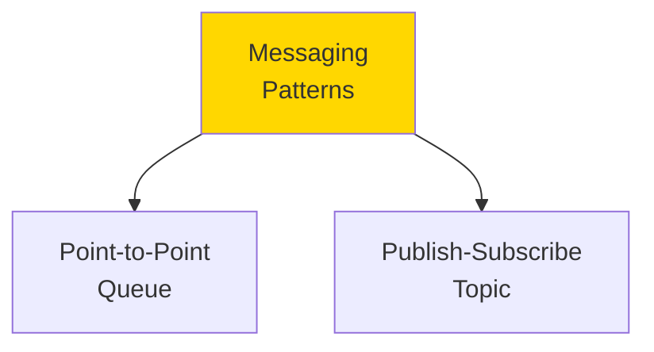
```mermaid
graph TB
    A[Messaging<br/>Patterns] --> B[Point-to-Point<br/>Queue]
    A --> C[Publish-Subscribe<br/>Topic]
    
    style A fill:#FFD700
```

### Point-to-Point Queue

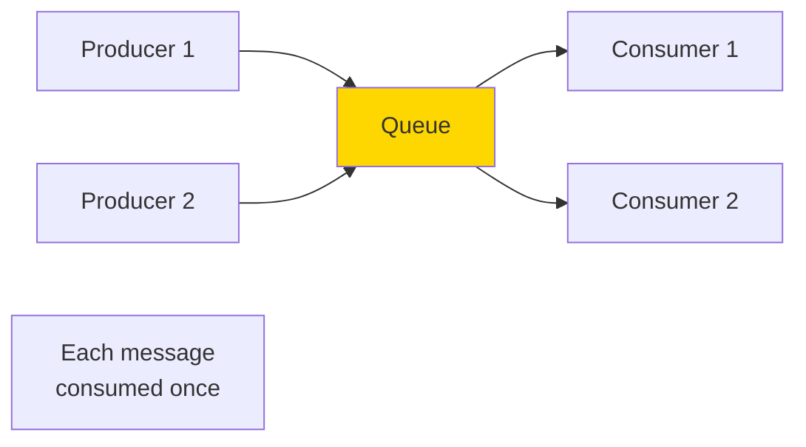
```mermaid
graph LR
    A1[Producer 1] --> Q[Queue]
    A2[Producer 2] --> Q
    
    Q --> B1[Consumer 1]
    Q --> B2[Consumer 2]
    
    Note1[Each message<br/>consumed once]
    
    style Q fill:#FFD700
```

### Publish-Subscribe

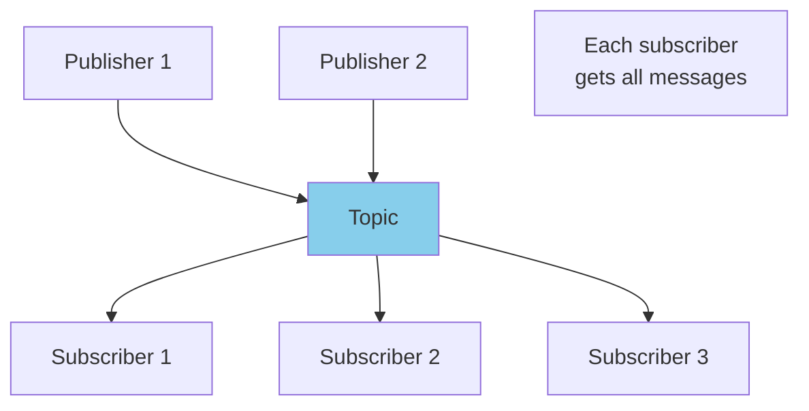
```mermaid
graph TB
    A1[Publisher 1] --> T[Topic]
    A2[Publisher 2] --> T
    
    T --> B1[Subscriber 1]
    T --> B2[Subscriber 2]
    T --> B3[Subscriber 3]
    
    Note1[Each subscriber<br/>gets all messages]
    
    style T fill:#87CEEB
```

### Message Flow

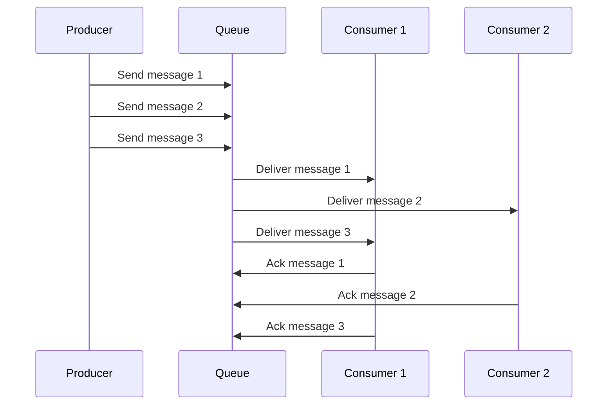
```mermaid
sequenceDiagram
    participant P as Producer
    participant Q as Queue
    participant C1 as Consumer 1
    participant C2 as Consumer 2
    
    P->>Q: Send message 1
    P->>Q: Send message 2
    P->>Q: Send message 3
    
    Q->>C1: Deliver message 1
    Q->>C2: Deliver message 2
    Q->>C1: Deliver message 3
    
    C1->>Q: Ack message 1
    C2->>Q: Ack message 2
    C1->>Q: Ack message 3
```

**Benefits**:
- Decoupling: Producers/consumers independent
- Buffering: Handle traffic spikes
- Reliability: Messages persisted
- Scalability: Add consumers

**Use Cases**:
- Task queues (background jobs)
- Event streaming
- Log aggregation
- Microservice communication

---

## Q5: Explain idempotency in distributed systems.

**Answer**:

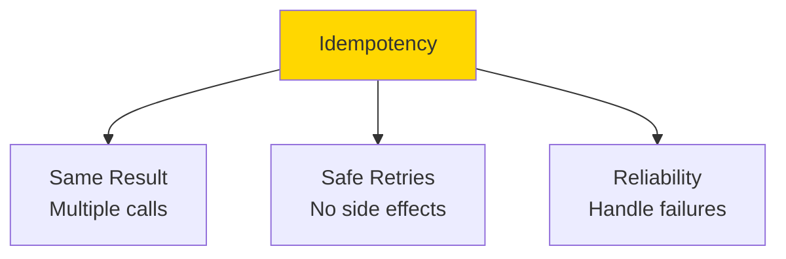
```mermaid
graph TB
    A[Idempotency] --> B[Same Result<br/>Multiple calls]
    A --> C[Safe Retries<br/>No side effects]
    A --> D[Reliability<br/>Handle failures]
    
    style A fill:#FFD700
```

### Idempotent vs Non-Idempotent

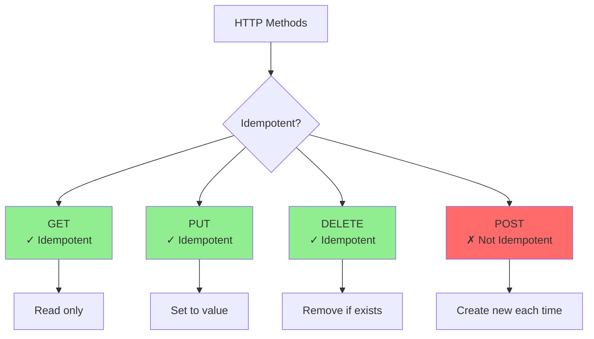
```mermaid
graph TB
    A[HTTP Methods] --> B{Idempotent?}
    
    B --> C1[GET<br/>✓ Idempotent]
    B --> C2[PUT<br/>✓ Idempotent]
    B --> C3[DELETE<br/>✓ Idempotent]
    B --> C4[POST<br/>✗ Not Idempotent]
    
    C1 --> D1[Read only]
    C2 --> D2[Set to value]
    C3 --> D3[Remove if exists]
    C4 --> D4[Create new each time]
    
    style C1 fill:#90EE90
    style C2 fill:#90EE90
    style C3 fill:#90EE90
    style C4 fill:#FF6B6B
```

### Making POST Idempotent

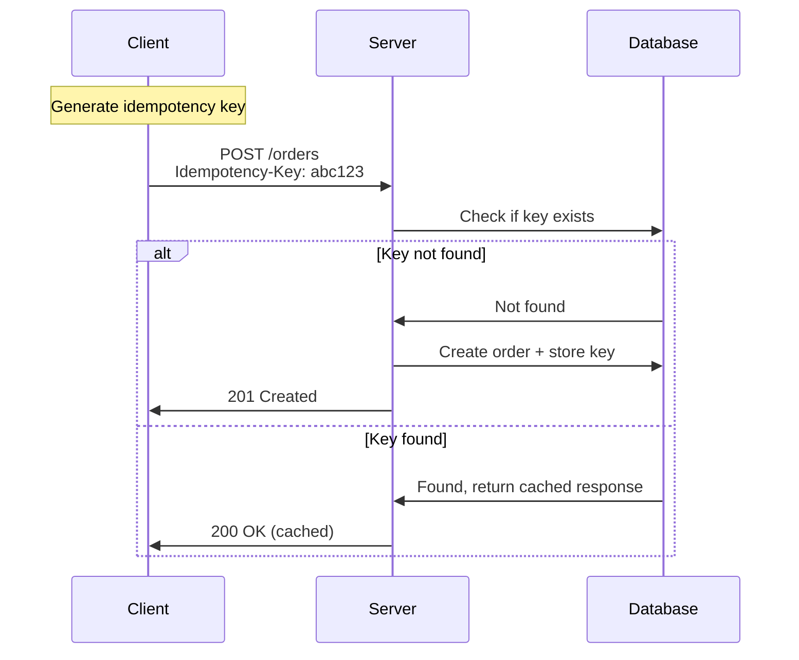
```mermaid
sequenceDiagram
    participant C as Client
    participant S as Server
    participant DB as Database
    
    Note over C: Generate idempotency key
    C->>S: POST /orders<br/>Idempotency-Key: abc123
    S->>DB: Check if key exists
    
    alt Key not found
        DB->>S: Not found
        S->>DB: Create order + store key
        S->>C: 201 Created
    else Key found
        DB->>S: Found, return cached response
        S->>C: 200 OK (cached)
    end
```

### Retry Scenario

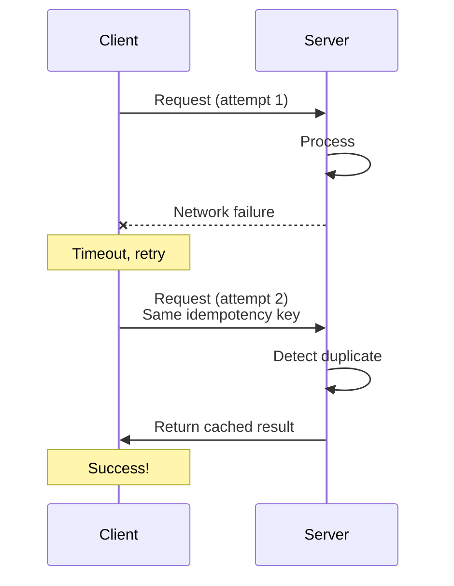
```mermaid
sequenceDiagram
    participant C as Client
    participant S as Server
    
    C->>S: Request (attempt 1)
    S->>S: Process
    S--xC: Network failure
    
    Note over C: Timeout, retry
    
    C->>S: Request (attempt 2)<br/>Same idempotency key
    S->>S: Detect duplicate
    S->>C: Return cached result
    
    Note over C: Success!
```

**Implementation Strategies**:
- Idempotency keys (client-generated)
- Natural keys (order ID, transaction ID)
- Database constraints (unique indexes)
- Distributed locks

---

## Q6: Explain rate limiting strategies.

**Answer**:

```mermaid
graph TB
    A[Rate Limiting<br/>Algorithms] --> B[Token Bucket]
    A --> C[Leaky Bucket]
    A --> D[Fixed Window]
    A --> E[Sliding Window]
    
    style A fill:#FFD700
```

### Token Bucket

```mermaid
graph TB
    A[Bucket<br/>Max 10 tokens] --> B{Request<br/>Arrives}
    
    B --> C{Token<br/>Available?}
    
    C -->|Yes| D[Take token<br/>Allow request]
    C -->|No| E[Reject request<br/>429 Too Many Requests]
    
    F[Refill<br/>1 token/second] --> A
    
    style A fill:#FFD700
    style D fill:#90EE90
    style E fill:#FF6B6B
```

**Characteristics**:
- Allows bursts (up to bucket size)
- Smooth rate over time
- Most flexible

### Fixed Window

```mermaid
graph TB
    A[Window: 00:00-00:59<br/>Limit: 100 requests] --> B{Request<br/>Count}
    
    B --> C1[< 100<br/>Allow]
    B --> C2[≥ 100<br/>Reject]
    
    D[Next window: 01:00<br/>Reset counter] --> A
    
    style C1 fill:#90EE90
    style C2 fill:#FF6B6B
```

**Problem**: Burst at window boundary

```mermaid
sequenceDiagram
    participant C as Client
    participant S as Server
    
    Note over S: Window 1: 00:00-00:59
    C->>S: 100 requests at 00:59
    S->>C: All allowed
    
    Note over S: Window 2: 01:00-01:59
    C->>S: 100 requests at 01:00
    S->>C: All allowed
    
    Note over C,S: 200 requests in 1 second!
```

### Sliding Window

```mermaid
graph TB
    A[Current Time:<br/>01:30] --> B[Look back<br/>60 seconds]
    
    B --> C[Count requests<br/>from 00:30 to 01:30]
    
    C --> D{< Limit?}
    
    D -->|Yes| E[Allow]
    D -->|No| F[Reject]
    
    style D fill:#FFD700
    style E fill:#90EE90
    style F fill:#FF6B6B
```

**Advantages**: More accurate, prevents boundary bursts

---

## Q7: Explain circuit breaker pattern.

**Answer**:

```mermaid
graph TB
    A[Circuit Breaker] --> B[Closed<br/>Normal operation]
    A --> C[Open<br/>Fail fast]
    A --> D[Half-Open<br/>Testing]
    
    B --> E[Failures exceed<br/>threshold]
    E --> C
    
    C --> F[Timeout expires]
    F --> D
    
    D --> G{Test request<br/>succeeds?}
    
    G -->|Yes| B
    G -->|No| C
    
    style B fill:#90EE90
    style C fill:#FF6B6B
    style D fill:#FFD700
```

### State Transitions

```mermaid
sequenceDiagram
    participant C as Client
    participant CB as Circuit Breaker
    participant S as Service
    
    Note over CB: State: CLOSED
    C->>CB: Request
    CB->>S: Forward
    S--xCB: Failure
    CB->>C: Error
    
    Note over CB: Failures: 1/5
    
    C->>CB: Request
    CB->>S: Forward
    S--xCB: Failure
    CB->>C: Error
    
    Note over CB: Failures: 5/5 - OPEN
    
    C->>CB: Request
    CB->>C: Fail fast (no call to service)
    
    Note over CB: Wait timeout...
    Note over CB: State: HALF-OPEN
    
    C->>CB: Request
    CB->>S: Test request
    S->>CB: Success
    CB->>C: Success
    
    Note over CB: State: CLOSED
```

**Configuration**:
- **Failure threshold**: 5 failures
- **Timeout**: 30 seconds
- **Success threshold**: 2 successes to close

**Benefits**:
- Prevent cascading failures
- Fail fast
- Give service time to recover
- Improve user experience

---

## Q8: Explain service mesh architecture.

**Answer**:

```mermaid
graph TB
    A[Service Mesh] --> B[Data Plane<br/>Proxies]
    A --> C[Control Plane<br/>Management]
    
    B --> D[Traffic Management]
    B --> E[Security]
    B --> F[Observability]
    
    style A fill:#FFD700
```

### Architecture

```mermaid
graph TB
    A[Service A] --> P1[Sidecar<br/>Proxy]
    B[Service B] --> P2[Sidecar<br/>Proxy]
    C[Service C] --> P3[Sidecar<br/>Proxy]
    
    P1 <--> P2
    P2 <--> P3
    P1 <--> P3
    
    CP[Control Plane] --> P1
    CP --> P2
    CP --> P3
    
    style CP fill:#FFD700
    style P1 fill:#87CEEB
    style P2 fill:#87CEEB
    style P3 fill:#87CEEB
```

### Request Flow

```mermaid
sequenceDiagram
    participant A as Service A
    participant P1 as Proxy A
    participant P2 as Proxy B
    participant B as Service B
    
    A->>P1: Request
    P1->>P1: Apply policies<br/>Retry, timeout, etc.
    P1->>P2: Encrypted request
    P2->>P2: Verify mTLS
    P2->>B: Request
    B->>P2: Response
    P2->>P1: Encrypted response
    P1->>A: Response
```

**Features**:
- **Traffic Management**: Load balancing, routing, retries
- **Security**: mTLS, authentication, authorization
- **Observability**: Metrics, logs, traces
- **Resilience**: Circuit breakers, timeouts

**Popular Service Meshes**:
- Istio
- Linkerd
- Consul Connect

---

## Q9: Explain event sourcing and CQRS.

**Answer**:

```mermaid
graph TB
    A[Event Sourcing] --> B[Store Events<br/>Not state]
    A --> C[Replay Events<br/>Rebuild state]
    A --> D[Audit Trail<br/>Complete history]
    
    style A fill:#FFD700
```

### Traditional vs Event Sourcing

```mermaid
graph TB
    subgraph Traditional["Traditional (State)"]
        A1[User: John<br/>Balance: $100] --> A2[Update]
        A2 --> A3[User: John<br/>Balance: $150]
        Note1[Lost: How we got here]
    end
    
    subgraph EventSourcing["Event Sourcing"]
        B1[Created John, $0] --> B2[Deposited $100]
        B2 --> B3[Deposited $50]
        B3 --> B4[Current: $150]
        Note2[Full history preserved]
    end
```

### Event Store

```mermaid
sequenceDiagram
    participant C as Command
    participant A as Aggregate
    participant E as Event Store
    participant P as Projections
    
    C->>A: Deposit($50)
    A->>A: Validate
    A->>E: Save event<br/>MoneyDeposited($50)
    E->>P: Notify subscribers
    P->>P: Update read models
```

### CQRS (Command Query Responsibility Segregation)

```mermaid
graph TB
    A[Client] --> B{Request Type}
    
    B --> C[Command<br/>Write]
    B --> D[Query<br/>Read]
    
    C --> E[Write Model<br/>Event Store]
    D --> F[Read Model<br/>Optimized Views]
    
    E --> G[Events]
    G --> F
    
    style C fill:#FFD700
    style D fill:#87CEEB
```

**Benefits**:
- Complete audit trail
- Time travel (replay to any point)
- Separate read/write optimization
- Event-driven architecture

**Challenges**:
- Complexity
- Eventual consistency
- Event schema evolution

---

## Q10: Explain distributed tracing.

**Answer**:

```mermaid
graph TB
    A[Distributed<br/>Tracing] --> B[Trace<br/>End-to-end request]
    A --> C[Spans<br/>Individual operations]
    A --> D[Context Propagation<br/>Across services]
    
    style A fill:#FFD700
```

### Trace Structure

```mermaid
graph TB
    A[Trace ID: abc123] --> B[Span: API Gateway<br/>100ms]
    
    B --> C[Span: Auth Service<br/>20ms]
    B --> D[Span: Order Service<br/>60ms]
    
    D --> E[Span: Database Query<br/>40ms]
    D --> F[Span: Payment Service<br/>15ms]
    
    style A fill:#FFD700
    style B fill:#87CEEB
    style C fill:#90EE90
    style D fill:#87CEEB
    style E fill:#90EE90
    style F fill:#90EE90
```

### Trace Timeline

```mermaid
gantt
    title Request Trace (200ms total)
    dateFormat SSS
    axisFormat %L ms
    
    section API Gateway
    API Gateway    :000, 100ms
    
    section Auth
    Auth Service   :010, 20ms
    
    section Order
    Order Service  :040, 60ms
    
    section Database
    DB Query       :050, 40ms
    
    section Payment
    Payment Service:080, 15ms
```

### Context Propagation

```mermaid
sequenceDiagram
    participant C as Client
    participant G as Gateway
    participant A as Auth
    participant O as Order
    
    C->>G: Request
    Note over G: Generate Trace ID: abc123<br/>Span ID: span1
    
    G->>A: Request<br/>Trace-ID: abc123<br/>Parent-Span: span1<br/>Span-ID: span2
    A->>G: Response
    
    G->>O: Request<br/>Trace-ID: abc123<br/>Parent-Span: span1<br/>Span-ID: span3
    O->>G: Response
    
    G->>C: Response
```

**Benefits**:
- Identify bottlenecks
- Understand dependencies
- Debug distributed systems
- Measure latency

**Tools**:
- Jaeger
- Zipkin
- OpenTelemetry

---

## Summary

Medium protocol and design topics:
- **HTTP/2**: Multiplexing, header compression
- **gRPC**: Binary protocol, streaming, Protocol Buffers
- **Consensus**: Raft/Paxos for distributed agreement
- **Message Queues**: Point-to-point and pub/sub patterns
- **Idempotency**: Safe retries in distributed systems
- **Rate Limiting**: Token bucket, sliding window
- **Circuit Breaker**: Prevent cascading failures
- **Service Mesh**: Traffic management, security, observability
- **Event Sourcing/CQRS**: Event-driven architecture
- **Distributed Tracing**: End-to-end request tracking

These concepts enable building robust distributed systems.

