Easy-level research interview questions covering fundamental research concepts and methodologies.

## Q1: What is the scientific method and how do you apply it to technical research?

**Answer**:

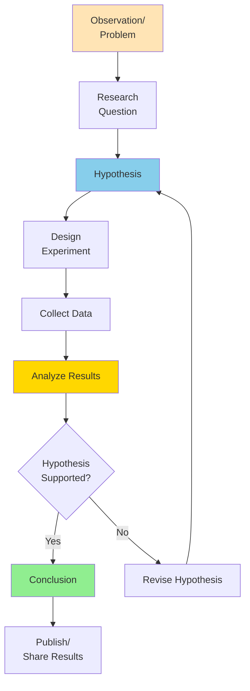

**Application to Technical Research**:
- **Observation**: System is slow
- **Question**: What causes the slowdown?
- **Hypothesis**: Database queries are the bottleneck
- **Experiment**: Profile application, measure query times
- **Analysis**: Compare query times vs. other operations
- **Conclusion**: Confirm or reject hypothesis

---

## Q2: How do you conduct a literature review?

**Answer**:

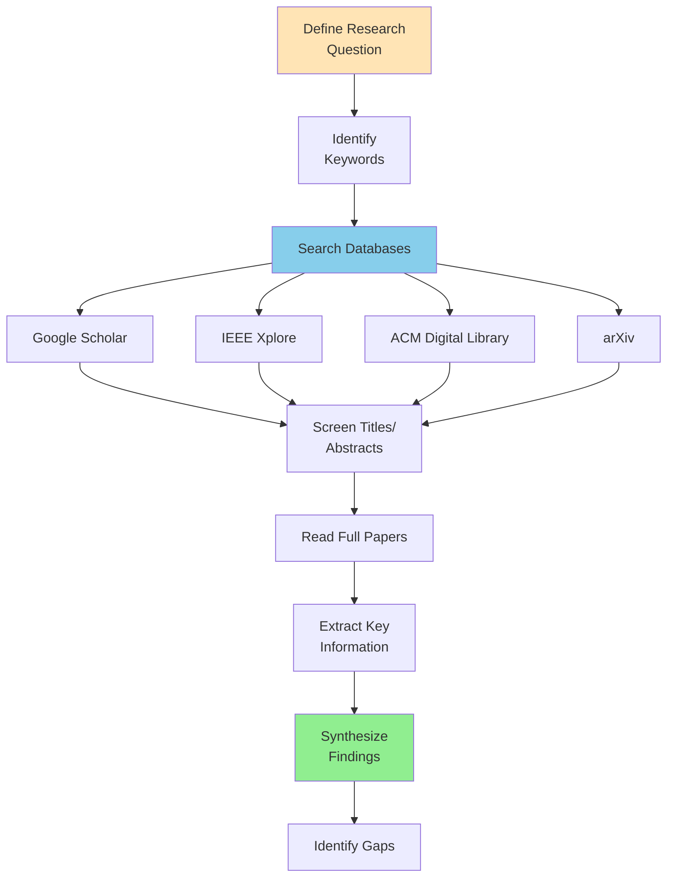

**Key Steps**:
1. **Define scope**: What are you researching?
2. **Search systematically**: Use multiple databases
3. **Screen papers**: Read abstracts first
4. **Take notes**: Extract key findings
5. **Organize**: Group by themes/topics
6. **Synthesize**: Find patterns and gaps

---

## Q3: What is the difference between qualitative and quantitative research?

**Answer**:

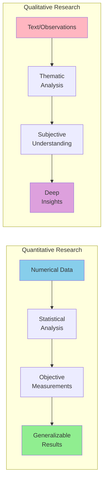

**Quantitative**:
- Numbers and statistics
- Large sample sizes
- Hypothesis testing
- **Example**: "80% of users prefer feature A"

**Qualitative**:
- Words and observations
- Small sample sizes
- Exploratory
- **Example**: "Users find feature A intuitive because..."

**When to Use**:
- **Quantitative**: Measure performance, validate hypotheses
- **Qualitative**: Understand user behavior, explore new areas

---

## Q4: How do you design a controlled experiment?

**Answer**:

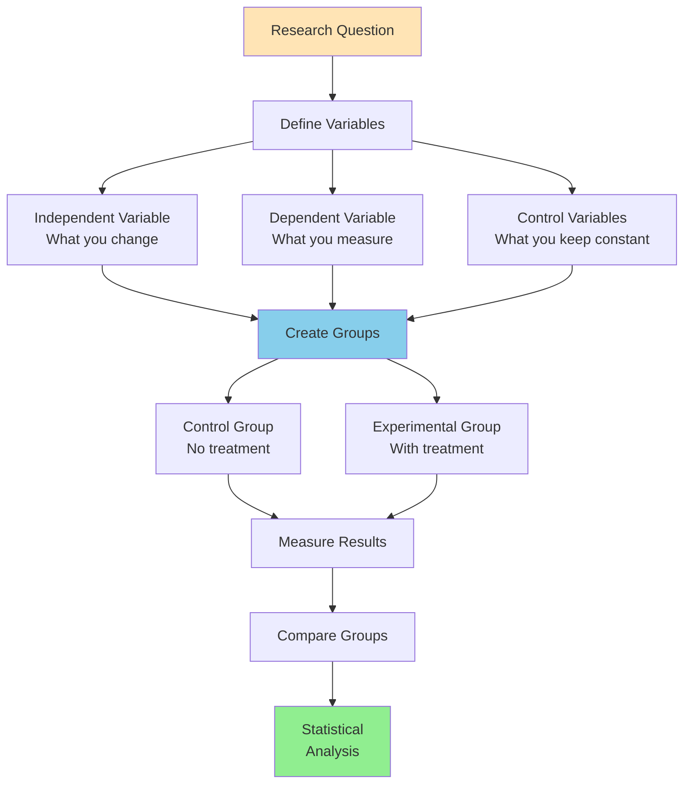

**Example - Testing New Algorithm**:
- **Independent**: Algorithm version (old vs. new)
- **Dependent**: Processing time
- **Control**: Same hardware, same dataset, same conditions
- **Groups**: 
  - Control: Old algorithm
  - Experimental: New algorithm
- **Measure**: Average processing time
- **Analyze**: T-test to compare means

---

## Q5: What is statistical significance and p-value?

**Answer**:

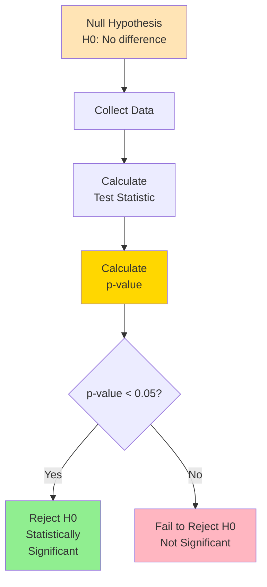

**P-value**: Probability of observing results if null hypothesis is true.

**Interpretation**:
- **p < 0.05**: Less than 5% chance results are due to random chance (significant)
- **p > 0.05**: Results could be due to random chance (not significant)

**Example**:
- Test if new algorithm is faster
- H0: No difference in speed
- p-value = 0.02
- **Conclusion**: Reject H0, new algorithm is significantly faster

---

## Q6: How do you measure research validity and reliability?

**Answer**:

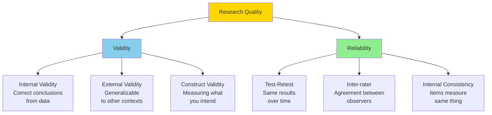

**Validity**: Are you measuring the right thing?
**Reliability**: Are measurements consistent?

**Example**:
- **Valid but not reliable**: Measuring user satisfaction with inconsistent questions
- **Reliable but not valid**: Consistently measuring wrong metric
- **Both**: Consistent measurement of correct metric

---

## Q7: What is a research hypothesis and how do you formulate one?

**Answer**:

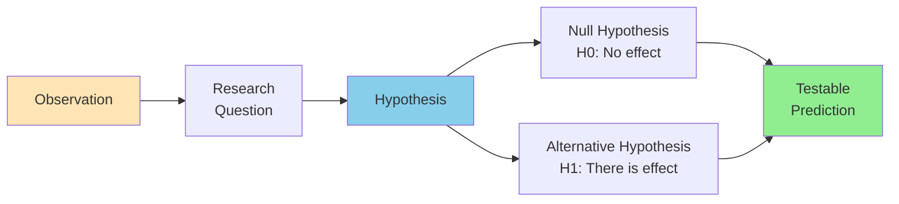

**Good Hypothesis Characteristics**:
- **Testable**: Can be proven true or false
- **Specific**: Clear variables defined
- **Falsifiable**: Can be disproven
- **Based on theory**: Grounded in existing knowledge

**Examples**:

**Bad**: "The system will be better"
- Not specific, not measurable

**Good**: "Implementing caching will reduce API response time by at least 30%"
- Specific, measurable, testable

---

## Q8: How do you collect and organize research data?

**Answer**:

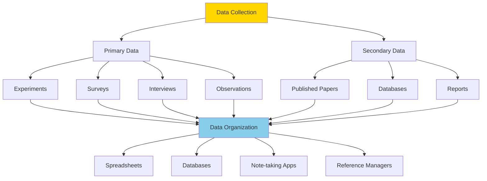

**Organization Best Practices**:
- **Consistent naming**: Use clear, systematic file names
- **Version control**: Track changes over time
- **Backup**: Multiple copies in different locations
- **Documentation**: README files explaining structure
- **Metadata**: Record when, where, how data collected

---

## Q9: What is peer review and why is it important?

**Answer**:

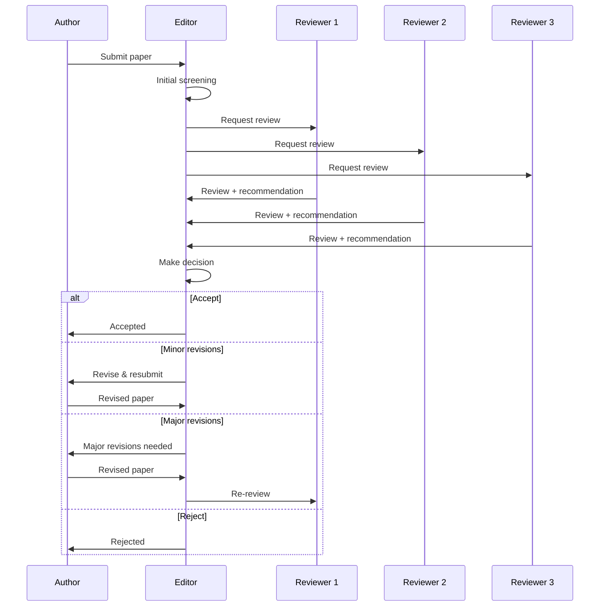

**Purpose of Peer Review**:
- **Quality control**: Catch errors and flaws
- **Validation**: Independent experts verify claims
- **Improvement**: Constructive feedback
- **Credibility**: Establishes trust in findings

**Review Criteria**:
- Methodology sound?
- Results support conclusions?
- Novel contribution?
- Clear presentation?

---

## Q10: How do you present research findings effectively?

**Answer**:

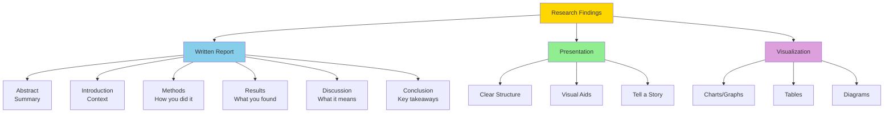

**Presentation Structure**:

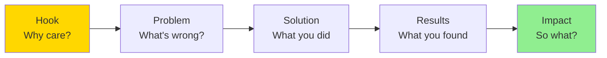

**Visualization Best Practices**:
- **Keep it simple**: One message per chart
- **Label clearly**: Axes, legends, titles
- **Use color wisely**: Highlight key points
- **Choose right chart**: Bar, line, scatter based on data type

---

## Summary

Key research concepts:
- **Scientific Method**: Systematic approach to investigation
- **Literature Review**: Survey existing knowledge
- **Qualitative vs. Quantitative**: Different data types
- **Controlled Experiments**: Isolate variables
- **Statistical Significance**: P-values and hypothesis testing
- **Validity & Reliability**: Quality measures
- **Hypothesis Formulation**: Testable predictions
- **Data Organization**: Systematic collection and storage
- **Peer Review**: Quality control process
- **Presentation**: Effective communication of findings

These fundamentals enable conducting rigorous technical research.

