Hard-level research interview questions covering advanced methodologies and complex analysis.

## Q1: Explain Bayesian vs. Frequentist approaches to statistics.

**Answer**:

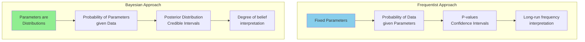

**Bayes' Theorem**:
$$P(\theta|D) = \frac{P(D|\theta) \times P(\theta)}{P(D)}$$

```mermaid
graph LR
    A[Prior<br/>P θ] --> B[Likelihood<br/>P D|θ]
    B --> C[Posterior<br/>P θ|D]
    
    D[Data] --> B
    
    style A fill:#FFE4B5
    style B fill:#87CEEB
    style C fill:#90EE90
```

**When to Use**:
- **Frequentist**: Large samples, no prior knowledge
- **Bayesian**: Small samples, incorporate prior knowledge, sequential updating

---

## Q2: Design a randomized controlled trial with complex interventions.

**Answer**:

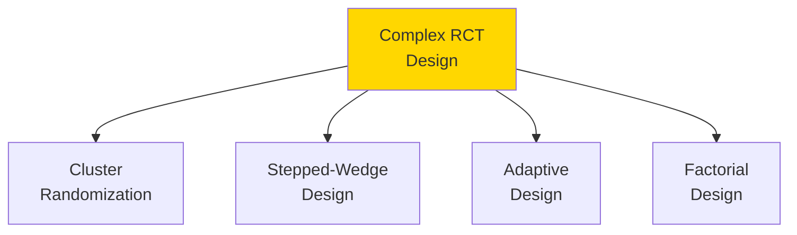

### Cluster Randomized Trial

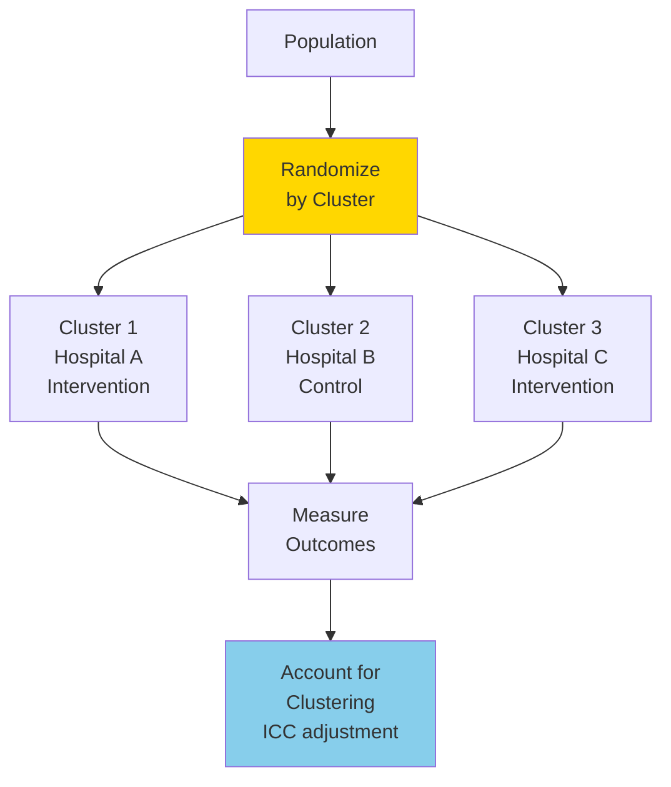

**Intraclass Correlation (ICC)**: Similarity within clusters
- Requires larger sample size than individual randomization
- Design effect = 1 + (m-1) × ICC

### Stepped-Wedge Design

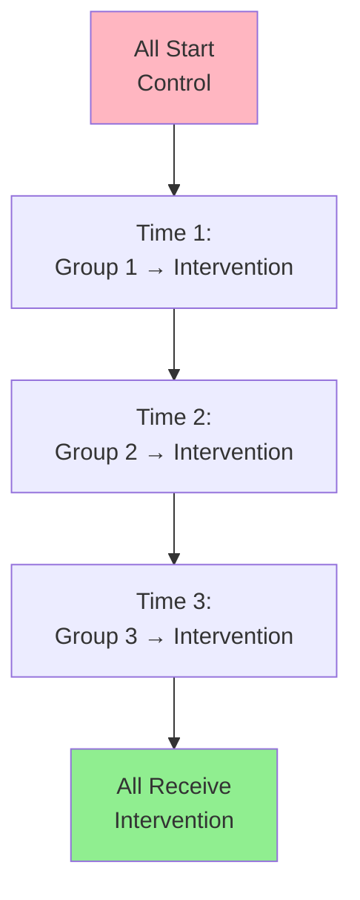

**Advantages**: Ethical (all get treatment), controls for time trends
**Disadvantages**: Complex analysis, longer duration

---

## Q3: Explain structural equation modeling (SEM).

**Answer**:

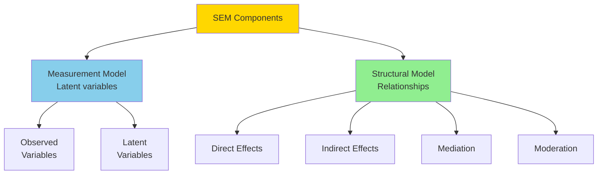

### Path Diagram

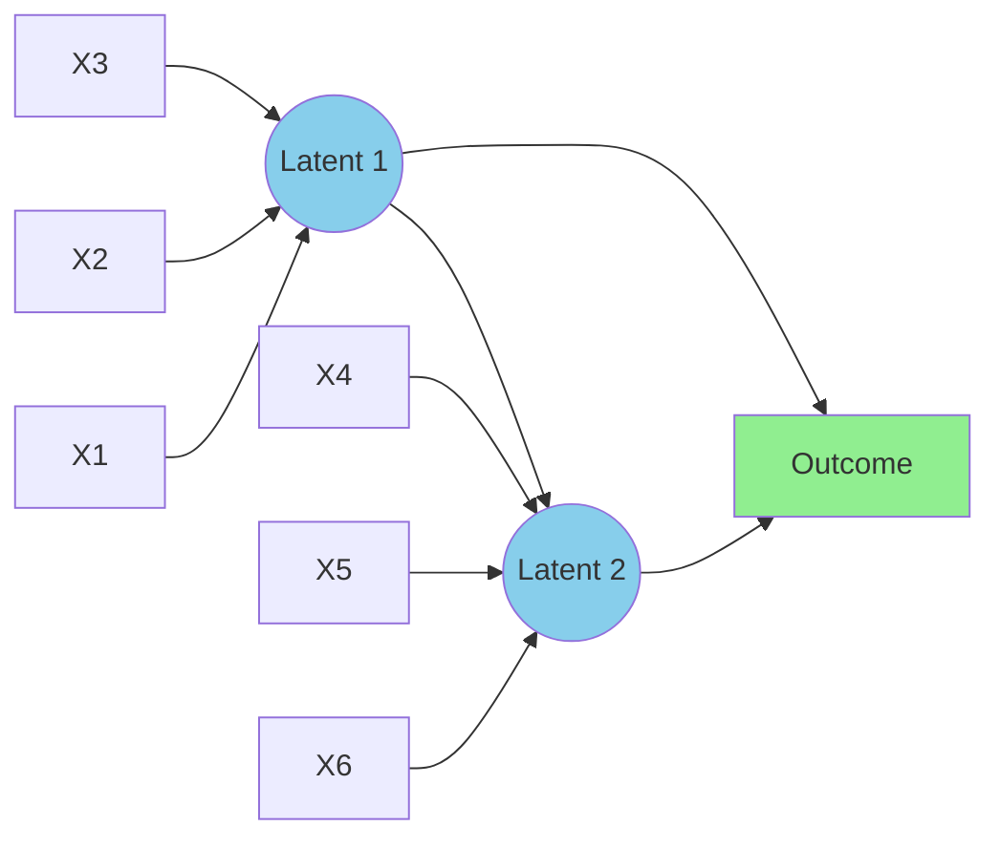

**Fit Indices**:
- **CFI** (Comparative Fit Index): > 0.95 good
- **RMSEA** (Root Mean Square Error): < 0.06 good
- **SRMR** (Standardized Root Mean Square Residual): < 0.08 good

---

## Q4: How do you handle multiple testing problems?

**Answer**:

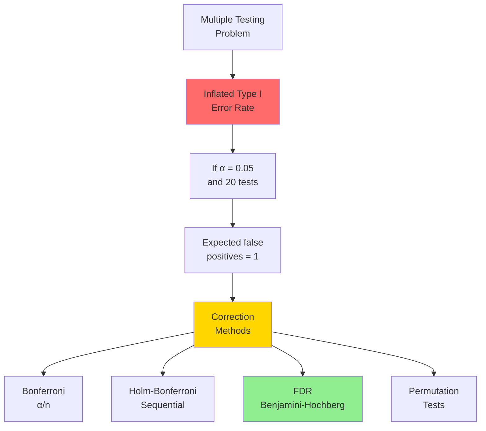

### Family-Wise Error Rate (FWER)

**Bonferroni Correction**:
$$\alpha_{adjusted} = \frac{\alpha}{n}$$

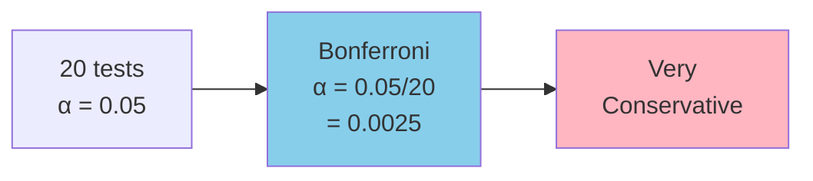

### False Discovery Rate (FDR)

**Benjamini-Hochberg Procedure**:

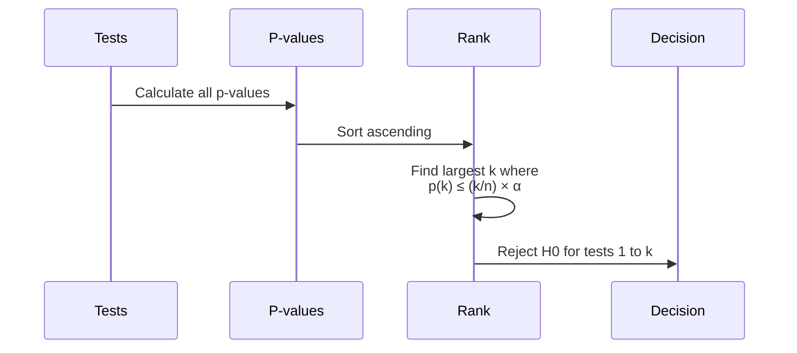

**Less conservative than Bonferroni**, controls proportion of false discoveries

---

## Q5: Explain time series analysis and forecasting.

**Answer**:

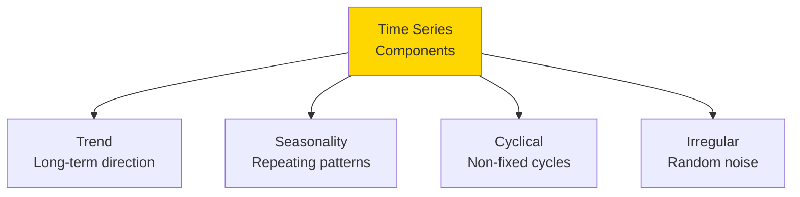

### Decomposition

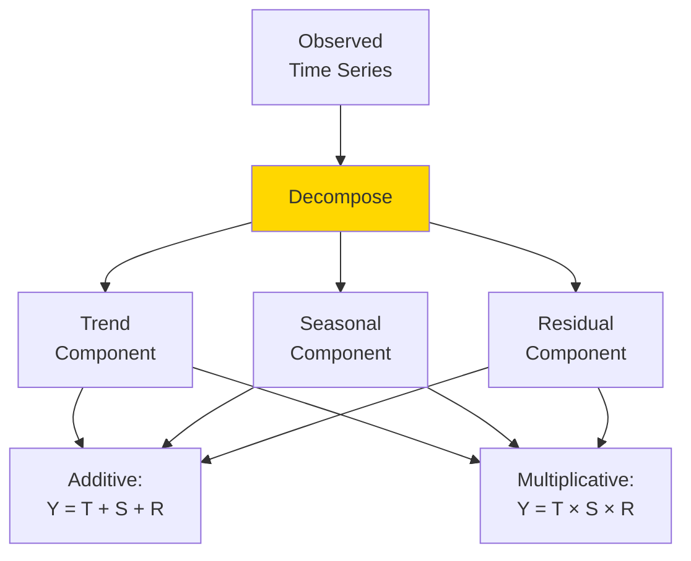

### ARIMA Models

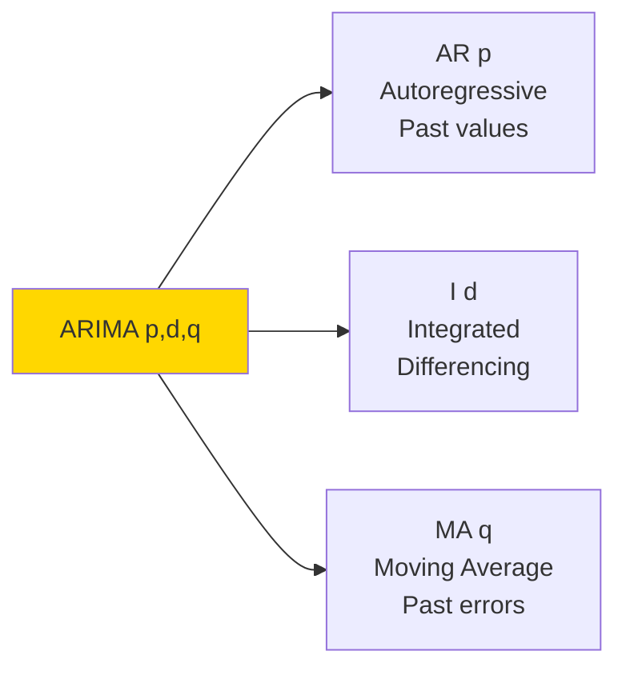

**Model Selection**:
- **ACF/PACF plots**: Identify p, q
- **AIC/BIC**: Compare models
- **Stationarity tests**: Determine d

---

## Q6: Design a mixed-methods research study.

**Answer**:

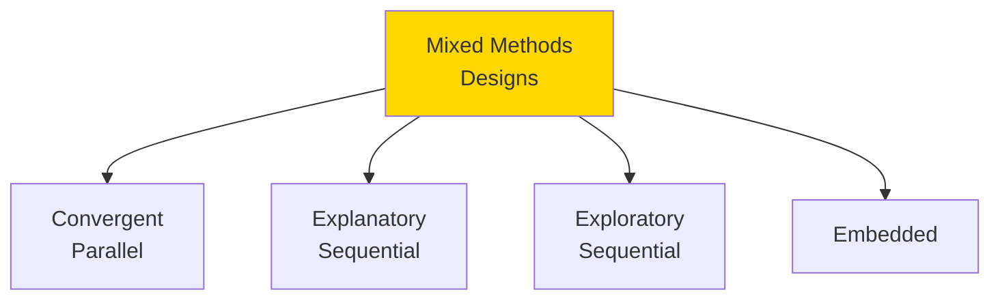

### Convergent Parallel Design

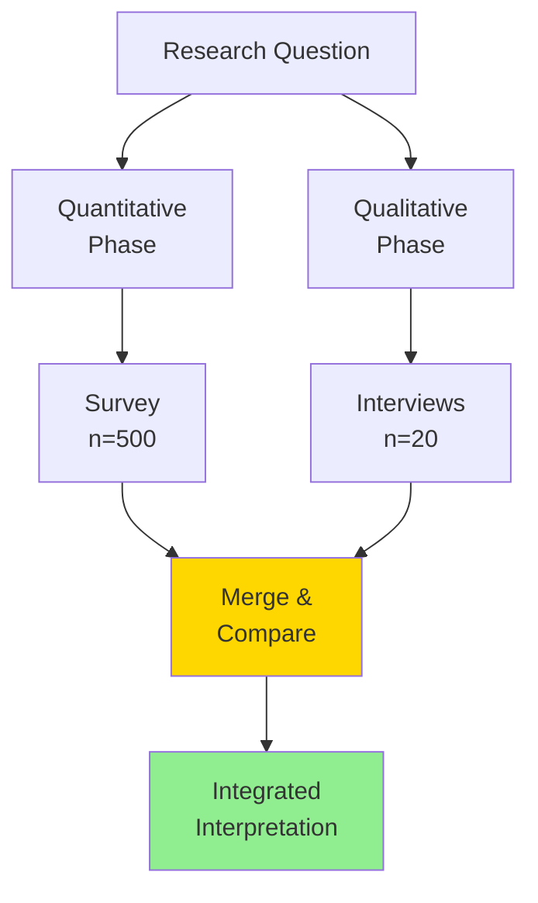

**Collect both simultaneously**, compare and integrate

### Explanatory Sequential Design

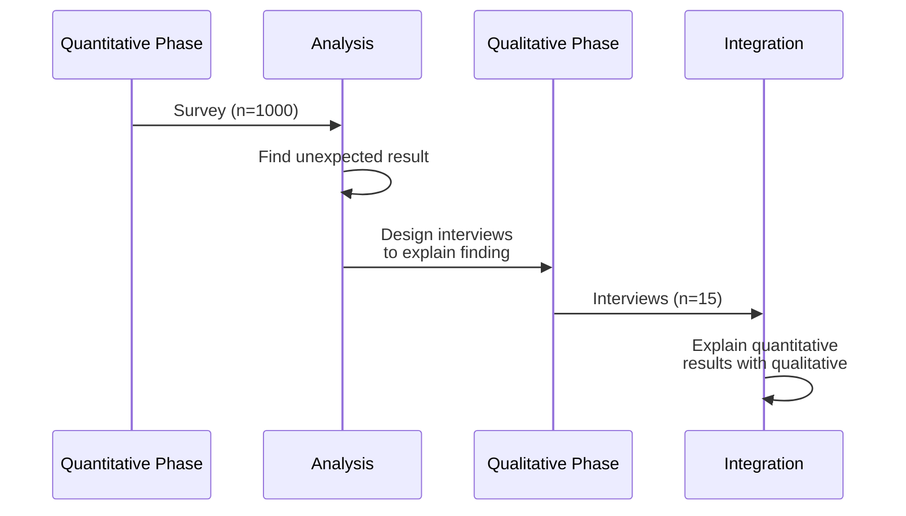

**Quant first**, then qual to explain

---

## Q7: Implement machine learning for causal inference.

**Answer**:

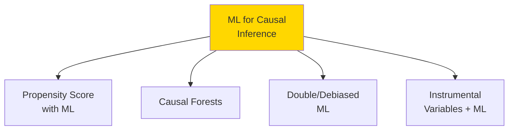

### Double/Debiased Machine Learning

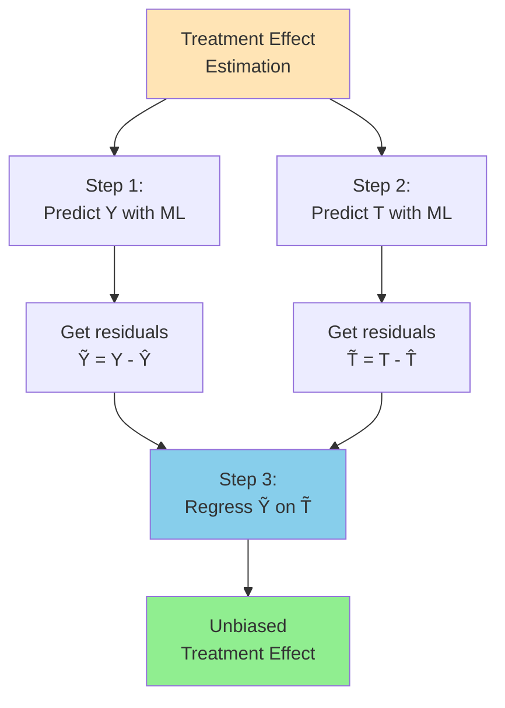

**Advantages**:
- Flexible modeling of confounders
- Reduces bias from model misspecification
- Valid inference

### Causal Forests

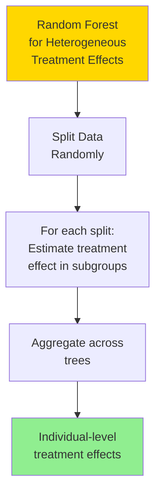

---

## Q8: Explain survival analysis and competing risks.

**Answer**:

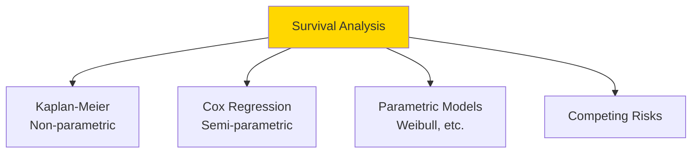

### Kaplan-Meier Curve

```mermaid
graph LR
    A[Time 0<br/>100% survive] --> B[Event 1<br/>95% survive]
    B --> C[Event 2<br/>88% survive]
    C --> D[Event 3<br/>75% survive]
    D --> E[Censored<br/>75% survive]
    E --> F[Event 4<br/>65% survive]
    
    style A fill:#90EE90
    style F fill:#FFB6C1
```

**Censoring**: Participant lost to follow-up or study ends

### Competing Risks

```mermaid
graph TB
    A[Patient<br/>at Risk] --> B{Outcome}
    
    B --> C[Event of<br/>Interest]
    B --> D[Competing<br/>Event 1]
    B --> E[Competing<br/>Event 2]
    B --> F[Censored]
    
    style C fill:#90EE90
    style D fill:#FFB6C1
    style E fill:#FFB6C1
```

**Example**: Studying death from disease
- **Event of interest**: Death from disease
- **Competing risk**: Death from other causes

**Cumulative Incidence Function (CIF)**: Accounts for competing risks

---

## Q9: Design and analyze network experiments.

**Answer**:

```mermaid
graph TB
    A[Network<br/>Experiments] --> B[Spillover Effects<br/>Treatment affects<br/>neighbors]
    
    B --> C[Cluster<br/>Randomization]
    B --> D[Ego-Network<br/>Randomization]
    B --> E[Graph Cluster<br/>Randomization]
    
    style A fill:#FFD700
    style B fill:#FF6B6B
```

### Network Structure

```mermaid
graph TB
    A((User A<br/>Treated)) --> B((User B<br/>Control))
    A --> C((User C<br/>Control))
    B --> D((User D<br/>Control))
    
    Note[Spillover: A's treatment<br/>may affect B and C]
    
    style A fill:#90EE90
    style B fill:#FFB6C1
    style C fill:#FFB6C1
```

### Graph Cluster Randomization

```mermaid
graph TB
    A[Network] --> B[Detect<br/>Communities]
    
    B --> C1[Community 1<br/>Treatment]
    B --> C2[Community 2<br/>Control]
    B --> C3[Community 3<br/>Treatment]
    
    C1 --> D[Minimize<br/>Between-cluster<br/>Connections]
    C2 --> D
    C3 --> D
    
    style B fill:#FFD700
    style D fill:#90EE90
```

**Analysis Considerations**:
- Direct effects vs. spillover effects
- Network autocorrelation
- Exposure mapping (who affects whom)

---

## Q10: Implement Bayesian hierarchical models.

**Answer**:

```mermaid
graph TB
    A[Hierarchical<br/>Bayesian Model] --> B[Level 1:<br/>Individual<br/>Observations]
    
    B --> C[Level 2:<br/>Group<br/>Parameters]
    
    C --> D[Level 3:<br/>Hyperparameters]
    
    D --> E[Priors on<br/>Hyperparameters]
    
    style A fill:#FFD700
    style C fill:#87CEEB
    style E fill:#FFE4B5
```

### Model Structure

```mermaid
graph TB
    A[Hyperprior<br/>μ, τ] --> B1[Group 1<br/>θ₁ ~ N μ,τ]
    A --> B2[Group 2<br/>θ₂ ~ N μ,τ]
    A --> B3[Group k<br/>θₖ ~ N μ,τ]
    
    B1 --> C1[Observations<br/>y₁ⱼ ~ N θ₁,σ]
    B2 --> C2[Observations<br/>y₂ⱼ ~ N θ₂,σ]
    B3 --> C3[Observations<br/>yₖⱼ ~ N θₖ,σ]
    
    style A fill:#FFE4B5
    style B1 fill:#87CEEB
    style B2 fill:#87CEEB
    style B3 fill:#87CEEB
```

**Advantages**:
- **Partial pooling**: Borrow strength across groups
- **Shrinkage**: Pull extreme estimates toward mean
- **Uncertainty quantification**: Full posterior distributions

### MCMC Sampling

```mermaid
sequenceDiagram
    participant I as Initialize
    participant S as Sample
    participant A as Accept/Reject
    participant C as Converge
    
    I->>S: Start with initial values
    loop MCMC iterations
        S->>S: Propose new parameters
        S->>A: Calculate acceptance probability
        A->>S: Accept or reject
    end
    S->>C: Check convergence (R-hat)
    
    alt Converged
        C->>C: Use samples for inference
    else Not converged
        C->>S: Continue sampling
    end
```

**Diagnostics**:
- **Trace plots**: Visual convergence check
- **R-hat**: < 1.01 indicates convergence
- **Effective sample size**: > 1000 recommended

---

## Summary

Hard research topics:
- **Bayesian vs. Frequentist**: Different statistical philosophies
- **Complex RCTs**: Cluster, stepped-wedge, adaptive designs
- **SEM**: Latent variables and structural relationships
- **Multiple Testing**: FWER and FDR control
- **Time Series**: ARIMA, decomposition, forecasting
- **Mixed Methods**: Integrating qual and quant
- **ML for Causality**: Double ML, causal forests
- **Survival Analysis**: Competing risks, censoring
- **Network Experiments**: Spillover effects
- **Hierarchical Bayesian**: Partial pooling, MCMC

These advanced methods enable tackling complex research questions with rigor.

