Medium-level research interview questions covering advanced methodologies and analysis techniques.

## Q1: Explain different experimental designs and when to use each.

**Answer**:

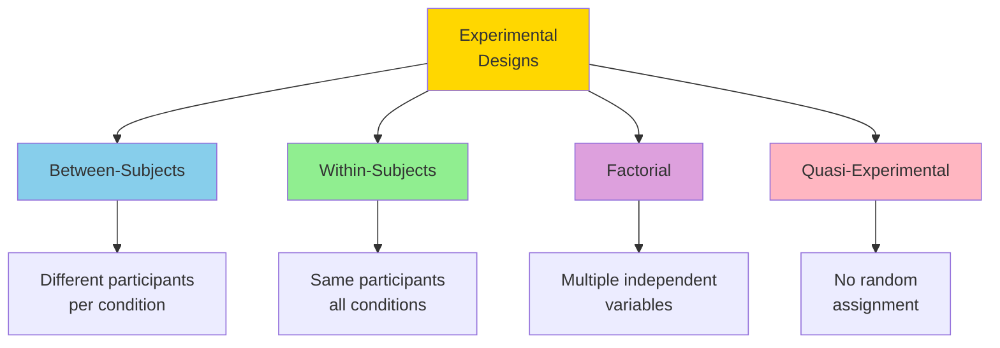

### Between-Subjects Design

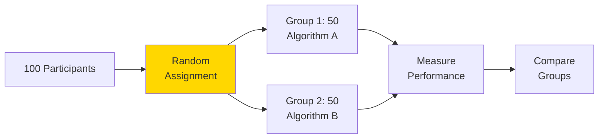

**Pros**: No learning effects, simpler analysis
**Cons**: Need more participants, individual differences

### Within-Subjects Design

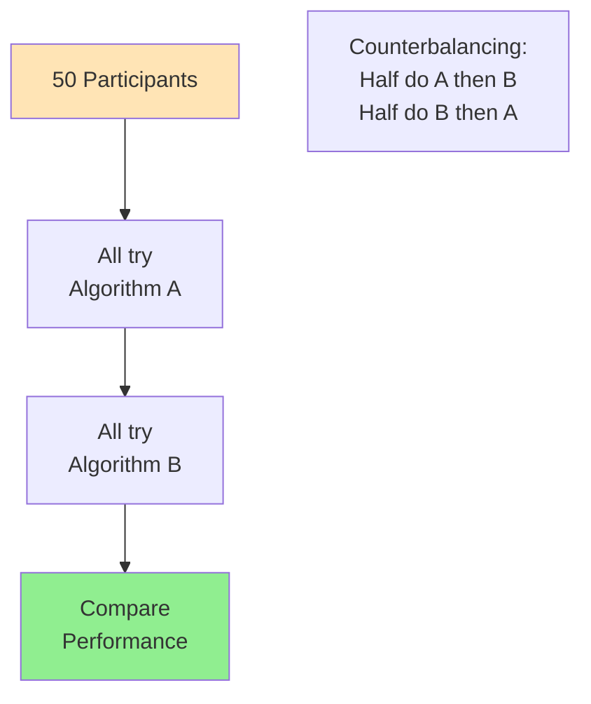

**Pros**: Fewer participants, control individual differences
**Cons**: Learning effects, fatigue

### Factorial Design

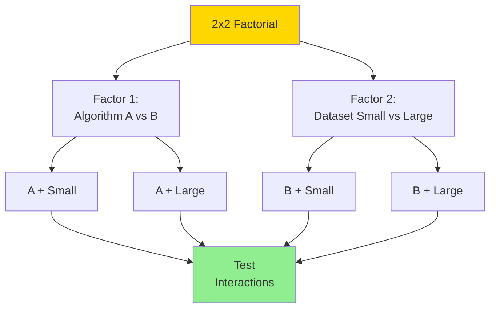

**Pros**: Test multiple factors, find interactions
**Cons**: Complex, need more participants

---

## Q2: How do you handle confounding variables?

**Answer**:

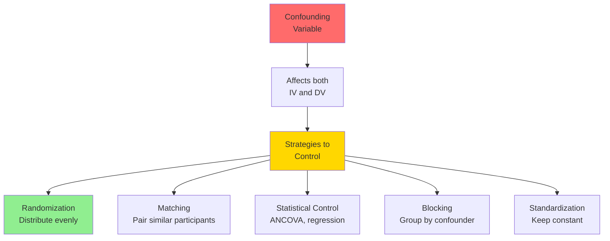

**Example - Testing Algorithm Performance**:

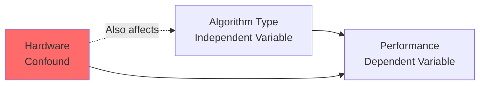

**Solution**: Use same hardware for all tests (standardization)

---

## Q3: Explain power analysis and sample size calculation.

**Answer**:

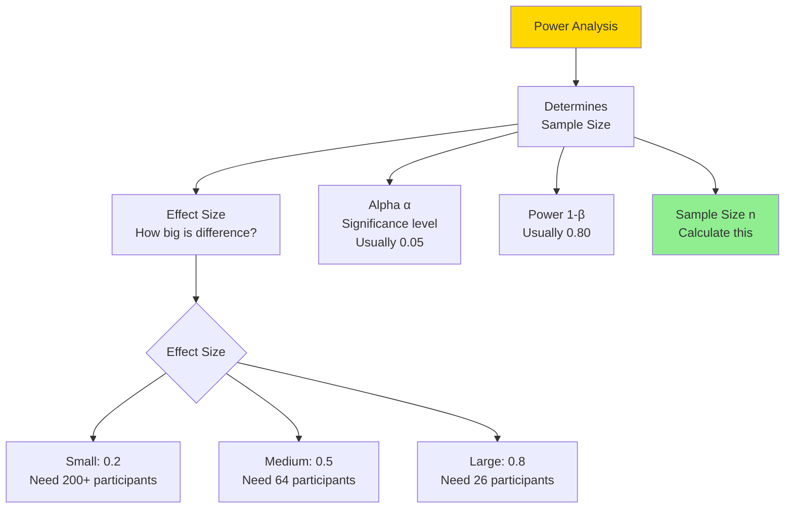

**Power**: Probability of detecting effect if it exists

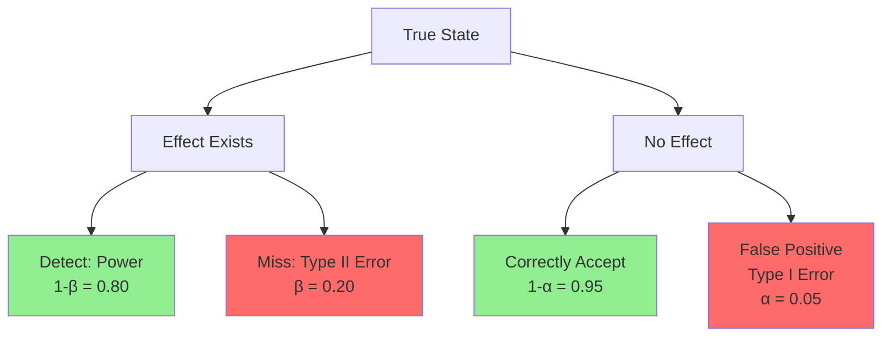

---

## Q4: How do you conduct meta-analysis?

**Answer**:

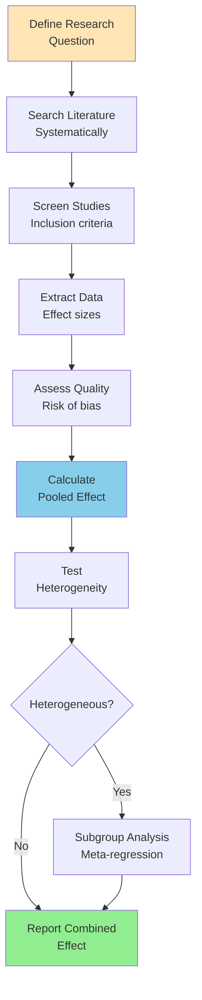

**Forest Plot Visualization**:

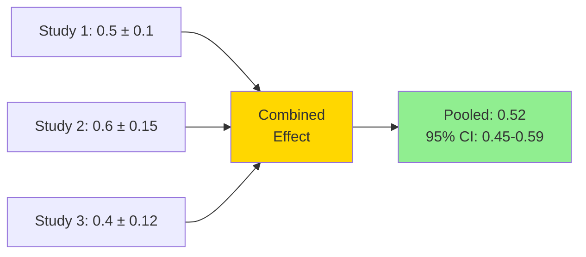

**Heterogeneity Tests**:
- **I²**: Percentage of variation due to heterogeneity
  - I² < 25%: Low
  - I² 25-75%: Moderate
  - I² > 75%: High

---

## Q5: Explain different types of bias in research.

**Answer**:

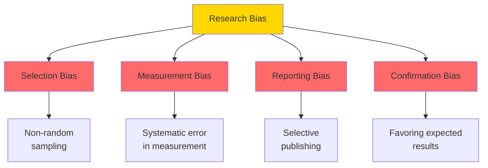

### Selection Bias

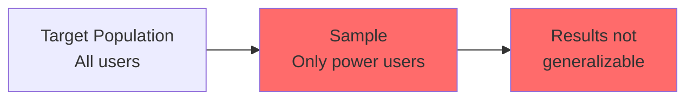

**Mitigation**: Random sampling, stratified sampling

### Publication Bias

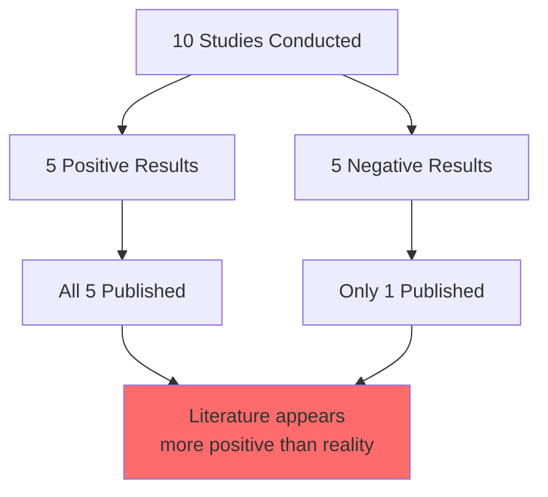

**Mitigation**: Pre-registration, publish all results

---

## Q6: How do you perform A/B testing correctly?

**Answer**:

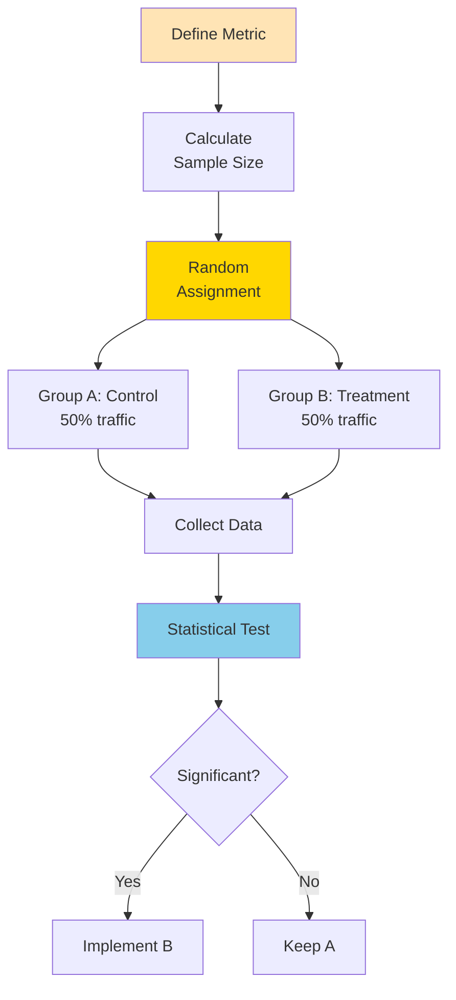

**Common Pitfalls**:

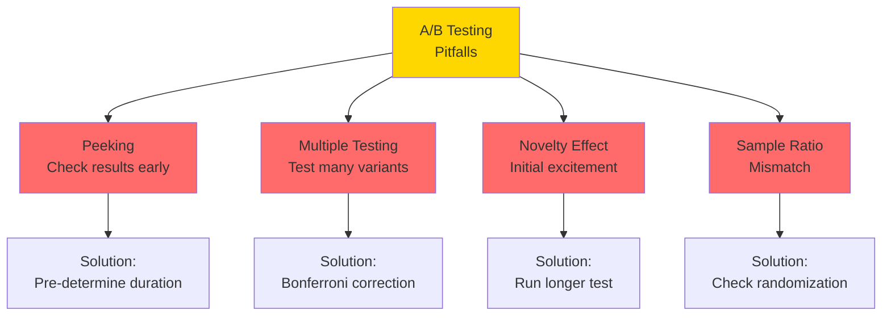

**Sequential Testing**:

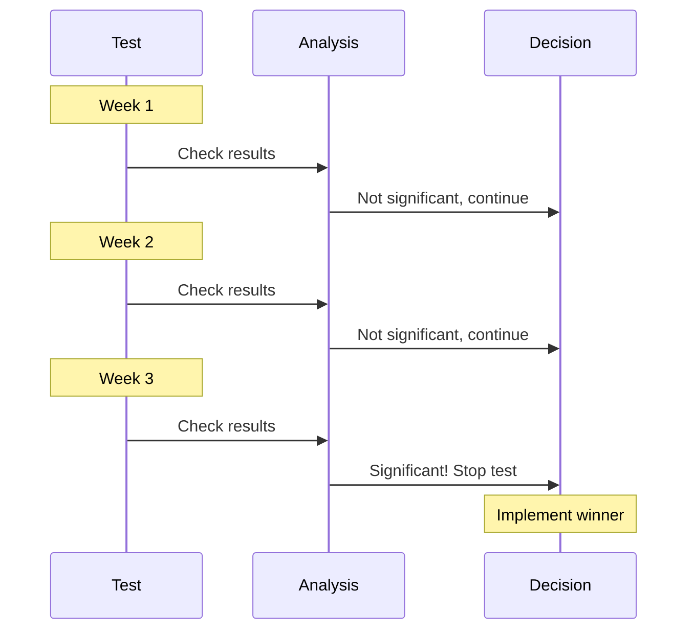

---

## Q7: Explain regression analysis and when to use it.

**Answer**:

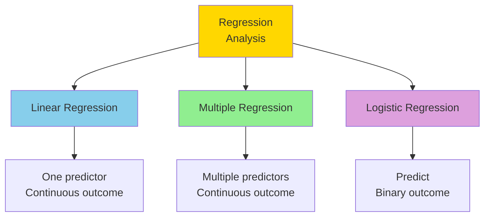

### Simple Linear Regression

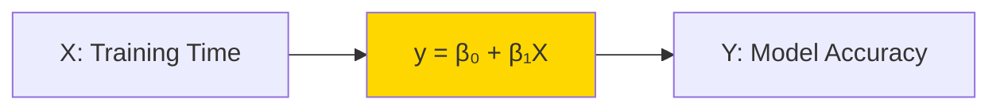

**Equation**: $y = \beta_0 + \beta_1 x + \epsilon$

**Interpretation**:
- $\beta_0$: Intercept (accuracy with 0 training)
- $\beta_1$: Slope (accuracy increase per hour)
- $R^2$: Proportion of variance explained

### Multiple Regression

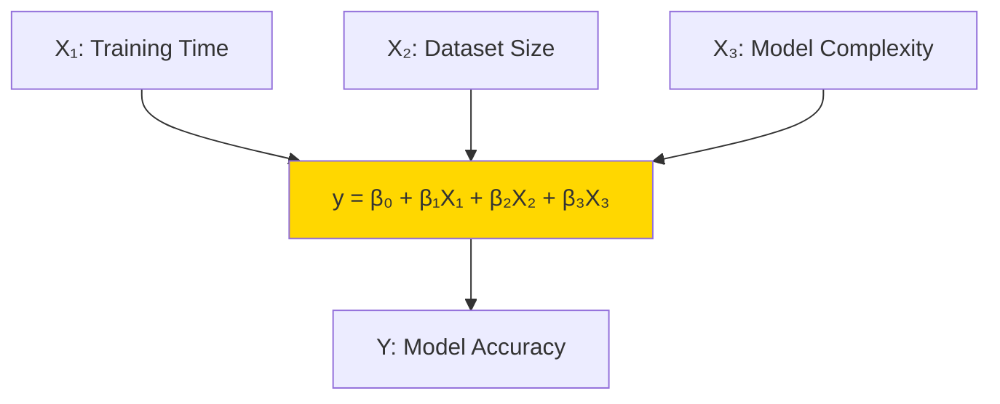

**Use Cases**:
- Predict continuous outcomes
- Understand relationships
- Control for confounds
- Feature importance

---

## Q8: How do you handle missing data?

**Answer**:

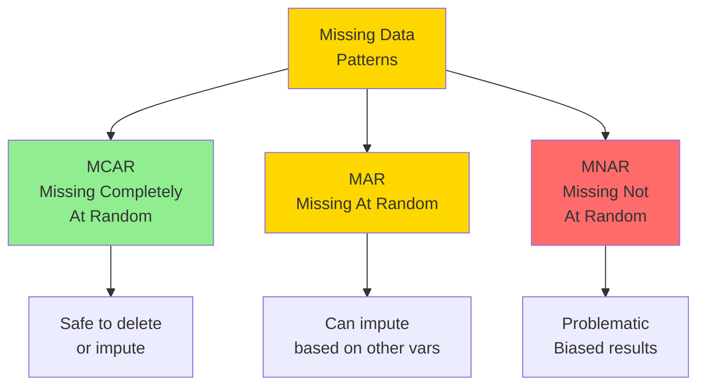

**Handling Strategies**:

```mermaid
graph TB
    A[Missing Data<br/>Solutions] --> B1[Deletion<br/>Listwise/Pairwise]
    A --> B2[Imputation<br/>Fill in values]
    A --> B3[Model-Based<br/>ML methods]
    
    B2 --> C1[Mean/Median<br/>Simple]
    B2 --> C2[Regression<br/>Predict from others]
    B2 --> C3[Multiple Imputation<br/>Create several datasets]
    B2 --> C4[KNN<br/>Similar cases]
    
    style A fill:#FFD700
    style B2 fill:#87CEEB
    style C3 fill:#90EE90
```

**Multiple Imputation Process**:

```mermaid
sequenceDiagram
    participant D as Original Data
    participant I as Imputation
    participant A as Analysis
    participant P as Pooling
    
    D->>I: Create imputed dataset 1
    D->>I: Create imputed dataset 2
    D->>I: Create imputed dataset n
    
    I->>A: Analyze dataset 1
    I->>A: Analyze dataset 2
    I->>A: Analyze dataset n
    
    A->>P: Combine results
    P->>P: Pool estimates
```

---

## Q9: Explain causal inference and methods.

**Answer**:

```mermaid
graph TB
    A[Correlation ≠<br/>Causation] --> B[Establish<br/>Causality]
    
    B --> C1[Randomized<br/>Controlled Trial<br/>Gold standard]
    B --> C2[Natural<br/>Experiments]
    B --> C3[Instrumental<br/>Variables]
    B --> C4[Regression<br/>Discontinuity]
    B --> C5[Difference-in-<br/>Differences]
    
    style A fill:#FF6B6B
    style C1 fill:#90EE90
```

### Causal Diagrams (DAG)

```mermaid
graph LR
    A[Treatment] --> C[Outcome]
    B[Confounder] --> A
    B --> C
    D[Mediator] --> C
    A --> D
    
    style A fill:#87CEEB
    style C fill:#90EE90
    style B fill:#FFD700
```

### Propensity Score Matching

```mermaid
graph TB
    A[Observational Data] --> B[Calculate<br/>Propensity Scores]
    
    B --> C[Probability of<br/>receiving treatment]
    
    C --> D[Match treated<br/>with untreated]
    
    D --> E[Similar propensity<br/>scores paired]
    
    E --> F[Compare outcomes<br/>in matched pairs]
    
    style B fill:#FFD700
    style F fill:#90EE90
```

---

## Q10: How do you conduct reproducible research?

**Answer**:

```mermaid
graph TB
    A[Reproducible<br/>Research] --> B[Version Control<br/>Git]
    A --> C[Documentation<br/>README, comments]
    A --> D[Environment<br/>Docker, conda]
    A --> E[Data Management<br/>Raw + processed]
    A --> F[Code Organization<br/>Modular, tested]
    
    B --> G[Track all changes]
    C --> G
    D --> G
    E --> G
    F --> G
    
    G --> H[Others can<br/>replicate results]
    
    style A fill:#FFD700
    style H fill:#90EE90
```

**Project Structure**:

```mermaid
graph TB
    A[project/] --> B[data/<br/>raw/, processed/]
    A --> C[src/<br/>analysis scripts]
    A --> D[notebooks/<br/>exploration]
    A --> E[results/<br/>figures, tables]
    A --> F[README.md]
    A --> G[requirements.txt]
    A --> H[.gitignore]
    
    style A fill:#FFE4B5
```

**Reproducibility Checklist**:

```mermaid
graph LR
    A[Checklist] --> B1[✓ Code versioned]
    A --> B2[✓ Dependencies listed]
    A --> B3[✓ Data available]
    A --> B4[✓ Seeds set]
    A --> B5[✓ Steps documented]
    A --> B6[✓ Results match]
    
    style A fill:#FFD700
    style B1 fill:#90EE90
    style B2 fill:#90EE90
    style B3 fill:#90EE90
    style B4 fill:#90EE90
    style B5 fill:#90EE90
    style B6 fill:#90EE90
```

---

## Summary

Medium research topics:
- **Experimental Designs**: Between, within, factorial
- **Confounding Variables**: Control strategies
- **Power Analysis**: Sample size calculation
- **Meta-Analysis**: Combining study results
- **Research Bias**: Types and mitigation
- **A/B Testing**: Proper implementation
- **Regression Analysis**: Prediction and relationships
- **Missing Data**: Handling strategies
- **Causal Inference**: Establishing causality
- **Reproducibility**: Version control, documentation

These techniques enable conducting rigorous, reliable research.

