Easy-level technical due diligence interview questions covering fundamental assessment areas.

## Q1: What is technical due diligence and why is it important?

**Answer**:

**Definition**: Systematic evaluation of a company's technology assets, infrastructure, and capabilities.

**Why Important**:
- Identify technical risks
- Validate claims
- Assess scalability
- Evaluate team capability
- Inform valuation

**When Conducted**:
- M&A transactions
- Investment rounds
- Partnership decisions
- Vendor selection

---

## Q2: What are the key areas to assess in tech due diligence?

**Answer**:

### Assessment Framework

**Product & Technology**:
- What does it do?
- How mature is it?
- What's the tech stack?
- How scalable?

**Team**:
- Size and structure?
- Key person dependencies?
- Skill gaps?
- Turnover rate?

---

## Q3: How do you assess code quality?

**Answer**:

### Code Review Checklist

```mermaid
graph TB
    A[Code Review] --> B1[✓ Readability<br/>Clear, consistent]
    A --> B2[✓ Modularity<br/>Well-organized]
    A --> B3[✓ Error Handling<br/>Robust]
    A --> B4[✓ Comments<br/>Adequate]
    A --> B5[✓ Standards<br/>Follows conventions]
    
    B1 --> C{Quality<br/>Score}
    B2 --> C
    B3 --> C
    B4 --> C
    B5 --> C
    
    C --> D1[High: 80-100%]
    C --> D2[Medium: 50-79%]
    C --> D3[Low: <50%]
    
    style D1 fill:#90EE90
    style D2 fill:#FFD700
    style D3 fill:#FF6B6B
```

**Red Flags**:
- No version control
- No tests
- Spaghetti code
- Hardcoded secrets
- No documentation

---

## Q4: How do you evaluate technical debt?

**Answer**:

### Assessment Matrix

**Questions to Ask**:
- How old is the codebase?
- When was last major refactor?
- What's the bug backlog?
- How long for new features?

---

## Q5: What security aspects should be reviewed?

**Answer**:

### Security Checklist

```mermaid
graph LR
    A[Security Item] --> B{Implemented?}
    
    B -->|Yes| C[✓ Pass]
    B -->|No| D[✗ Risk]
    
    style C fill:#90EE90
    style D fill:#FF6B6B
```

**Key Questions**:
- How is data encrypted (at rest/in transit)?
- How are secrets managed?
- What's the incident response plan?
- When was last security audit?
- Any past breaches?

**Red Flags**:
- Passwords in code
- No encryption
- Admin access for all
- No audit logs
- No security updates

---

## Q6: How do you assess scalability?

**Answer**:

### Load Testing

**Questions**:
- Current user count?
- Peak load handled?
- Database sharding strategy?
- Caching implemented?
- Load balancing in place?

---

## Q7: How do you evaluate the development team?

**Answer**:

### Team Structure

**Key Metrics**:
- Team size vs. product complexity
- Senior/junior ratio
- Turnover rate
- Key person dependencies
- Hiring pipeline

**Red Flags**:
- Single developer knows everything
- High turnover
- No senior engineers
- Skill gaps in critical areas

---

## Q8: What documentation should exist?

**Answer**:

### Documentation Quality

**Essential Documents**:
- System architecture
- API specifications
- Database schema
- Deployment procedures
- Incident response
- Onboarding guide

**Assessment**:
- Can new developer onboard easily?
- Can ops team deploy without help?
- Are APIs documented?
- Is architecture clear?

---

## Q9: How do you assess infrastructure and DevOps?

**Answer**:

### CI/CD Maturity

**Questions**:
- Where is it hosted? (AWS, GCP, Azure, on-prem)
- How is it deployed? (Manual vs. automated)
- What's the deployment frequency?
- How long to rollback?
- What monitoring is in place?
- Backup strategy?

**Red Flags**:
- Manual deployments
- No monitoring
- No backups
- Single region
- No disaster recovery plan

---

## Q10: What are common red flags in tech due diligence?

**Answer**:

```mermaid
graph TB
    A[Red Flags] --> B1[🚩 No Version Control]
    A --> B2[🚩 No Tests]
    A --> B3[🚩 Single Developer<br/>Dependency]
    A --> B4[🚩 No Documentation]
    A --> B5[🚩 Security Issues]
    A --> B6[🚩 Scalability Problems]
    A --> B7[🚩 Technical Debt]
    A --> B8[🚩 IP Issues]
    
    style A fill:#FFD700
    style B1 fill:#FF6B6B
    style B2 fill:#FF6B6B
    style B3 fill:#FF6B6B
    style B4 fill:#FF6B6B
    style B5 fill:#FF6B6B
    style B6 fill:#FF6B6B
    style B7 fill:#FF6B6B
    style B8 fill:#FF6B6B
```

### Risk Assessment

**Critical Issues**:
- No IP ownership
- Major security breach
- Unsalvageable codebase
- Key team leaving
- Regulatory violations

**Manageable Issues**:
- Technical debt (can be fixed)
- Missing documentation (can be created)
- Scalability concerns (can be addressed)
- Process gaps (can be implemented)

---

## Summary

Key tech due diligence areas:
- **Purpose**: Assess technology before investment/acquisition
- **Key Areas**: Product, architecture, team, security, IP
- **Code Quality**: Review, tests, documentation
- **Technical Debt**: Identify and quantify
- **Security**: Authentication, encryption, compliance
- **Scalability**: Load testing, architecture review
- **Team**: Size, skills, processes, retention
- **Documentation**: Architecture, APIs, operations
- **Infrastructure**: Hosting, CI/CD, monitoring
- **Red Flags**: Critical issues that affect deal

These fundamentals enable thorough technical assessment.

