Hard-level technical due diligence interview questions covering strategic and complex assessments.

## Q1: How do you assess technical debt and create a remediation roadmap?

**Answer**:

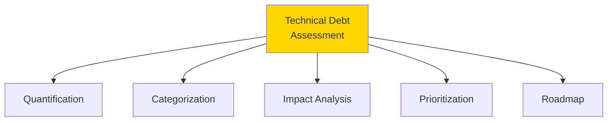

### Debt Quantification Framework

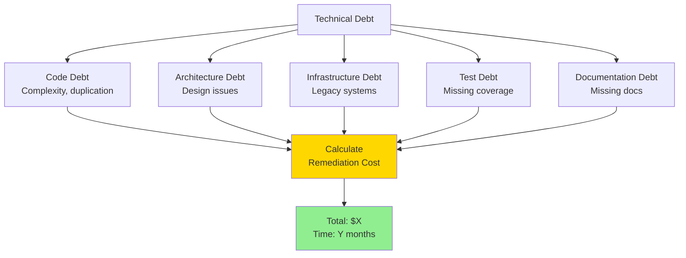

### Prioritization Matrix

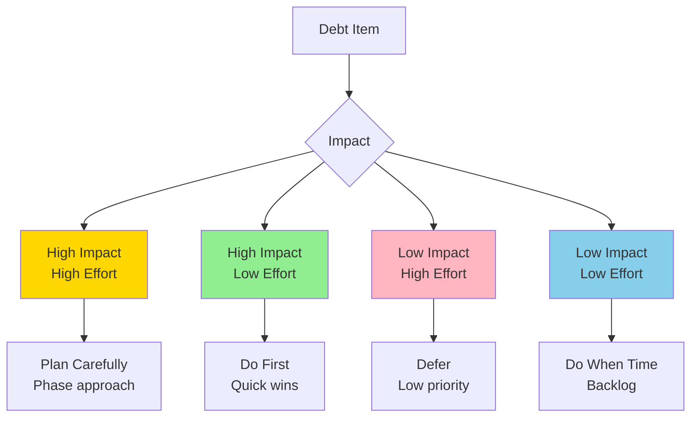

**Remediation Roadmap**:

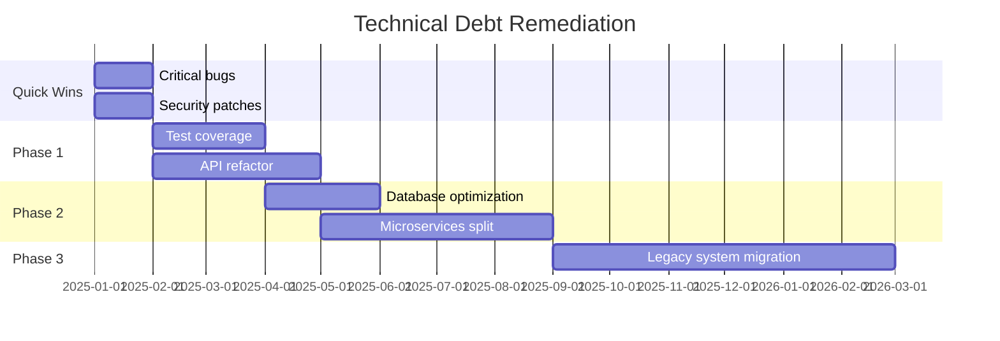

**Assessment Deliverables**:
- Debt inventory with cost estimates
- Risk assessment for each item
- Prioritized remediation plan
- Resource requirements
- Timeline and milestones

---

## Q2: How do you evaluate the technology stack for future-proofing?

**Answer**:

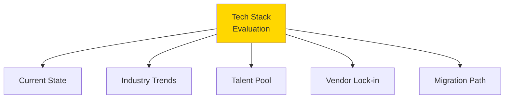

### Technology Lifecycle Assessment

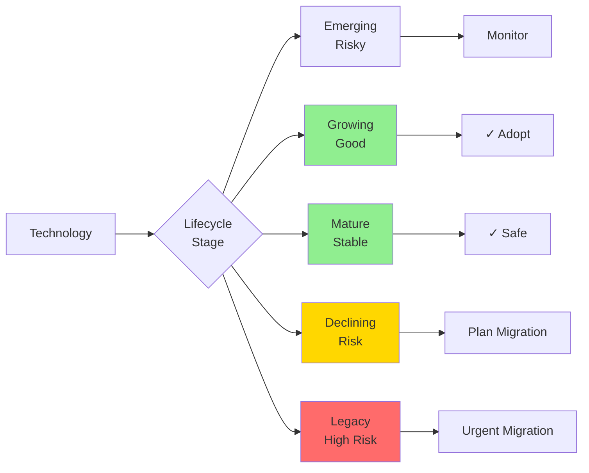

### Stack Assessment Framework

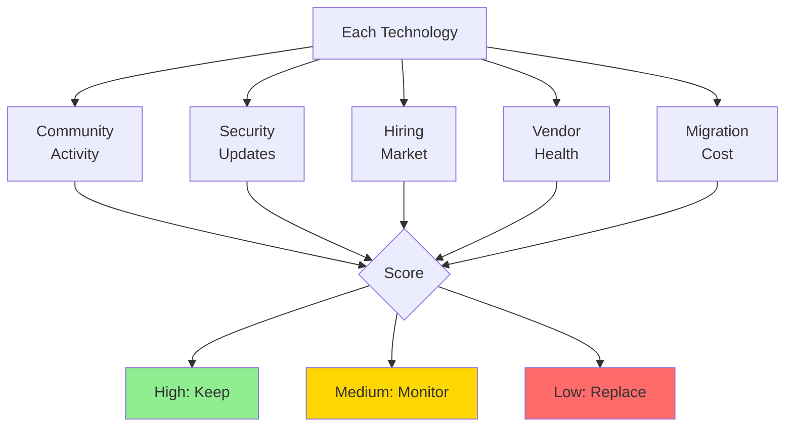

**Red Flags**:
- Technologies with declining community
- Unsupported versions in use
- Vendor going out of business
- Difficult to hire for
- No clear upgrade path

**Assessment Questions**:
- When were dependencies last updated?
- Are there known vulnerabilities?
- What's the vendor roadmap?
- How hard to migrate away?
- What's the talent availability?

---

## Q3: How do you assess organizational technical capabilities?

**Answer**:

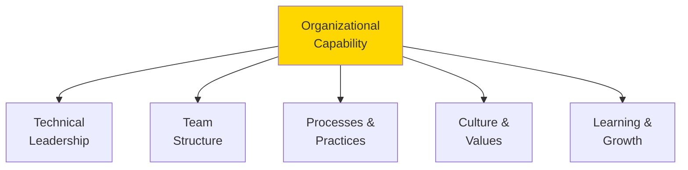

### Technical Leadership Assessment

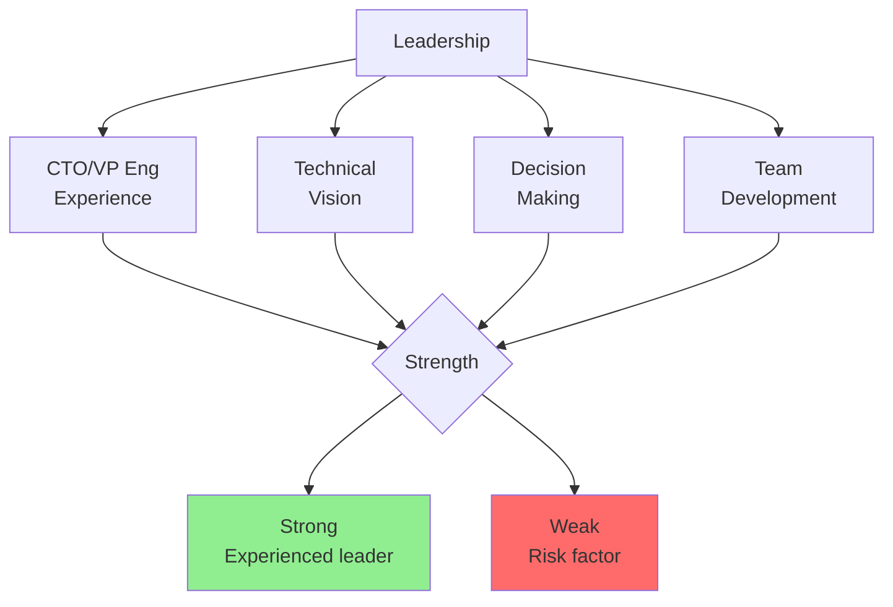

### Team Capability Matrix

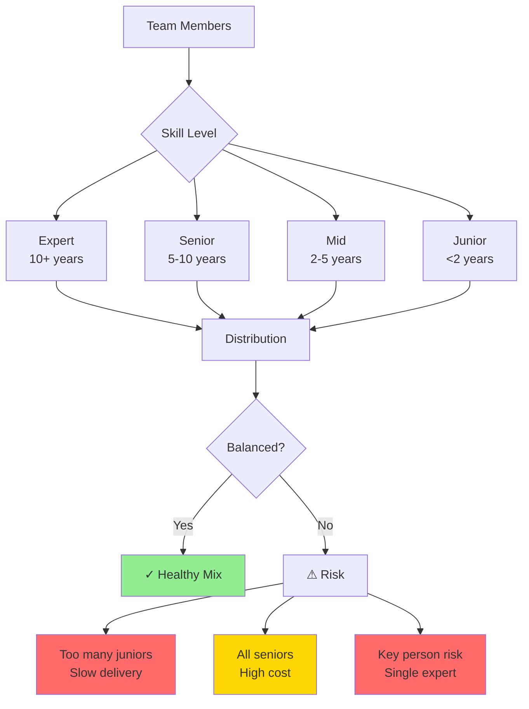

### Process Maturity Model

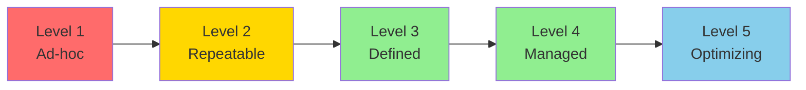

**Assessment Indicators**:
- **Level 1**: No process, heroics
- **Level 2**: Some repeatability, inconsistent
- **Level 3**: Documented processes, followed
- **Level 4**: Measured, controlled
- **Level 5**: Continuous improvement

---

## Q4: How do you assess multi-region and global scalability?

**Answer**:

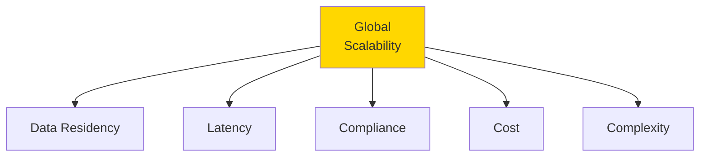

### Multi-Region Architecture

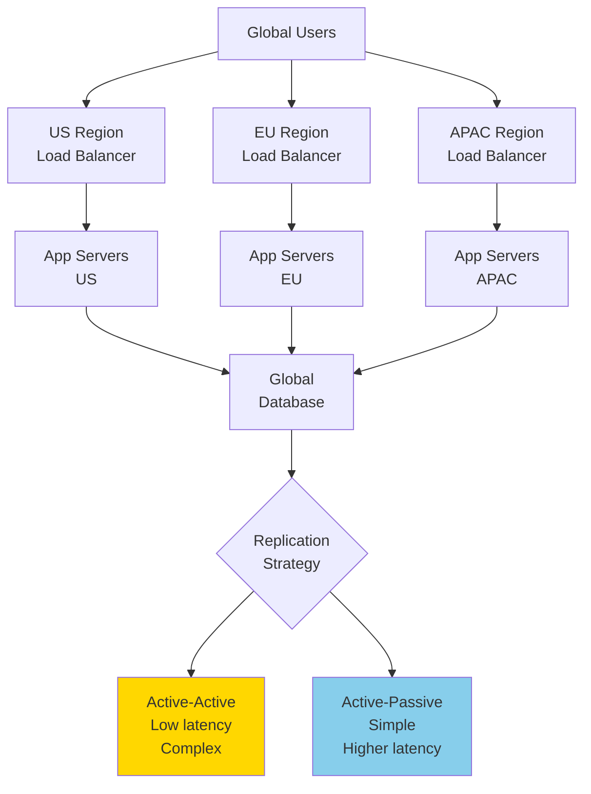

### Data Consistency Trade-offs

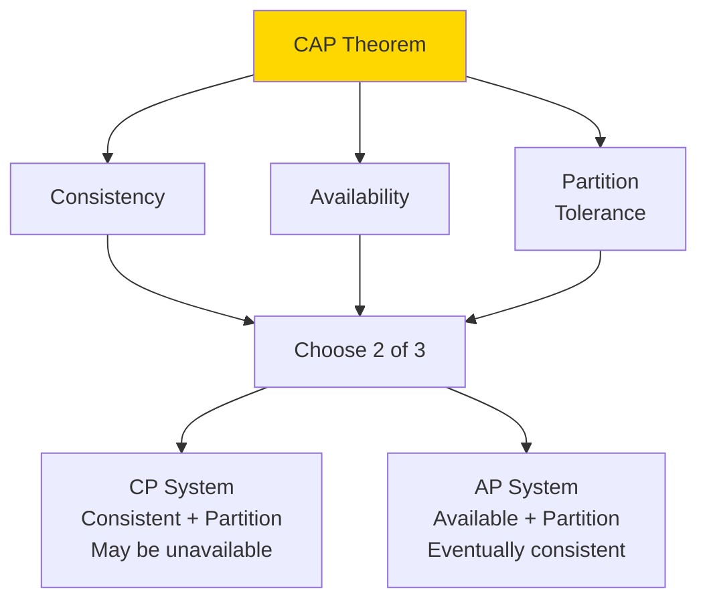

**Assessment Questions**:
- Where are users located?
- What are latency requirements?
- Data residency regulations?
- Consistency requirements?
- Failover strategy?
- Cost of multi-region?

**Complexity Factors**:
- Database replication conflicts
- Cross-region transactions
- Time zone handling
- Regulatory compliance (GDPR, etc.)
- Cost optimization

---

## Q5: How do you assess security posture and vulnerabilities?

**Answer**:

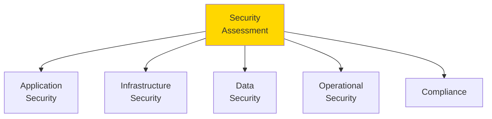

### Security Layers

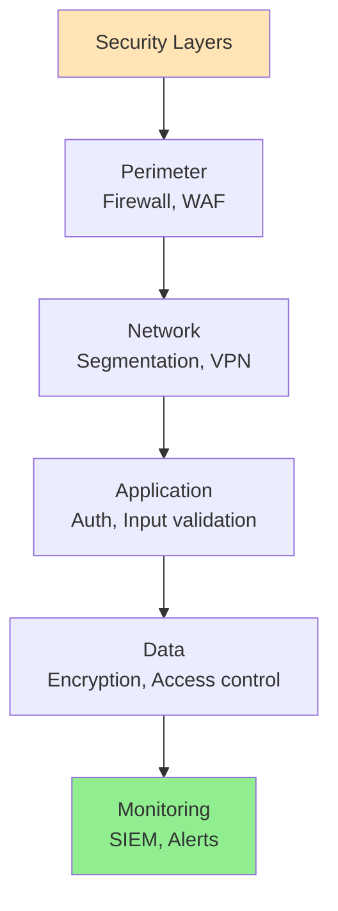

### Vulnerability Assessment

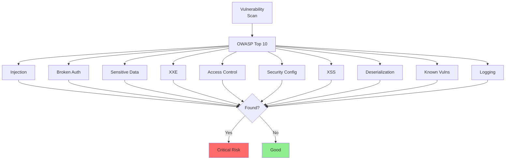

### Security Maturity

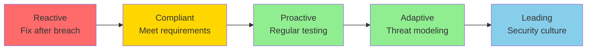

**Assessment Approach**:
1. **Automated Scanning**: SAST, DAST, dependency checks
2. **Manual Review**: Code review, architecture review
3. **Penetration Testing**: Simulated attacks
4. **Compliance Audit**: SOC2, ISO 27001, etc.
5. **Incident History**: Past breaches, response

**Red Flags**:
- No security team/champion
- Outdated dependencies with CVEs
- No security testing
- Secrets in code
- No incident response plan
- Failed compliance audits

---

## Q6: How do you evaluate technical innovation vs. stability trade-offs?

**Answer**:

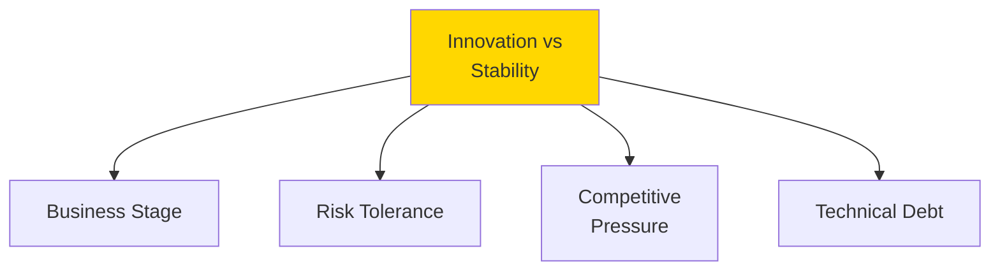

### Innovation Spectrum

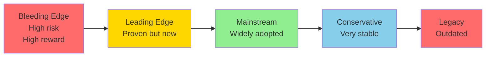

### Decision Framework

```mermaid
graph TB
    A[New Technology] --> B{Critical Path?}
    
    B -->|Yes| C{Proven?}
    B -->|No| D[Can Experiment]
    
    C -->|Yes| E[Consider]
    C -->|No| F[Too Risky]
    
    E --> G{Team<br/>Expertise?}
    
    G -->|Yes| H[Adopt]
    G -->|No| I[Train First]
    
    style H fill:#90EE90
    style F fill:#FF6B6B
    style D fill:#FFD700
```

**Assessment Questions**:
- What's the adoption strategy?
- Is there a fallback plan?
- What's the learning curve?
- How does it affect stability?
- What's the competitive advantage?

**Balanced Approach**:
- **Core systems**: Stable, proven tech
- **New features**: Controlled innovation
- **Internal tools**: Experiment freely
- **Infrastructure**: Gradual adoption

---

## Q7: How do you assess M&A technical integration complexity?

**Answer**:

```mermaid
graph TB
    A[Integration<br/>Assessment] --> B[System<br/>Compatibility]
    A --> C[Data<br/>Migration]
    A --> D[Team<br/>Integration]
    A --> E[Process<br/>Alignment]
    A --> F[Timeline &<br/>Cost]
    
    style A fill:#FFD700
```

### Integration Scenarios

```mermaid
graph TB
    A[Integration<br/>Strategy] --> B1[Full Integration<br/>Merge everything]
    A --> B2[Partial Integration<br/>Key systems only]
    A --> B3[Standalone<br/>Keep separate]
    
    B1 --> C1[High effort<br/>Long timeline<br/>Full synergy]
    B2 --> C2[Medium effort<br/>Medium timeline<br/>Partial synergy]
    B3 --> C3[Low effort<br/>Short timeline<br/>No synergy]
    
    style B1 fill:#FF6B6B
    style B2 fill:#FFD700
    style B3 fill:#90EE90
```

### Compatibility Matrix

```mermaid
graph TB
    A[System A] --> C{Compatibility}
    B[System B] --> C
    
    C --> D1[Same Stack<br/>Easy integration]
    C --> D2[Similar Stack<br/>Medium effort]
    C --> D3[Different Stack<br/>High effort]
    C --> D4[Incompatible<br/>Replace one]
    
    D1 --> E1[1-3 months]
    D2 --> E2[3-6 months]
    D3 --> E3[6-12 months]
    D4 --> E4[12+ months]
    
    style D1 fill:#90EE90
    style D2 fill:#FFD700
    style D3 fill:#FFD700
    style D4 fill:#FF6B6B
```

### Data Migration Complexity

```mermaid
sequenceDiagram
    participant S as Source System
    participant M as Migration Layer
    participant T as Target System
    participant V as Validation
    
    S->>M: Extract data
    M->>M: Transform schema
    M->>M: Clean data
    M->>T: Load data
    T->>V: Validate
    
    alt Validation Pass
        V->>V: Cutover
    else Validation Fail
        V->>M: Fix and retry
    end
```

**Assessment Deliverables**:
- Integration architecture plan
- Data migration strategy
- Risk assessment
- Resource requirements
- Timeline with milestones
- Cost estimate
- Rollback plan

---

## Q8: How do you assess AI/ML capabilities and maturity?

**Answer**:

```mermaid
graph TB
    A[AI/ML<br/>Assessment] --> B[Use Cases]
    A --> C[Data Quality]
    A --> D[Model Quality]
    A --> E[Infrastructure]
    A --> F[Team Expertise]
    
    style A fill:#FFD700
```

### ML Maturity Model

```mermaid
graph LR
    A[Level 0<br/>No ML] --> B[Level 1<br/>Ad-hoc ML]
    B --> C[Level 2<br/>Repeatable]
    C --> D[Level 3<br/>Reliable]
    D --> E[Level 4<br/>Scalable]
    
    style A fill:#FFB6C1
    style B fill:#FFD700
    style C fill:#FFD700
    style D fill:#90EE90
    style E fill:#87CEEB
```

**Maturity Levels**:
- **Level 0**: No ML, manual processes
- **Level 1**: Jupyter notebooks, manual training
- **Level 2**: Automated training, version control
- **Level 3**: CI/CD for models, monitoring
- **Level 4**: AutoML, self-healing, A/B testing

### ML Pipeline Assessment

```mermaid
graph TB
    A[Data Collection] --> B[Data Cleaning]
    B --> C[Feature Engineering]
    C --> D[Model Training]
    D --> E[Model Evaluation]
    E --> F[Model Deployment]
    F --> G[Monitoring]
    G --> H{Performance<br/>Degradation?}
    
    H -->|Yes| I[Retrain]
    H -->|No| J[Continue]
    
    I --> D
    
    style A fill:#FFE4B5
    style G fill:#FFD700
```

**Assessment Questions**:
- What ML use cases exist?
- How is training data managed?
- What's the model performance?
- How are models deployed?
- Is there model monitoring?
- What's the retraining process?
- Who maintains the models?

**Red Flags**:
- Models in production without monitoring
- No data versioning
- Manual deployment process
- No A/B testing
- Stale models (not retrained)
- Data quality issues
- No ML expertise on team

---

## Q9: How do you assess technical risk and create mitigation plans?

**Answer**:

```mermaid
graph TB
    A[Risk<br/>Assessment] --> B[Identify Risks]
    A --> C[Analyze Impact]
    A --> D[Prioritize]
    A --> E[Mitigate]
    A --> F[Monitor]
    
    style A fill:#FFD700
```

### Risk Categories

```mermaid
graph TB
    A[Technical Risks] --> B1[Technology<br/>Obsolescence]
    A --> B2[Scalability<br/>Limits]
    A --> B3[Security<br/>Vulnerabilities]
    A --> B4[Key Person<br/>Dependencies]
    A --> B5[Vendor<br/>Lock-in]
    A --> B6[Technical<br/>Debt]
    A --> B7[Integration<br/>Complexity]
    A --> B8[Compliance<br/>Gaps]
    
    style A fill:#FFD700
```

### Risk Matrix

```mermaid
graph TB
    A[Risk] --> B{Probability}
    
    B --> C1[High Prob<br/>High Impact]
    B --> C2[High Prob<br/>Low Impact]
    B --> C3[Low Prob<br/>High Impact]
    B --> C4[Low Prob<br/>Low Impact]
    
    C1 --> D1[Critical<br/>Immediate action]
    C2 --> D2[Monitor<br/>Quick fixes]
    C3 --> D3[Contingency<br/>Plan for it]
    C4 --> D4[Accept<br/>Low priority]
    
    style C1 fill:#FF6B6B
    style C2 fill:#FFD700
    style C3 fill:#FFD700
    style C4 fill:#90EE90
```

### Mitigation Strategies

```mermaid
graph TB
    A[Risk] --> B{Mitigation<br/>Strategy}
    
    B --> C1[Avoid<br/>Don't do it]
    B --> C2[Reduce<br/>Lower probability]
    B --> C3[Transfer<br/>Insurance, vendor]
    B --> C4[Accept<br/>Live with it]
    
    C1 --> D[Document<br/>Decision]
    C2 --> D
    C3 --> D
    C4 --> D
    
    style B fill:#FFD700
    style D fill:#90EE90
```

**Risk Register Template**:
- Risk ID & Description
- Category
- Probability (1-5)
- Impact (1-5)
- Risk Score (P × I)
- Mitigation Strategy
- Owner
- Status
- Review Date

---

## Q10: How do you create a comprehensive technical due diligence report?

**Answer**:

```mermaid
graph TB
    A[DD Report] --> B[Executive<br/>Summary]
    A --> C[Detailed<br/>Findings]
    A --> D[Risk<br/>Assessment]
    A --> E[Recommendations]
    A --> F[Appendices]
    
    style A fill:#FFD700
```

### Report Structure

```mermaid
graph TB
    A[Executive Summary] --> B[1-2 pages<br/>Key findings<br/>Overall assessment]
    
    C[Technical Overview] --> D[Architecture<br/>Stack<br/>Infrastructure]
    
    E[Assessment Areas] --> F[Product<br/>Team<br/>Processes<br/>Security]
    
    G[Risk Analysis] --> H[Critical risks<br/>Medium risks<br/>Low risks]
    
    I[Recommendations] --> J[Immediate actions<br/>Short-term<br/>Long-term]
    
    K[Appendices] --> L[Detailed data<br/>Code samples<br/>Metrics]
    
    style A fill:#FFE4B5
    style G fill:#FFD700
    style I fill:#90EE90
```

### Scoring Framework

```mermaid
graph TB
    A[Overall Score] --> B1[Technology: 7/10]
    A --> B2[Team: 8/10]
    A --> B3[Processes: 6/10]
    A --> B4[Security: 5/10]
    A --> B5[Scalability: 7/10]
    
    B1 --> C[Weighted<br/>Average]
    B2 --> C
    B3 --> C
    B4 --> C
    B5 --> C
    
    C --> D{Final Score}
    
    D --> E1[8-10: Excellent]
    D --> E2[6-7: Good]
    D --> E3[4-5: Fair]
    D --> E4[<4: Poor]
    
    style E1 fill:#90EE90
    style E2 fill:#90EE90
    style E3 fill:#FFD700
    style E4 fill:#FF6B6B
```

### Recommendation Framework

```mermaid
graph TB
    A[Recommendations] --> B[Deal Breakers<br/>Walk away]
    A --> C[Critical<br/>Fix before close]
    A --> D[High Priority<br/>Fix in 90 days]
    A --> E[Medium Priority<br/>Fix in 6 months]
    A --> F[Low Priority<br/>Backlog]
    
    B --> G[Impact on<br/>Valuation]
    C --> G
    D --> G
    
    style B fill:#FF6B6B
    style C fill:#FFD700
    style G fill:#90EE90
```

**Report Deliverables**:
- Executive summary (2 pages)
- Detailed report (20-50 pages)
- Risk register
- Remediation roadmap
- Cost estimates
- Presentation deck
- Raw data appendix

---

## Summary

Hard tech due diligence topics:
- **Technical Debt**: Quantification, prioritization, roadmap
- **Future-Proofing**: Technology lifecycle, migration paths
- **Organizational Capability**: Leadership, team, processes
- **Global Scalability**: Multi-region, data consistency
- **Security Posture**: Comprehensive assessment, maturity
- **Innovation vs Stability**: Risk management, balance
- **M&A Integration**: Compatibility, migration, complexity
- **AI/ML Maturity**: Pipeline, monitoring, expertise
- **Risk Management**: Identification, prioritization, mitigation
- **DD Report**: Structure, scoring, recommendations

These advanced assessments enable strategic decision-making for investments and acquisitions.

