Medium-level technical due diligence interview questions covering deeper assessment methodologies.

## Q1: How do you conduct a comprehensive architecture review?

**Answer**:

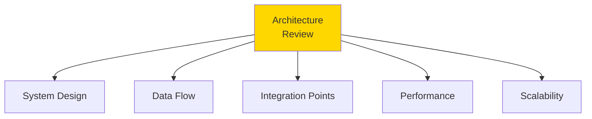

### Multi-Layer Assessment

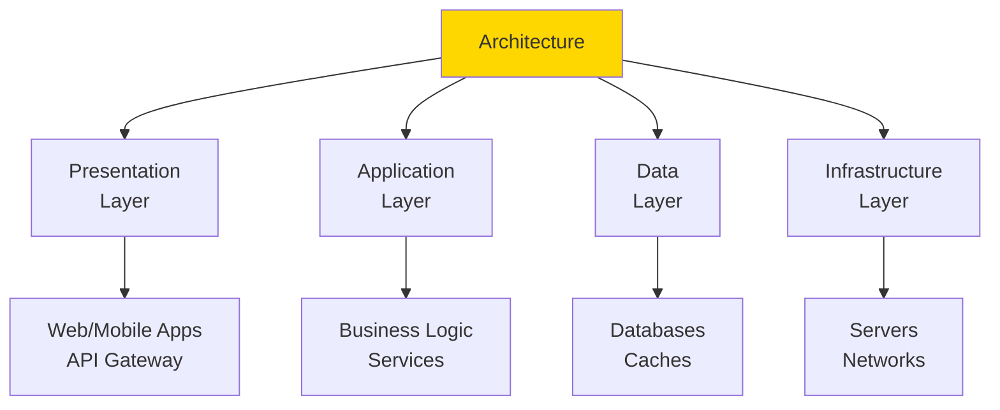

**Key Questions**:
- Is the architecture documented?
- Are concerns properly separated?
- How are services communicating?
- What are the failure points?
- How does data flow through the system?

### Architecture Patterns Assessment

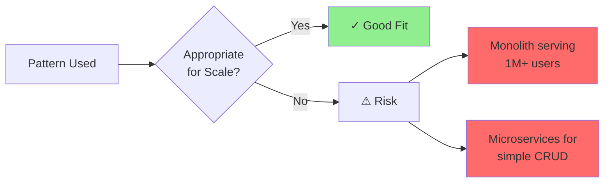

---

## Q2: How do you assess data architecture and management?

**Answer**:

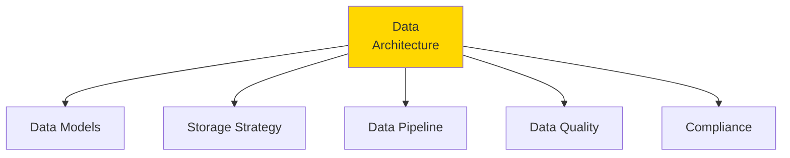

### Data Flow Analysis

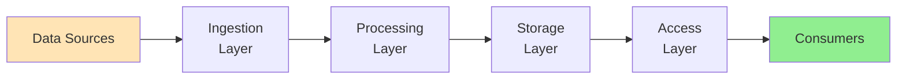

**Assessment Areas**:

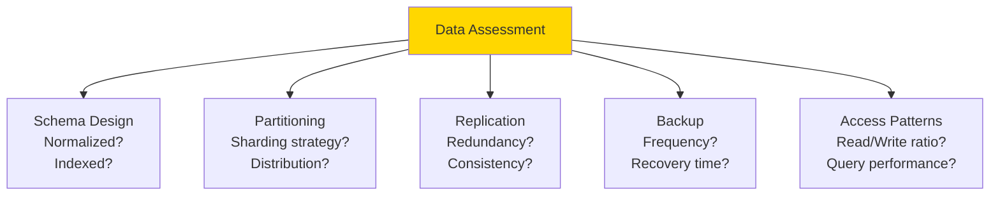

**Red Flags**:
- No data governance
- Inconsistent schemas
- No backup strategy
- PII not encrypted
- No data retention policy

---

## Q3: How do you evaluate API design and integration quality?

**Answer**:

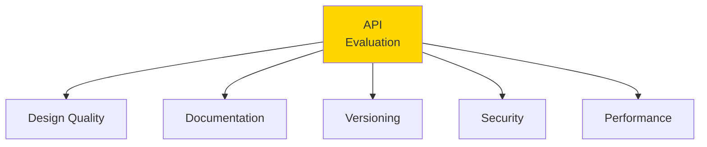

### API Design Assessment

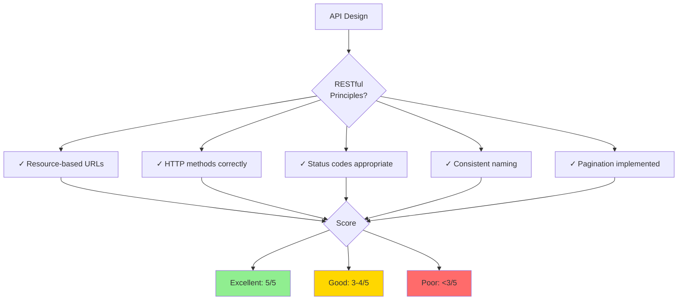

### Integration Complexity

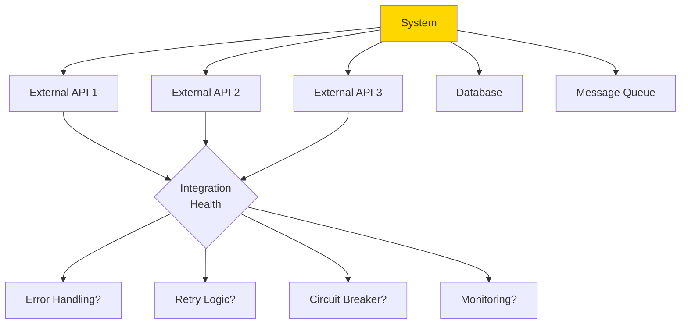

**Questions**:
- How many external dependencies?
- What happens if one fails?
- Are there rate limits?
- How is authentication handled?
- What's the API versioning strategy?

---

## Q4: How do you assess testing strategy and quality assurance?

**Answer**:

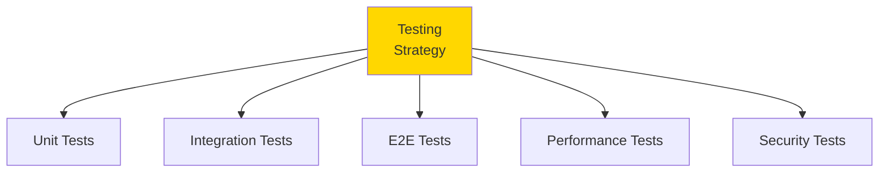

### Test Pyramid Assessment

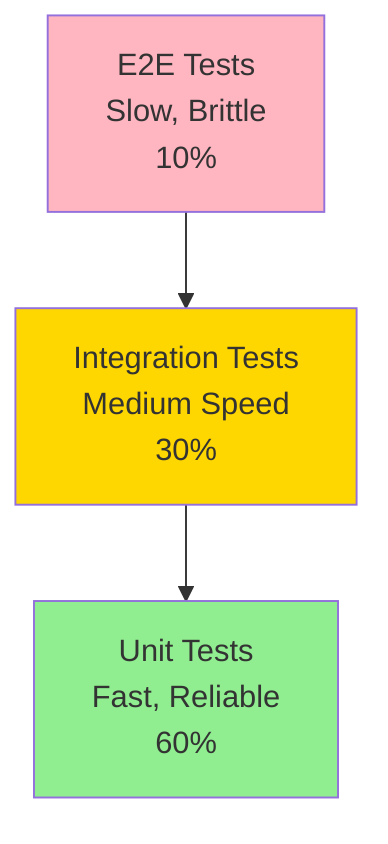

**Ideal distribution**: Many unit tests, fewer integration, minimal E2E

### Coverage Analysis

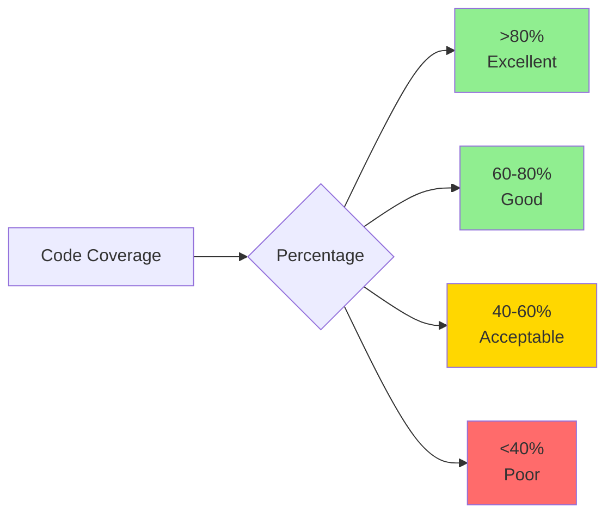

**But**: Coverage % alone insufficient - check test quality!

**Assessment Questions**:
- What's the test coverage?
- How long do tests take to run?
- Are tests run in CI/CD?
- When was last test suite review?
- Are critical paths tested?

---

## Q5: How do you evaluate deployment and release processes?

**Answer**:

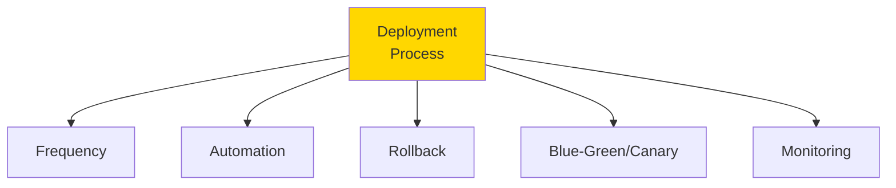

### Deployment Maturity Model

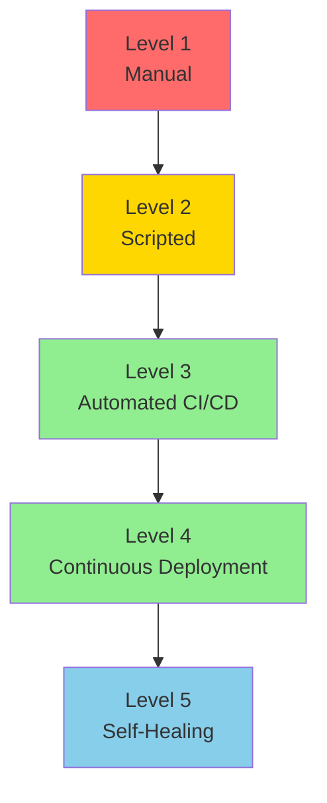

### Release Strategy

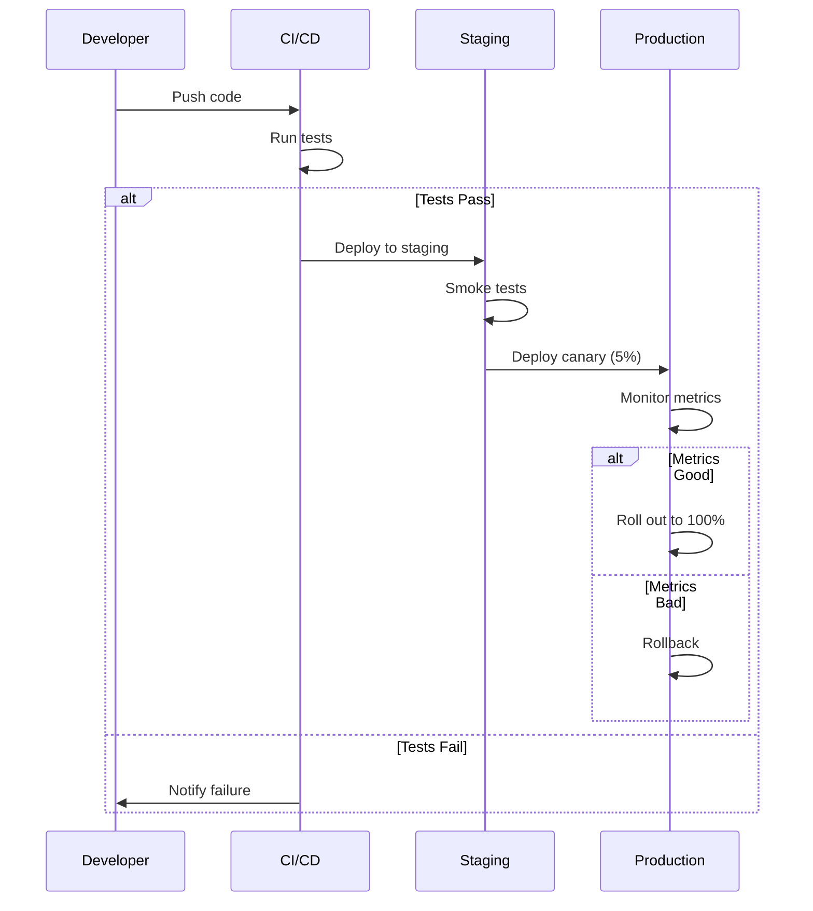

**Key Metrics**:
- Deployment frequency (daily? weekly?)
- Lead time (commit to production)
- Mean time to recovery (MTTR)
- Change failure rate

---

## Q6: How do you assess observability and monitoring?

**Answer**:

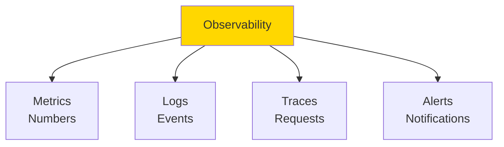

### Three Pillars Assessment

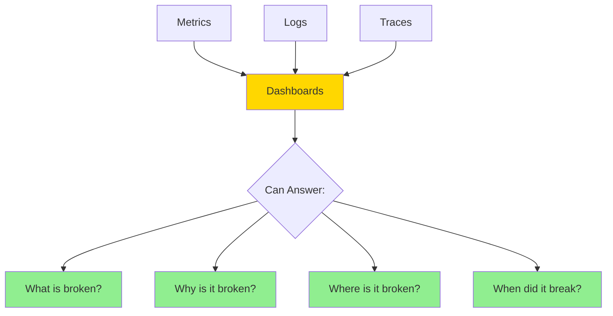

**Assessment Questions**:
- What monitoring tools are used?
- What metrics are tracked?
- Are logs centralized?
- Is distributed tracing implemented?
- What's the alerting strategy?
- How long to detect issues?

### Alert Quality

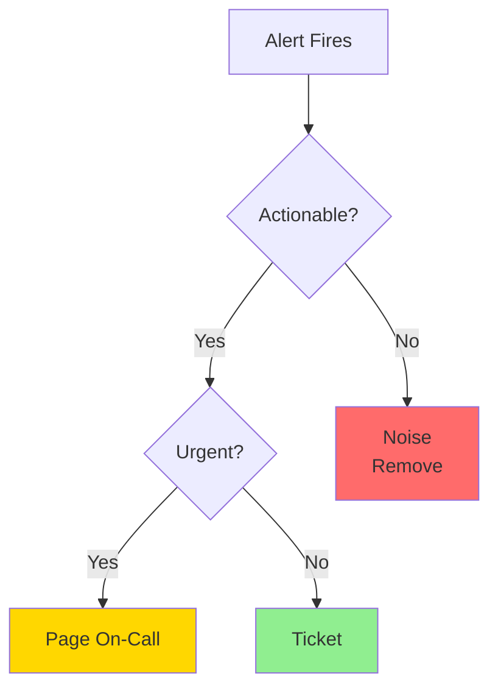

**Red Flags**:
- Alert fatigue (too many alerts)
- No runbooks
- Alerts without context
- No SLOs/SLIs defined

---

## Q7: How do you evaluate intellectual property and licensing?

**Answer**:

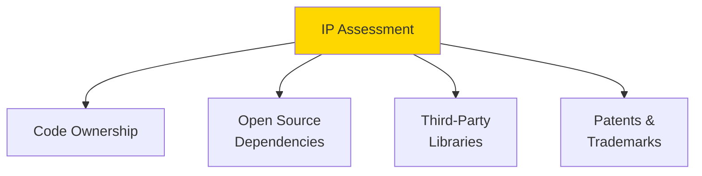

### License Risk Assessment

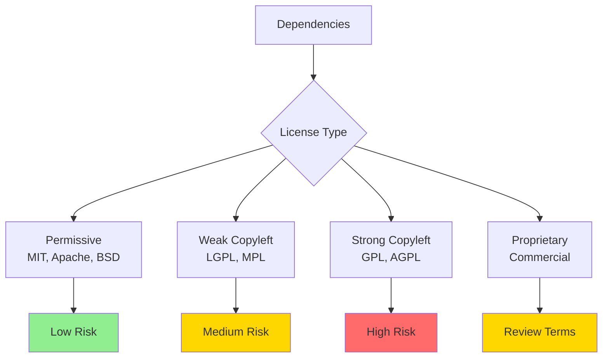

**Key Questions**:
- Are all dependencies documented?
- Any GPL/AGPL dependencies?
- Are licenses compatible?
- Is there a license compliance process?
- Who owns the code? (employees? contractors?)
- Are IP assignments signed?

### Dependency Audit

```mermaid
sequenceDiagram
    participant S as Scan Codebase
    participant I as Identify Dependencies
    participant L as Check Licenses
    participant R as Risk Assessment
    
    S->>I: Extract all dependencies
    I->>L: For each dependency
    L->>L: Identify license
    L->>R: Assess compatibility
    
    alt High Risk Found
        R->>R: Flag for review
        R->>R: Plan remediation
    else Low Risk
        R->>R: Document and approve
    end
```

---

## Q8: How do you assess technical scalability limits?

**Answer**:

```mermaid
graph TB
    A[Scalability<br/>Assessment] --> B[Current Capacity]
    A --> C[Bottlenecks]
    A --> D[Growth Projections]
    A --> E[Cost Scaling]
    
    style A fill:#FFD700
```

### Capacity Planning

```mermaid
graph LR
    A[Current:<br/>10K users<br/>100 RPS] --> B[6 months:<br/>50K users<br/>500 RPS]
    B --> C[12 months:<br/>200K users<br/>2K RPS]
    C --> D{Can System<br/>Handle?}
    
    D -->|Yes| E[Scalable]
    D -->|No| F[Identify<br/>Constraints]
    
    style E fill:#90EE90
    style F fill:#FFD700
```

### Bottleneck Identification

```mermaid
graph TB
    A[System] --> B1[Database<br/>Queries]
    A --> B2[API<br/>Response Time]
    A --> B3[Memory<br/>Usage]
    A --> B4[CPU<br/>Usage]
    A --> B5[Network<br/>Bandwidth]
    
    B1 --> C{Load Test}
    B2 --> C
    B3 --> C
    B4 --> C
    B5 --> C
    
    C --> D[Identify<br/>Bottleneck]
    
    style D fill:#FFD700
```

**Assessment Approach**:
1. Profile current performance
2. Identify bottlenecks
3. Project growth
4. Calculate when limits hit
5. Estimate cost to scale

**Red Flags**:
- Already at capacity
- No horizontal scaling path
- Database can't shard
- Monolithic architecture at scale
- Exponential cost growth

---

## Q9: How do you evaluate disaster recovery and business continuity?

**Answer**:

```mermaid
graph TB
    A[DR/BC<br/>Assessment] --> B[Backup Strategy]
    A --> C[Recovery Plan]
    A --> D[Redundancy]
    A --> E[Testing]
    
    style A fill:#FFD700
```

### Key Metrics

```mermaid
graph TB
    A[DR Metrics] --> B[RPO<br/>Recovery Point<br/>Objective]
    A --> C[RTO<br/>Recovery Time<br/>Objective]
    
    B --> D[Max data loss<br/>acceptable]
    C --> E[Max downtime<br/>acceptable]
    
    D --> F{Current<br/>vs Target}
    E --> F
    
    F -->|Match| G[✓ Adequate]
    F -->|Gap| H[⚠ Risk]
    
    style G fill:#90EE90
    style H fill:#FF6B6B
```

### Disaster Scenarios

```mermaid
graph TB
    A[Disaster<br/>Scenarios] --> B1[Data Center<br/>Failure]
    A --> B2[Database<br/>Corruption]
    A --> B3[Ransomware<br/>Attack]
    A --> B4[Key Person<br/>Loss]
    A --> B5[DDoS<br/>Attack]
    
    B1 --> C{Plan<br/>Exists?}
    B2 --> C
    B3 --> C
    B4 --> C
    B5 --> C
    
    C -->|Yes| D[✓ Prepared]
    C -->|No| E[⚠ Vulnerable]
    
    style D fill:#90EE90
    style E fill:#FF6B6B
```

**Assessment Questions**:
- What's the backup frequency?
- Where are backups stored?
- How long to restore?
- When was last DR test?
- Is there geographic redundancy?
- What's the failover process?

---

## Q10: How do you assess technical team processes and culture?

**Answer**:

```mermaid
graph TB
    A[Team<br/>Processes] --> B[Development<br/>Workflow]
    A --> C[Code Review<br/>Process]
    A --> D[Knowledge<br/>Sharing]
    A --> E[Incident<br/>Management]
    
    style A fill:#FFD700
```

### Development Workflow Maturity

```mermaid
graph TB
    A[Feature Request] --> B[Design Review]
    B --> C[Implementation]
    C --> D[Code Review]
    D --> E[Testing]
    E --> F[Deployment]
    F --> G[Monitoring]
    
    G --> H{Issues?}
    H -->|Yes| I[Incident Response]
    H -->|No| J[Success]
    
    I --> K[Post-Mortem]
    K --> L[Improvements]
    
    style A fill:#FFE4B5
    style J fill:#90EE90
```

### Code Review Quality

```mermaid
graph LR
    A[PR Submitted] --> B{Review<br/>Process}
    
    B --> C1[✓ Timely<br/><24hrs]
    B --> C2[✓ Thorough<br/>Multiple reviewers]
    B --> C3[✓ Constructive<br/>Feedback]
    B --> C4[✓ Standards<br/>Enforced]
    
    C1 --> D{Quality<br/>Score}
    C2 --> D
    C3 --> D
    C4 --> D
    
    D --> E[High/Medium/Low]
    
    style E fill:#90EE90
```

**Assessment Areas**:
- Sprint planning effectiveness
- Estimation accuracy
- Velocity trends
- Bug escape rate
- Time to resolution
- Knowledge silos
- Documentation culture
- On-call rotation

**Red Flags**:
- No code review
- Cowboy coding
- Knowledge in one person
- No post-mortems
- Blame culture
- No process documentation

---

## Summary

Medium tech due diligence topics:
- **Architecture Review**: Multi-layer assessment, patterns
- **Data Architecture**: Models, pipelines, quality
- **API Quality**: Design, documentation, integrations
- **Testing Strategy**: Pyramid, coverage, automation
- **Deployment**: Maturity model, release strategy
- **Observability**: Metrics, logs, traces, alerts
- **IP & Licensing**: Ownership, dependencies, compliance
- **Scalability Limits**: Capacity planning, bottlenecks
- **Disaster Recovery**: RPO/RTO, redundancy, testing
- **Team Processes**: Workflow, reviews, culture

These deeper assessments reveal technical maturity and risks.

