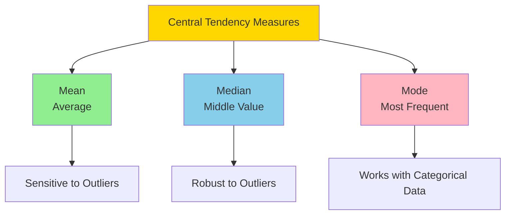
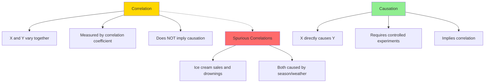
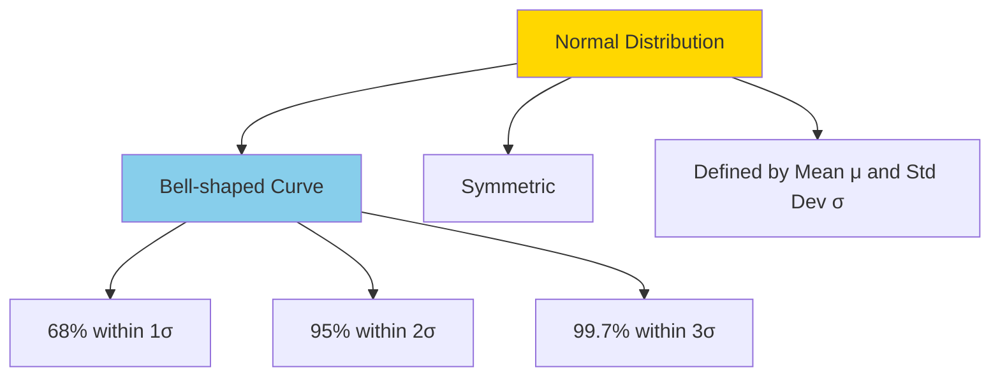
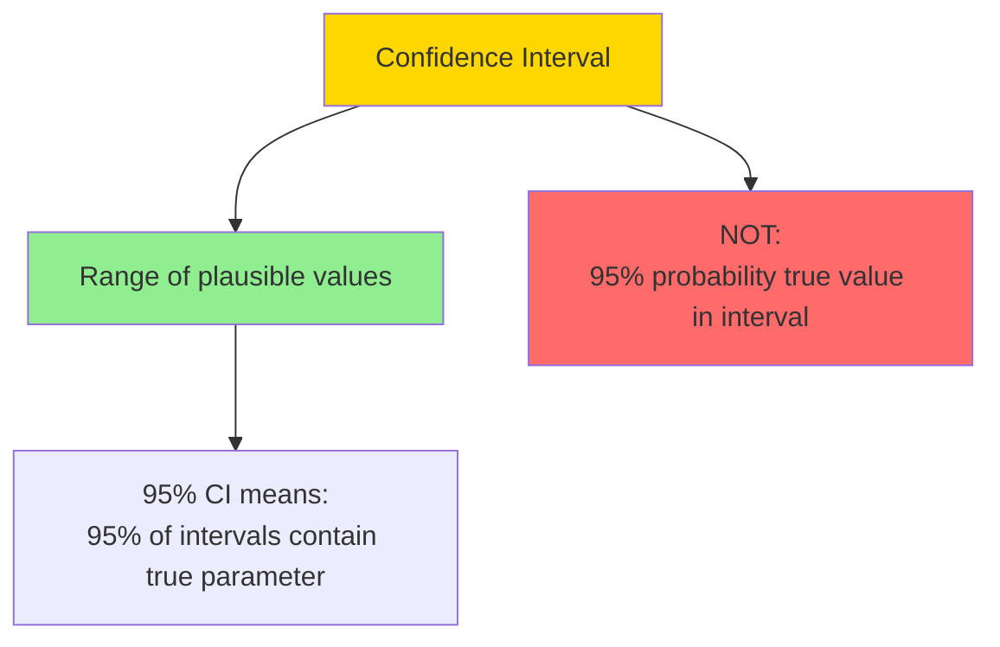
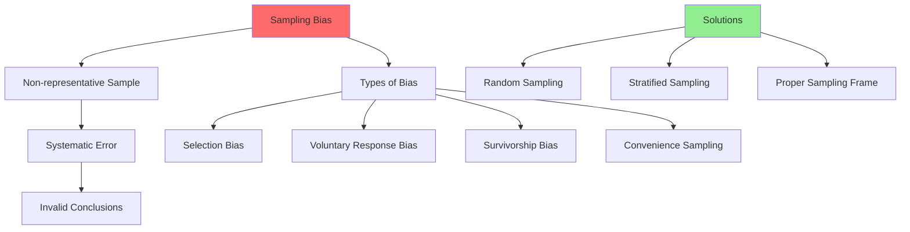

Easy-level statistics interview questions covering fundamental concepts, descriptive statistics, and basic probability.

## Q1: Explain the difference between mean, median, and mode.

**Answer**:



### Definitions

- **Mean** ($\bar{x} = \frac{1}{n}\sum_{i=1}^{n} x_i$): Arithmetic average of all values
- **Median**: Middle value when data is sorted (50th percentile)
- **Mode**: Most frequently occurring value(s)

### When to Use Each

- **Mean**: When data is normally distributed, no extreme outliers
- **Median**: When data has outliers, skewed distributions
- **Mode**: Categorical data, finding most common category

### Python Example

```python
import numpy as np
from scipy import stats

# Sample data
data = [10, 20, 20, 30, 40, 50, 60, 70, 1000]  # 1000 is an outlier

# Mean (sensitive to outliers)
mean = np.mean(data)
print(f"Mean: {mean:.2f}")  # 144.44 - heavily influenced by 1000

# Median (robust to outliers)
median = np.median(data)
print(f"Median: {median:.2f}")  # 40.0 - not affected by outlier

# Mode
mode = stats.mode(data, keepdims=True)
print(f"Mode: {mode.mode[0]}")  # 20 - most frequent value

# For skewed data, median is preferred
skewed_data = [1, 2, 3, 4, 5, 6, 7, 8, 9, 100]
print(f"Skewed data - Mean: {np.mean(skewed_data):.2f}, Median: {np.median(skewed_data):.2f}")
```

**Thinking Process**: Mean is most intuitive but sensitive to outliers. Median is better for skewed data. Mode is useful for categorical or discrete data.

---

## Q2: What is variance and standard deviation? How do you calculate them?

**Answer**:

```mermaid
graph LR
    A[Variance] --> B[Average Squared<br/>Deviations]
    B --> C[Standard Deviation<br/>Square Root of Variance]
    
    A --> A1[$\sigma^2 = \frac{1}{n}\sum(x_i - \mu)^2$]
    C --> C1[$\sigma = \sqrt{\sigma^2}$]
    
    style A fill:#FFD700
    style C fill:#87CEEB
```

### Definitions

**Variance** ($\sigma^2$): Average squared deviation from the mean
- Measures spread/dispersion of data
- Units are squared (hard to interpret)

**Standard Deviation** ($\sigma$): Square root of variance
- Same units as original data
- More interpretable measure of spread

### Formulas

- **Population Variance**: $\sigma^2 = \frac{1}{N}\sum_{i=1}^{N}(x_i - \mu)^2$
- **Sample Variance**: $s^2 = \frac{1}{n-1}\sum_{i=1}^{n}(x_i - \bar{x})^2$ (Bessel's correction)
- **Standard Deviation**: $\sigma = \sqrt{\sigma^2}$ or $s = \sqrt{s^2}$

### Python Example

```python
import numpy as np

data = [10, 20, 30, 40, 50]

# Calculate mean
mean = np.mean(data)
print(f"Mean: {mean}")

# Variance (using n-1 for sample, ddof=1)
variance = np.var(data, ddof=1)  # Sample variance
variance_pop = np.var(data, ddof=0)  # Population variance
print(f"Sample variance: {variance:.2f}")
print(f"Population variance: {variance_pop:.2f}")

# Standard deviation
std_dev = np.std(data, ddof=1)  # Sample std dev
print(f"Standard deviation: {std_dev:.2f}")

# Manual calculation
deviations = [(x - mean) ** 2 for x in data]
manual_variance = sum(deviations) / (len(data) - 1)
manual_std = np.sqrt(manual_variance)
print(f"Manual calculation - Variance: {manual_variance:.2f}, Std Dev: {manual_std:.2f}")

# Interpretation
print(f"\nData points within 1 std dev: {mean - std_dev:.2f} to {mean + std_dev:.2f}")
```

**Thinking Process**: Variance squares deviations to avoid cancellation, but units are squared. Standard deviation fixes units and is more interpretable. Use $n-1$ for samples (Bessel's correction) to get unbiased estimate.

---

## Q3: What is the difference between correlation and causation?

**Answer**:



### Key Differences

**Correlation**:
- Measures association between two variables
- Range: -1 to +1
- Does NOT imply one causes the other
- Can be spurious (third variable)

**Causation**:
- One variable directly causes change in another
- Requires controlled experiments
- Correlation is necessary but not sufficient

### Common Fallacies

1. **Post hoc ergo propter hoc**: Assuming correlation implies causation
2. **Spurious correlation**: Third variable explains both
3. **Reverse causation**: Y causes X, not X causes Y

### Python Example

```python
import numpy as np
import matplotlib.pyplot as plt

# Spurious correlation example
np.random.seed(42)
days = np.arange(1, 101)
temperature = 20 + 10 * np.sin(days * 2 * np.pi / 365) + np.random.normal(0, 2, 100)
ice_cream_sales = 100 + 50 * (temperature - 20) / 10 + np.random.normal(0, 10, 100)
drowning_deaths = 5 + 0.3 * (temperature - 20) + np.random.normal(0, 1, 100)

# Calculate correlation
correlation = np.corrcoef(ice_cream_sales, drowning_deaths)[0, 1]
print(f"Correlation between ice cream sales and drowning: {correlation:.3f}")
print("This is spurious - both are caused by temperature (season)")

# True correlation with temperature
corr_temp_ice = np.corrcoef(temperature, ice_cream_sales)[0, 1]
corr_temp_drown = np.corrcoef(temperature, drowning_deaths)[0, 1]
print(f"Temperature vs Ice cream: {corr_temp_ice:.3f}")
print(f"Temperature vs Drownings: {corr_temp_drown:.3f}")

# To establish causation, need controlled experiment
print("\nTo prove causation:")
print("1. Controlled experiment with randomization")
print("2. Control for confounding variables")
print("3. Temporal precedence (cause before effect)")
print("4. Dose-response relationship")
```

**Thinking Process**: Correlation is easy to measure but causation requires careful experimental design. Always consider confounding variables and alternative explanations.

---

## Q4: Explain the normal distribution and its properties.

**Answer**:



### Properties

1. **Symmetry**: Mean = Median = Mode
2. **68-95-99.7 Rule**: Empirical rule for standard deviations
3. **Infinite support**: Extends from -∞ to +∞
4. **Defined by two parameters**: Mean (μ) and standard deviation (σ)

### Probability Density Function

$$f(x) = \frac{1}{\sigma\sqrt{2\pi}} e^{-\frac{1}{2}(\frac{x-\mu}{\sigma})^2}$$

### Python Example

```python
import numpy as np
import matplotlib.pyplot as plt
from scipy import stats

# Generate normal distribution
mu, sigma = 100, 15  # Mean and standard deviation
data = np.random.normal(mu, sigma, 10000)

# Calculate properties
mean = np.mean(data)
median = np.median(data)
std_dev = np.std(data)

print(f"Mean: {mean:.2f}")
print(f"Median: {median:.2f}")
print(f"Standard Deviation: {std_dev:.2f}")
print(f"Mean ≈ Median (symmetric): {abs(mean - median) < 0.1}")

# 68-95-99.7 rule verification
within_1sigma = np.sum(np.abs(data - mean) < std_dev) / len(data)
within_2sigma = np.sum(np.abs(data - mean) < 2*std_dev) / len(data)
within_3sigma = np.sum(np.abs(data - mean) < 3*std_dev) / len(data)

print(f"\n68-95-99.7 Rule:")
print(f"Within 1σ: {within_1sigma*100:.1f}% (expected 68%)")
print(f"Within 2σ: {within_2sigma*100:.1f}% (expected 95%)")
print(f"Within 3σ: {within_3sigma*100:.1f}% (expected 99.7%)")

# Calculate probabilities using scipy
prob_less_than_85 = stats.norm.cdf(85, loc=mu, scale=sigma)
prob_between_85_115 = stats.norm.cdf(115, loc=mu, scale=sigma) - stats.norm.cdf(85, loc=mu, scale=sigma)
print(f"\nP(X < 85) = {prob_less_than_85:.3f}")
print(f"P(85 < X < 115) = {prob_between_85_115:.3f}")

# Z-score calculation
z_score = (85 - mu) / sigma
print(f"Z-score for 85: {z_score:.2f}")
```

**Thinking Process**: Normal distribution is fundamental in statistics due to Central Limit Theorem. Many statistical tests assume normality. Always verify assumptions before applying tests.

---

## Q5: What is a confidence interval? How do you interpret it?

**Answer**:



### Definition

A **confidence interval** is a range of values that likely contains the true population parameter, based on sample data.

### Common Misinterpretation

❌ **Wrong**: "There's a 95% probability the true mean is in this interval"
✅ **Correct**: "95% of such intervals (if we repeated the study) would contain the true mean"

### Calculation

For a mean with known population standard deviation:
$$\bar{x} \pm z_{\alpha/2} \frac{\sigma}{\sqrt{n}}$$

For a mean with unknown population standard deviation (t-distribution):
$$\bar{x} \pm t_{\alpha/2, n-1} \frac{s}{\sqrt{n}}$$

### Python Example

```python
import numpy as np
from scipy import stats

# Sample data
np.random.seed(42)
sample = np.random.normal(100, 15, 30)  # Sample size 30
sample_mean = np.mean(sample)
sample_std = np.std(sample, ddof=1)
n = len(sample)

# 95% Confidence interval using t-distribution (unknown population std)
confidence_level = 0.95
alpha = 1 - confidence_level
t_critical = stats.t.ppf(1 - alpha/2, df=n-1)
margin_error = t_critical * (sample_std / np.sqrt(n))

ci_lower = sample_mean - margin_error
ci_upper = sample_mean + margin_error

print(f"Sample mean: {sample_mean:.2f}")
print(f"Sample std: {sample_std:.2f}")
print(f"95% Confidence Interval: [{ci_lower:.2f}, {ci_upper:.2f}]")
print(f"Margin of error: ±{margin_error:.2f}")

# Interpretation
print(f"\nInterpretation:")
print(f"We are 95% confident that the true population mean")
print(f"lies between {ci_lower:.2f} and {ci_upper:.2f}")

# Using scipy directly
ci = stats.t.interval(confidence_level, df=n-1, loc=sample_mean, scale=stats.sem(sample))
print(f"\nUsing scipy: [{ci[0]:.2f}, {ci[1]:.2f}]")

# Effect of sample size on CI width
for n_size in [10, 30, 100]:
    t_crit = stats.t.ppf(0.975, df=n_size-1)
    margin = t_crit * 15 / np.sqrt(n_size)
    print(f"n={n_size}: CI width = {2*margin:.2f}")
```

**Thinking Process**: Confidence intervals provide uncertainty estimates. Wider intervals indicate more uncertainty. Sample size, variability, and confidence level all affect interval width. Remember it's about the method, not a single interval.

---

## Q6: Explain probability vs conditional probability.

**Answer**:

```mermaid
graph TB
    A[Probability P A] --> A1[Unconditional<br/>No prior information]
    
    B[Conditional Probability P A|B] --> B1[Given that B occurred]
    B --> B2[Updates our belief]
    
    B --> C[Bayes Rule:<br/>P A|B = P B|A * P A / P B]
    
    style A fill:#FFD700
    style B fill:#87CEEB
    style C fill:#90EE90
```

### Definitions

- **Probability** $P(A)$: Chance of event A occurring (unconditional)
- **Conditional Probability** $P(A|B)$: Probability of A given that B has occurred

### Formula

$$P(A|B) = \frac{P(A \cap B)}{P(B)}$$

### Python Example

```python
import numpy as np

# Example: Disease testing
# Prevalence: 1% of population has disease
# Test sensitivity: 95% (P(positive|disease))
# Test specificity: 90% (P(negative|no disease))

P_disease = 0.01
P_no_disease = 1 - P_disease
P_positive_given_disease = 0.95
P_negative_given_no_disease = 0.90
P_positive_given_no_disease = 1 - P_negative_given_no_disease

# Unconditional probability of positive test
P_positive = (P_positive_given_disease * P_disease + 
              P_positive_given_no_disease * P_no_disease)

print(f"Unconditional P(positive test): {P_positive:.3f}")

# Conditional probability: P(disease|positive test) using Bayes
P_disease_given_positive = (P_positive_given_disease * P_disease) / P_positive

print(f"\nConditional P(disease|positive test): {P_disease_given_positive:.3f}")
print(f"This is surprisingly low despite 95% sensitivity!")

# Bayes' Theorem manually
print(f"\nBayes' Theorem breakdown:")
print(f"P(disease|positive) = P(positive|disease) × P(disease) / P(positive)")
print(f"                    = {P_positive_given_disease} × {P_disease} / {P_positive:.3f}")
print(f"                    = {P_disease_given_positive:.3f}")

# Why conditional probability matters
print(f"\nKey insight: Low prevalence makes false positives more common")
print(f"than true positives, even with good test sensitivity!")
```

**Thinking Process**: Conditional probability updates beliefs based on new information. Bayes' theorem shows how prior knowledge combines with evidence. Always consider base rates (prevalence) when interpreting test results.

---

## Q7: What is sampling bias and how can you avoid it?

**Answer**:



### Types of Sampling Bias

1. **Selection Bias**: Non-random selection from population
2. **Voluntary Response Bias**: Self-selected participants
3. **Survivorship Bias**: Only considering successful/visible cases
4. **Convenience Sampling**: Easy-to-reach participants

### How to Avoid

- **Random Sampling**: Each member has equal chance
- **Stratified Sampling**: Ensure subgroups are represented
- **Proper Sampling Frame**: Complete list of population
- **Adequate Sample Size**: Reduce random error

### Python Example

```python
import numpy as np
import pandas as pd

# Example: Survey bias
np.random.seed(42)

# True population parameters
population_size = 10000
true_support = 0.45  # 45% support policy

# Generate population
population = np.random.choice([0, 1], size=population_size, p=[1-true_support, true_support])

# 1. Random sample (unbiased)
random_sample = np.random.choice(population, size=100, replace=False)
random_support = np.mean(random_sample)
print(f"True support: {true_support:.2%}")
print(f"Random sample estimate: {random_support:.2%}")

# 2. Convenience sample (biased - only older people respond)
# Assume older people more likely to respond and have higher support
age_factor = np.random.beta(2, 5, population_size)  # Skewed toward older
response_probability = age_factor * 0.3 + 0.1
responded = np.random.binomial(1, response_probability, population_size).astype(bool)
convenience_sample = population[responded][:100] if np.sum(responded) >= 100 else population[responded]
convenience_support = np.mean(convenience_sample)
print(f"Convenience sample estimate: {convenience_support:.2%} (BIASED)")

# 3. Stratified sampling (ensures representation)
# Stratify by age groups
age_groups = pd.cut(range(population_size), bins=3, labels=['Young', 'Middle', 'Old'])
stratum_size = 33
stratified_sample = []
for group in ['Young', 'Middle', 'Old']:
    group_indices = np.where(age_groups == group)[0]
    stratum = np.random.choice(population[group_indices], size=stratum_size, replace=False)
    stratified_sample.extend(stratum)
stratified_support = np.mean(stratified_sample)
print(f"Stratified sample estimate: {stratified_support:.2%}")

print(f"\nBias in convenience sampling: {abs(convenience_support - true_support):.2%}")
print(f"Bias in stratified sampling: {abs(stratified_support - true_support):.2%}")
```

**Thinking Process**: Bias creates systematic error that doesn't decrease with sample size. Random sampling is key, but may need stratification if subgroups differ. Always consider who is included/excluded from sample.

---

*These fundamental concepts form the basis for more advanced statistical analysis and inference.*

