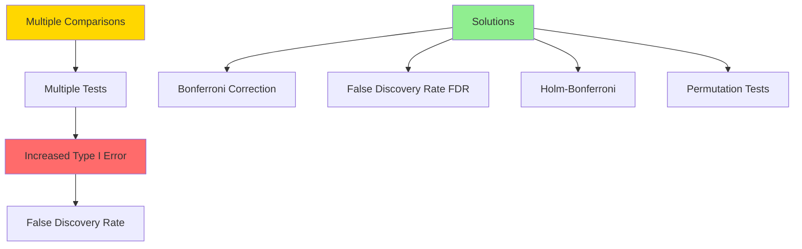
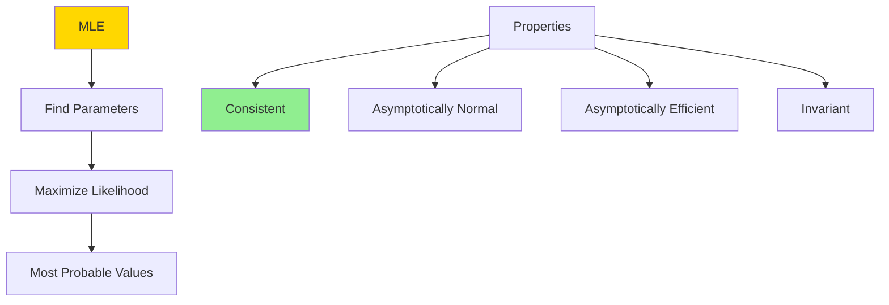
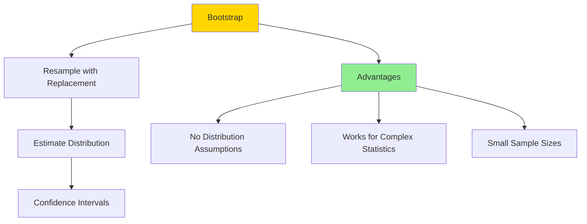
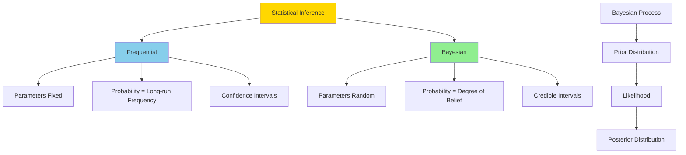
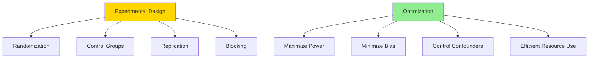

Hard-level statistics interview questions covering advanced inference, multiple comparisons, non-parametric methods, and complex experimental design.

## Q1: Explain the multiple comparisons problem and how to address it.

**Answer**:



### The Problem

When testing multiple hypotheses simultaneously, probability of at least one Type I error increases:
$$P(\text{at least one Type I error}) = 1 - (1-\alpha)^m$$

With 20 tests at α=0.05: P(at least one false positive) ≈ 0.64

### Solutions

1. **Bonferroni Correction**: Divide α by number of tests (conservative)
2. **False Discovery Rate (FDR)**: Controls expected proportion of false discoveries
3. **Holm-Bonferroni**: Step-down procedure (less conservative than Bonferroni)
4. **Permutation Testing**: Resampling-based approach

### Python Example

```python
import numpy as np
from scipy import stats
from statsmodels.stats.multitest import multipletests

np.random.seed(42)

# Simulate multiple hypothesis tests
n_tests = 20
alpha = 0.05

# Generate p-values (most from null, few from alternative)
p_values = []
true_hypotheses = []  # Track which are actually true

for i in range(n_tests):
    if i < 16:  # 16 true null hypotheses
        # Null hypothesis: mean = 0
        data = np.random.normal(0, 1, 30)
        true_hypotheses.append(True)
    else:  # 4 false null hypotheses (true effects exist)
        # Alternative: mean = 0.8
        data = np.random.normal(0.8, 1, 30)
        true_hypotheses.append(False)
    
    _, p_val = stats.ttest_1samp(data, 0)
    p_values.append(p_val)

p_values = np.array(p_values)
true_hypotheses = np.array(true_hypotheses)

print("Multiple Comparisons Problem:")
print(f"Number of tests: {n_tests}")
print(f"Nominal α: {alpha}")
print(f"Expected false positives without correction: {alpha * n_tests:.1f}")

# Uncorrected
rejections_uncorrected = p_values < alpha
false_positives_uncorrected = np.sum(rejections_uncorrected & true_hypotheses)
print(f"\nUncorrected:")
print(f"  Rejections: {np.sum(rejections_uncorrected)}")
print(f"  False positives: {false_positives_uncorrected}")

# Bonferroni correction
alpha_bonf = alpha / n_tests
rejections_bonf = p_values < alpha_bonf
false_positives_bonf = np.sum(rejections_bonf & true_hypotheses)
print(f"\nBonferroni correction (α = {alpha_bonf:.4f}):")
print(f"  Rejections: {np.sum(rejections_bonf)}")
print(f"  False positives: {false_positives_bonf}")
print(f"  Trade-off: Very conservative, may miss real effects")

# FDR (Benjamini-Hochberg)
rejections_fdr, p_corrected_fdr, alpha_sidak, alpha_bonf_fdr = multipletests(
    p_values, alpha=alpha, method='fdr_bh'
)
false_positives_fdr = np.sum(rejections_fdr & true_hypotheses)
print(f"\nFalse Discovery Rate (FDR) - Benjamini-Hochberg:")
print(f"  Rejections: {np.sum(rejections_fdr)}")
print(f"  False positives: {false_positives_fdr}")
print(f"  Trade-off: Less conservative, controls FDR instead of FWER")

# Holm-Bonferroni (step-down)
rejections_holm, p_corrected_holm, _, _ = multipletests(
    p_values, alpha=alpha, method='holm'
)
false_positives_holm = np.sum(rejections_holm & true_hypotheses)
print(f"\nHolm-Bonferroni (step-down):")
print(f"  Rejections: {np.sum(rejections_holm)}")
print(f"  False positives: {false_positives_holm}")
print(f"  Trade-off: Less conservative than Bonferroni, still controls FWER")

# Comparison
print(f"\nSummary:")
print(f"{'Method':<20} {'Rejections':<12} {'False Positives':<15}")
print("-" * 50)
print(f"{'Uncorrected':<20} {np.sum(rejections_uncorrected):<12} {false_positives_uncorrected:<15}")
print(f"{'Bonferroni':<20} {np.sum(rejections_bonf):<12} {false_positives_bonf:<15}")
print(f"{'FDR (BH)':<20} {np.sum(rejections_fdr):<12} {false_positives_fdr:<15}")
print(f"{'Holm':<20} {np.sum(rejections_holm):<12} {false_positives_holm:<15}")
```

**Thinking Process**: Multiple comparisons inflate Type I error. Choose correction based on goals: FWER (family-wise error rate) for strict control, FDR for exploratory analysis. Balance between power and false positive control.

---

## Q2: Explain maximum likelihood estimation (MLE) and its properties.

**Answer**:



### Definition

Maximum Likelihood Estimation finds parameter values that maximize the likelihood function (probability of observing the data given parameters).

### Likelihood Function

$$L(\theta | x) = \prod_{i=1}^{n} f(x_i | \theta)$$

Or log-likelihood (easier to work with):
$$\ell(\theta | x) = \sum_{i=1}^{n} \log f(x_i | \theta)$$

### Properties

1. **Consistency**: MLE → true parameter as n → ∞
2. **Asymptotic Normality**: MLE ~ Normal(θ, I(θ)⁻¹) for large n
3. **Efficiency**: Achieves Cramér-Rao lower bound
4. **Invariance**: If $\hat{\theta}$ is MLE of θ, then $g(\hat{\theta})$ is MLE of g(θ)

### Python Example

```python
import numpy as np
import matplotlib.pyplot as plt
from scipy import stats
from scipy.optimize import minimize

# Example: MLE for normal distribution parameters
np.random.seed(42)

# True parameters
true_mu = 5.0
true_sigma = 2.0
n = 100

# Generate data
data = np.random.normal(true_mu, true_sigma, n)

# MLE for normal distribution (analytical solution)
# μ_MLE = sample mean
# σ²_MLE = sample variance (biased version)
mu_mle = np.mean(data)
sigma_mle = np.std(data, ddof=0)  # MLE uses N, not N-1

print("MLE for Normal Distribution:")
print(f"True μ = {true_mu:.3f}, True σ = {true_sigma:.3f}")
print(f"MLE μ = {mu_mle:.3f}, MLE σ = {sigma_mle:.3f}")

# Numerical MLE using optimization
def negative_log_likelihood(params, data):
    """Negative log-likelihood for normal distribution."""
    mu, sigma = params
    if sigma <= 0:
        return np.inf
    return -np.sum(stats.norm.logpdf(data, loc=mu, scale=sigma))

# Optimize
initial_guess = [0, 1]
result = minimize(negative_log_likelihood, initial_guess, args=(data,), 
                  method='L-BFGS-B', bounds=[(None, None), (0.01, None)])

mu_mle_opt = result.x[0]
sigma_mle_opt = result.x[1]

print(f"\nNumerical MLE:")
print(f"μ = {mu_mle_opt:.3f}, σ = {sigma_mle_opt:.3f}")
print(f"Log-likelihood: {-result.fun:.3f}")

# MLE for Poisson distribution
true_lambda = 3.0
poisson_data = np.random.poisson(true_lambda, n)

# Analytical MLE for Poisson: λ_MLE = sample mean
lambda_mle = np.mean(poisson_data)

print(f"\nMLE for Poisson Distribution:")
print(f"True λ = {true_lambda:.3f}")
print(f"MLE λ = {lambda_mle:.3f}")

# Likelihood function visualization
def log_likelihood_poisson(lambda_val, data):
    """Log-likelihood for Poisson."""
    return np.sum(stats.poisson.logpmf(data, lambda_val))

lambda_vals = np.linspace(1, 5, 100)
log_likes = [log_likelihood_poisson(l, poisson_data) for l in lambda_vals]

# Find MLE
mle_idx = np.argmax(log_likes)
lambda_mle_vis = lambda_vals[mle_idx]

print(f"\nMLE from likelihood plot: {lambda_mle_vis:.3f}")

# Asymptotic distribution of MLE
# For large n, MLE ~ Normal(θ, I(θ)⁻¹)
# For Poisson: I(λ) = n/λ, so var(λ_MLE) ≈ λ/n
n_samples = 1000
mle_samples = [np.mean(np.random.poisson(true_lambda, n)) for _ in range(n_samples)]

theoretical_var = true_lambda / n
theoretical_std = np.sqrt(theoretical_var)
empirical_std = np.std(mle_samples)

print(f"\nAsymptotic Distribution of MLE (Poisson):")
print(f"Theoretical std: {theoretical_std:.4f}")
print(f"Empirical std: {empirical_std:.4f}")
print(f"Sample mean (should be close to true λ): {np.mean(mle_samples):.3f}")

# Verify asymptotic normality
from scipy.stats import normaltest
stat, p_val = normaltest(mle_samples)
print(f"Normality test p-value: {p_val:.4f}")
```

**Thinking Process**: MLE is powerful because it provides optimal parameter estimates under regularity conditions. Can be computed analytically for many distributions, or numerically via optimization. Asymptotic properties (consistency, normality) justify using MLE for inference.

---

## Q3: What is bootstrapping and when would you use it?

**Answer**:



### Definition

**Bootstrap** resamples the original data with replacement to estimate sampling distribution of a statistic.

### When to Use

- Complex statistics (no known distribution)
- Small sample sizes
- Non-parametric inference
- When assumptions of parametric tests violated

### Types

1. **Parametric Bootstrap**: Resample from fitted parametric distribution
2. **Non-parametric Bootstrap**: Resample from empirical distribution

### Python Example

```python
import numpy as np
from scipy import stats
import matplotlib.pyplot as plt

np.random.seed(42)

# Original data (skewed, non-normal)
data = np.random.exponential(scale=2, size=30)
true_median = 2 * np.log(2)  # True median of exponential

print("Bootstrap Confidence Interval Example:")
print(f"Sample size: {len(data)}")
print(f"Sample median: {np.median(data):.3f}")
print(f"True median: {true_median:.3f}")

# Bootstrap procedure
n_bootstrap = 10000
bootstrap_medians = []

for _ in range(n_bootstrap):
    # Resample with replacement
    bootstrap_sample = np.random.choice(data, size=len(data), replace=True)
    bootstrap_medians.append(np.median(bootstrap_sample))

bootstrap_medians = np.array(bootstrap_medians)

# Confidence interval using percentile method
ci_lower = np.percentile(bootstrap_medians, 2.5)
ci_upper = np.percentile(bootstrap_medians, 97.5)

print(f"\nBootstrap 95% CI (percentile method): [{ci_lower:.3f}, {ci_upper:.3f}]")

# Bootstrap standard error
bootstrap_se = np.std(bootstrap_medians)
print(f"Bootstrap standard error: {bootstrap_se:.3f}")

# Compare with normal approximation (may not be valid)
sample_median = np.median(data)
# Bootstrap t-interval
t_critical = stats.t.ppf(0.975, df=len(data)-1)
ci_normal = [sample_median - t_critical * bootstrap_se, 
             sample_median + t_critical * bootstrap_se]
print(f"Bootstrap 95% CI (t-interval): [{ci_normal[0]:.3f}, {ci_normal[1]:.3f}]")

# Bootstrap for correlation (no simple CI formula)
np.random.seed(42)
x = np.random.normal(0, 1, 50)
y = 2 + 1.5*x + np.random.normal(0, 0.5, 50)
true_correlation = 1.5 / np.sqrt(1 + 0.5**2)  # Theoretical correlation

sample_correlation = np.corrcoef(x, y)[0, 1]
print(f"\nBootstrap for Correlation:")
print(f"Sample correlation: {sample_correlation:.3f}")
print(f"Theoretical correlation: {true_correlation:.3f}")

bootstrap_correlations = []
for _ in range(n_bootstrap):
    indices = np.random.choice(len(x), size=len(x), replace=True)
    boot_x = x[indices]
    boot_y = y[indices]
    boot_corr = np.corrcoef(boot_x, boot_y)[0, 1]
    bootstrap_correlations.append(boot_corr)

bootstrap_correlations = np.array(bootstrap_correlations)
ci_corr = np.percentile(bootstrap_correlations, [2.5, 97.5])
print(f"Bootstrap 95% CI for correlation: [{ci_corr[0]:.3f}, {ci_corr[1]:.3f}]")

# Bootstrap hypothesis testing
# Test: H0: median = 1.0
null_value = 1.0
test_statistic = np.median(data) - null_value

# Bootstrap under H0: center data at null value
centered_data = data - np.median(data) + null_value
bootstrap_test_stats = []

for _ in range(n_bootstrap):
    boot_sample = np.random.choice(centered_data, size=len(data), replace=True)
    boot_stat = np.median(boot_sample) - null_value
    bootstrap_test_stats.append(boot_stat)

bootstrap_test_stats = np.array(bootstrap_test_stats)

# Two-tailed p-value
p_value = np.mean(np.abs(bootstrap_test_stats) >= np.abs(test_statistic))
print(f"\nBootstrap Hypothesis Test:")
print(f"H0: median = {null_value}")
print(f"Test statistic: {test_statistic:.3f}")
print(f"Bootstrap p-value: {p_value:.3f}")
```

**Thinking Process**: Bootstrap is powerful non-parametric method that makes no distributional assumptions. Works by treating sample as population and resampling. Good for complex statistics, but requires sufficient sample size and independence. Computationally intensive but flexible.

---

## Q4: Explain Bayesian inference and how it differs from frequentist inference.

**Answer**:



### Key Differences

| Aspect | Frequentist | Bayesian |
|--------|------------|----------|
| Parameters | Fixed, unknown | Random variables |
| Probability | Long-run frequency | Degree of belief |
| Inference | p-values, CI | Posterior distributions |
| Prior info | Not used | Incorporated via prior |

### Bayesian Framework

$$P(\theta | data) = \frac{P(data | \theta) P(\theta)}{P(data)}$$

- **Prior** P(θ): Belief before seeing data
- **Likelihood** P(data|θ): Probability of data given parameters
- **Posterior** P(θ|data): Updated belief after seeing data
- **Evidence** P(data): Normalizing constant

### Python Example

```python
import numpy as np
from scipy import stats
import matplotlib.pyplot as plt

# Bayesian inference for normal mean (known variance)

# Data
np.random.seed(42)
true_mu = 10
true_sigma = 2
n = 20
data = np.random.normal(true_mu, true_sigma, n)
sample_mean = np.mean(data)

print("Bayesian Inference: Normal Mean (known variance)")
print(f"True μ = {true_mu}, True σ = {true_sigma}")
print(f"Sample mean = {sample_mean:.3f}, n = {n}")

# Conjugate prior: Normal(μ₀, τ₀²)
# Prior
mu_0 = 8  # Prior mean
tau_0_sq = 4  # Prior variance
tau_0 = np.sqrt(tau_0_sq)

# Posterior (conjugate prior)
# Posterior is Normal with:
# μ_n = (τ₀² * x̄ + σ²/n * μ₀) / (τ₀² + σ²/n)
# τ_n² = 1 / (1/τ₀² + n/σ²)

tau_n_sq = 1 / (1/tau_0_sq + n / (true_sigma**2))
mu_n = (tau_0_sq * sample_mean + (true_sigma**2/n) * mu_0) / (tau_0_sq + true_sigma**2/n)
tau_n = np.sqrt(tau_n_sq)

print(f"\nPrior: Normal(μ₀={mu_0}, τ₀²={tau_0_sq})")
print(f"Posterior: Normal(μ_n={mu_n:.3f}, τ_n²={tau_n_sq:.3f})")

# Compare with frequentist
frequentist_mean = sample_mean
frequentist_se = true_sigma / np.sqrt(n)
frequentist_ci = [frequentist_mean - 1.96*frequentist_se, 
                   frequentist_mean + 1.96*frequentist_se]

bayesian_ci = stats.norm.interval(0.95, loc=mu_n, scale=tau_n)

print(f"\nFrequentist 95% CI: [{frequentist_ci[0]:.3f}, {frequentist_ci[1]:.3f}]")
print(f"Bayesian 95% Credible Interval: [{bayesian_ci[0]:.3f}, {bayesian_ci[1]:.3f}]")

# Visualize prior, likelihood, posterior
mu_range = np.linspace(5, 15, 200)

prior = stats.norm.pdf(mu_range, loc=mu_0, scale=tau_0)
# Likelihood (as function of mu)
likelihood = np.exp(-n/(2*true_sigma**2) * (mu_range - sample_mean)**2)
likelihood = likelihood / np.trapz(likelihood, mu_range) * np.max(prior) / np.max(likelihood)
posterior = stats.norm.pdf(mu_range, loc=mu_n, scale=tau_n)

# Bayesian A/B testing (Beta-Binomial)
print("\n" + "="*50)
print("Bayesian A/B Testing")

# Priors: Beta(α, β) - uniform priors
alpha_A, beta_A = 1, 1
alpha_B, beta_B = 1, 1

# Data
successes_A, trials_A = 45, 100
successes_B, trials_B = 55, 100

# Posteriors (Beta is conjugate prior for binomial)
alpha_A_post = alpha_A + successes_A
beta_A_post = beta_A + (trials_A - successes_A)
alpha_B_post = alpha_B + successes_B
beta_B_post = beta_B + (trials_B - successes_B)

# Probability that B > A
n_samples = 10000
samples_A = np.random.beta(alpha_A_post, beta_A_post, n_samples)
samples_B = np.random.beta(alpha_B_post, beta_B_post, n_samples)
prob_B_better = np.mean(samples_B > samples_A)

print(f"P(B > A) = {prob_B_better:.3f}")

# Expected values
expected_A = alpha_A_post / (alpha_A_post + beta_A_post)
expected_B = alpha_B_post / (alpha_B_post + beta_B_post)
print(f"Expected conversion A: {expected_A:.3f}")
print(f"Expected conversion B: {expected_B:.3f}")

# Credible intervals
ci_A = stats.beta.interval(0.95, alpha_A_post, beta_A_post)
ci_B = stats.beta.interval(0.95, alpha_B_post, beta_B_post)
print(f"95% Credible Interval A: [{ci_A[0]:.3f}, {ci_A[1]:.3f}]")
print(f"95% Credible Interval B: [{ci_B[0]:.3f}, {ci_B[1]:.3f}]")

# Advantage: Direct probability statements
print(f"\nBayesian advantage:")
print(f"We can say: 'There is a {prob_B_better:.1%} probability that B is better'")
print(f"Frequentist can only say: 'We reject/fail to reject H0'")
```

**Thinking Process**: Bayesian inference provides intuitive probability statements about parameters and naturally incorporates prior knowledge. Frequentist focuses on long-run behavior. Choose based on needs: Bayesian for incorporating prior info, credible intervals, probability of hypotheses; Frequentist for p-values, classical hypothesis testing, when prior is unclear.

---

## Q5: What is experimental design and how do you optimize it?

**Answer**:



### Key Principles

1. **Randomization**: Eliminates selection bias
2. **Control Groups**: Isolates treatment effect
3. **Replication**: Reduces variability, increases power
4. **Blocking**: Controls for known confounders
5. **Blinding**: Prevents observer bias

### Design Types

- **Completely Randomized Design (CRD)**: Simple, all units randomly assigned
- **Randomized Block Design (RBD)**: Block by confounder, randomize within blocks
- **Factorial Design**: Test multiple factors simultaneously
- **Crossover Design**: Each subject receives multiple treatments

### Python Example

```python
import numpy as np
import pandas as pd
from scipy import stats
from itertools import product

# Design optimization: Sample size for different designs

def calculate_power_two_sample(effect_size, n_per_group, std_dev=1, alpha=0.05):
    """Calculate power for two-sample t-test."""
    z_alpha = stats.norm.ppf(1 - alpha/2)
    z_beta = stats.norm.ppf(0.80)  # Target power
    n_required = 2 * ((z_alpha + z_beta)**2 * std_dev**2) / effect_size**2
    return 1 - stats.norm.cdf(z_alpha - effect_size * np.sqrt(n_per_group) / std_dev)

print("Experimental Design Optimization:")
print("="*50)

# Scenario: Testing new drug vs placebo
effect_size = 0.5  # Standardized effect size
alpha = 0.05
target_power = 0.80

# Required sample size
z_alpha = stats.norm.ppf(1 - alpha/2)
z_beta = stats.norm.ppf(target_power)
n_per_group = int(np.ceil(2 * ((z_alpha + z_beta)**2) / effect_size**2))

print(f"Scenario: Drug vs Placebo")
print(f"Effect size (Cohen's d): {effect_size}")
print(f"Required sample size per group: {n_per_group}")
print(f"Total sample size: {n_per_group * 2}")

# Compare designs
designs = {
    'CRD': {'n': n_per_group * 2, 'efficiency': 1.0},
    'RBD (4 blocks)': {'n': n_per_group * 2, 'efficiency': 1.2},  # Blocking reduces variance
    'Crossover': {'n': int(n_per_group * 0.6), 'efficiency': 1.5}  # Within-subject more efficient
}

print(f"\nDesign Comparison:")
print(f"{'Design':<20} {'Total N':<12} {'Efficiency':<12}")
print("-" * 45)
for design, props in designs.items():
    print(f"{design:<20} {props['n']:<12} {props['efficiency']:<12}")

# Factorial design: Testing 2 factors simultaneously
print(f"\nFactorial Design (2×2):")
print("Testing: Drug (A/B) × Dose (Low/High)")

# Main effects and interactions
effects = {
    'Main Effect A': 0.3,
    'Main Effect Dose': 0.4,
    'Interaction': 0.2
}

# Calculate power for each effect
n_per_cell = 25
for effect_name, effect in effects.items():
    power = calculate_power_two_sample(effect, n_per_cell)
    print(f"{effect_name}: effect={effect:.2f}, power={power:.3f}")

# Optimal allocation for stratified design
print(f"\nOptimal Stratification:")
strata_sizes = {'Young': 1000, 'Middle': 2000, 'Old': 1000}
total_N = sum(strata_sizes.values())
target_n = 300

# Proportional allocation
proportional = {k: int(v/total_N * target_n) for k, v in strata_sizes.items()}
print(f"Proportional allocation: {proportional}")

# Optimal allocation (Neyman allocation - accounts for variance)
# Assume older group has higher variance
strata_vars = {'Young': 1.0, 'Middle': 1.2, 'Old': 1.5}
weights = {k: v * np.sqrt(strata_vars[k]) for k, v in strata_sizes.items()}
total_weight = sum(weights.values())
optimal = {k: int(v/total_weight * target_n) for k, v in weights.items()}
print(f"Optimal allocation (Neyman): {optimal}")

# Randomized block design simulation
print(f"\nRandomized Block Design Simulation:")
np.random.seed(42)

n_blocks = 4
n_per_block = 10
block_effects = np.random.normal(0, 2, n_blocks)  # Block-to-block variation
treatment_effect = 3

# Generate data
data = []
for block in range(n_blocks):
    control = np.random.normal(block_effects[block], 1, n_per_block // 2)
    treatment = np.random.normal(block_effects[block] + treatment_effect, 1, n_per_block // 2)
    
    for val in control:
        data.append({'block': block, 'treatment': 'control', 'value': val})
    for val in treatment:
        data.append({'block': block, 'treatment': 'treatment', 'value': val})

df = pd.DataFrame(data)

# Two approaches: Ignore blocks vs account for blocks
# Ignore blocks (treat as CRD)
control_vals = df[df['treatment']=='control']['value']
treat_vals = df[df['treatment']=='treatment']['value']
t_stat_crd, p_crd = stats.ttest_ind(treat_vals, control_vals)

# Account for blocks (two-way ANOVA or paired t-test per block)
from scipy.stats import f_oneway
# Simplified: block as factor
block_means_control = df[df['treatment']=='control'].groupby('block')['value'].mean()
block_means_treat = df[df['treatment']=='treatment'].groupby('block')['value'].mean()
t_stat_rbd, p_rbd = stats.ttest_rel(block_means_treat, block_means_control)

print(f"CRD analysis (ignoring blocks): t={t_stat_crd:.3f}, p={p_crd:.4f}")
print(f"RBD analysis (accounting for blocks): t={t_stat_rbd:.3f}, p={p_rbd:.4f}")
print(f"Blocking improves precision (lower p-value)")
```

**Thinking Process**: Good experimental design maximizes information while minimizing bias and cost. Randomization is crucial for causal inference. Blocking improves precision by controlling known confounders. Choose design based on constraints, confounders, and research questions. Always consider practical limitations (cost, time, ethics).

---

*These advanced topics require deep understanding of statistical theory and are essential for designing robust studies and making valid inferences in complex scenarios.*

