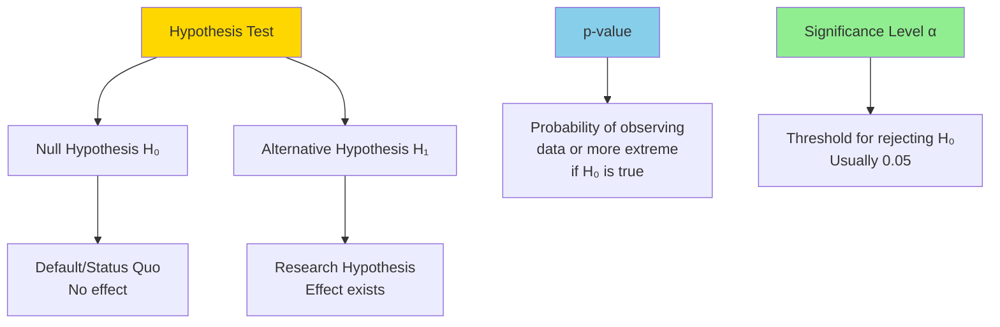
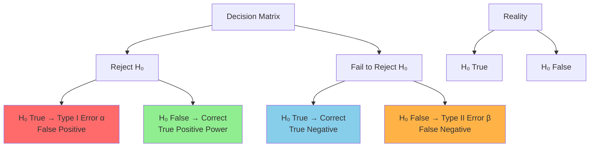
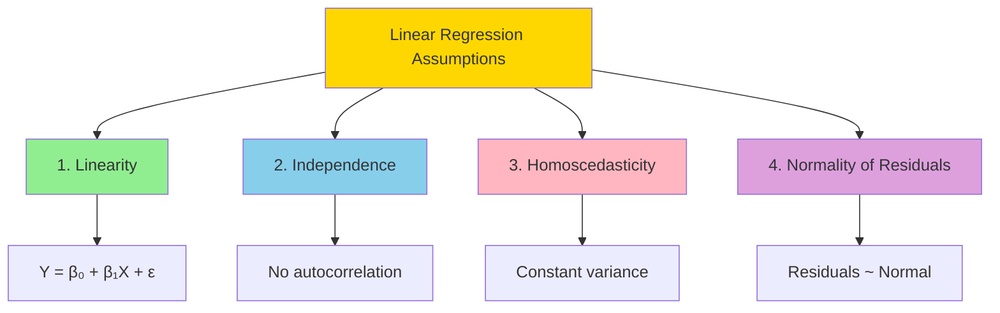
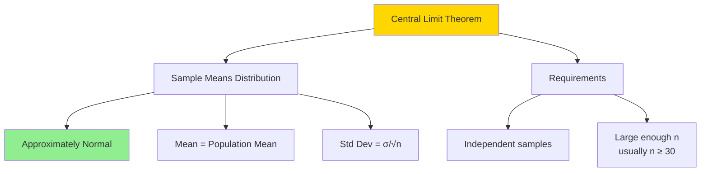
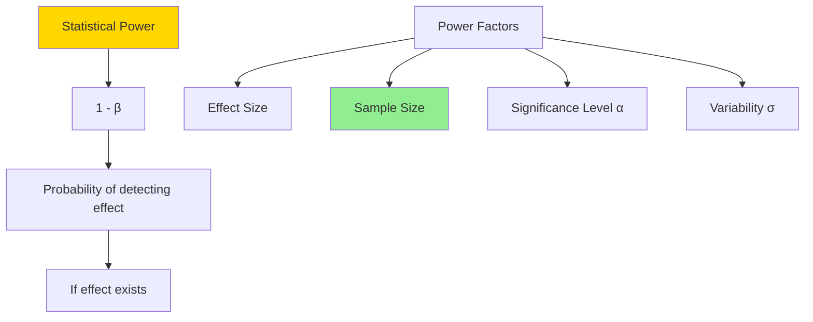

Medium-level statistics interview questions covering hypothesis testing, regression analysis, and statistical inference.

## Q1: Explain hypothesis testing: null hypothesis, alternative hypothesis, p-value, and significance level.

**Answer**:



### Key Concepts

- **Null Hypothesis (H₀)**: Statement being tested (usually "no effect" or "no difference")
- **Alternative Hypothesis (H₁)**: What we want to prove (there is an effect)
- **p-value**: Probability of observing data as extreme or more extreme, assuming H₀ is true
- **Significance Level (α)**: Threshold for rejecting H₀ (typically 0.05)

### Decision Rule

- If p-value < α: Reject H₀ (statistically significant)
- If p-value ≥ α: Fail to reject H₀ (not significant)

### Python Example

```python
import numpy as np
from scipy import stats

# Example: Testing if a new drug is more effective
# H₀: μ_new - μ_old = 0 (no difference)
# H₁: μ_new - μ_old > 0 (new drug better)

np.random.seed(42)
# Old drug: mean recovery time 10 days
old_drug = np.random.normal(10, 2, 30)

# New drug: mean recovery time 8.5 days (actually better)
new_drug = np.random.normal(8.5, 2, 30)

# One-sample t-test: test if new drug mean is significantly less than 10
t_stat, p_value = stats.ttest_1samp(new_drug, 10, alternative='less')

alpha = 0.05
print(f"Null hypothesis (H₀): Mean recovery time = 10 days")
print(f"Alternative (H₁): Mean recovery time < 10 days")
print(f"\nSample mean: {np.mean(new_drug):.2f} days")
print(f"t-statistic: {t_stat:.3f}")
print(f"p-value: {p_value:.4f}")
print(f"Significance level (α): {alpha}")

if p_value < alpha:
    print(f"\nDecision: Reject H₀ (p < α)")
    print("Conclusion: New drug is significantly more effective")
else:
    print(f"\nDecision: Fail to reject H₀ (p ≥ α)")
    print("Conclusion: No significant evidence new drug is better")

# Two-sample t-test (comparing means)
t_stat_2, p_value_2 = stats.ttest_ind(new_drug, old_drug, alternative='less')
print(f"\nTwo-sample test:")
print(f"t-statistic: {t_stat_2:.3f}")
print(f"p-value: {p_value_2:.4f}")
```

**Thinking Process**: Hypothesis testing is about finding evidence against the null. Low p-value means data is unlikely under H₀, suggesting H₁ might be true. Never "accept" H₀, only "fail to reject" - absence of evidence ≠ evidence of absence.

---

## Q2: What are Type I and Type II errors? How do they relate to statistical power?

**Answer**:



### Error Types

- **Type I Error (α)**: Rejecting H₀ when it's true (false positive)
- **Type II Error (β)**: Failing to reject H₀ when it's false (false negative)
- **Power (1-β)**: Probability of correctly rejecting H₀ when it's false

### Trade-offs

- Decreasing α (Type I error) increases β (Type II error)
- Increasing sample size increases power
- Larger effect sizes are easier to detect (higher power)

### Python Example

```python
import numpy as np
from scipy import stats
import matplotlib.pyplot as plt

# Simulate hypothesis testing with known truth
np.random.seed(42)
alpha = 0.05
n_trials = 1000

# Scenario 1: H₀ is true (no effect)
null_true = []
for _ in range(n_trials):
    sample = np.random.normal(0, 1, 30)  # True mean = 0
    _, p_val = stats.ttest_1samp(sample, 0)
    null_true.append(p_val < alpha)

type1_error_rate = np.mean(null_true)
print(f"Type I Error Rate (α = {alpha}): {type1_error_rate:.3f}")
print(f"Expected: ~{alpha}")

# Scenario 2: H₁ is true (effect exists)
alt_true = []
true_effect = 0.5  # Actual difference
for _ in range(n_trials):
    sample = np.random.normal(true_effect, 1, 30)
    _, p_val = stats.ttest_1samp(sample, 0)
    alt_true.append(p_val < alpha)

power = np.mean(alt_true)
type2_error_rate = 1 - power
print(f"\nType II Error Rate (β): {type2_error_rate:.3f}")
print(f"Statistical Power (1-β): {power:.3f}")

# Effect of sample size on power
sample_sizes = [10, 20, 30, 50, 100]
powers = []
for n in sample_sizes:
    rejections = 0
    for _ in range(n_trials):
        sample = np.random.normal(true_effect, 1, n)
        _, p_val = stats.ttest_1samp(sample, 0)
        if p_val < alpha:
            rejections += 1
    powers.append(rejections / n_trials)

print(f"\nPower vs Sample Size:")
for n, pwr in zip(sample_sizes, powers):
    print(f"  n={n:3d}: Power = {pwr:.3f}")

# Effect of effect size on power
effect_sizes = [0.1, 0.2, 0.5, 1.0]
powers_effect = []
for effect in effect_sizes:
    rejections = 0
    for _ in range(n_trials):
        sample = np.random.normal(effect, 1, 30)
        _, p_val = stats.ttest_1samp(sample, 0)
        if p_val < alpha:
            rejections += 1
    powers_effect.append(rejections / n_trials)

print(f"\nPower vs Effect Size (n=30):")
for effect, pwr in zip(effect_sizes, powers_effect):
    print(f"  Effect={effect:.1f}: Power = {pwr:.3f}")
```

**Thinking Process**: Type I and Type II errors are inversely related for fixed sample size. To increase power without increasing Type I error, need larger sample size or larger effect size. Power analysis helps determine adequate sample size before study.

---

## Q3: Explain linear regression assumptions and how to check them.

**Answer**:



### Assumptions

1. **Linearity**: Relationship between X and Y is linear
2. **Independence**: Observations are independent (no autocorrelation)
3. **Homoscedasticity**: Constant variance of residuals across X values
4. **Normality**: Residuals are normally distributed

### Diagnostics

- **Residual plots**: Check linearity and homoscedasticity
- **Q-Q plots**: Check normality
- **Durbin-Watson test**: Check independence
- **Leverage/Cook's distance**: Check for influential points

### Python Example

```python
import numpy as np
import matplotlib.pyplot as plt
from scipy import stats
from sklearn.linear_model import LinearRegression
from sklearn.metrics import r2_score

np.random.seed(42)

# Generate data that violates assumptions
# True relationship: y = 2 + 3x + error
x = np.linspace(0, 10, 100)
# Heteroscedastic errors (violates assumption)
error = np.random.normal(0, 0.5 + 0.3*x, len(x))
y_true = 2 + 3*x
y = y_true + error

# Fit linear regression
X = x.reshape(-1, 1)
model = LinearRegression()
model.fit(X, y)
y_pred = model.predict(X)

# Calculate residuals
residuals = y - y_pred

print(f"R²: {r2_score(y, y_pred):.3f}")
print(f"Coefficients: β₀={model.intercept_:.2f}, β₁={model.coef_[0]:.2f}")

# Check assumptions

# 1. Linearity: Plot residuals vs fitted
plt.figure(figsize=(12, 8))

plt.subplot(2, 2, 1)
plt.scatter(y_pred, residuals, alpha=0.6)
plt.axhline(y=0, color='r', linestyle='--')
plt.xlabel('Fitted Values')
plt.ylabel('Residuals')
plt.title('Residuals vs Fitted (Linearity & Homoscedasticity)')
plt.grid(True, alpha=0.3)

# 2. Normality: Q-Q plot
plt.subplot(2, 2, 2)
stats.probplot(residuals, dist="norm", plot=plt)
plt.title('Q-Q Plot (Normality Check)')
plt.grid(True, alpha=0.3)

# 3. Homoscedasticity: Scale-location plot
plt.subplot(2, 2, 3)
sqrt_abs_residuals = np.sqrt(np.abs(residuals))
plt.scatter(y_pred, sqrt_abs_residuals, alpha=0.6)
plt.xlabel('Fitted Values')
plt.ylabel('√|Standardized Residuals|')
plt.title('Scale-Location Plot (Homoscedasticity)')
plt.grid(True, alpha=0.3)

# 4. Statistical tests
# Normality test (Shapiro-Wilk)
shapiro_stat, shapiro_p = stats.shapiro(residuals)
print(f"\nNormality test (Shapiro-Wilk):")
print(f"  p-value: {shapiro_p:.4f}")
if shapiro_p < 0.05:
    print("  Violation: Residuals not normally distributed")
else:
    print("  OK: Residuals appear normally distributed")

# Homoscedasticity: Breusch-Pagan test (simplified)
from scipy.stats import chi2
n = len(residuals)
bp_stat = n * r2_score(y_pred, residuals**2)
bp_p = 1 - chi2.cdf(bp_stat, 1)
print(f"\nHomoscedasticity test (Breusch-Pagan):")
print(f"  p-value: {bp_p:.4f}")
if bp_p < 0.05:
    print("  Violation: Heteroscedasticity detected")
else:
    print("  OK: Homoscedasticity assumption holds")

plt.tight_layout()
plt.show()

# Remedies
print("\nPotential remedies:")
print("- Non-linearity: Transform variables, add polynomial terms")
print("- Heteroscedasticity: Transform Y, use weighted least squares")
print("- Non-normality: Transform Y, use robust regression")
print("- Dependencies: Use time series methods, mixed models")
```

**Thinking Process**: Violating assumptions affects validity of p-values and confidence intervals. Always check diagnostics after fitting model. Transformations or alternative methods may be needed if assumptions violated.

---

## Q4: What is the Central Limit Theorem and why is it important?

**Answer**:



### Statement

As sample size increases, the distribution of sample means approaches a normal distribution, regardless of the population distribution shape.

### Key Points

- **Mean of sampling distribution** = Population mean (μ)
- **Standard error** = σ/√n (standard deviation of sample means)
- Works even if population is not normal (with large enough n)

### Why It Matters

- Justifies using normal distribution for inference
- Allows calculation of confidence intervals
- Foundation for many statistical tests

### Python Example

```python
import numpy as np
import matplotlib.pyplot as plt
from scipy import stats

np.random.seed(42)

# Non-normal population: Exponential distribution
population = np.random.exponential(scale=2, size=10000)
true_mean = 2  # Mean of exponential is scale parameter

print(f"Population distribution: Exponential (mean={true_mean})")
print(f"Population is NOT normal (right-skewed)")

# Simulate sampling distribution of means
sample_sizes = [5, 10, 30, 50]
n_samples = 1000

fig, axes = plt.subplots(2, 2, figsize=(12, 10))
axes = axes.flatten()

for idx, n in enumerate(sample_sizes):
    sample_means = []
    for _ in range(n_samples):
        sample = np.random.choice(population, size=n, replace=False)
        sample_means.append(np.mean(sample))
    
    sample_means = np.array(sample_means)
    
    # Theoretical CLT predictions
    theoretical_mean = true_mean
    theoretical_std = np.std(population) / np.sqrt(n)
    
    # Plot histogram
    axes[idx].hist(sample_means, bins=30, density=True, alpha=0.7, label='Sample Means')
    
    # Overlay normal distribution
    x = np.linspace(min(sample_means), max(sample_means), 100)
    normal_pdf = stats.norm.pdf(x, loc=theoretical_mean, scale=theoretical_std)
    axes[idx].plot(x, normal_pdf, 'r-', linewidth=2, label='Normal (CLT)')
    
    axes[idx].axvline(theoretical_mean, color='green', linestyle='--', label=f'True Mean={theoretical_mean}')
    axes[idx].set_title(f'n = {n}')
    axes[idx].set_xlabel('Sample Mean')
    axes[idx].set_ylabel('Density')
    axes[idx].legend()
    axes[idx].grid(True, alpha=0.3)
    
    # Compare empirical vs theoretical
    empirical_mean = np.mean(sample_means)
    empirical_std = np.std(sample_means)
    
    print(f"\nn = {n}:")
    print(f"  Empirical mean: {empirical_mean:.3f} (theoretical: {theoretical_mean:.3f})")
    print(f"  Empirical std: {empirical_std:.3f} (theoretical: {theoretical_std:.3f})")
    
    # Normality test
    stat, p_val = stats.shapiro(sample_means)
    print(f"  Normality test p-value: {p_val:.4f}", end="")
    if p_val > 0.05:
        print(" (approximately normal ✓)")
    else:
        print(" (not normal yet)")

plt.suptitle('Central Limit Theorem: Sample Means Approach Normal Distribution', fontsize=14)
plt.tight_layout()
plt.show()

# Practical application: Confidence interval
n = 30
sample = np.random.choice(population, size=n, replace=False)
sample_mean = np.mean(sample)
sample_std = np.std(sample, ddof=1)

# 95% CI using CLT (t-distribution for small n)
t_critical = stats.t.ppf(0.975, df=n-1)
margin_error = t_critical * (sample_std / np.sqrt(n))
ci_lower = sample_mean - margin_error
ci_upper = sample_mean + margin_error

print(f"\nPractical application: 95% Confidence Interval")
print(f"Sample mean: {sample_mean:.3f}")
print(f"95% CI: [{ci_lower:.3f}, {ci_upper:.3f}]")
print(f"True mean ({true_mean:.3f}) is in CI: {ci_lower <= true_mean <= ci_upper}")
```

**Thinking Process**: CLT is fundamental because it allows inference even when population distribution is unknown. Larger samples → better normal approximation. For small samples from non-normal populations, may need non-parametric methods or bootstrap.

---

## Q5: Explain Bayes' theorem and its application in statistics.

**Answer**:

```mermaid
graph TB
    A[Bayes Theorem] --> B[Updates Prior Belief]
    B --> C[With New Evidence]
    
    A --> D[Formula]
    D --> D1[P A|B = P B|A × P A / P B]
    
    E[Components] --> E1[Prior P A]
    E --> E2[Likelihood P B|A]
    E --> E3[Evidence P B]
    E --> E4[Posterior P A|B]
    
    style A fill:#FFD700
    style E4 fill:#90EE90
```

### Formula

$$P(A|B) = \frac{P(B|A) \times P(A)}{P(B)}$$

Where:
- **P(A|B)**: Posterior probability (what we want)
- **P(B|A)**: Likelihood (probability of evidence given hypothesis)
- **P(A)**: Prior probability (initial belief)
- **P(B)**: Evidence/Normalizing constant

### Applications

- Medical diagnosis
- Spam filtering
- A/B testing
- Machine learning (Naive Bayes)

### Python Example

```python
import numpy as np
from scipy import stats

# Example: Medical diagnosis
# Disease prevalence: 1% of population
# Test sensitivity: 95% (P(positive|disease))
# Test specificity: 90% (P(negative|no disease))

# Prior
P_disease = 0.01
P_no_disease = 1 - P_disease

# Likelihoods
P_positive_given_disease = 0.95
P_negative_given_disease = 1 - P_positive_given_disease
P_negative_given_no_disease = 0.90
P_positive_given_no_disease = 1 - P_negative_given_no_disease

# Evidence (marginal probability)
P_positive = (P_positive_given_disease * P_disease + 
              P_positive_given_no_disease * P_no_disease)

# Bayes' theorem: P(disease|positive)
P_disease_given_positive = (P_positive_given_disease * P_disease) / P_positive

print("Medical Diagnosis Example:")
print(f"Prior: P(disease) = {P_disease:.3f} (1%)")
print(f"Likelihood: P(positive|disease) = {P_positive_given_disease:.3f}")
print(f"Evidence: P(positive) = {P_positive:.3f}")
print(f"\nPosterior: P(disease|positive) = {P_disease_given_positive:.3f} ({P_disease_given_positive*100:.1f}%)")
print(f"\nKey insight: Despite 95% sensitivity, only {P_disease_given_positive*100:.1f}%")
print(f"of positive tests indicate actual disease (low prevalence)!")

# Bayesian updating with multiple tests
print("\n" + "="*50)
print("Bayesian Updating: Multiple Tests")

# First test positive
prior = P_disease
posterior_1 = (P_positive_given_disease * prior) / P_positive
print(f"After 1st positive test: {posterior_1:.3f}")

# Second test positive (using first posterior as new prior)
P_positive_2 = (P_positive_given_disease * posterior_1 + 
                P_positive_given_no_disease * (1 - posterior_1))
posterior_2 = (P_positive_given_disease * posterior_1) / P_positive_2
print(f"After 2nd positive test: {posterior_2:.3f}")

# Compare to naive approach (wrong)
naive_estimate = 1 - (1 - P_positive_given_disease)**2
print(f"\nNaive approach (wrong): {naive_estimate:.3f}")
print("This ignores prior probability!")

# A/B Testing Example
print("\n" + "="*50)
print("Bayesian A/B Testing Example")

# Prior: uniform (no preference)
prior_A = 0.5
prior_B = 0.5

# Observed data: A converts 45/100, B converts 55/100
conversions_A = 45
trials_A = 100
conversions_B = 55
trials_B = 100

# Beta distribution (conjugate prior for binomial)
# Posterior is Beta(alpha + conversions, beta + non-conversions)
from scipy.stats import beta

# Prior: Beta(1,1) - uniform
alpha_prior, beta_prior = 1, 1

# Posteriors
alpha_A = alpha_prior + conversions_A
beta_A = beta_prior + (trials_A - conversions_A)
alpha_B = alpha_prior + conversions_B
beta_B = beta_prior + (trials_B - conversions_B)

# Probability that B > A
# Sample from posteriors and compare
n_samples = 10000
samples_A = beta.rvs(alpha_A, beta_A, size=n_samples)
samples_B = beta.rvs(alpha_B, beta_B, size=n_samples)
prob_B_better = np.mean(samples_B > samples_A)

print(f"Probability that B is better than A: {prob_B_better:.3f}")
print(f"Expected conversion rate A: {alpha_A/(alpha_A+beta_A):.3f}")
print(f"Expected conversion rate B: {alpha_B/(alpha_B+beta_B):.3f}")

# Credible interval (Bayesian confidence interval)
ci_A = beta.interval(0.95, alpha_A, beta_A)
ci_B = beta.interval(0.95, alpha_B, beta_B)
print(f"\n95% Credible Interval A: [{ci_A[0]:.3f}, {ci_A[1]:.3f}]")
print(f"95% Credible Interval B: [{ci_B[0]:.3f}, {ci_B[1]:.3f}]")
```

**Thinking Process**: Bayes' theorem quantifies how evidence updates beliefs. Prior matters - base rates are crucial. Bayesian approach provides probability of hypothesis (more intuitive than p-values) and naturally incorporates prior knowledge.

---

## Q6: What is statistical power and how do you calculate sample size needed?

**Answer**:



### Definition

**Statistical Power** = Probability of correctly rejecting H₀ when H₁ is true (1 - Type II error rate)

### Factors Affecting Power

1. **Effect size**: Larger effects → higher power
2. **Sample size**: Larger n → higher power
3. **Significance level**: Higher α → higher power (but more Type I errors)
4. **Variability**: Lower σ → higher power

### Sample Size Calculation

For two-sample t-test:
$$n = \frac{2(z_{\alpha/2} + z_{\beta})^2 \sigma^2}{\delta^2}$$

Where:
- δ = effect size (difference in means)
- σ = standard deviation
- α = significance level
- β = Type II error rate (power = 1-β)

### Python Example

```python
import numpy as np
from scipy import stats

# Sample size calculation function
def calculate_sample_size(effect_size, std_dev, alpha=0.05, power=0.80):
    """
    Calculate sample size for two-sample t-test.
    
    Parameters:
    - effect_size: Minimum detectable difference (δ)
    - std_dev: Standard deviation (σ)
    - alpha: Significance level (default 0.05)
    - power: Desired power (default 0.80, so β=0.20)
    """
    z_alpha = stats.norm.ppf(1 - alpha/2)  # Two-tailed
    z_beta = stats.norm.ppf(power)
    
    n = 2 * ((z_alpha + z_beta)**2 * std_dev**2) / effect_size**2
    return int(np.ceil(n))

# Example: Clinical trial
# Want to detect 5-point difference in test scores
# Standard deviation: 10 points
# Significance: 0.05, Power: 0.80

effect_size = 5
std_dev = 10
alpha = 0.05
power = 0.80

n_required = calculate_sample_size(effect_size, std_dev, alpha, power)
print(f"Sample size calculation:")
print(f"Effect size (δ): {effect_size}")
print(f"Standard deviation (σ): {std_dev}")
print(f"Significance level (α): {alpha}")
print(f"Power (1-β): {power}")
print(f"\nRequired sample size per group: {n_required}")
print(f"Total sample size: {n_required * 2}")

# Verify with simulation
print("\nVerifying with simulation:")
n_simulations = 1000
rejections = 0

for _ in range(n_simulations):
    group1 = np.random.normal(100, std_dev, n_required)
    group2 = np.random.normal(100 + effect_size, std_dev, n_required)  # True effect exists
    t_stat, p_val = stats.ttest_ind(group2, group1, alternative='greater')
    if p_val < alpha:
        rejections += 1

empirical_power = rejections / n_simulations
print(f"Empirical power: {empirical_power:.3f} (target: {power})")

# Power analysis: How power changes with sample size
sample_sizes = [10, 20, 30, 50, 64, 100]
powers = []

for n in sample_sizes:
    rejections = 0
    for _ in range(n_simulations):
        group1 = np.random.normal(100, std_dev, n)
        group2 = np.random.normal(100 + effect_size, std_dev, n)
        _, p_val = stats.ttest_ind(group2, group1, alternative='greater')
        if p_val < alpha:
            rejections += 1
    powers.append(rejections / n_simulations)

print(f"\nPower vs Sample Size (effect={effect_size}, σ={std_dev}):")
for n, pwr in zip(sample_sizes, powers):
    print(f"  n={n:3d} per group: Power = {pwr:.3f}")

# Power analysis: How power changes with effect size
effect_sizes_test = [2, 3, 5, 7, 10]
powers_effect = []
n_fixed = 30

for effect in effect_sizes_test:
    rejections = 0
    for _ in range(n_simulations):
        group1 = np.random.normal(100, std_dev, n_fixed)
        group2 = np.random.normal(100 + effect, std_dev, n_fixed)
        _, p_val = stats.ttest_ind(group2, group1, alternative='greater')
        if p_val < alpha:
            rejections += 1
    powers_effect.append(rejections / n_simulations)

print(f"\nPower vs Effect Size (n={n_fixed} per group):")
for effect, pwr in zip(effect_sizes_test, powers_effect):
    print(f"  Effect={effect:2d}: Power = {pwr:.3f}")

# Using statsmodels for power analysis
try:
    from statsmodels.stats.power import TTestIndPower
    
    analysis = TTestIndPower()
    effect_size_cohen = effect_size / std_dev  # Cohen's d
    n_required_statsmodels = analysis.solve_power(
        effect_size=effect_size_cohen,
        alpha=alpha,
        power=power,
        ratio=1.0,
        alternative='larger'
    )
    print(f"\nUsing statsmodels: n = {int(np.ceil(n_required_statsmodels))} per group")
except ImportError:
    print("\nInstall statsmodels for additional power analysis functions")
```

**Thinking Process**: Power analysis is crucial before study to ensure adequate sample size. Low power wastes resources and may miss real effects. Balance statistical power with practical constraints (cost, time). Consider effect size that's clinically/practically meaningful, not just statistically significant.

---

*These concepts are essential for designing studies, analyzing data, and making valid statistical inferences.*

