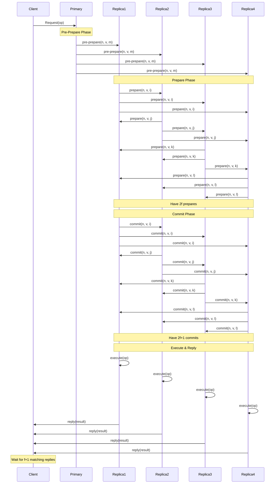
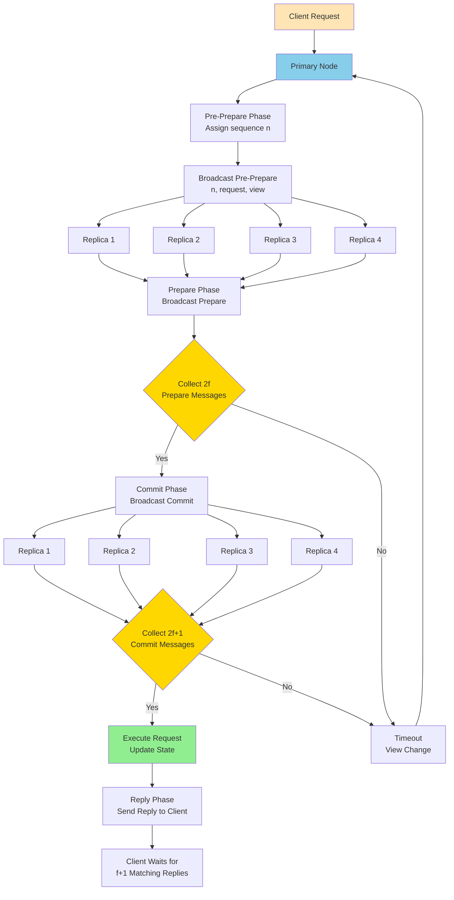
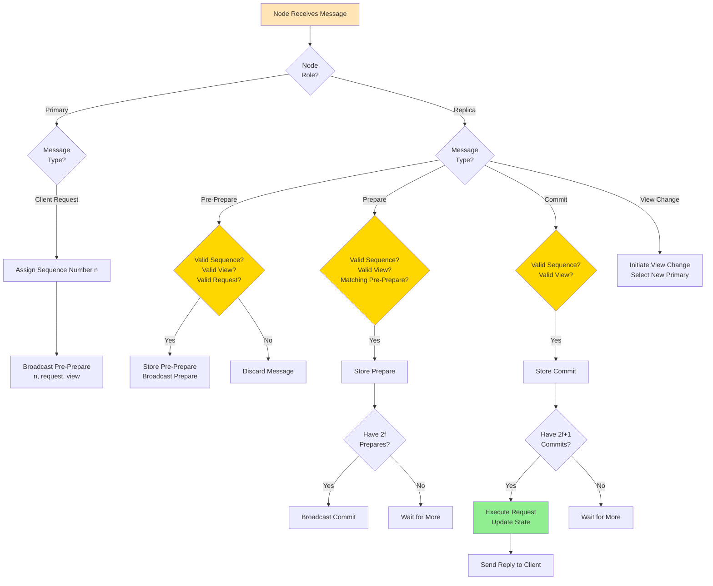

Byzantine Fault Tolerance (BFT) consensus algorithm interview questions covering distributed systems that handle arbitrary failures.

## Q1: How does Byzantine Fault Tolerance (BFT) work?

**Answer**:

**Byzantine Fault Tolerance** handles arbitrary failures, including malicious behavior.

**Sequence Diagram**:


**Overall Flow Diagram**:


**Individual Node Decision Diagram**:


**BFT Requirements**:
- **Total Nodes**: `n = 3f + 1` (where `f` is max Byzantine nodes)
- **Honest Nodes**: `2f + 1` (majority)
- **Fault Tolerance**: Up to `f` Byzantine nodes

**BFT Phases**:

**1. Request Phase**:
- Client sends request to primary
- Primary broadcasts to all replicas

**2. Pre-Prepare Phase**:
- Primary assigns sequence number
- Broadcasts pre-prepare message

**3. Prepare Phase**:
- Replicas broadcast prepare messages
- Wait for `2f` matching prepares

**4. Commit Phase**:
- Replicas broadcast commit messages
- Wait for `2f + 1` commits (including self)

**5. Reply Phase**:
- Execute request
- Send reply to client
- Client waits for `f + 1` matching replies

**Example**:
```python
class BFTNode:
    def __init__(self, node_id, total_nodes):
        self.node_id = node_id
        self.total_nodes = total_nodes
        self.f = (total_nodes - 1) // 3
        self.quorum = 2 * self.f + 1
        self.log = {}
    
    def pre_prepare(self, sequence, request):
        # Primary assigns sequence number
        self.log[sequence] = {
            'request': request,
            'prepares': set([self.node_id]),
            'commits': set()
        }
        return {'pre_prepare': (sequence, request)}
    
    def prepare(self, sequence, request):
        if sequence in self.log:
            self.log[sequence]['prepares'].add(self.node_id)
            if len(self.log[sequence]['prepares']) >= self.quorum:
                return {'prepared': True}
        return {'prepared': False}
    
    def commit(self, sequence):
        if sequence in self.log:
            self.log[sequence]['commits'].add(self.node_id)
            if len(self.log[sequence]['commits']) >= self.quorum:
                # Execute request
                return {'committed': True, 'result': self.execute(sequence)}
        return {'committed': False}
```

**Use Cases**:
- Hyperledger Fabric
- Stellar
- Ripple

---

