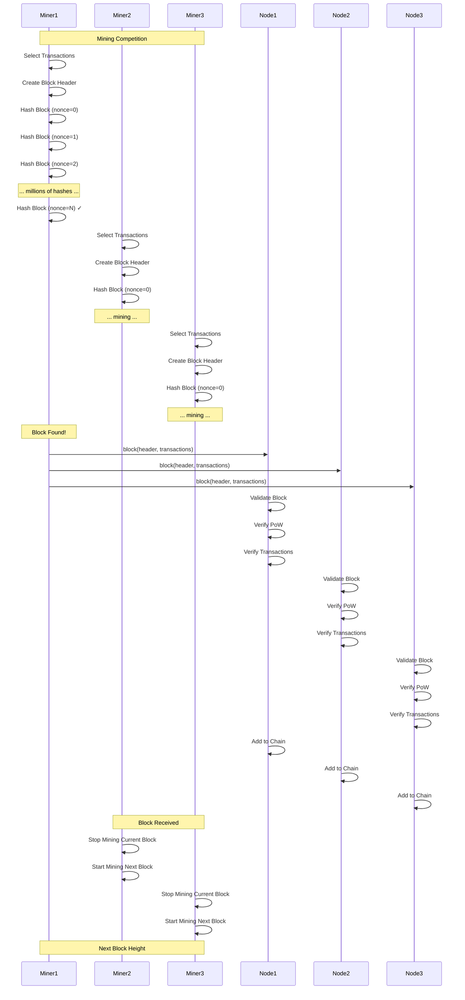
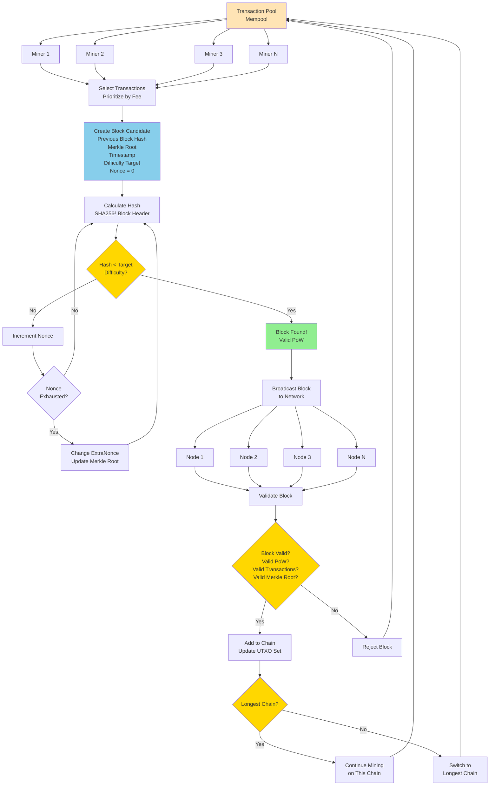
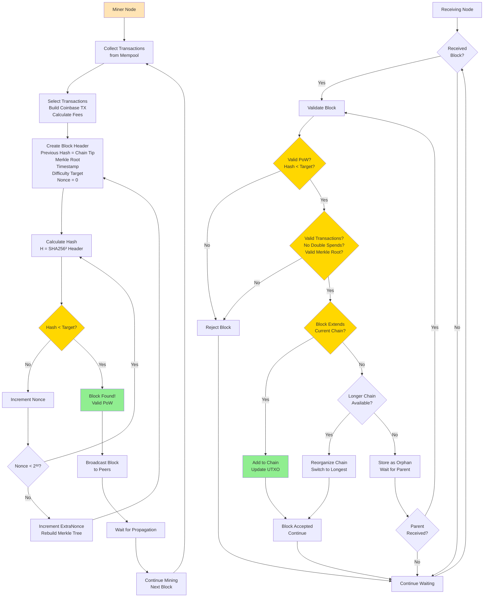

Bitcoin consensus algorithm interview questions covering Proof-of-Work (PoW) and Nakamoto consensus.

## Q1: How does Bitcoin (Nakamoto) consensus work?

**Answer**:

**Bitcoin** uses Proof-of-Work (PoW) consensus, also known as Nakamoto consensus.

**Sequence Diagram**:


**Overall Flow Diagram**:


**Individual Node Decision Diagram**:


**Bitcoin Consensus Process**:

**1. Transaction Collection**:
- Miners collect transactions from mempool
- Select transactions (prioritize fees)
- Create block candidate

**2. Block Structure**:
```
Block Header:
- Previous Block Hash
- Merkle Root (transactions)
- Timestamp
- Difficulty Target
- Nonce
```

**3. Mining (Proof-of-Work)**:
- Calculate hash: `SHA256(SHA256(BlockHeader))`
- Check if hash < target difficulty
- If not: Increment nonce, repeat
- If yes: Block found!

**4. Block Propagation**:
- Broadcast block to network
- Other nodes validate
- If valid: Add to chain

**5. Chain Selection**:
- Always extend longest valid chain
- Fork resolution: Longest chain wins
- Orphaned blocks: No reward

**Key Properties**:
- **Security**: Computational security
- **Decentralization**: Anyone can mine
- **Finality**: Probabilistic (6 confirmations)
- **Energy**: High energy consumption

**Example**:
```python
import hashlib
import time

class BitcoinMiner:
    def __init__(self, difficulty_target):
        self.difficulty_target = difficulty_target
    
    def mine_block(self, transactions, previous_hash):
        # Create block
        block = {
            'previous_hash': previous_hash,
            'merkle_root': self.calculate_merkle_root(transactions),
            'timestamp': int(time.time()),
            'nonce': 0,
            'transactions': transactions
        }
        
        # Mine (find nonce)
        while True:
            block['nonce'] += 1
            block_hash = self.hash_block(block)
            
            if int(block_hash, 16) < self.difficulty_target:
                return block, block_hash
    
    def hash_block(self, block):
        header = (
            block['previous_hash'] +
            block['merkle_root'] +
            str(block['timestamp']) +
            str(block['nonce'])
        )
        return hashlib.sha256(
            hashlib.sha256(header.encode()).digest()
        ).hexdigest()
    
    def calculate_merkle_root(self, transactions):
        # Simplified Merkle tree calculation
        if len(transactions) == 0:
            return "0" * 64
        
        # Hash all transactions
        hashes = [hashlib.sha256(str(tx).encode()).hexdigest() 
                  for tx in transactions]
        
        # Build Merkle tree
        while len(hashes) > 1:
            if len(hashes) % 2 == 1:
                hashes.append(hashes[-1])  # Duplicate last if odd
            
            hashes = [
                hashlib.sha256((hashes[i] + hashes[i+1]).encode()).hexdigest()
                for i in range(0, len(hashes), 2)
            ]
        
        return hashes[0]
```

**Difficulty Adjustment**:
- Every 2016 blocks (~2 weeks)
- Target time: 10 minutes per block
- Adjust difficulty to maintain rate

**Use Cases**:
- Bitcoin
- Litecoin
- Many PoW blockchains

---

