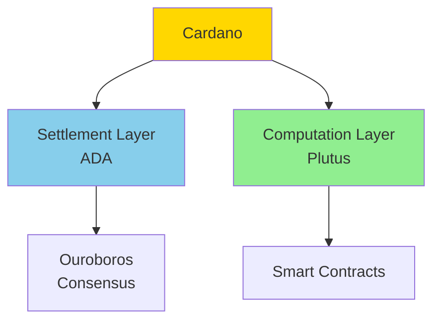

Easy-level Cardano interview questions covering blockchain basics, Plutus, and development.

## Q1: What is Cardano and how does it work?

**Answer**:

**Cardano** is a proof-of-stake blockchain platform.



**Key Features**:
- **Ouroboros**: Proof-of-Stake consensus
- **Plutus**: Smart contract language
- **Formal Verification**: Mathematically verified
- **Research-Driven**: Peer-reviewed

---

## Q2: What is Plutus and how do you write smart contracts?

**Answer**:

**Plutus** is Cardano's smart contract language (Haskell-based).

**Basic Contract**:
```haskell
{-# INLINABLE mkValidator #-}
mkValidator :: Data -> Data -> Data -> ()
mkValidator _ _ _ = ()

validator :: Validator
validator = mkValidatorScript $$(PlutusTx.compile [|| mkValidator ||])
```

**Contract Structure**:
- **Validator**: On-chain code
- **Datum**: Contract state
- **Redeemer**: Spending condition

---

## Q3: What are UTXOs and how do they work?

**Answer**:

**UTXO Model**:
- **Unspent Transaction Outputs**
- Each output can be spent once
- Similar to Bitcoin model
- More privacy than account model

**Transaction**:
- Consumes UTXOs (inputs)
- Creates new UTXOs (outputs)
- Must balance (inputs >= outputs)

---

## Q4: How does Ouroboros consensus work?

**Answer**:

**Ouroboros**:
- Proof-of-Stake
- Slot leaders produce blocks
- Epochs and slots structure
- Energy efficient

**Staking**:
- Stake ADA to pools
- Pools produce blocks
- Rewards distributed to delegators

---

## Q5: How do you interact with Cardano?

**Answer**:

**Using cardano-cli**:
```bash
# Query balance
cardano-cli query utxo --address $ADDRESS

# Build transaction
cardano-cli transaction build \
    --tx-in $TXIN \
    --tx-out $ADDRESS+1000000 \
    --out-file tx.raw

# Sign and submit
cardano-cli transaction sign --tx-body-file tx.raw --out-file tx.signed
cardano-cli transaction submit --tx-file tx.signed
```

---

## Q6: What are Cardano native tokens?

**Answer**:

**Native Tokens**:
- Built into protocol (not smart contracts)
- Policy IDs define tokens
- Minting and burning
- No gas fees for transfers

**Minting**:
```haskell
-- Define minting policy
policy :: ScriptContext -> Bool
policy ctx = True  -- Simple policy

-- Mint tokens
```

---

## Q7: How do you test Plutus contracts?

**Answer**:

**Testing**:
```haskell
import Plutus.Contract.Test

testContract :: EmulatorTrace ()
testContract = do
    -- Test logic
    assertContractState
```

**Emulator**:
- Local testing environment
- Simulate transactions
- Test contract logic

---

## Q8: What is the difference between Cardano and Ethereum?

**Answer**:

**Cardano**:
- UTXO model
- Proof-of-Stake
- Research-driven
- Formal verification

**Ethereum**:
- Account model
- Proof-of-Work (moving to PoS)
- Faster development
- Larger ecosystem

---

## Q9: How does Cardano governance work?

**Answer**:

**Voltaire**:
- Treasury system
- Voting on proposals
- Community-driven
- Catalyst project

**Voting**:
- Stake-based voting
- Proposals funded from treasury
- Community decides direction

---

## Q10: How do you deploy Plutus contracts?

**Answer**:

**Deployment**:
```bash
# Compile contract
cabal build

# Create script address
cardano-cli address build \
    --payment-script-file script.plutus \
    --out-file script.addr

# Deploy
cardano-cli transaction submit \
    --tx-file deploy.signed
```

---

