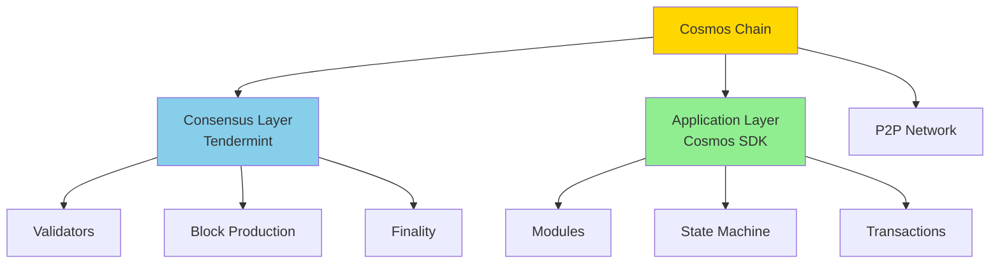
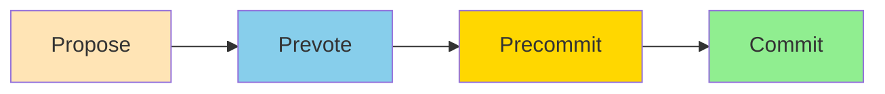
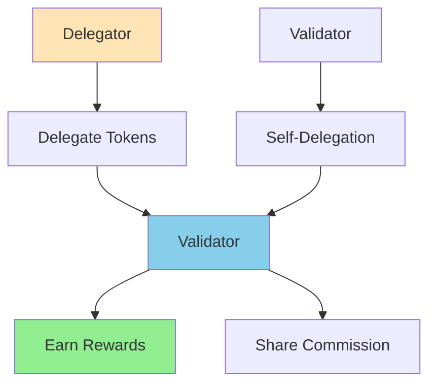
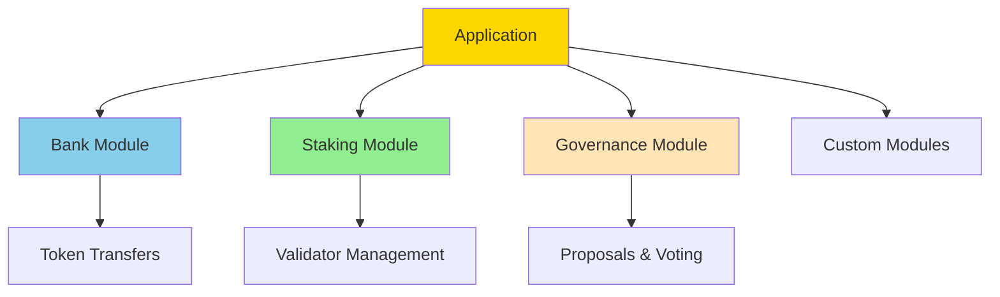
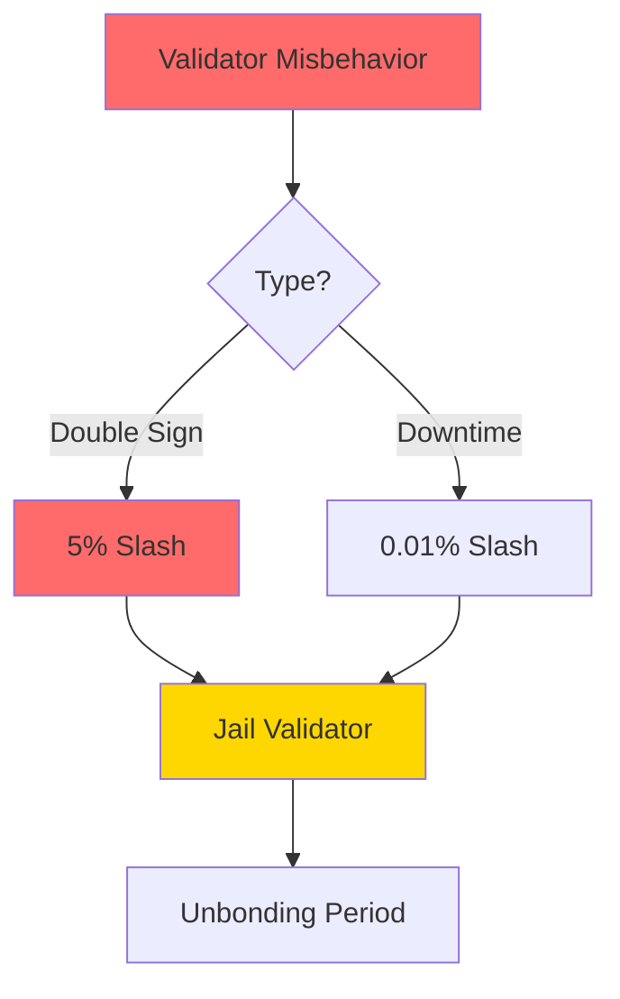

Easy-level Cosmos chain operation interview questions covering chain operations, algorithms, keys, validators, and modules.

## Q1: What are the key components of a Cosmos chain?

**Answer**:

**Chain Components**:



**Key Components**:

1. **Tendermint Core**: Consensus and networking
   - Byzantine Fault Tolerant (BFT) consensus
   - P2P networking
   - Block production

2. **Cosmos SDK**: Application framework
   - Modules (bank, staking, governance)
   - State management
   - Transaction processing

3. **Validators**: Block producers
   - Stake tokens
   - Participate in consensus
   - Earn rewards

4. **Full Nodes**: State maintainers
   - Store blockchain state
   - Serve queries
   - Validate blocks

5. **Light Clients**: Query-only nodes
   - Verify headers
   - Query state
   - Minimal resource usage

---

## Q2: How does Tendermint consensus work?

**Answer**:

**Tendermint Consensus Algorithm**:



**Consensus Steps**:

1. **Propose**: Validator proposes block
   - Highest voting power validator proposes
   - Block includes transactions from mempool

2. **Prevote**: Validators vote on proposal
   - Validators check if proposal is valid
   - Broadcast prevote if valid
   - Need 2/3+ voting power

3. **Precommit**: Validators commit to block
   - After seeing 2/3+ prevotes
   - Broadcast precommit
   - Need 2/3+ voting power

4. **Commit**: Block is finalized
   - After seeing 2/3+ precommits
   - Block is committed to chain
   - State is updated

**Key Properties**:
- **Safety**: No two validators commit different blocks
- **Liveness**: Chain continues even with 1/3 failures
- **Finality**: Blocks are final (no reorgs)

**Byzantine Fault Tolerance**:
- Tolerates up to 1/3 Byzantine validators
- Requires 2/3+ honest validators
- Ensures consensus safety

---

## Q3: What are validator keys and how are they managed?

**Answer**:

**Validator Key Types**:

1. **Consensus Key**: Used for consensus signing
   - Signs prevotes/precommits
   - Stored in validator node
   - Can be rotated

2. **Tendermint Key**: Used for block signing
   - Signs proposed blocks
   - Stored in validator node

3. **Account Key**: Used for transactions
   - Sends transactions
   - Receives rewards
   - Can be different from validator

**Key Management**:
```bash
# Generate consensus key
gaiad init validator --chain-id mychain

# This creates:
# ~/.gaia/config/priv_validator_key.json  # Consensus key
# ~/.gaia/config/node_key.json           # Node key

# View validator address
gaiad tendermint show-address

# View validator pubkey
gaiad tendermint show-validator
```

**Key Security**:
- **Hardware Security Modules (HSM)**: Store keys in hardware
- **Key Rotation**: Periodically rotate keys
- **Multi-sig**: Use multiple keys for security
- **Backup**: Securely backup keys

**Key Derivation**:
```go
// Generate Ed25519 key pair
privKey := ed25519.GenPrivKey()
pubKey := privKey.PubKey()

// Get address from pubkey
address := sdk.AccAddress(pubKey.Address())
```

---

## Q4: How do you become a validator?

**Answer**:

**Validator Setup Process**:

1. **Create Validator Account**:
```bash
# Create account
gaiad keys add validator

# Fund account
gaiad tx bank send <from> <validator-address> 1000000uatom
```

2. **Initialize Node**:
```bash
# Initialize node
gaiad init my-validator --chain-id cosmoshub-4

# Download genesis
curl https://raw.githubusercontent.com/cosmos/mainnet/master/genesis.json > ~/.gaia/config/genesis.json

# Set peers
sed -i 's/persistent_peers = ""/persistent_peers = "..."/' ~/.gaia/config/config.toml
```

3. **Create Validator**:
```bash
# Create validator transaction
gaiad tx staking create-validator \
  --amount=1000000uatom \
  --pubkey=$(gaiad tendermint show-validator) \
  --moniker="My Validator" \
  --commission-rate="0.10" \
  --commission-max-rate="0.20" \
  --commission-max-change-rate="0.01" \
  --min-self-delegation="1" \
  --from=validator \
  --chain-id=cosmoshub-4
```

**Validator Parameters**:
- **Moniker**: Validator name
- **Commission Rate**: Fee charged to delegators
- **Max Commission**: Maximum commission rate
- **Min Self-Delegation**: Minimum self-staked amount

**Validator Requirements**:
- Minimum stake (varies by chain)
- Running node 24/7
- Good network connection
- Security practices

---

## Q5: How does staking and delegation work?

**Answer**:

**Staking Mechanism**:



**Delegation Process**:

1. **Delegate**:
```bash
# Delegate to validator
gaiad tx staking delegate <validator-address> 1000000uatom --from delegator
```

2. **Rewards**:
   - Validators earn block rewards
   - Delegators share in rewards
   - Validator takes commission

3. **Undelegate**:
```bash
# Undelegate (unbonding period applies)
gaiad tx staking unbond <validator-address> 1000000uatom --from delegator
```

**Unbonding Period**:
- Tokens are locked during unbonding
- Typically 21 days for Cosmos Hub
- Prevents validator misbehavior

**Redelegation**:
```bash
# Move delegation to another validator
gaiad tx staking redelegate <src-validator> <dst-validator> 1000000uatom --from delegator
```

**Reward Distribution**:
- Block rewards distributed to validators
- Validators take commission (e.g., 10%)
- Remaining rewards shared with delegators
- Proportional to stake

---

## Q6: What are Cosmos SDK modules and how do they work?

**Answer**:

**Module Architecture**:



**Core Modules**:

1. **Bank Module**: Token management
   - Send/receive tokens
   - Query balances
   - Mint/burn tokens

2. **Staking Module**: Validator management
   - Create validators
   - Delegate/undelegate
   - Validator set updates

3. **Governance Module**: On-chain governance
   - Submit proposals
   - Vote on proposals
   - Parameter changes

4. **Distribution Module**: Reward distribution
   - Distribute block rewards
   - Handle commissions
   - Community pool

5. **Slashing Module**: Penalties
   - Slash for downtime
   - Slash for double-signing
   - Jail validators

**Module Interaction**:
- Modules communicate via keepers
- Each module has its own store
- Modules can depend on other modules

---

## Q7: How does block production work?

**Answer**:

**Block Production Process**:

1. **Transaction Collection**:
   - Node collects transactions from mempool
   - Validates transactions
   - Orders transactions

2. **Block Proposal**:
   - Proposer creates block
   - Includes transactions
   - Signs block with consensus key

3. **Consensus**:
   - Validators vote on block
   - Need 2/3+ voting power
   - Block is committed

4. **State Update**:
   - Execute transactions
   - Update state
   - Emit events

**Block Structure**:
```go
type Block struct {
    Header     Header
    Data       Data      // Transactions
    Evidence   Evidence  // Proof of misbehavior
    LastCommit Commit    // Previous block commits
}
```

**Block Time**:
- Typically 1-6 seconds
- Configurable per chain
- Faster than Bitcoin/Ethereum

**Block Size**:
- Limited by consensus parameters
- Typically 1-10 MB
- Prevents spam attacks

---

## Q8: How do you query chain state?

**Answer**:

**Query Methods**:

1. **CLI Queries**:
```bash
# Query account balance
gaiad query bank balances <address>

# Query validator info
gaiad query staking validator <validator-address>

# Query governance proposals
gaiad query gov proposals

# Query module parameters
gaiad query staking params
```

2. **REST API**:
```bash
# Query via REST
curl http://localhost:1317/cosmos/bank/v1beta1/balances/<address>

# Query validators
curl http://localhost:1317/cosmos/staking/v1beta1/validators
```

3. **gRPC**:
```go
// Query via gRPC
conn, _ := grpc.Dial("localhost:9090", grpc.WithInsecure())
client := banktypes.NewQueryClient(conn)

resp, err := client.Balance(context.Background(), &banktypes.QueryBalanceRequest{
    Address: address,
    Denom:   "uatom",
})
```

4. **Tendermint RPC**:
```bash
# Query block
curl http://localhost:26657/block?height=100

# Query transaction
curl http://localhost:26657/tx?hash=<tx-hash>

# Query account
curl http://localhost:26657/abci_query?path="/store/acc/key"&data=<address>
```

---

## Q9: How does slashing work?

**Answer**:

**Slashing Types**:

1. **Double Signing**:
   - Validator signs two different blocks at same height
   - Severe penalty (e.g., 5% of stake)
   - Validator is jailed

2. **Downtime**:
   - Validator misses too many blocks
   - Moderate penalty (e.g., 0.01% of stake)
   - Validator is jailed

**Slashing Process**:



**Slashing Parameters**:
- **Slash Fraction Double Sign**: Penalty for double signing
- **Slash Fraction Downtime**: Penalty for downtime
- **Signed Blocks Window**: Blocks to check for downtime
- **Min Signed Per Window**: Minimum blocks to sign

**Jailing**:
- Validator is jailed after slashing
- Cannot participate in consensus
- Must wait for unjail period
- Can unjail after period expires

**Unjailing**:
```bash
# Unjail validator
gaiad tx slashing unjail --from validator
```

---

## Q10: How do you run a full node?

**Answer**:

**Full Node Setup**:

1. **Install Binary**:
```bash
# Download and install
git clone https://github.com/cosmos/gaia
cd gaia
make install

# Verify installation
gaiad version
```

2. **Initialize Node**:
```bash
# Initialize
gaiad init my-node --chain-id cosmoshub-4

# Download genesis
curl https://raw.githubusercontent.com/cosmos/mainnet/master/genesis.json > ~/.gaia/config/genesis.json

# Verify genesis
gaiad validate-genesis
```

3. **Configure Node**:
```bash
# Edit config.toml
nano ~/.gaia/config/config.toml

# Set persistent peers
persistent_peers = "node1@ip:port,node2@ip:port"

# Set seeds
seeds = "seed1@ip:port,seed2@ip:port"

# Enable API
[api]
enable = true
address = "tcp://0.0.0.0:1317"
```

4. **Start Node**:
```bash
# Start node
gaiad start

# Or as service
sudo systemctl start gaiad
```

**Node Types**:
- **Full Node**: Stores all state, can query
- **Archive Node**: Stores all historical state
- **Pruned Node**: Stores recent state only
- **Validator Node**: Full node + validator

**Sync Methods**:
- **State Sync**: Fast sync from snapshot
- **Block Sync**: Sync from genesis
- **Fast Sync**: Sync recent blocks only

---

