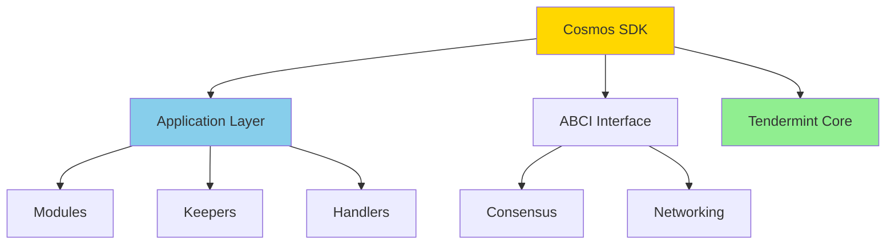

Easy-level Cosmos SDK interview questions covering chain code, SDK basics, and Ignite CLI.

## Q1: What is Cosmos SDK and how does it work?

**Answer**:

**Cosmos SDK** is a framework for building blockchain applications in Go. It provides modular components that developers can combine to create custom blockchains.



**Key Components**:
- **ABCI (Application Blockchain Interface)**: Interface between application and consensus engine
- **Tendermint Core**: Consensus and networking layer
- **Modules**: Reusable components (bank, staking, governance)
- **Keepers**: State management layer
- **Handlers**: Process transactions

**Architecture**:
```
┌─────────────────┐
│  Application    │  (Your custom logic)
├─────────────────┤
│  Cosmos SDK     │  (Modules, Keepers, Handlers)
├─────────────────┤
│  ABCI           │  (Interface)
├─────────────────┤
│  Tendermint     │  (Consensus & P2P)
└─────────────────┘
```

---

## Q2: Explain the basic structure of a Cosmos SDK module.

**Answer**:

A **module** is the basic unit of functionality in Cosmos SDK. Each module has:

**Structure**:
```go
// Module structure
module/
├── keeper/
│   └── keeper.go          // State management
├── types/
│   ├── keys.go            // Store keys
│   ├── msgs.go            // Message types
│   └── params.go          // Parameters
├── handler.go             // Message handlers
├── querier.go             // Query handlers
└── module.go              // Module definition
```

**Example Module**:
```go
package bank

import (
    sdk "github.com/cosmos/cosmos-sdk/types"
)

// Keeper manages state
type Keeper struct {
    storeKey sdk.StoreKey
    cdc      codec.Codec
}

// NewKeeper creates a new keeper
func NewKeeper(cdc codec.Codec, storeKey sdk.StoreKey) Keeper {
    return Keeper{
        storeKey: storeKey,
        cdc:      cdc,
    }
}

// SendCoins transfers coins
func (k Keeper) SendCoins(ctx sdk.Context, from, to sdk.AccAddress, amount sdk.Coins) error {
    // Implementation
    return nil
}
```

**Key Concepts**:
- **Keeper**: Manages access to module state
- **StoreKey**: Identifies the store for this module
- **Context**: Contains blockchain state (height, time, etc.)
- **Messages**: User actions (transactions)
- **Queries**: Read-only state access

---

## Q3: How do you create a new blockchain with Ignite CLI?

**Answer**:

**Ignite CLI** is a tool for scaffolding Cosmos SDK blockchains.

**Installation**:
```bash
curl https://get.ignite.com/cli! | bash
```

**Create New Chain**:
```bash
# Create a new blockchain
ignite scaffold chain github.com/user/mychain

# This creates:
# - Chain application code
# - Module structure
# - Configuration files
# - Build scripts
```

**Project Structure**:
```
mychain/
├── app/
│   └── app.go              # Application setup
├── cmd/
│   └── mychaind/           # Daemon binary
├── x/
│   └── mychain/             # Custom modules
├── proto/                   # Protocol buffers
└── config.yml               # Ignite config
```

**Add a Module**:
```bash
# Scaffold a new module
ignite scaffold module mymodule

# Add CRUD operations
ignite scaffold list post title body --module mymodule
```

**Run Chain**:
```bash
# Start local node
ignite chain serve

# Build and run
ignite chain build
./build/mychaind start
```

**Key Ignite Commands**:
- `ignite scaffold chain`: Create new chain
- `ignite scaffold module`: Add module
- `ignite scaffold list`: Add CRUD operations
- `ignite scaffold message`: Add transaction
- `ignite chain serve`: Run development chain

---

## Q4: What are messages and handlers in Cosmos SDK?

**Answer**:

**Messages** are user actions that modify state. **Handlers** process these messages.

**Message Definition**:
```go
package types

import (
    sdk "github.com/cosmos/cosmos-sdk/types"
)

// MsgSend represents a send transaction
type MsgSend struct {
    FromAddress string
    ToAddress   string
    Amount      sdk.Coins
}

// ValidateBasic performs basic validation
func (msg MsgSend) ValidateBasic() error {
    if msg.FromAddress == "" {
        return sdkerrors.Wrap(sdkerrors.ErrInvalidAddress, "from address cannot be empty")
    }
    if msg.ToAddress == "" {
        return sdkerrors.Wrap(sdkerrors.ErrInvalidAddress, "to address cannot be empty")
    }
    if !msg.Amount.IsValid() {
        return sdkerrors.Wrap(sdkerrors.ErrInvalidCoins, "amount is invalid")
    }
    return nil
}

// GetSigners returns addresses that must sign
func (msg MsgSend) GetSigners() []sdk.AccAddress {
    from, _ := sdk.AccAddressFromBech32(msg.FromAddress)
    return []sdk.AccAddress{from}
}
```

**Handler Implementation**:
```go
package keeper

import (
    sdk "github.com/cosmos/cosmos-sdk/types"
    "github.com/user/mychain/x/mymodule/types"
)

// HandleMsgSend processes send messages
func (k Keeper) HandleMsgSend(ctx sdk.Context, msg types.MsgSend) (*sdk.Result, error) {
    // Convert addresses
    from, err := sdk.AccAddressFromBech32(msg.FromAddress)
    if err != nil {
        return nil, err
    }
    
    to, err := sdk.AccAddressFromBech32(msg.ToAddress)
    if err != nil {
        return nil, err
    }
    
    // Transfer coins
    err = k.SendCoins(ctx, from, to, msg.Amount)
    if err != nil {
        return nil, err
    }
    
    // Emit event
    ctx.EventManager().EmitEvent(
        sdk.NewEvent(
            types.EventTypeSend,
            sdk.NewAttribute(types.AttributeKeyFrom, msg.FromAddress),
            sdk.NewAttribute(types.AttributeKeyTo, msg.ToAddress),
            sdk.NewAttribute(sdk.AttributeKeyAmount, msg.Amount.String()),
        ),
    )
    
    return &sdk.Result{Events: ctx.EventManager().Events()}, nil
}
```

**Message Flow**:
1. User creates transaction with message
2. Transaction is broadcast to network
3. Validator receives transaction
4. Handler processes message
5. State is updated
6. Event is emitted

---

## Q5: How do you query state in Cosmos SDK?

**Answer**:

**Queries** are read-only operations that retrieve state.

**Query Request**:
```go
package types

// QueryBalanceRequest requests account balance
type QueryBalanceRequest struct {
    Address string
}

// QueryBalanceResponse returns account balance
type QueryBalanceResponse struct {
    Balance sdk.Coins
}
```

**Querier Implementation**:
```go
package keeper

import (
    "github.com/cosmos/cosmos-sdk/types/query"
    "google.golang.org/grpc/codes"
    "google.golang.org/grpc/status"
)

// Balance queries account balance
func (k Keeper) Balance(ctx sdk.Context, req *types.QueryBalanceRequest) (*types.QueryBalanceResponse, error) {
    if req == nil {
        return nil, status.Error(codes.InvalidArgument, "invalid request")
    }
    
    // Parse address
    addr, err := sdk.AccAddressFromBech32(req.Address)
    if err != nil {
        return nil, status.Error(codes.InvalidArgument, "invalid address")
    }
    
    // Get balance
    balance := k.GetBalance(ctx, addr)
    
    return &types.QueryBalanceResponse{
        Balance: balance,
    }, nil
}
```

**Register Query**:
```go
// In module.go
func (am AppModule) RegisterQueryService(cfg module.Configurator) {
    types.RegisterQueryServer(cfg.QueryServer(), am.keeper)
}
```

**Query from CLI**:
```bash
# Query balance
mychaind query bank balances <address>

# Query with gRPC
grpcurl -plaintext localhost:9090 cosmos.bank.v1beta1.Query/Balance \
  '{"address": "cosmos1..."}'
```

**Query Types**:
- **gRPC queries**: Standard queries via gRPC
- **ABCI queries**: Direct store queries
- **REST queries**: HTTP/REST API

---

## Q6: What is a Keeper and how does it manage state?

**Answer**:

A **Keeper** is a module's interface to its state. It encapsulates all state access logic.

**Keeper Structure**:
```go
package keeper

import (
    sdk "github.com/cosmos/cosmos-sdk/types"
    "github.com/cosmos/cosmos-sdk/store/types"
)

type Keeper struct {
    storeKey      sdk.StoreKey
    cdc           codec.BinaryCodec
    paramSpace    types.ParamSubspace
    accountKeeper types.AccountKeeper
    bankKeeper    types.BankKeeper
}

// NewKeeper creates a new keeper
func NewKeeper(
    cdc codec.BinaryCodec,
    storeKey sdk.StoreKey,
    paramSpace types.ParamSubspace,
    ak types.AccountKeeper,
    bk types.BankKeeper,
) Keeper {
    return Keeper{
        storeKey:      storeKey,
        cdc:           cdc,
        paramSpace:    paramSpace,
        accountKeeper: ak,
        bankKeeper:    bk,
    }
}
```

**State Access**:
```go
// Get retrieves value from store
func (k Keeper) Get(ctx sdk.Context, key []byte) []byte {
    store := ctx.KVStore(k.storeKey)
    return store.Get(key)
}

// Set stores value
func (k Keeper) Set(ctx sdk.Context, key []byte, value []byte) {
    store := ctx.KVStore(k.storeKey)
    store.Set(key, value)
}

// Has checks if key exists
func (k Keeper) Has(ctx sdk.Context, key []byte) bool {
    store := ctx.KVStore(k.storeKey)
    return store.Has(key)
}

// Delete removes key
func (k Keeper) Delete(ctx sdk.Context, key []byte) {
    store := ctx.KVStore(k.storeKey)
    store.Delete(key)
}
```

**Key Principles**:
- **Encapsulation**: Only keeper can access its store
- **Dependency Injection**: Keepers can use other keepers
- **Store Keys**: Each module has unique store key
- **Context**: Provides access to current blockchain state

---

## Q7: How do you add a new transaction type with Ignite?

**Answer**:

**Scaffold Message**:
```bash
# Create a new message type
ignite scaffold message create-post title body --module blog

# This creates:
# - Message type (types/msg_create_post.go)
# - Handler (keeper/msg_server.go)
# - CLI command (client/cli/tx_create_post.go)
```

**Generated Message**:
```go
package types

// MsgCreatePost defines the CreatePost message
type MsgCreatePost struct {
    Creator string
    Title   string
    Body    string
}

// NewMsgCreatePost creates a new MsgCreatePost instance
func NewMsgCreatePost(creator string, title string, body string) *MsgCreatePost {
    return &MsgCreatePost{
        Creator: creator,
        Title:   title,
        Body:    body,
    }
}

// ValidateBasic performs basic validation
func (msg *MsgCreatePost) ValidateBasic() error {
    if msg.Creator == "" {
        return sdkerrors.Wrap(sdkerrors.ErrInvalidAddress, "creator cannot be empty")
    }
    if msg.Title == "" {
        return sdkerrors.Wrap(sdkerrors.ErrInvalidRequest, "title cannot be empty")
    }
    return nil
}

// GetSigners returns the signers
func (msg *MsgCreatePost) GetSigners() []sdk.AccAddress {
    creator, err := sdk.AccAddressFromBech32(msg.Creator)
    if err != nil {
        panic(err)
    }
    return []sdk.AccAddress{creator}
}
```

**Handler Implementation**:
```go
package keeper

func (k msgServer) CreatePost(goCtx context.Context, msg *types.MsgCreatePost) (*types.MsgCreatePostResponse, error) {
    ctx := sdk.UnwrapSDKContext(goCtx)
    
    // Create post
    post := types.Post{
        Creator: msg.Creator,
        Title:   msg.Title,
        Body:    msg.Body,
        Id:      k.AppendPost(ctx, types.Post{
            Creator: msg.Creator,
            Title:   msg.Title,
            Body:    msg.Body,
        }),
    }
    
    // Emit event
    ctx.EventManager().EmitEvent(
        sdk.NewEvent(
            types.EventTypePostCreated,
            sdk.NewAttribute(types.AttributeKeyPostId, fmt.Sprintf("%d", post.Id)),
        ),
    )
    
    return &types.MsgCreatePostResponse{Id: post.Id}, nil
}
```

**Send Transaction**:
```bash
# From CLI
mychaind tx blog create-post "My Title" "My Body" --from alice

# From code
msg := types.NewMsgCreatePost(
    creator.String(),
    "My Title",
    "My Body",
)
txResp, err := client.BroadcastTx(ctx, clientCtx, msg)
```

---

## Q8: What are the main Cosmos SDK modules?

**Answer**:

**Core Modules**:

1. **Bank Module**: Token transfers and balances
   - `SendCoins`: Transfer tokens
   - `MintCoins`: Create new tokens
   - `BurnCoins`: Destroy tokens

2. **Staking Module**: Validator management
   - `Delegate`: Stake tokens
   - `Undelegate`: Unstake tokens
   - `Redelegate`: Move stake between validators

3. **Governance Module**: On-chain governance
   - `SubmitProposal`: Create proposal
   - `Vote`: Vote on proposal
   - `Deposit`: Add deposit to proposal

4. **Distribution Module**: Fee distribution
   - Distributes fees to validators
   - Handles validator rewards

5. **Slashing Module**: Validator penalties
   - Slashes for downtime
   - Slashes for double-signing

6. **Auth Module**: Account management
   - Account creation
   - Sequence numbers
   - Public keys

**Using Modules**:
```go
// In app.go
app := simapp.NewSimApp(
    logger,
    db,
    nil,
    true,
    map[int64]bool{},
    simapp.DefaultNodeHome,
    simapp.MakeEncodingConfig(),
    simapp.EmptyAppOptions{},
    baseapp.SetChainID("mychain"),
)
```

**Module Dependencies**:
- Modules can depend on other modules
- Access via keeper interfaces
- Prevents circular dependencies

---

## Q9: How do you test Cosmos SDK modules?

**Answer**:

**Unit Testing**:
```go
package keeper_test

import (
    "testing"
    "github.com/cosmos/cosmos-sdk/simapp"
    "github.com/stretchr/testify/require"
    "github.com/user/mychain/x/mymodule/keeper"
    "github.com/user/mychain/x/mymodule/types"
)

func TestKeeper(t *testing.T) {
    app := simapp.Setup(false)
    ctx := app.BaseApp.NewContext(false, tmproto.Header{})
    
    keeper := app.MyModuleKeeper
    
    // Test operations
    msg := types.MsgCreatePost{
        Creator: "cosmos1...",
        Title:   "Test",
        Body:    "Body",
    }
    
    _, err := keeper.CreatePost(ctx, &msg)
    require.NoError(t, err)
    
    // Query
    post, found := keeper.GetPost(ctx, 1)
    require.True(t, found)
    require.Equal(t, "Test", post.Title)
}
```

**Integration Testing**:
```go
func TestEndToEnd(t *testing.T) {
    app := simapp.Setup(false)
    ctx := app.BaseApp.NewContext(false, tmproto.Header{})
    
    // Create account
    acc := app.AccountKeeper.NewAccountWithAddress(ctx, addr)
    app.AccountKeeper.SetAccount(ctx, acc)
    
    // Fund account
    err := app.BankKeeper.SendCoins(
        ctx,
        moduleAcc,
        addr,
        sdk.NewCoins(sdk.NewCoin("stake", sdk.NewInt(1000))),
    )
    require.NoError(t, err)
    
    // Execute transaction
    msg := types.NewMsgCreatePost(addr.String(), "Title", "Body")
    handler := keeper.NewHandler(app.MyModuleKeeper)
    _, err = handler(ctx, msg)
    require.NoError(t, err)
}
```

**Testing Tools**:
- **simapp**: Testing application
- **testify**: Assertions
- **Mock**: Mock keepers for isolation

---

## Q10: What is the difference between ABCI and Cosmos SDK?

**Answer**:

**ABCI (Application Blockchain Interface)**:
- **Purpose**: Interface between application and consensus
- **Language**: Protocol buffers
- **Level**: Low-level interface

**ABCI Methods**:
```go
// ABCI interface
type Application interface {
    // Consensus methods
    Info(RequestInfo) ResponseInfo
    InitChain(RequestInitChain) ResponseInitChain
    BeginBlock(RequestBeginBlock) ResponseBeginBlock
    DeliverTx(RequestDeliverTx) ResponseDeliverTx
    EndBlock(RequestEndBlock) ResponseEndBlock
    Commit() ResponseCommit
    
    // Query methods
    Query(RequestQuery) ResponseQuery
}
```

**Cosmos SDK**:
- **Purpose**: Framework for building applications
- **Language**: Go
- **Level**: High-level framework

**Relationship**:
```
┌─────────────┐
│ Application │  (Your code)
├─────────────┤
│ Cosmos SDK  │  (Modules, Keepers, Handlers)
├─────────────┤
│ ABCI        │  (Interface)
├─────────────┤
│ Tendermint  │  (Consensus)
└─────────────┘
```

**Key Differences**:
- **ABCI**: Protocol specification
- **Cosmos SDK**: Implementation framework
- **ABCI**: Works with any consensus engine
- **Cosmos SDK**: Specifically for Tendermint

**Usage**:
- Cosmos SDK implements ABCI
- You build on Cosmos SDK
- Tendermint uses ABCI to communicate

---

