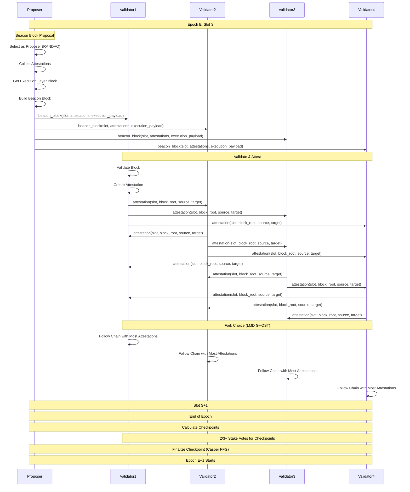
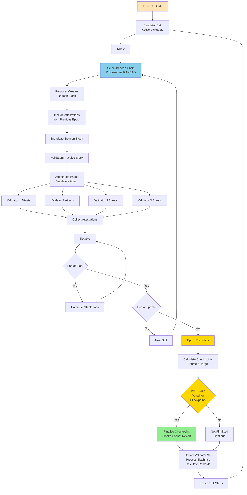
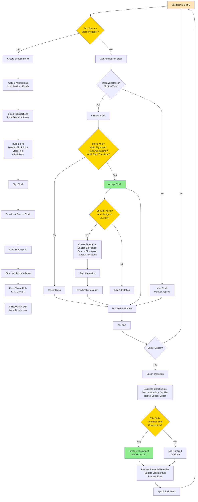

Ethereum Proof-of-Stake consensus algorithm interview questions covering Casper FFG and LMD GHOST.

## Q1: How does Ethereum consensus work (Proof-of-Stake)?

**Answer**:

**Ethereum 2.0** uses Proof-of-Stake consensus (Casper FFG + LMD GHOST).

**Sequence Diagram**:


**Overall Flow Diagram**:


**Individual Node Decision Diagram**:


**Ethereum PoS Components**:

**1. Beacon Chain**:
- Coordinates validators
- Manages validator set
- Handles finality

**2. Validator Duties**:
- **Proposing**: Create blocks (selected randomly)
- **Attesting**: Vote on blocks (every epoch)
- **Sync Committee**: Light client support

**3. Slot and Epoch**:
- **Slot**: 12 seconds (one block)
- **Epoch**: 32 slots (~6.4 minutes)
- **Finality**: ~2 epochs (~13 minutes)

**4. Fork Choice (LMD GHOST)**:
- Latest Message Driven Greedy Heaviest Observed Subtree
- Follows chain with most attestations
- Resolves forks

**5. Finality (Casper FFG)**:
- Finalized blocks cannot be reverted
- Requires `2/3+` validator stake
- Checkpoint every epoch

**Key Properties**:
- **Security**: Economic security (stake at risk)
- **Energy**: 99.9% less energy than PoW
- **Finality**: Checkpoint finality
- **Scalability**: Sharding support

**Example**:
```python
class EthereumValidator:
    def __init__(self, validator_index, balance):
        self.validator_index = validator_index
        self.balance = balance  # In ETH
        self.activation_epoch = None
        self.exit_epoch = None
    
    def propose_block(self, slot, parent_block):
        # Selected as proposer
        if self.is_proposer(slot):
            block = {
                'slot': slot,
                'parent_root': parent_block.hash,
                'state_root': self.get_state_root(),
                'body': self.get_transactions(),
                'signature': self.sign_block()
            }
            return block
        return None
    
    def attest(self, slot, block_root):
        # Attest to block
        attestation = {
            'slot': slot,
            'index': self.validator_index,
            'beacon_block_root': block_root,
            'source': self.get_source_checkpoint(),
            'target': self.get_target_checkpoint(),
            'signature': self.sign_attestation()
        }
        return attestation
    
    def get_rewards(self, epoch):
        # Calculate rewards based on participation
        base_reward = self.calculate_base_reward()
        if self.attested_correctly(epoch):
            return base_reward
        else:
            # Penalty for missing attestations
            return -base_reward
```

**Slashing Conditions**:
- **Double Voting**: Two different attestations in same epoch
- **Surround Voting**: Attestation surrounds another
- **Proposer Violations**: Invalid block proposals

**Use Cases**:
- Ethereum 2.0
- High-security PoS systems

---

