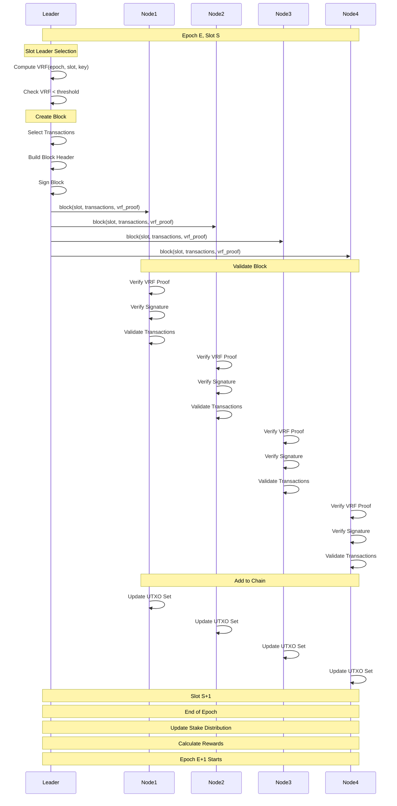
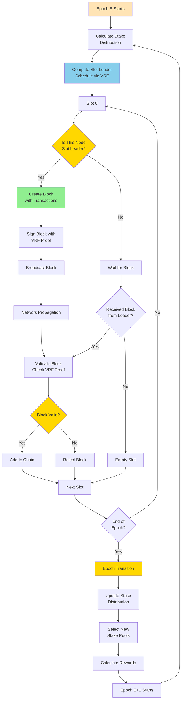
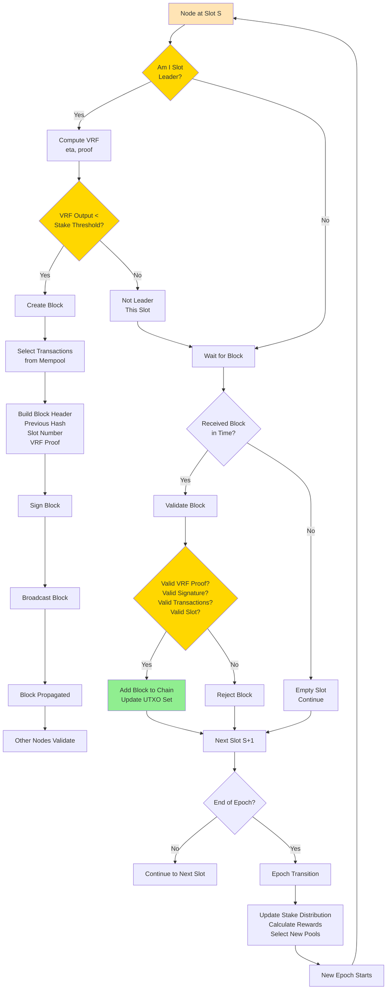

Ouroboros consensus algorithm interview questions covering Cardano's Proof-of-Stake consensus mechanism.

## Q1: How does Ouroboros (Cardano) consensus work?

**Answer**:

**Ouroboros** is Cardano's Proof-of-Stake consensus algorithm.

**Sequence Diagram**:


**Overall Flow Diagram**:


**Individual Node Decision Diagram**:


**Ouroboros Phases**:

**1. Epoch Structure**:
- **Epoch**: 432,000 slots (5 days)
- **Slot**: 1 second
- **Slot Leader**: Selected based on stake

**2. Slot Leader Selection**:
- Probability proportional to stake
- Uses Verifiable Random Function (VRF)
- Leaders known in advance (for security)

**3. Block Creation**:
- Slot leader creates block
- Includes transactions
- Signs with private key

**4. Chain Selection**:
- Longest chain rule
- Fork resolution by stake weight

**5. Epoch Transition**:
- Update stake distribution
- Recalculate leader schedule

**Key Properties**:
- **Security**: Cryptographically secure
- **Energy Efficient**: No mining required
- **Decentralized**: Stake-based selection
- **Formal Verification**: Mathematically proven

**Example**:
```haskell
-- Slot leader selection
selectSlotLeader :: Epoch -> Slot -> StakeDistribution -> Maybe StakePool
selectSlotLeader epoch slot stakeDist = do
    -- Calculate probability based on stake
    let totalStake = sumStake stakeDist
    let poolStake = getPoolStake pool stakeDist
    let probability = poolStake / totalStake
    
    -- VRF to determine if selected
    let vrfOutput = computeVRF epoch slot poolPrivateKey
    if vrfOutput < probability then
        Just pool
    else
        Nothing

-- Block creation
createBlock :: SlotLeader -> [Transaction] -> Block
createBlock leader txs = Block
    { slot = currentSlot
    , transactions = txs
    , previousHash = getPreviousHash
    , signature = signBlock leaderPrivateKey
    }
```

**Ouroboros Variants**:
- **Ouroboros Classic**: Basic PoS
- **Ouroboros Praos**: Semi-synchronous, private leader selection
- **Ouroboros Genesis**: No trusted setup
- **Ouroboros Chronos**: Time synchronization

**Use Cases**:
- Cardano blockchain
- High-security PoS systems

---

