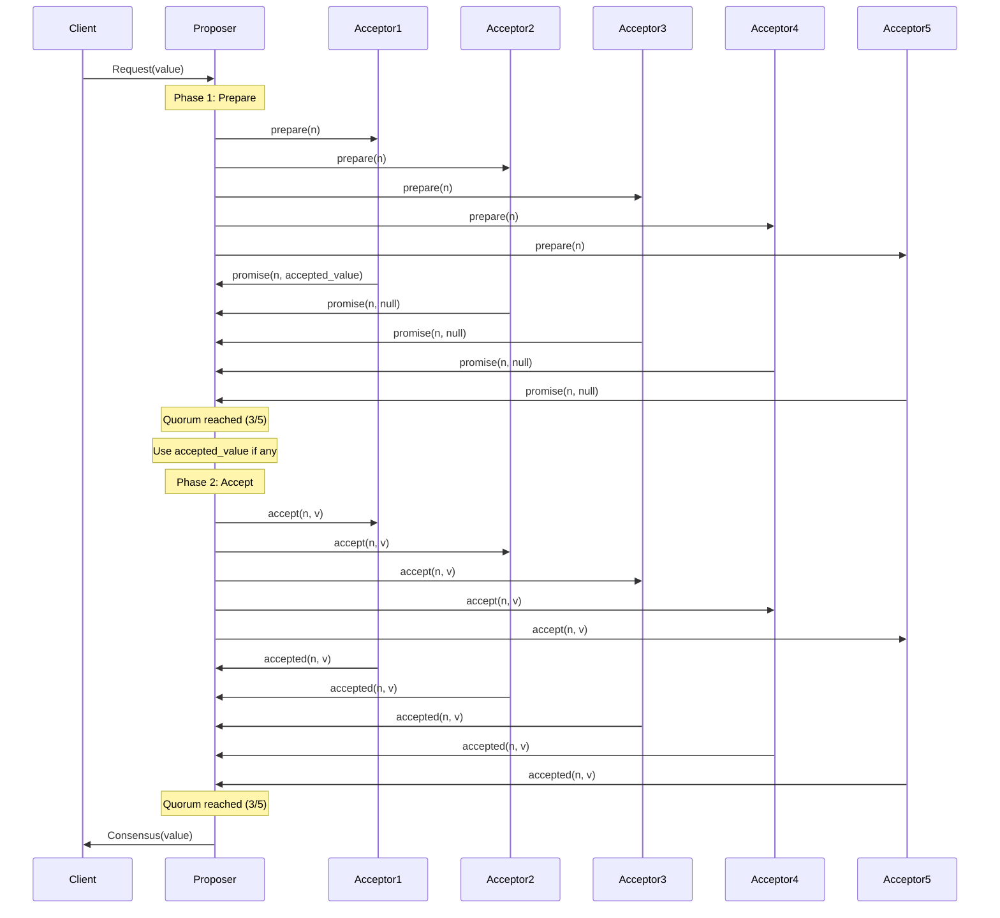
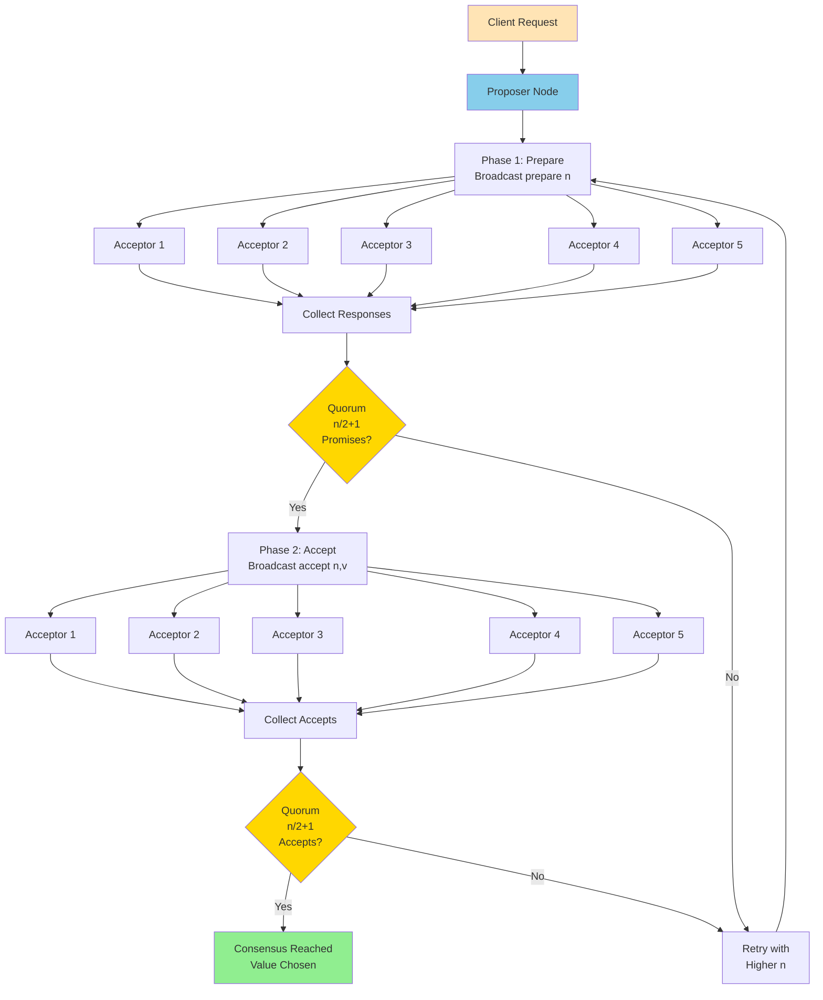
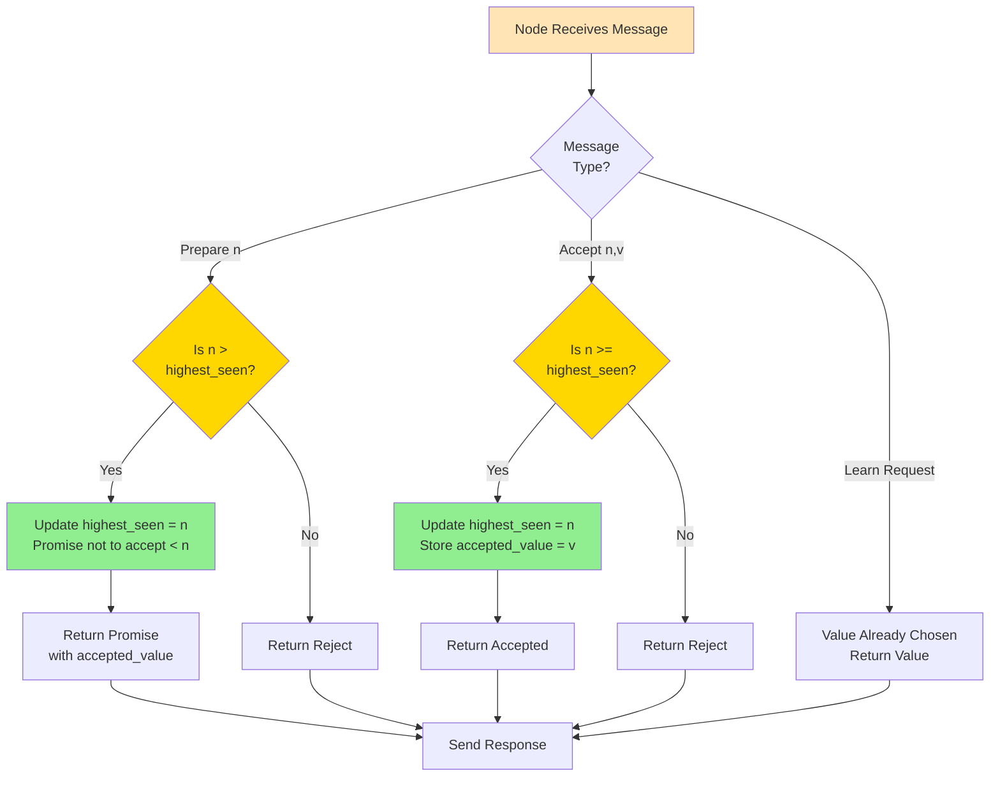

Paxos consensus algorithm interview questions covering the classic distributed consensus protocol.

## Q1: How does Paxos consensus work?

**Answer**:

**Paxos** is a consensus algorithm for distributed systems that ensures agreement among nodes even with failures.

**Sequence Diagram**:


**Overall Flow Diagram**:


**Individual Node Decision Diagram**:


**Paxos Phases**:

**Phase 1: Prepare**
1. Proposer sends `prepare(n)` with proposal number `n`
2. Acceptors respond:
   - If `n > highest_seen`: Promise not to accept proposals < `n`, return highest accepted value
   - Otherwise: Reject

**Phase 2: Accept**
1. If majority promise: Proposer sends `accept(n, v)` with value `v`
2. Acceptors accept if `n >= highest_seen`
3. If majority accept: Consensus reached

**Key Properties**:
- **Safety**: Only one value can be chosen
- **Liveness**: Eventually reaches consensus (if no failures)
- **Fault Tolerance**: Works with up to (n-1)/2 failures

**Example**:
```python
class PaxosNode:
    def __init__(self, node_id):
        self.node_id = node_id
        self.highest_seen = 0
        self.accepted_value = None
        self.accepted_proposal = 0
    
    def prepare(self, proposal_num):
        if proposal_num > self.highest_seen:
            self.highest_seen = proposal_num
            return {
                'promise': True,
                'accepted_proposal': self.accepted_proposal,
                'accepted_value': self.accepted_value
            }
        return {'promise': False}
    
    def accept(self, proposal_num, value):
        if proposal_num >= self.highest_seen:
            self.highest_seen = proposal_num
            self.accepted_proposal = proposal_num
            self.accepted_value = value
            return {'accepted': True}
        return {'accepted': False}
```

**Use Cases**:
- Distributed databases
- Configuration management
- State machine replication

---

