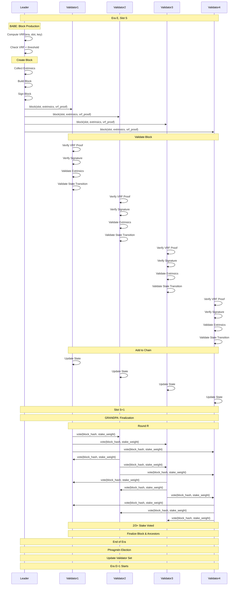
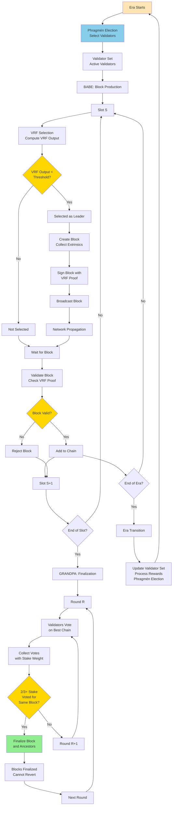
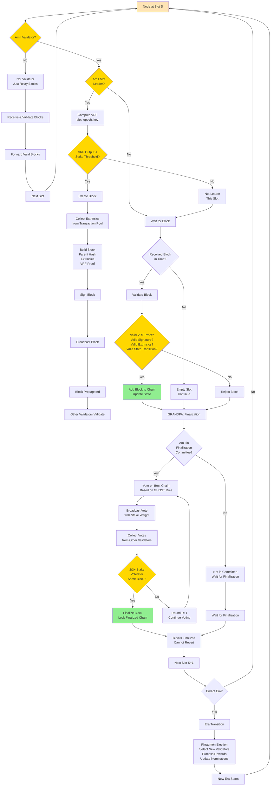

Polkadot consensus algorithm interview questions covering Nominated Proof-of-Stake (NPoS) with BABE and GRANDPA.

## Q1: How does Polkadot (NPoS) consensus work?

**Answer**:

**Polkadot** uses Nominated Proof-of-Stake (NPoS) with BABE + GRANDPA.

**Sequence Diagram**:


**Overall Flow Diagram**:


**Individual Node Decision Diagram**:


**Polkadot Consensus Components**:

**1. BABE (Blind Assignment for Blockchain Extension)**:
- **Block Production**: Creates blocks
- **VRF Selection**: Verifiable Random Function selects leaders
- **Slots**: Discrete time intervals
- **Multiple Leaders**: Can have multiple blocks per slot

**2. GRANDPA (GHOST-based Recursive Ancestor Deriving Prefix Agreement)**:
- **Finality Gadget**: Finalizes blocks
- **Not Block-by-Block**: Finalizes chains, not individual blocks
- **Fast Finality**: Can finalize many blocks at once
- **Safety**: Requires `2/3+` validator stake

**3. Validator Set**:
- **Validators**: Block producers and finalizers
- **Nominators**: Stake to validators
- **Election**: Phragmén algorithm selects validators
- **Rotation**: Validator set changes each era

**4. Era Structure**:
- **Era**: ~24 hours
- **Session**: ~1 hour
- **Epoch**: Multiple slots

**Key Properties**:
- **Hybrid**: BABE for liveness, GRANDPA for finality
- **Fast Blocks**: ~6 seconds
- **Fast Finality**: ~12-60 seconds
- **Shared Security**: All parachains share security

**Example**:
```rust
// BABE block production
fn produce_block(slot: Slot, parent: BlockHash) -> Option<Block> {
    // VRF to determine if selected
    let vrf_output = compute_vrf(slot, validator_key);
    let threshold = calculate_threshold(validator_stake, total_stake);
    
    if vrf_output < threshold {
        // Selected as leader
        let block = Block {
            parent_hash: parent,
            slot: slot,
            extrinsics: select_extrinsics(),
            state_root: compute_state_root(),
        };
        
        return Some(block);
    }
    
    None
}

// GRANDPA finalization
fn finalize_chain(
    validators: &[Validator],
    chain: &[Block]
) -> Option<BlockHash> {
    // Validators vote on chain
    let votes: Vec<Vote> = validators
        .iter()
        .map(|v| v.vote_on_chain(chain))
        .collect();
    
    // Check for 2/3+ majority
    let mut vote_counts: HashMap<BlockHash, u64> = HashMap::new();
    for vote in votes {
        *vote_counts.entry(vote.block_hash).or_insert(0) += vote.stake;
    }
    
    let total_stake: u64 = validators.iter().map(|v| v.stake).sum();
    let threshold = (total_stake * 2) / 3 + 1;
    
    // Find block with 2/3+ votes
    for (block_hash, votes) in vote_counts {
        if votes >= threshold {
            return Some(block_hash);
        }
    }
    
    None
}
```

**Phragmén Election**:
- Optimizes validator selection
- Maximizes minimum stake
- Ensures fair distribution

**Use Cases**:
- Polkadot
- Kusama
- Substrate-based chains

---

