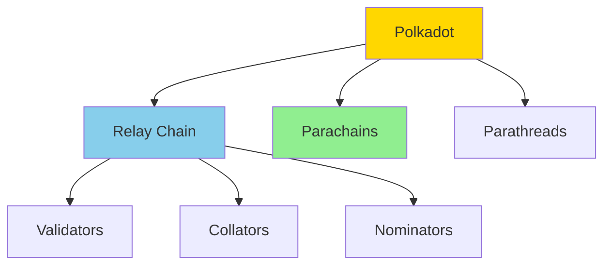

Easy-level Polkadot interview questions covering blockchain basics, Substrate, and parachains.

## Q1: What is Polkadot and how does it work?

**Answer**:

**Polkadot** is a heterogeneous multi-chain protocol.



**Key Components**:
- **Relay Chain**: Main chain providing security
- **Parachains**: Independent chains with dedicated slots
- **Parathreads**: Pay-as-you-go parachains
- **Bridges**: Connect to external chains

**Consensus**: Nominated Proof of Stake (NPoS)

---

## Q2: What is Substrate and how do you build with it?

**Answer**:

**Substrate** is a blockchain framework for building custom chains.

**Basic Runtime**:
```rust
// runtime/src/lib.rs
pub struct Runtime;

impl Config for Runtime {
    type Block = Block;
    type RuntimeCall = RuntimeCall;
}

// Define modules (pallets)
construct_runtime!(
    pub enum Runtime {
        System: frame_system,
        Balances: pallet_balances,
    }
);
```

**Build Chain**:
```bash
# Create new substrate node
substrate-node-new my-chain

# Build
cargo build --release

# Run
./target/release/my-chain --dev
```

---

## Q3: What are Polkadot validators and nominators?

**Answer**:

**Validators**:
- Produce blocks on Relay Chain
- Validate parachain blocks
- Stake DOT tokens
- Earn rewards

**Nominators**:
- Stake DOT to validators
- Share in rewards
- Help secure network

**Staking**:
```bash
# Bond DOT
polkadot-js-apps -> Staking -> Account actions -> Bond

# Nominate validators
polkadot-js-apps -> Staking -> Nominate
```

---

## Q4: How do parachains work?

**Answer**:

**Parachain Architecture**:
- Independent chains with own state
- Connected to Relay Chain
- Share security with Relay Chain
- Can communicate with other parachains

**Parachain Slot**:
- Auctioned for 96 weeks
- Requires DOT bond
- Provides dedicated block space

**Collators**:
- Collect transactions
- Produce blocks
- Submit to validators

---

## Q5: What are Substrate pallets?

**Answer**:

**Pallets** are runtime modules.

**Example Pallet**:
```rust
#[pallet]
pub mod pallet {
    use frame_support::pallet_prelude::*;
    
    #[pallet::config]
    pub trait Config: frame_system::Config {
        type Event: From<Event<Self>> + IsType<<Self as frame_system::Config>::Event>;
    }
    
    #[pallet::storage]
    pub type MyStorage<T: Config> = StorageValue<_, u32>;
    
    #[pallet::call]
    impl<T: Config> Pallet<T> {
        #[pallet::weight(10_000)]
        pub fn my_function(origin: OriginFor<T>) -> DispatchResult {
            // Implementation
            Ok(())
        }
    }
}
```

---

## Q6: How does XCM (Cross-Consensus Messaging) work?

**Answer**:

**XCM** enables communication between parachains.

**Send XCM**:
```rust
use xcm::prelude::*;

let message = Xcm(vec![
    WithdrawAsset(assets),
    BuyExecution { fees, weight_limit },
    DepositAsset { assets, beneficiary },
]);

// Send to parachain
XcmPallet::send(origin, dest, message)?;
```

---

## Q7: How do you interact with Polkadot using polkadot.js?

**Answer**:

**Basic Interaction**:
```javascript
import { ApiPromise, WsProvider } from '@polkadot/api';

// Connect
const provider = new WsProvider('wss://rpc.polkadot.io');
const api = await ApiPromise.create({ provider });

// Get balance
const balance = await api.query.balances.account(accountAddress);

// Send transaction
const tx = api.tx.balances.transfer(recipient, amount);
await tx.signAndSend(signer);
```

---

## Q8: What is the difference between parachains and parathreads?

**Answer**:

**Parachains**:
- Dedicated slot (auctioned)
- Guaranteed block space
- Higher cost
- Better for high-throughput

**Parathreads**:
- Pay-per-block model
- No dedicated slot
- Lower cost
- Better for occasional use

---

## Q9: How does Polkadot governance work?

**Answer**:

**Governance Bodies**:
- **Council**: Elected representatives
- **Technical Committee**: Technical experts
- **Referendum**: Public voting

**Proposal Process**:
1. Submit proposal
2. Council/Technical Committee review
3. Public referendum
4. Execution if passed

---

## Q10: How do you test Substrate pallets?

**Answer**:

**Unit Tests**:
```rust
#[cfg(test)]
mod tests {
    use super::*;
    
    #[test]
    fn test_my_function() {
        new_test_ext().execute_with(|| {
            // Test logic
            assert_ok!(Pallet::my_function(Origin::signed(1)));
        });
    }
}
```

---

