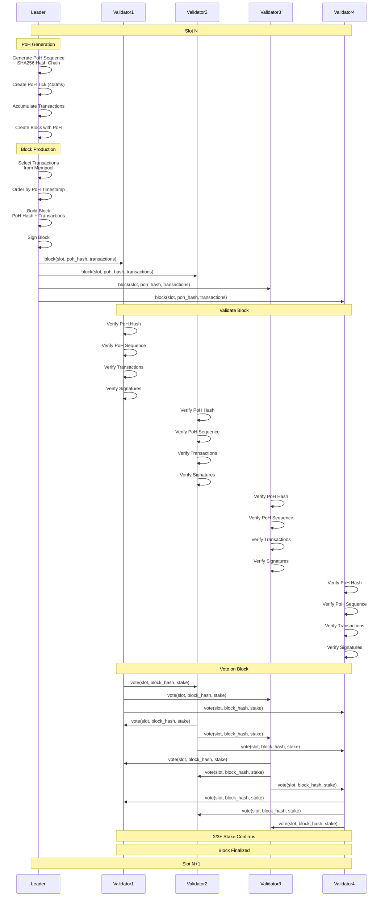
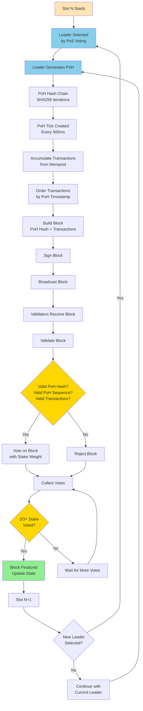

Solana consensus algorithm interview questions covering Proof of History (PoH) combined with Proof of Stake.

## Q1: How does Solana Proof of History (PoH) consensus work?

**Answer**:

**Solana** uses a unique consensus mechanism combining **Proof of History (PoH)** with **Proof of Stake (PoS)**. PoH provides a cryptographic timestamp for events, enabling high throughput and parallel processing.

**Sequence Diagram**:


**Overall Flow Diagram**:


**Individual Node Decision Diagram**:

```mermaid
graph TB
    A[Node at Slot N] --> B{Am I Leader?}
    
    B -->|Yes| C[Generate PoH]
    C --> D[Start PoH Hash Chain<br/>hash_0 = SHA256 seed]
    D --> E[Iterate Hash Chain<br/>hash_i = SHA256 hash_i-1]
    E --> F{PoH Tick Interval<br/>400ms?}
    
    F -->|No| E
    F -->|Yes| G[Create PoH Tick<br/>Store hash_i]
    G --> H[Accumulate Transactions<br/>from Mempool]
    H --> I[Assign PoH Timestamp<br/>to Each Transaction]
    
    I --> J{Block Ready?<br/>Enough Transactions<br/>or Timeout?}
    J -->|No| E
    J -->|Yes| K[Build Block<br/>PoH Hash + Transactions]
    K --> L[Sign Block]
    L --> M[Broadcast Block]
    
    B -->|No| N[Wait for Block]
    M --> O[Block Propagated]
    O --> N
    
    N --> P{Received Block<br/>in Time?}
    P -->|Yes| Q[Validate Block]
    P -->|No| R[Miss Block<br/>Continue]
    
    Q --> S{Valid PoH Hash?<br/>Verify PoH Sequence<br/>hash_i-1 -> hash_i}
    S -->|No| T[Reject Block]
    
    S -->|Yes| U{Valid Transactions?<br/>Valid Signatures?<br/>Valid State Transition?}
    U -->|No| T
    U -->|Yes| V[Accept Block]
    
    V --> W{Should I Vote?<br/>Am I Validator?}
    W -->|Yes| X[Create Vote<br/>Block Hash + Stake]
    W -->|No| Y[Skip Voting]
    
    X --> Z[Sign Vote]
    Z --> AA[Broadcast Vote]
    
    AA --> AB[Collect Votes<br/>from Other Validators]
    Y --> AB
    T --> AB
    R --> AB
    
    AB --> AC{2/3+ Stake<br/>Voted for Block?}
    AC -->|Yes| AD[Block Finalized<br/>Update State]
    AC -->|No| AE{Timeout?}
    AE -->|Yes| AF[Move to Next Slot]
    AE -->|No| AB
    
    AD --> AG[Slot N+1]
    AF --> AG
    AG --> AH{New Leader<br/>Selected?}
    AH -->|Yes| AI[Update Leader]
    AH -->|No| AJ[Continue]
    AI --> A
    AJ --> A
    
    style A fill:#FFE4B5
    style B fill:#FFD700
    style S fill:#FFD700
    style U fill:#FFD700
    style AC fill:#FFD700
    style V fill:#90EE90
    style AD fill:#90EE90
```


**Proof of History (PoH) Components**:

**1. PoH Hash Chain**:
- Leader generates a continuous hash chain
- Each hash depends on previous hash: `hash_i = SHA256(hash_i-1)`
- Provides verifiable time ordering
- Cannot be parallelized (sequential by design)

**2. PoH Ticks**:
- Created at regular intervals (~400ms)
- Each tick contains a hash from the chain
- Provides timestamp for transactions
- Enables parallel transaction processing

**3. Transaction Ordering**:
- Transactions are assigned PoH timestamps
- Ordering is deterministic based on PoH
- Enables parallel execution
- Reduces consensus overhead

**4. Leader Selection (PoS)**:
- Leaders selected by stake-weighted voting
- Rotates every slot (~400ms)
- Provides Byzantine fault tolerance
- Requires 2/3+ stake for finality

**Key Properties**:
- **High Throughput**: 65,000+ TPS (theoretical)
- **Low Latency**: ~400ms block time
- **Parallel Execution**: Transactions ordered by PoH
- **Verifiable Time**: Cryptographic proof of time passage
- **Energy Efficient**: PoS-based, no mining

**Example**:
```rust
// PoH Hash Chain Generation
struct ProofOfHistory {
    hash: [u8; 32],
    tick_count: u64,
}

impl ProofOfHistory {
    fn new(seed: [u8; 32]) -> Self {
        ProofOfHistory {
            hash: seed,
            tick_count: 0,
        }
    }
    
    fn generate_tick(&mut self) -> [u8; 32] {
        // Generate next hash in chain
        self.hash = sha256(&self.hash);
        self.tick_count += 1;
        self.hash
    }
    
    fn verify_sequence(&self, start_hash: [u8; 32], end_hash: [u8; 32], count: u64) -> bool {
        // Verify hash chain sequence
        let mut current = start_hash;
        for _ in 0..count {
            current = sha256(&current);
        }
        current == end_hash
    }
}

// Block Creation with PoH
struct SolanaBlock {
    slot: u64,
    poh_hash: [u8; 32],
    poh_tick_count: u64,
    transactions: Vec<Transaction>,
    leader_signature: Signature,
}

fn create_block(
    leader: &Validator,
    poh: &mut ProofOfHistory,
    transactions: Vec<Transaction>
) -> SolanaBlock {
    // Generate PoH ticks
    let mut poh_hashes = Vec::new();
    for _ in 0..TICKS_PER_SLOT {
        poh_hashes.push(poh.generate_tick());
    }
    
    // Order transactions by PoH timestamp
    let mut ordered_txs = transactions;
    ordered_txs.sort_by_key(|tx| tx.poh_timestamp);
    
    // Build block
    SolanaBlock {
        slot: get_current_slot(),
        poh_hash: poh_hashes.last().unwrap().clone(),
        poh_tick_count: poh.tick_count,
        transactions: ordered_txs,
        leader_signature: leader.sign_block(),
    }
}

// Block Validation
fn validate_block(block: &SolanaBlock, previous_poh: [u8; 32]) -> bool {
    // Verify PoH sequence
    if !verify_poh_sequence(previous_poh, block.poh_hash, block.poh_tick_count) {
        return false;
    }
    
    // Verify transactions are ordered correctly
    for i in 1..block.transactions.len() {
        if block.transactions[i].poh_timestamp < block.transactions[i-1].poh_timestamp {
            return false;
        }
    }
    
    // Verify leader signature
    if !verify_signature(&block.leader_signature, &block) {
        return false;
    }
    
    true
}
```

**PoH vs Traditional Consensus**:

**Traditional (e.g., Tendermint)**:
- Validators must agree on transaction order
- Consensus overhead for ordering
- Sequential processing
- Lower throughput

**PoH (Solana)**:
- Leader pre-orders transactions using PoH
- Validators only verify PoH sequence
- Parallel execution possible
- Higher throughput

**Advantages**:
- **Scalability**: High TPS through parallel processing
- **Efficiency**: Less consensus overhead
- **Determinism**: PoH provides verifiable ordering
- **Speed**: Fast block times

**Challenges**:
- **Leader Dependency**: Single leader per slot
- **PoH Verification**: Must verify hash chain
- **Clock Synchronization**: Requires accurate time
- **Complexity**: More complex than simple PoS

**Use Cases**:
- Solana blockchain
- High-throughput applications
- DeFi protocols requiring speed
- Real-time trading systems

---

