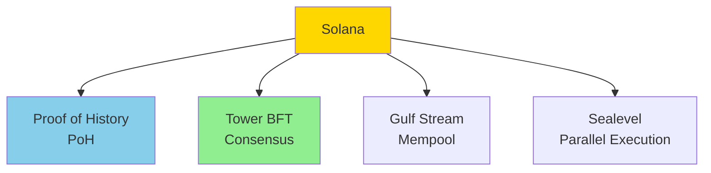

Easy-level Solana interview questions covering blockchain basics, programs, and development.

## Q1: What is Solana and how does it work?

**Answer**:

**Solana** is a high-performance blockchain designed for scalability.



**Key Features**:
- **High Throughput**: 65,000+ TPS
- **Low Latency**: ~400ms block time
- **Low Cost**: ~$0.00025 per transaction
- **Proof of History**: Cryptographic time ordering
- **Tower BFT**: Practical Byzantine Fault Tolerance

**Architecture**:
- **Validators**: Produce blocks and validate
- **Programs**: Smart contracts (on-chain code)
- **Accounts**: Store data and SOL
- **Transactions**: Instructions executed atomically

---

## Q2: What are Solana programs and how do you write them?

**Answer**:

**Solana Programs** are smart contracts written in Rust.

**Basic Program Structure**:
```rust
use solana_program::{
    account_info::AccountInfo,
    entrypoint,
    entrypoint::ProgramResult,
    pubkey::Pubkey,
    msg,
};

// Entry point
entrypoint!(process_instruction);

pub fn process_instruction(
    program_id: &Pubkey,
    accounts: &[AccountInfo],
    instruction_data: &[u8],
) -> ProgramResult {
    msg!("Hello, Solana!");
    
    // Process instruction
    Ok(())
}
```

**Program Types**:
- **System Program**: Basic operations
- **Token Program**: SPL tokens
- **Custom Programs**: Your own logic

**Deploy Program**:
```bash
# Build program
cargo build-bpf

# Deploy
solana program deploy target/deploy/my_program.so
```

---

## Q3: What are Solana accounts and how do they work?

**Answer**:

**Account Structure**:
```rust
pub struct Account {
    pub lamports: u64,           // Balance in lamports
    pub data: Vec<u8>,            // Account data
    pub owner: Pubkey,            // Program owner
    pub executable: bool,          // Is executable program
    pub rent_epoch: u64,          // Rent epoch
}
```

**Account Types**:
- **System Accounts**: Owned by system program
- **Program Accounts**: Owned by programs
- **PDA (Program Derived Address)**: Deterministic addresses

**Account Data**:
- Accounts store state
- Programs own accounts
- Accounts pay rent

---

## Q4: How do you create and send transactions on Solana?

**Answer**:

**Transaction Creation**:
```javascript
// Using @solana/web3.js
import { Connection, Keypair, Transaction, SystemProgram } from '@solana/web3.js';

// Create transaction
const transaction = new Transaction().add(
    SystemProgram.transfer({
        fromPubkey: fromKeypair.publicKey,
        toPubkey: toPubkey,
        lamports: 1000000, // 0.001 SOL
    })
);

// Sign and send
transaction.sign(fromKeypair);
const signature = await connection.sendTransaction(transaction, [fromKeypair]);
```

**Transaction Structure**:
- **Instructions**: Operations to perform
- **Signatures**: Required signatures
- **Recent Blockhash**: Prevents replay

---

## Q5: What is the Solana Program Library (SPL)?

**Answer**:

**SPL Programs**:
- **Token Program**: Create and manage tokens
- **Token Swap**: AMM for token swaps
- **Stake Pool**: Staking pools
- **Name Service**: Domain names

**Using SPL Token**:
```rust
use spl_token::instruction as token_instruction;

// Create token
let create_ix = token_instruction::initialize_mint(
    &spl_token::id(),
    &mint_pubkey,
    &mint_authority,
    None,
    9, // decimals
)?;
```

---

## Q6: How does Solana achieve high throughput?

**Answer**:

**Performance Features**:

1. **Proof of History**: Cryptographic time ordering
   - Eliminates need for validators to agree on time
   - Enables parallel processing

2. **Tower BFT**: Optimized consensus
   - Faster than traditional BFT
   - Reduces communication overhead

3. **Gulf Stream**: Transaction forwarding
   - Validators know transactions in advance
   - Reduces confirmation time

4. **Sealevel**: Parallel execution
   - Executes transactions in parallel
   - Uses all CPU cores

5. **Pipelining**: Multiple stages
   - Transaction processing pipeline
   - Overlaps different stages

---

## Q7: How do you interact with Solana using web3.js?

**Answer**:

**Basic Interaction**:
```javascript
import { Connection, PublicKey, Keypair } from '@solana/web3.js';

// Connect to cluster
const connection = new Connection('https://api.mainnet-beta.solana.com');

// Get balance
const balance = await connection.getBalance(publicKey);

// Get account info
const accountInfo = await connection.getAccountInfo(publicKey);

// Send transaction
const signature = await connection.sendTransaction(transaction, [signer]);
```

**Reading Data**:
```javascript
// Get program accounts
const accounts = await connection.getProgramAccounts(programId);

// Get transaction
const tx = await connection.getTransaction(signature);
```

---

## Q8: What are Program Derived Addresses (PDAs)?

**Answer**:

**PDA** are deterministic addresses derived from program ID and seeds.

**Creating PDA**:
```rust
use solana_program::pubkey::Pubkey;

// Find PDA
let (pda, bump_seed) = Pubkey::find_program_address(
    &[b"my_seed", user_pubkey.as_ref()],
    program_id,
);
```

**PDA Properties**:
- Deterministic: Same seeds = same address
- No private key: Controlled by program
- Used for: Program-owned accounts

**Use Cases**:
- Escrow accounts
- Token vaults
- Program state

---

## Q9: How does Solana handle fees and rent?

**Answer**:

**Transaction Fees**:
- Base fee: 0.000005 SOL (5000 lamports)
- Compute units: Additional fee for compute
- Priority fees: Optional for faster processing

**Rent**:
- Accounts must maintain minimum balance
- Rent exempt: Accounts with enough balance
- Rent collection: Inactive accounts lose rent

**Rent Calculation**:
```rust
let rent = Rent::default();
let rent_exempt_minimum = rent.minimum_balance(data_len);
```

---

## Q10: How do you test Solana programs?

**Answer**:

**Testing with Anchor**:
```rust
#[cfg(test)]
mod tests {
    use super::*;
    use anchor_lang::prelude::*;
    
    #[test]
    fn test_my_program() {
        let program = anchor_lang::solana_program::program::Program::new(
            program_id,
            &program_data,
        );
        
        // Test instruction
        let result = program.process_instruction(
            &program_id,
            &accounts,
            &instruction_data,
        );
        
        assert!(result.is_ok());
    }
}
```

**Local Testing**:
```bash
# Start local validator
solana-test-validator

# Run tests
anchor test
```

---

