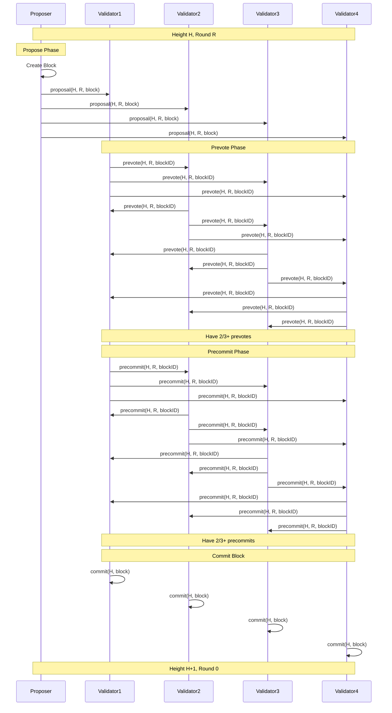
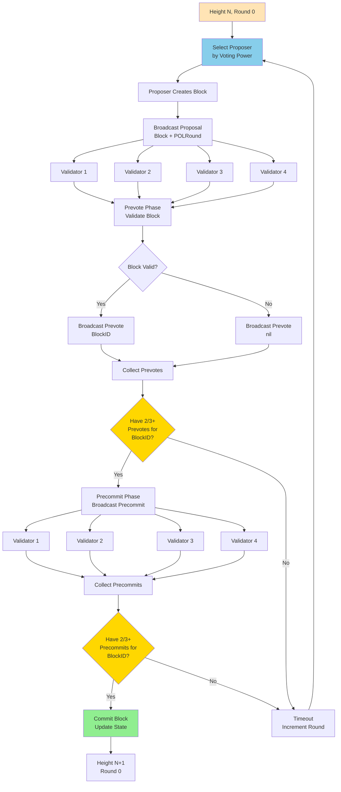
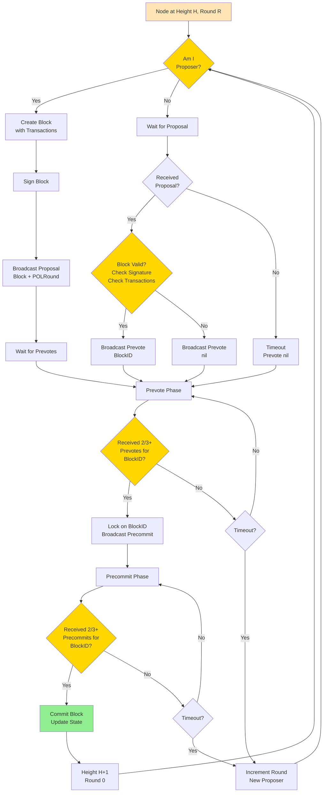

Tendermint consensus algorithm interview questions covering the Byzantine Fault Tolerant consensus used in Cosmos chains.

## Q1: How does Tendermint consensus work?

**Answer**:

**Tendermint** is a Byzantine Fault Tolerant consensus algorithm used in Cosmos chains.

**Sequence Diagram**:


**Overall Flow Diagram**:


**Individual Node Decision Diagram**:


**Tendermint Phases**:

**1. Propose**:
- Proposer selected (round-robin by voting power)
- Creates block with transactions
- Broadcasts proposal

**2. Prevote**:
- Validators receive proposal
- Validate block
- Broadcast prevote (yes/no)
- Need `2/3+` prevotes to continue

**3. Precommit**:
- After `2/3+` prevotes, broadcast precommit
- Need `2/3+` precommits to commit
- If timeout: Move to next round

**4. Commit**:
- Block committed when `2/3+` precommits received
- State updated
- Move to next height

**Key Properties**:
- **Finality**: Blocks are final (no reorgs)
- **Safety**: Tolerates up to `1/3` Byzantine validators
- **Liveness**: Continues with `2/3+` honest validators
- **Fast**: ~1-6 second block time

**Example**:
```go
type TendermintState struct {
    Height int64
    Round  int32
    Step   Step
}

type Step int

const (
    StepPropose Step = iota
    StepPrevote
    StepPrecommit
    StepCommit
)

func (s *TendermintState) Propose(block *Block) {
    // Proposer creates and broadcasts block
    s.Step = StepPropose
    broadcastProposal(block)
}

func (s *TendermintState) Prevote(blockID BlockID) {
    // Validators vote on proposal
    s.Step = StepPrevote
    if validateBlock(blockID) {
        broadcastPrevote(blockID, true)
    } else {
        broadcastPrevote(blockID, false)
    }
}

func (s *TendermintState) Precommit(blockID BlockID) {
    // After 2/3+ prevotes, precommit
    if countPrevotes(blockID) >= getQuorum() {
        s.Step = StepPrecommit
        broadcastPrecommit(blockID, true)
    }
}

func (s *TendermintState) Commit(blockID BlockID) {
    // After 2/3+ precommits, commit block
    if countPrecommits(blockID) >= getQuorum() {
        s.Step = StepCommit
        commitBlock(blockID)
        s.Height++
        s.Round = 0
    }
}
```

**Use Cases**:
- Cosmos chains
- Binance Chain
- Terra

---

