Easy-level Web3 interview questions covering blockchain fundamentals, Ethereum, smart contracts, and decentralized applications.

## Q1: What is blockchain and how does it work?

**Answer**:

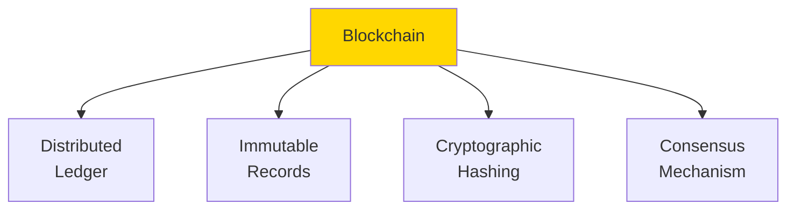

### Block Structure

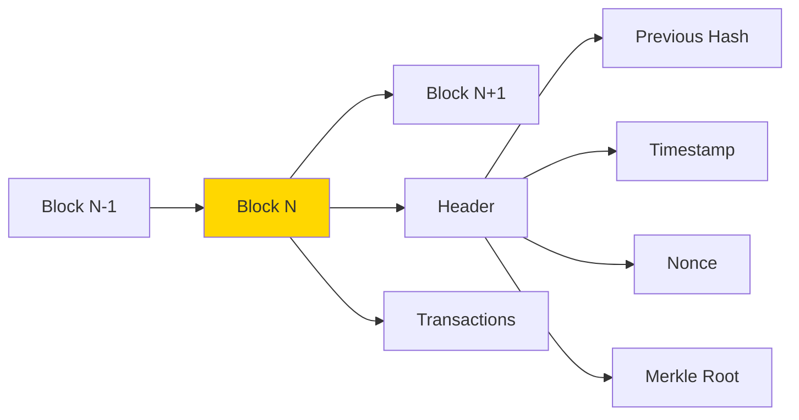

**Key Components**:
- **Block**: Container of transactions
- **Hash**: Unique identifier (SHA-256)
- **Previous Hash**: Links to previous block
- **Timestamp**: When block was created
- **Nonce**: Number used in mining
- **Transactions**: List of transfers/operations

### How It Works

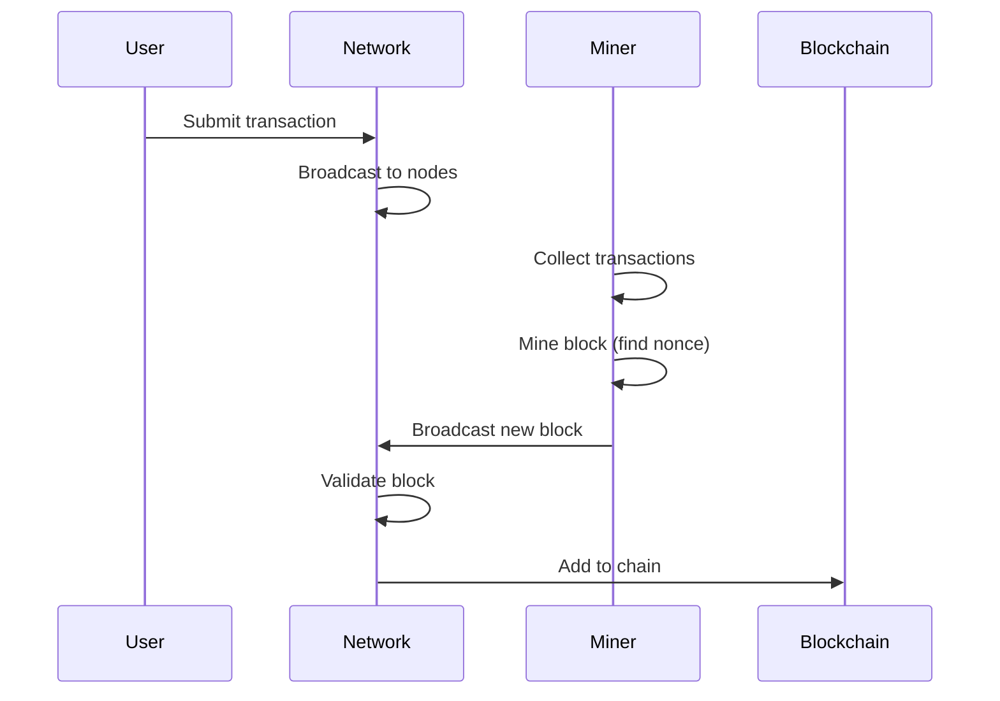

**Properties**:
- **Decentralized**: No single authority
- **Transparent**: All transactions visible
- **Immutable**: Cannot change past blocks
- **Secure**: Cryptographically protected

---

## Q2: What is Ethereum and how does it differ from Bitcoin?

**Answer**:

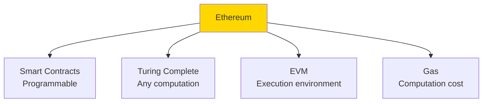

### Bitcoin vs Ethereum

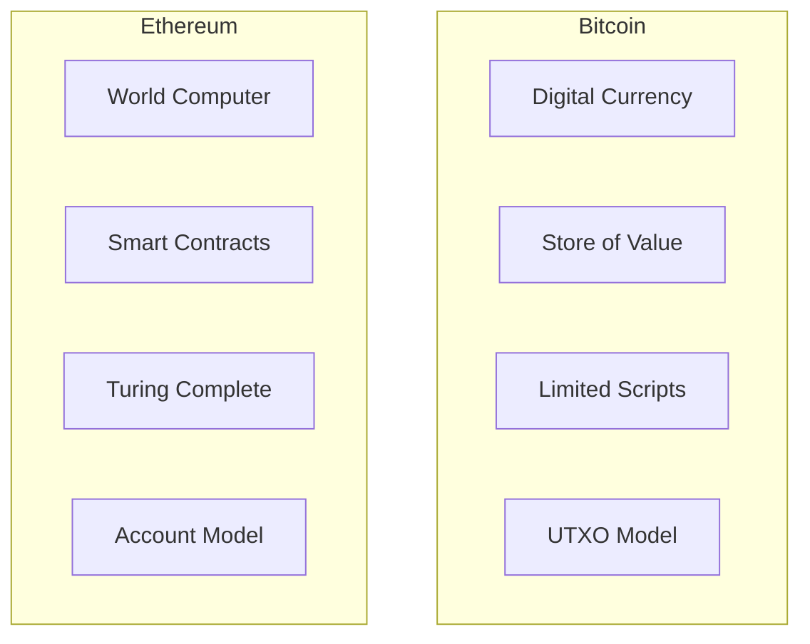

**Comparison**:

| Feature | Bitcoin | Ethereum |
|---------|---------|----------|
| Purpose | Digital currency | Decentralized platform |
| Block Time | ~10 minutes | ~12 seconds |
| Supply | 21M cap | No hard cap |
| Scripting | Limited | Turing complete |
| Consensus | PoW | PoS (after Merge) |

---

## Q3: What is a smart contract?

**Answer**:

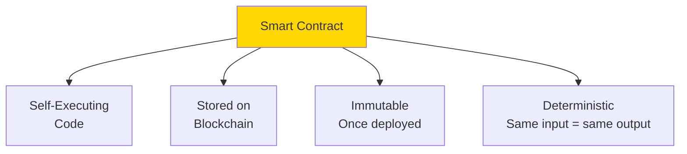

### Simple Smart Contract

```solidity
// SPDX-License-Identifier: MIT
pragma solidity ^0.8.0;

contract SimpleStorage {
    // State variable
    uint256 private value;
    
    // Event
    event ValueChanged(uint256 newValue);
    
    // Write function
    function setValue(uint256 _value) public {
        value = _value;
        emit ValueChanged(_value);
    }
    
    // Read function (view)
    function getValue() public view returns (uint256) {
        return value;
    }
}
```

### Contract Lifecycle

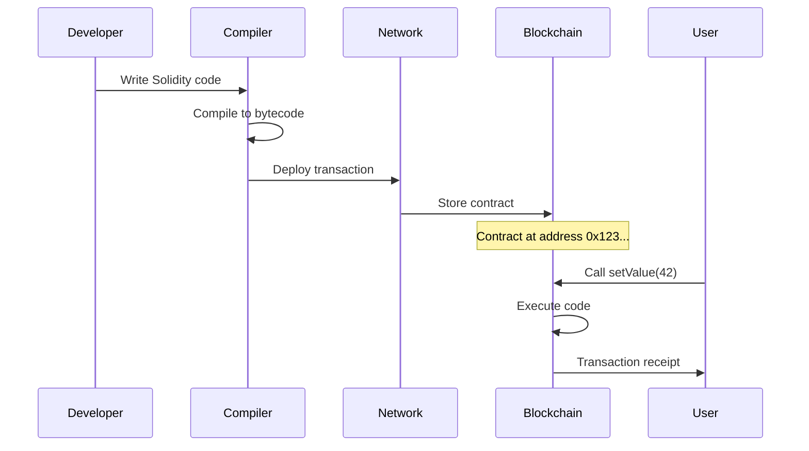

**Characteristics**:
- **Trustless**: No intermediary needed
- **Transparent**: Code is public
- **Immutable**: Cannot be changed
- **Composable**: Can call other contracts

---

## Q4: What are gas and gas fees?

**Answer**:

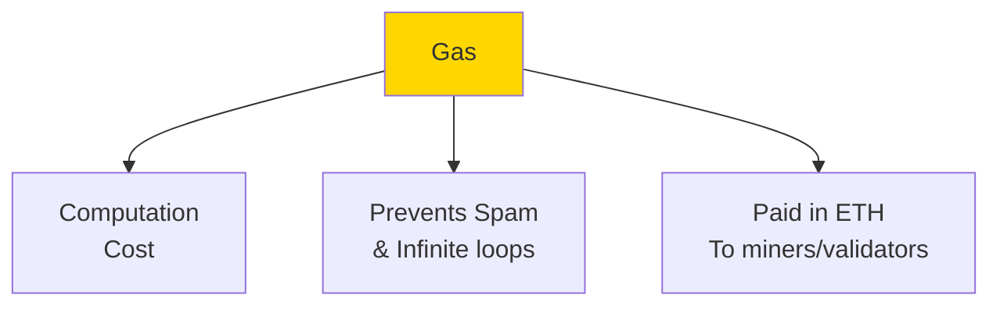

### Gas Calculation

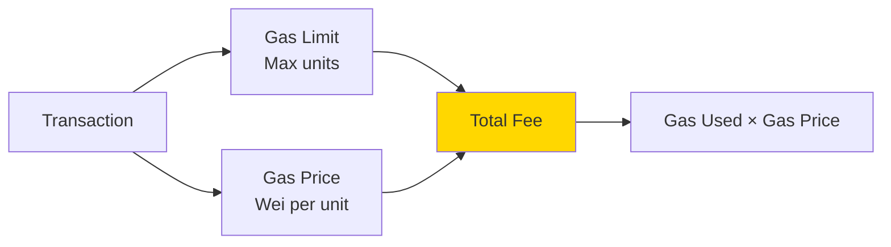

**Formula**:
$$\text{Transaction Fee} = \text{Gas Used} \times \text{Gas Price}$$

### Gas Costs

```solidity
contract GasExample {
    uint256 public value; // Storage: expensive
    
    // ~43,000 gas (storage write)
    function setValue(uint256 _value) public {
        value = _value;
    }
    
    // ~23,000 gas (read from storage)
    function getValue() public view returns (uint256) {
        return value;
    }
    
    // ~21,000 gas (simple transfer)
    function sendEther(address payable recipient) public payable {
        recipient.transfer(msg.value);
    }
}
```

### Gas Optimization

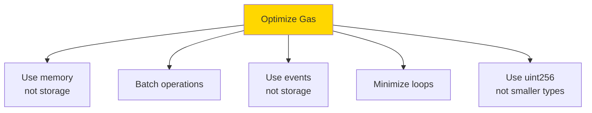

**Gas Price Units**:
- 1 Gwei = 10⁹ Wei
- 1 ETH = 10¹⁸ Wei

---

## Q5: What is a wallet and what are public/private keys?

**Answer**:

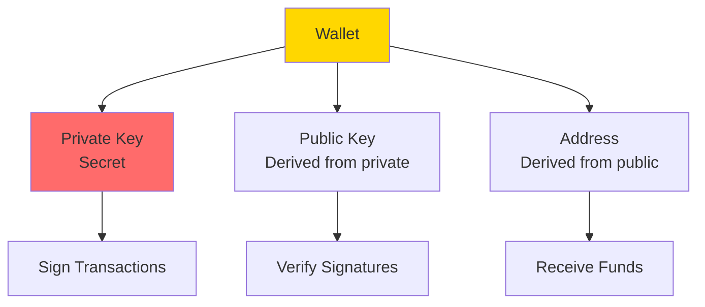

### Key Relationship

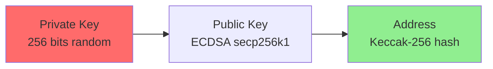

**Example**:
```
Private Key: 
0x4c0883a69102937d6231471b5dbb6204fe512961708279f8c5c9e4e6f1b9a91a

Public Key:
0x04a34b99f22c790c4e36b2b3c2c35a36db06226e41c692fc82b8b56ac1c540c5bd5b8dec5235a0fa8722476c7709c02559e3aa73aa03918ba2d492eea75abea235

Address (last 20 bytes of Keccak-256):
0x5aAeb6053F3E94C9b9A09f33669435E7Ef1BeAed
```

### Wallet Types

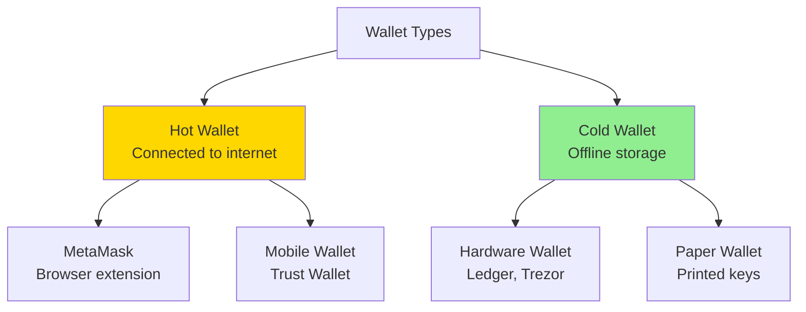

**Security**:
- **Never share private key**
- **Backup seed phrase**
- **Use hardware wallet for large amounts**
- **Verify addresses before sending**

---

## Q6: What are ERC-20 tokens?

**Answer**:

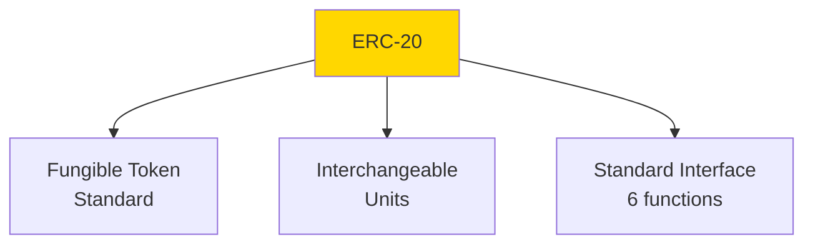

### ERC-20 Interface

```solidity
// SPDX-License-Identifier: MIT
pragma solidity ^0.8.0;

interface IERC20 {
    // Returns total token supply
    function totalSupply() external view returns (uint256);
    
    // Returns account balance
    function balanceOf(address account) external view returns (uint256);
    
    // Transfers tokens
    function transfer(address recipient, uint256 amount) external returns (bool);
    
    // Returns remaining allowance
    function allowance(address owner, address spender) external view returns (uint256);
    
    // Sets allowance for spender
    function approve(address spender, uint256 amount) external returns (bool);
    
    // Transfers from one account to another
    function transferFrom(address sender, address recipient, uint256 amount) external returns (bool);
    
    // Events
    event Transfer(address indexed from, address indexed to, uint256 value);
    event Approval(address indexed owner, address indexed spender, uint256 value);
}
```

### Simple ERC-20 Implementation

```solidity
contract MyToken is IERC20 {
    string public name = "MyToken";
    string public symbol = "MTK";
    uint8 public decimals = 18;
    uint256 private _totalSupply;
    
    mapping(address => uint256) private _balances;
    mapping(address => mapping(address => uint256)) private _allowances;
    
    constructor(uint256 initialSupply) {
        _totalSupply = initialSupply * 10**decimals;
        _balances[msg.sender] = _totalSupply;
    }
    
    function totalSupply() public view returns (uint256) {
        return _totalSupply;
    }
    
    function balanceOf(address account) public view returns (uint256) {
        return _balances[account];
    }
    
    function transfer(address recipient, uint256 amount) public returns (bool) {
        require(_balances[msg.sender] >= amount, "Insufficient balance");
        _balances[msg.sender] -= amount;
        _balances[recipient] += amount;
        emit Transfer(msg.sender, recipient, amount);
        return true;
    }
    
    // ... other functions
}
```

### Token Flow

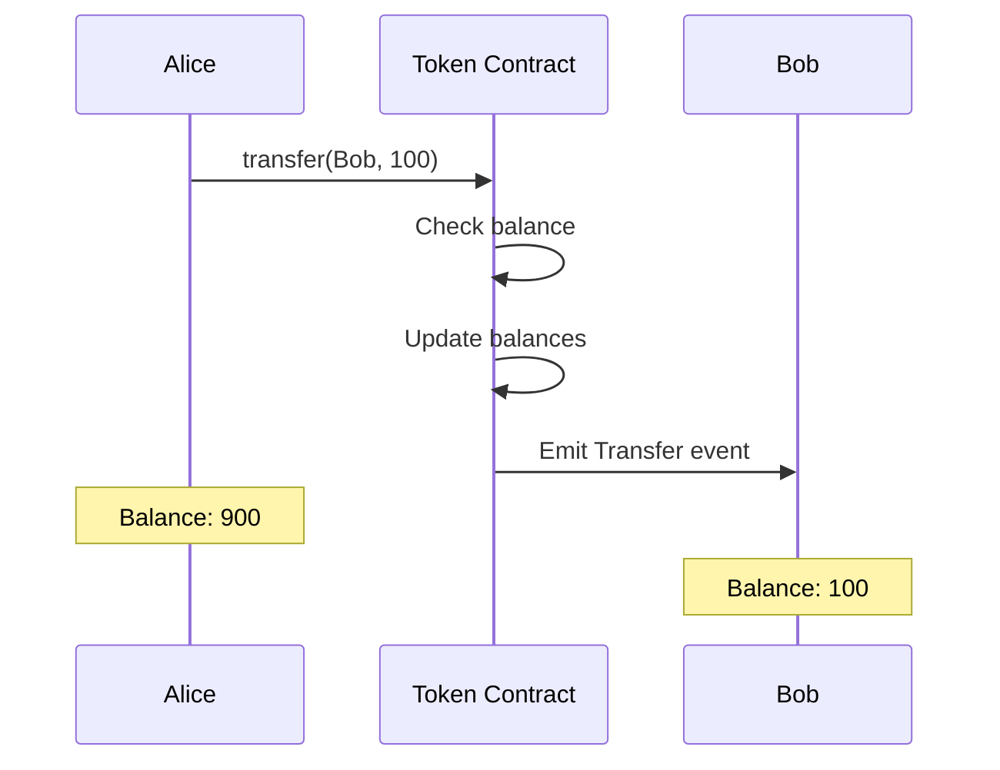

---

## Q7: What are NFTs (ERC-721)?

**Answer**:

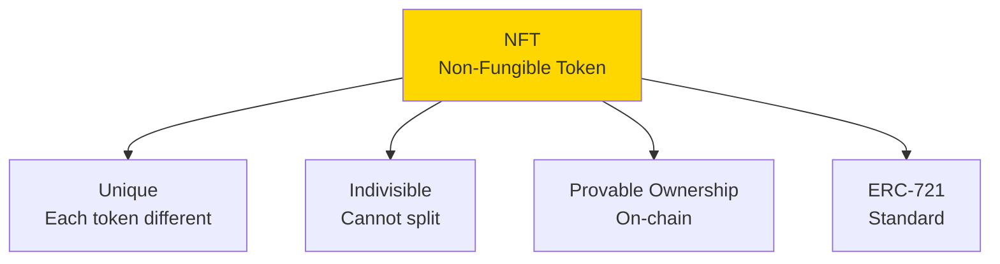

### ERC-721 vs ERC-20

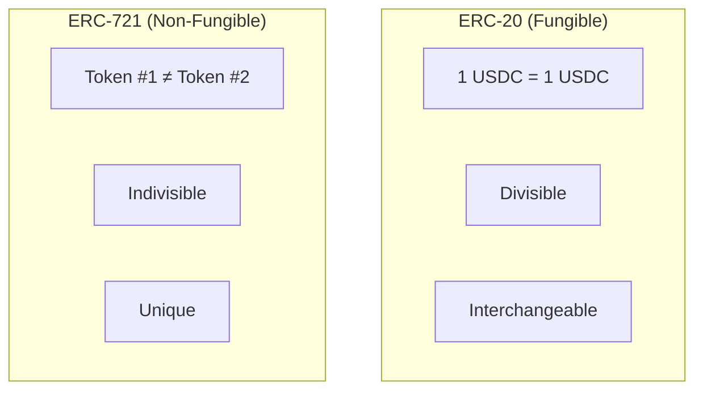

### ERC-721 Interface

```solidity
// SPDX-License-Identifier: MIT
pragma solidity ^0.8.0;

interface IERC721 {
    // Returns owner of token
    function ownerOf(uint256 tokenId) external view returns (address);
    
    // Returns token balance of owner
    function balanceOf(address owner) external view returns (uint256);
    
    // Transfers token
    function transferFrom(address from, address to, uint256 tokenId) external;
    
    // Safe transfer with callback
    function safeTransferFrom(address from, address to, uint256 tokenId) external;
    
    // Approve address to transfer token
    function approve(address to, uint256 tokenId) external;
    
    // Set approval for all tokens
    function setApprovalForAll(address operator, bool approved) external;
    
    // Events
    event Transfer(address indexed from, address indexed to, uint256 indexed tokenId);
    event Approval(address indexed owner, address indexed approved, uint256 indexed tokenId);
}
```

### Simple NFT

```solidity
contract SimpleNFT is IERC721 {
    string public name = "MyNFT";
    string public symbol = "MNFT";
    
    uint256 private _tokenIdCounter;
    mapping(uint256 => address) private _owners;
    mapping(address => uint256) private _balances;
    mapping(uint256 => string) private _tokenURIs;
    
    function mint(address to, string memory tokenURI) public returns (uint256) {
        uint256 tokenId = _tokenIdCounter++;
        _owners[tokenId] = to;
        _balances[to]++;
        _tokenURIs[tokenId] = tokenURI;
        
        emit Transfer(address(0), to, tokenId);
        return tokenId;
    }
    
    function tokenURI(uint256 tokenId) public view returns (string memory) {
        require(_owners[tokenId] != address(0), "Token doesn't exist");
        return _tokenURIs[tokenId];
    }
    
    // ... other functions
}
```

**Use Cases**:
- Digital art
- Collectibles
- Gaming items
- Real estate
- Identity/credentials

---

## Q8: What is a decentralized application (dApp)?

**Answer**:

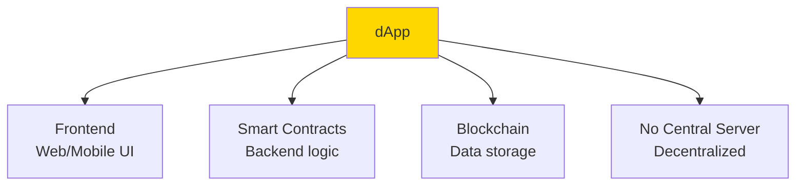

### dApp Architecture

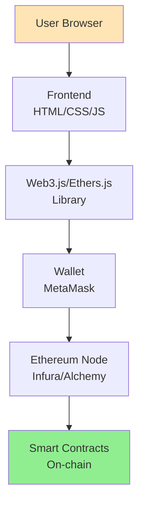

### Connecting to dApp

```javascript
// Using ethers.js
import { ethers } from 'ethers';

// Connect to MetaMask
async function connectWallet() {
  if (typeof window.ethereum !== 'undefined') {
    // Request account access
    await window.ethereum.request({ method: 'eth_requestAccounts' });
    
    // Create provider
    const provider = new ethers.providers.Web3Provider(window.ethereum);
    
    // Get signer (user's account)
    const signer = provider.getSigner();
    
    // Get address
    const address = await signer.getAddress();
    console.log('Connected:', address);
    
    return { provider, signer, address };
  } else {
    alert('Please install MetaMask!');
  }
}

// Interact with contract
async function interactWithContract() {
  const { provider, signer } = await connectWallet();
  
  // Contract ABI and address
  const contractAddress = '0x123...';
  const abi = [...]; // Contract ABI
  
  // Create contract instance
  const contract = new ethers.Contract(contractAddress, abi, signer);
  
  // Read from contract
  const value = await contract.getValue();
  console.log('Value:', value.toString());
  
  // Write to contract
  const tx = await contract.setValue(42);
  await tx.wait(); // Wait for confirmation
  console.log('Transaction confirmed');
}
```

### dApp vs Traditional App

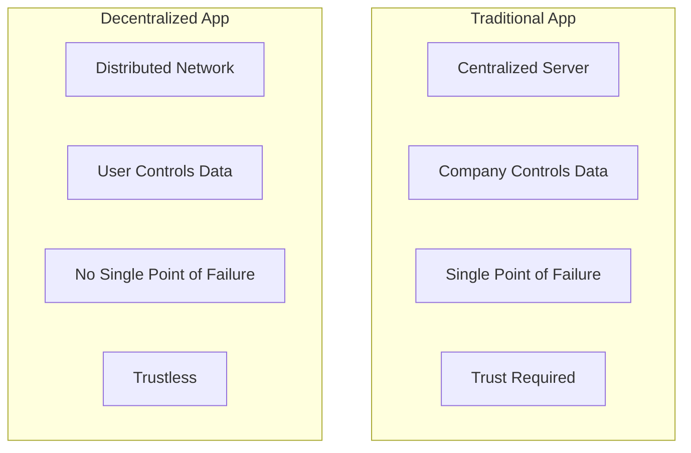

---

## Q9: What is Web3.js and Ethers.js?

**Answer**:

```mermaid
graph TB
    A[JavaScript<br/>Libraries] --> B[Web3.js<br/>Original library]
    A --> C[Ethers.js<br/>Modern alternative]
    
    B --> D[Connect to<br/>Ethereum]
    C --> D
    
    D --> E[Read blockchain]
    D --> F[Send transactions]
    D --> G[Interact with contracts]
    
    style A fill:#FFD700
```

### Web3.js Example

```javascript
const Web3 = require('web3');

// Connect to Ethereum node
const web3 = new Web3('https://mainnet.infura.io/v3/YOUR_PROJECT_ID');

// Get balance
async function getBalance(address) {
  const balance = await web3.eth.getBalance(address);
  const eth = web3.utils.fromWei(balance, 'ether');
  console.log(`Balance: ${eth} ETH`);
}

// Send transaction
async function sendTransaction(from, to, amount) {
  const tx = {
    from: from,
    to: to,
    value: web3.utils.toWei(amount, 'ether'),
    gas: 21000
  };
  
  const receipt = await web3.eth.sendTransaction(tx);
  console.log('Transaction hash:', receipt.transactionHash);
}

// Interact with contract
const abi = [...];
const contractAddress = '0x123...';
const contract = new web3.eth.Contract(abi, contractAddress);

// Call view function
const value = await contract.methods.getValue().call();

// Send transaction to contract
await contract.methods.setValue(42).send({ from: userAddress });
```

### Ethers.js Example

```javascript
const { ethers } = require('ethers');

// Connect to Ethereum node
const provider = new ethers.providers.JsonRpcProvider(
  'https://mainnet.infura.io/v3/YOUR_PROJECT_ID'
);

// Get balance
async function getBalance(address) {
  const balance = await provider.getBalance(address);
  const eth = ethers.utils.formatEther(balance);
  console.log(`Balance: ${eth} ETH`);
}

// Send transaction
async function sendTransaction(wallet, to, amount) {
  const tx = await wallet.sendTransaction({
    to: to,
    value: ethers.utils.parseEther(amount)
  });
  await tx.wait();
  console.log('Transaction hash:', tx.hash);
}

// Interact with contract
const abi = [...];
const contractAddress = '0x123...';
const contract = new ethers.Contract(contractAddress, abi, provider);

// Call view function
const value = await contract.getValue();

// Send transaction to contract (need signer)
const signer = provider.getSigner();
const contractWithSigner = contract.connect(signer);
const tx = await contractWithSigner.setValue(42);
await tx.wait();
```

**Comparison**:

| Feature | Web3.js | Ethers.js |
|---------|---------|-----------|
| Size | Larger | Smaller |
| API | Callback-based | Promise-based |
| TypeScript | Limited | Excellent |
| Documentation | Good | Excellent |
| Community | Larger | Growing |

---

## Q10: What is IPFS and decentralized storage?

**Answer**:

```mermaid
graph TB
    A[IPFS<br/>InterPlanetary<br/>File System] --> B[Content-Addressed<br/>Hash-based]
    A --> C[Distributed<br/>P2P network]
    A --> D[Permanent<br/>Immutable]
    
    style A fill:#FFD700
```

### IPFS vs HTTP

```mermaid
graph TB
    subgraph HTTP["HTTP (Location-based)"]
        H1[https://example.com/file.jpg]
        H2[Server location]
        H3[Can change/disappear]
    end
    
    subgraph IPFS["IPFS (Content-based)"]
        I1[ipfs://Qm...]
        I2[Content hash]
        I3[Permanent & verifiable]
    end
```

### How IPFS Works

```mermaid
sequenceDiagram
    participant U as User
    participant N as IPFS Node
    participant P as Peer Network
    
    U->>N: Add file
    N->>N: Calculate hash (CID)
    N->>P: Announce content
    
    Note over N: CID: QmXyz...
    
    participant U2 as Another User
    U2->>P: Request QmXyz...
    P->>P: Find nodes with content
    P->>U2: Download from nearest nodes
```

### Using IPFS with NFTs

```solidity
contract NFTWithIPFS {
    mapping(uint256 => string) private _tokenURIs;
    
    function mint(address to, uint256 tokenId, string memory ipfsHash) public {
        // Store IPFS hash as token URI
        _tokenURIs[tokenId] = string(abi.encodePacked("ipfs://", ipfsHash));
        _mint(to, tokenId);
    }
    
    function tokenURI(uint256 tokenId) public view returns (string memory) {
        return _tokenURIs[tokenId];
    }
}
```

```javascript
// Upload to IPFS
const IPFS = require('ipfs-http-client');
const ipfs = IPFS.create({ host: 'ipfs.infura.io', port: 5001, protocol: 'https' });

async function uploadToIPFS(file) {
  const added = await ipfs.add(file);
  const cid = added.path;
  console.log('IPFS CID:', cid);
  // Returns: QmXyz...
  
  // Access via: https://ipfs.io/ipfs/QmXyz...
  return cid;
}

// NFT Metadata
const metadata = {
  name: "My NFT",
  description: "A cool NFT",
  image: "ipfs://QmImageHash...",
  attributes: [
    { trait_type: "Color", value: "Blue" },
    { trait_type: "Rarity", value: "Rare" }
  ]
};

const metadataCID = await uploadToIPFS(JSON.stringify(metadata));
```

**Decentralized Storage Options**:
- **IPFS**: Content-addressed, P2P
- **Arweave**: Permanent storage, pay once
- **Filecoin**: Incentivized storage network
- **Swarm**: Ethereum-native storage

---

## Summary

Key Web3 concepts:
- **Blockchain**: Distributed ledger, immutable, cryptographic
- **Ethereum**: Smart contract platform, EVM, gas
- **Smart Contracts**: Self-executing code on blockchain
- **Gas**: Computation cost, prevents spam
- **Wallets**: Private/public keys, addresses
- **ERC-20**: Fungible token standard
- **NFTs (ERC-721)**: Non-fungible tokens, unique assets
- **dApps**: Decentralized applications
- **Web3.js/Ethers.js**: JavaScript libraries for Ethereum
- **IPFS**: Decentralized storage, content-addressed

These fundamentals are essential for Web3 development.

