Hard-level Web3 interview questions covering MEV, zero-knowledge proofs, advanced DeFi, and protocol design.

## Q1: Explain MEV (Maximal Extractable Value) and mitigation strategies.

**Answer**:


### Sandwich Attack

```mermaid
sequenceDiagram
    participant V as Victim
    participant M as Mempool
    participant A as MEV Bot
    participant D as DEX
    
    V->>M: Swap 100 ETH → USDC
    
    Note over A: Sees pending tx
    
    A->>M: Front-run: Buy USDC<br/>(higher gas)
    A->>M: Victim tx
    A->>M: Back-run: Sell USDC<br/>(higher gas)
    
    M->>D: Execute in order
    
    Note over A: Profit from<br/>price movement
    Note over V: Worse execution<br/>price
```



### MEV Mitigation

```solidity
// ✅ Use private mempools (Flashbots)
// ✅ Implement slippage protection
contract MEVProtected {
    function swapWithSlippage(
        address tokenIn,
        address tokenOut,
        uint256 amountIn,
        uint256 minAmountOut, // Minimum acceptable output
        uint256 deadline
    ) external {
        require(block.timestamp <= deadline, "Expired");
        
        uint256 amountOut = swap(tokenIn, tokenOut, amountIn);
        require(amountOut >= minAmountOut, "Slippage too high");
    }
}

// ✅ Use commit-reveal schemes
contract CommitReveal {
    mapping(address => bytes32) public commitments;
    
    function commit(bytes32 hash) external {
        commitments[msg.sender] = hash;
    }
    
    function reveal(
        uint256 amount,
        bytes32 secret
    ) external {
        require(
            keccak256(abi.encodePacked(amount, secret)) == commitments[msg.sender],
            "Invalid"
        );
        // Execute trade
    }
}
```

### Flashbots Integration

```javascript
const { FlashbotsBundleProvider } = require('@flashbots/ethers-provider-bundle');

async function sendPrivateTransaction() {
  const flashbotsProvider = await FlashbotsBundleProvider.create(
    provider,
    authSigner,
    'https://relay.flashbots.net'
  );
  
  const signedTransactions = await flashbotsProvider.signBundle([
    {
      signer: wallet,
      transaction: {
        to: contractAddress,
        data: txData,
        gasLimit: 200000
      }
    }
  ]);
  
  const simulation = await flashbotsProvider.simulate(
    signedTransactions,
    targetBlockNumber
  );
  
  if (simulation.firstRevert) {
    console.log('Simulation failed');
    return;
  }
  
  const bundleSubmission = await flashbotsProvider.sendRawBundle(
    signedTransactions,
    targetBlockNumber
  );
}
```

---

## Q2: Explain zero-knowledge proofs and zk-SNARKs.

**Answer**:


### ZK Proof Properties


### zk-SNARK Example

```solidity
// Verifier contract (generated by circom/snarkjs)
contract Verifier {
    struct VerifyingKey {
        Pairing.G1Point alpha;
        Pairing.G2Point beta;
        Pairing.G2Point gamma;
        Pairing.G2Point delta;
        Pairing.G1Point[] gamma_abc;
    }
    
    struct Proof {
        Pairing.G1Point a;
        Pairing.G2Point b;
        Pairing.G1Point c;
    }
    
    function verify(
        uint[2] memory a,
        uint[2][2] memory b,
        uint[2] memory c,
        uint[1] memory input
    ) public view returns (bool) {
        Proof memory proof;
        proof.a = Pairing.G1Point(a[0], a[1]);
        proof.b = Pairing.G2Point([b[0][0], b[0][1]], [b[1][0], b[1][1]]);
        proof.c = Pairing.G1Point(c[0], c[1]);
        
        VerifyingKey memory vk = verifyingKey();
        
        // Verify the proof
        return verifyProof(proof, input, vk);
    }
}

// Usage: Private transactions
contract PrivateTransfer {
    Verifier public verifier;
    
    mapping(bytes32 => bool) public nullifiers;
    
    function transfer(
        uint[2] memory a,
        uint[2][2] memory b,
        uint[2] memory c,
        bytes32 nullifier,
        bytes32 commitment
    ) external {
        require(!nullifiers[nullifier], "Already spent");
        require(verifier.verify(a, b, c, [uint(nullifier)]), "Invalid proof");
        
        nullifiers[nullifier] = true;
        // Transfer without revealing amount or recipient
    }
}
```

### ZK Applications


---

## Q3: Design a complex DeFi protocol (lending with liquidations).

**Answer**:


### Protocol Architecture

```solidity
contract LendingProtocol {
    struct Market {
        uint256 totalSupply;
        uint256 totalBorrows;
        uint256 supplyRate;
        uint256 borrowRate;
        uint256 collateralFactor; // 75% = 0.75e18
        uint256 liquidationThreshold; // 80% = 0.80e18
        uint256 liquidationBonus; // 5% = 0.05e18
    }
    
    mapping(address => Market) public markets;
    mapping(address => mapping(address => uint256)) public supplied;
    mapping(address => mapping(address => uint256)) public borrowed;
    
    // Supply assets
    function supply(address token, uint256 amount) external {
        IERC20(token).transferFrom(msg.sender, address(this), amount);
        supplied[msg.sender][token] += amount;
        markets[token].totalSupply += amount;
        
        updateInterestRates(token);
    }
    
    // Borrow assets
    function borrow(address token, uint256 amount) external {
        require(
            getAccountLiquidity(msg.sender) >= amount,
            "Insufficient collateral"
        );
        
        borrowed[msg.sender][token] += amount;
        markets[token].totalBorrows += amount;
        
        IERC20(token).transfer(msg.sender, amount);
        updateInterestRates(token);
    }
    
    // Calculate account liquidity
    function getAccountLiquidity(address account) 
        public 
        view 
        returns (uint256) 
    {
        uint256 totalCollateral = 0;
        uint256 totalBorrowed = 0;
        
        address[] memory tokens = getMarketTokens();
        
        for (uint256 i = 0; i < tokens.length; i++) {
            address token = tokens[i];
            
            uint256 supplyValue = supplied[account][token] * 
                getPrice(token) * 
                markets[token].collateralFactor / 1e18;
            
            uint256 borrowValue = borrowed[account][token] * 
                getPrice(token);
            
            totalCollateral += supplyValue;
            totalBorrowed += borrowValue;
        }
        
        return totalCollateral > totalBorrowed ? 
            totalCollateral - totalBorrowed : 0;
    }
    
    // Liquidate under-collateralized position
    function liquidate(
        address borrower,
        address borrowToken,
        address collateralToken,
        uint256 repayAmount
    ) external {
        require(
            isLiquidatable(borrower),
            "Account not liquidatable"
        );
        
        // Repay borrowed amount
        IERC20(borrowToken).transferFrom(msg.sender, address(this), repayAmount);
        borrowed[borrower][borrowToken] -= repayAmount;
        markets[borrowToken].totalBorrows -= repayAmount;
        
        // Calculate collateral to seize
        uint256 collateralValue = repayAmount * 
            getPrice(borrowToken) * 
            (1e18 + markets[collateralToken].liquidationBonus) / 
            (getPrice(collateralToken) * 1e18);
        
        // Transfer collateral to liquidator
        supplied[borrower][collateralToken] -= collateralValue;
        IERC20(collateralToken).transfer(msg.sender, collateralValue);
    }
    
    function isLiquidatable(address account) public view returns (bool) {
        uint256 totalCollateral = 0;
        uint256 totalBorrowed = 0;
        
        address[] memory tokens = getMarketTokens();
        
        for (uint256 i = 0; i < tokens.length; i++) {
            address token = tokens[i];
            
            uint256 supplyValue = supplied[account][token] * 
                getPrice(token) * 
                markets[token].liquidationThreshold / 1e18;
            
            uint256 borrowValue = borrowed[account][token] * 
                getPrice(token);
            
            totalCollateral += supplyValue;
            totalBorrowed += borrowValue;
        }
        
        return totalBorrowed > totalCollateral;
    }
    
    // Interest rate model (simplified)
    function updateInterestRates(address token) internal {
        Market storage market = markets[token];
        
        uint256 utilizationRate = market.totalSupply > 0 ?
            market.totalBorrows * 1e18 / market.totalSupply : 0;
        
        // Simple linear model
        market.borrowRate = 2e16 + (utilizationRate * 18e16 / 1e18); // 2% + utilization * 18%
        market.supplyRate = market.borrowRate * utilizationRate / 1e18;
    }
    
    function getPrice(address token) internal view returns (uint256) {
        // Get price from oracle (Chainlink, etc.)
        return IOracle(oracle).getPrice(token);
    }
    
    function getMarketTokens() internal view returns (address[] memory) {
        // Return list of supported tokens
    }
}
```

### Liquidation Flow


---

## Q4: Implement cross-chain bridge protocol.

**Answer**:


### Bridge Architecture


### Source Chain Contract

```solidity
contract SourceBridge {
    address public validator;
    mapping(bytes32 => bool) public processedDeposits;
    
    event Deposit(
        address indexed user,
        address indexed token,
        uint256 amount,
        uint256 indexed destinationChainId,
        uint256 nonce
    );
    
    event Withdrawal(
        address indexed user,
        address indexed token,
        uint256 amount,
        bytes32 indexed depositHash
    );
    
    function deposit(
        address token,
        uint256 amount,
        uint256 destinationChainId
    ) external {
        IERC20(token).transferFrom(msg.sender, address(this), amount);
        
        uint256 nonce = getNonce(msg.sender);
        
        emit Deposit(
            msg.sender,
            token,
            amount,
            destinationChainId,
            nonce
        );
    }
    
    function withdraw(
        address user,
        address token,
        uint256 amount,
        uint256 sourceChainId,
        uint256 nonce,
        bytes[] memory signatures
    ) external {
        bytes32 depositHash = keccak256(
            abi.encodePacked(user, token, amount, sourceChainId, nonce)
        );
        
        require(!processedDeposits[depositHash], "Already processed");
        require(verifySignatures(depositHash, signatures), "Invalid signatures");
        
        processedDeposits[depositHash] = true;
        IERC20(token).transfer(user, amount);
        
        emit Withdrawal(user, token, amount, depositHash);
    }
    
    function verifySignatures(
        bytes32 hash,
        bytes[] memory signatures
    ) internal view returns (bool) {
        require(signatures.length >= 2, "Need 2+ signatures");
        
        bytes32 ethSignedHash = keccak256(
            abi.encodePacked("\x19Ethereum Signed Message:\n32", hash)
        );
        
        address[] memory signers = new address[](signatures.length);
        
        for (uint256 i = 0; i < signatures.length; i++) {
            address signer = recoverSigner(ethSignedHash, signatures[i]);
            require(isValidator(signer), "Invalid validator");
            
            // Check for duplicate signers
            for (uint256 j = 0; j < i; j++) {
                require(signers[j] != signer, "Duplicate signer");
            }
            
            signers[i] = signer;
        }
        
        return true;
    }
    
    function recoverSigner(bytes32 hash, bytes memory signature)
        internal
        pure
        returns (address)
    {
        (bytes32 r, bytes32 s, uint8 v) = splitSignature(signature);
        return ecrecover(hash, v, r, s);
    }
    
    function splitSignature(bytes memory sig)
        internal
        pure
        returns (bytes32 r, bytes32 s, uint8 v)
    {
        require(sig.length == 65, "Invalid signature length");
        
        assembly {
            r := mload(add(sig, 32))
            s := mload(add(sig, 64))
            v := byte(0, mload(add(sig, 96)))
        }
    }
    
    function getNonce(address user) internal view returns (uint256) {
        // Implementation
    }
    
    function isValidator(address addr) internal view returns (bool) {
        // Check if address is authorized validator
    }
}
```

### Destination Chain Contract

```solidity
contract DestinationBridge {
    mapping(bytes32 => bool) public processedWithdrawals;
    
    event Mint(
        address indexed user,
        address indexed token,
        uint256 amount,
        bytes32 indexed sourceDepositHash
    );
    
    function mint(
        address user,
        address token,
        uint256 amount,
        uint256 sourceChainId,
        uint256 nonce,
        bytes[] memory signatures
    ) external {
        bytes32 depositHash = keccak256(
            abi.encodePacked(user, token, amount, sourceChainId, nonce)
        );
        
        require(!processedWithdrawals[depositHash], "Already processed");
        require(verifySignatures(depositHash, signatures), "Invalid signatures");
        
        processedWithdrawals[depositHash] = true;
        
        // Mint wrapped token
        IWrappedToken(token).mint(user, amount);
        
        emit Mint(user, token, amount, depositHash);
    }
    
    function burn(address token, uint256 amount, uint256 destinationChainId) external {
        IWrappedToken(token).burn(msg.sender, amount);
        
        emit Burn(msg.sender, token, amount, destinationChainId);
    }
}
```

---

## Q5: Explain and implement governance mechanisms.

**Answer**:


### Governance Token

```solidity
import "@openzeppelin/contracts/token/ERC20/extensions/ERC20Votes.sol";

contract GovernanceToken is ERC20Votes {
    constructor() ERC20("Governance Token", "GOV") ERC20Permit("Governance Token") {
        _mint(msg.sender, 1000000 * 10**18);
    }
    
    function _afterTokenTransfer(
        address from,
        address to,
        uint256 amount
    ) internal override(ERC20Votes) {
        super._afterTokenTransfer(from, to, amount);
    }
    
    function _mint(address to, uint256 amount) internal override(ERC20Votes) {
        super._mint(to, amount);
    }
    
    function _burn(address account, uint256 amount) internal override(ERC20Votes) {
        super._burn(account, amount);
    }
}
```

### Governor Contract

```solidity
contract Governor {
    struct Proposal {
        uint256 id;
        address proposer;
        address[] targets;
        uint256[] values;
        bytes[] calldatas;
        uint256 startBlock;
        uint256 endBlock;
        uint256 forVotes;
        uint256 againstVotes;
        uint256 abstainVotes;
        bool executed;
        bool canceled;
        mapping(address => Receipt) receipts;
    }
    
    struct Receipt {
        bool hasVoted;
        uint8 support; // 0=against, 1=for, 2=abstain
        uint256 votes;
    }
    
    GovernanceToken public token;
    uint256 public proposalCount;
    uint256 public votingDelay = 1; // 1 block
    uint256 public votingPeriod = 50400; // ~1 week
    uint256 public proposalThreshold = 100000 * 10**18; // 100k tokens
    uint256 public quorumVotes = 400000 * 10**18; // 400k tokens
    
    mapping(uint256 => Proposal) public proposals;
    
    event ProposalCreated(
        uint256 id,
        address proposer,
        address[] targets,
        string description
    );
    
    event VoteCast(
        address indexed voter,
        uint256 proposalId,
        uint8 support,
        uint256 votes
    );
    
    function propose(
        address[] memory targets,
        uint256[] memory values,
        bytes[] memory calldatas,
        string memory description
    ) external returns (uint256) {
        require(
            token.getPriorVotes(msg.sender, block.number - 1) > proposalThreshold,
            "Proposer votes below threshold"
        );
        
        uint256 proposalId = ++proposalCount;
        Proposal storage proposal = proposals[proposalId];
        
        proposal.id = proposalId;
        proposal.proposer = msg.sender;
        proposal.targets = targets;
        proposal.values = values;
        proposal.calldatas = calldatas;
        proposal.startBlock = block.number + votingDelay;
        proposal.endBlock = block.number + votingDelay + votingPeriod;
        
        emit ProposalCreated(proposalId, msg.sender, targets, description);
        
        return proposalId;
    }
    
    function castVote(uint256 proposalId, uint8 support) external {
        Proposal storage proposal = proposals[proposalId];
        
        require(block.number >= proposal.startBlock, "Voting not started");
        require(block.number <= proposal.endBlock, "Voting ended");
        
        Receipt storage receipt = proposal.receipts[msg.sender];
        require(!receipt.hasVoted, "Already voted");
        
        uint256 votes = token.getPriorVotes(msg.sender, proposal.startBlock);
        
        if (support == 0) {
            proposal.againstVotes += votes;
        } else if (support == 1) {
            proposal.forVotes += votes;
        } else if (support == 2) {
            proposal.abstainVotes += votes;
        } else {
            revert("Invalid support value");
        }
        
        receipt.hasVoted = true;
        receipt.support = support;
        receipt.votes = votes;
        
        emit VoteCast(msg.sender, proposalId, support, votes);
    }
    
    function execute(uint256 proposalId) external payable {
        Proposal storage proposal = proposals[proposalId];
        
        require(!proposal.executed, "Already executed");
        require(block.number > proposal.endBlock, "Voting not ended");
        require(proposal.forVotes > proposal.againstVotes, "Proposal defeated");
        require(proposal.forVotes >= quorumVotes, "Quorum not reached");
        
        proposal.executed = true;
        
        for (uint256 i = 0; i < proposal.targets.length; i++) {
            (bool success, ) = proposal.targets[i].call{value: proposal.values[i]}(
                proposal.calldatas[i]
            );
            require(success, "Transaction execution reverted");
        }
    }
}
```

### Timelock

```solidity
contract Timelock {
    uint256 public constant MINIMUM_DELAY = 2 days;
    uint256 public constant MAXIMUM_DELAY = 30 days;
    
    mapping(bytes32 => bool) public queuedTransactions;
    
    event QueueTransaction(
        bytes32 indexed txHash,
        address indexed target,
        uint256 value,
        bytes data,
        uint256 eta
    );
    
    event ExecuteTransaction(
        bytes32 indexed txHash,
        address indexed target,
        uint256 value,
        bytes data,
        uint256 eta
    );
    
    function queueTransaction(
        address target,
        uint256 value,
        bytes memory data,
        uint256 eta
    ) public returns (bytes32) {
        require(eta >= block.timestamp + MINIMUM_DELAY, "Delay too short");
        
        bytes32 txHash = keccak256(abi.encode(target, value, data, eta));
        queuedTransactions[txHash] = true;
        
        emit QueueTransaction(txHash, target, value, data, eta);
        return txHash;
    }
    
    function executeTransaction(
        address target,
        uint256 value,
        bytes memory data,
        uint256 eta
    ) public payable returns (bytes memory) {
        bytes32 txHash = keccak256(abi.encode(target, value, data, eta));
        
        require(queuedTransactions[txHash], "Transaction not queued");
        require(block.timestamp >= eta, "Transaction not ready");
        require(block.timestamp <= eta + MAXIMUM_DELAY, "Transaction stale");
        
        queuedTransactions[txHash] = false;
        
        (bool success, bytes memory returnData) = target.call{value: value}(data);
        require(success, "Transaction execution reverted");
        
        emit ExecuteTransaction(txHash, target, value, data, eta);
        return returnData;
    }
}
```

---

## Q6: Implement EIP-2535 (Diamond Pattern) for modular contracts.

**Answer**:


### Diamond Storage Pattern

```solidity
library LibDiamond {
    bytes32 constant DIAMOND_STORAGE_POSITION = keccak256("diamond.standard.diamond.storage");
    
    struct FacetAddressAndPosition {
        address facetAddress;
        uint96 functionSelectorPosition;
    }
    
    struct DiamondStorage {
        mapping(bytes4 => FacetAddressAndPosition) selectorToFacetAndPosition;
        bytes4[] selectors;
        mapping(bytes4 => bool) supportedInterfaces;
        address contractOwner;
    }
    
    function diamondStorage() internal pure returns (DiamondStorage storage ds) {
        bytes32 position = DIAMOND_STORAGE_POSITION;
        assembly {
            ds.slot := position
        }
    }
}

contract Diamond {
    constructor(address _owner, address _diamondCutFacet) {
        LibDiamond.DiamondStorage storage ds = LibDiamond.diamondStorage();
        ds.contractOwner = _owner;
        
        // Add diamondCut function
        bytes4 selector = IDiamondCut.diamondCut.selector;
        ds.selectorToFacetAndPosition[selector].facetAddress = _diamondCutFacet;
        ds.selectors.push(selector);
    }
    
    fallback() external payable {
        LibDiamond.DiamondStorage storage ds = LibDiamond.diamondStorage();
        address facet = ds.selectorToFacetAndPosition[msg.sig].facetAddress;
        require(facet != address(0), "Function does not exist");
        
        assembly {
            calldatacopy(0, 0, calldatasize())
            let result := delegatecall(gas(), facet, 0, calldatasize(), 0, 0)
            returndatacopy(0, 0, returndatasize())
            switch result
            case 0 { revert(0, returndatasize()) }
            default { return(0, returndatasize()) }
        }
    }
}

// Facet example
contract TokenFacet {
    bytes32 constant TOKEN_STORAGE_POSITION = keccak256("token.storage");
    
    struct TokenStorage {
        mapping(address => uint256) balances;
        uint256 totalSupply;
    }
    
    function tokenStorage() internal pure returns (TokenStorage storage ts) {
        bytes32 position = TOKEN_STORAGE_POSITION;
        assembly {
            ts.slot := position
        }
    }
    
    function balanceOf(address account) external view returns (uint256) {
        return tokenStorage().balances[account];
    }
    
    function transfer(address to, uint256 amount) external returns (bool) {
        TokenStorage storage ts = tokenStorage();
        require(ts.balances[msg.sender] >= amount, "Insufficient balance");
        
        ts.balances[msg.sender] -= amount;
        ts.balances[to] += amount;
        
        return true;
    }
}
```

---

## Q7: Explain account abstraction (EIP-4337).

**Answer**:


### UserOperation

```solidity
struct UserOperation {
    address sender;
    uint256 nonce;
    bytes initCode;
    bytes callData;
    uint256 callGasLimit;
    uint256 verificationGasLimit;
    uint256 preVerificationGas;
    uint256 maxFeePerGas;
    uint256 maxPriorityFeePerGas;
    bytes paymasterAndData;
    bytes signature;
}

interface IAccount {
    function validateUserOp(
        UserOperation calldata userOp,
        bytes32 userOpHash,
        uint256 missingAccountFunds
    ) external returns (uint256 validationData);
}

contract SimpleAccount is IAccount {
    address public owner;
    uint256 public nonce;
    
    function validateUserOp(
        UserOperation calldata userOp,
        bytes32 userOpHash,
        uint256 missingAccountFunds
    ) external override returns (uint256) {
        require(msg.sender == entryPoint, "Only EntryPoint");
        
        bytes32 hash = keccak256(abi.encode(userOpHash, block.chainid, address(this)));
        address signer = ECDSA.recover(hash, userOp.signature);
        
        require(signer == owner, "Invalid signature");
        
        if (missingAccountFunds > 0) {
            (bool success, ) = payable(msg.sender).call{value: missingAccountFunds}("");
            require(success, "Payment failed");
        }
        
        return 0; // Success
    }
    
    function execute(address dest, uint256 value, bytes calldata func) external {
        require(msg.sender == entryPoint, "Only EntryPoint");
        (bool success, ) = dest.call{value: value}(func);
        require(success, "Execution failed");
    }
}
```

### Paymaster (Gas Sponsorship)

```solidity
contract Paymaster {
    function validatePaymasterUserOp(
        UserOperation calldata userOp,
        bytes32 userOpHash,
        uint256 maxCost
    ) external returns (bytes memory context, uint256 validationData) {
        // Verify user is eligible for sponsorship
        require(isEligible(userOp.sender), "Not eligible");
        
        // Check paymaster has enough funds
        require(address(this).balance >= maxCost, "Insufficient funds");
        
        return ("", 0);
    }
    
    function postOp(
        PostOpMode mode,
        bytes calldata context,
        uint256 actualGasCost
    ) external {
        // Post-operation logic (e.g., charge user in tokens)
    }
}
```

---

## Q8: Design a decentralized exchange with concentrated liquidity (Uniswap V3).

**Answer**:


### Position Management

```solidity
contract ConcentratedLiquidityPool {
    struct Position {
        uint128 liquidity;
        int24 tickLower;
        int24 tickUpper;
        uint256 feeGrowthInside0LastX128;
        uint256 feeGrowthInside1LastX128;
        uint128 tokensOwed0;
        uint128 tokensOwed1;
    }
    
    mapping(bytes32 => Position) public positions;
    
    int24 public tick;
    uint160 public sqrtPriceX96;
    
    function mint(
        address recipient,
        int24 tickLower,
        int24 tickUpper,
        uint128 amount
    ) external returns (uint256 amount0, uint256 amount1) {
        require(tickLower < tickUpper, "Invalid ticks");
        require(amount > 0, "Amount must be > 0");
        
        bytes32 positionKey = keccak256(
            abi.encodePacked(recipient, tickLower, tickUpper)
        );
        
        Position storage position = positions[positionKey];
        
        // Calculate token amounts needed
        (amount0, amount1) = calculateAmounts(
            tickLower,
            tickUpper,
            amount,
            tick,
            sqrtPriceX96
        );
        
        // Update position
        position.liquidity += amount;
        position.tickLower = tickLower;
        position.tickUpper = tickUpper;
        
        // Transfer tokens
        if (amount0 > 0) token0.transferFrom(msg.sender, address(this), amount0);
        if (amount1 > 0) token1.transferFrom(msg.sender, address(this), amount1);
        
        return (amount0, amount1);
    }
    
    function swap(
        bool zeroForOne,
        int256 amountSpecified,
        uint160 sqrtPriceLimitX96
    ) external returns (int256 amount0, int256 amount1) {
        SwapState memory state = SwapState({
            amountSpecifiedRemaining: amountSpecified,
            amountCalculated: 0,
            sqrtPriceX96: sqrtPriceX96,
            tick: tick,
            liquidity: liquidity
        });
        
        while (state.amountSpecifiedRemaining != 0) {
            StepComputations memory step;
            
            step.sqrtPriceStartX96 = state.sqrtPriceX96;
            
            // Get next tick
            (step.tickNext, step.initialized) = tickBitmap.nextInitializedTickWithinOneWord(
                state.tick,
                tickSpacing,
                zeroForOne
            );
            
            // Compute swap step
            (state.sqrtPriceX96, step.amountIn, step.amountOut, step.feeAmount) = 
                SwapMath.computeSwapStep(
                    state.sqrtPriceX96,
                    getSqrtRatioAtTick(step.tickNext),
                    state.liquidity,
                    state.amountSpecifiedRemaining,
                    fee
                );
            
            state.amountSpecifiedRemaining -= (step.amountIn + step.feeAmount);
            state.amountCalculated += step.amountOut;
            
            // Cross tick if needed
            if (state.sqrtPriceX96 == getSqrtRatioAtTick(step.tickNext)) {
                int128 liquidityNet = ticks[step.tickNext].liquidityNet;
                state.liquidity = zeroForOne ? 
                    state.liquidity - liquidityNet : 
                    state.liquidity + liquidityNet;
                state.tick = zeroForOne ? step.tickNext - 1 : step.tickNext;
            }
        }
        
        // Update global state
        tick = state.tick;
        sqrtPriceX96 = state.sqrtPriceX96;
        
        return (amount0, amount1);
    }
}
```

---

## Q9: Implement a decentralized identity system.

**Answer**:


### DID Registry

```solidity
contract DIDRegistry {
    struct DIDDocument {
        address controller;
        string publicKey;
        string serviceEndpoint;
        uint256 created;
        uint256 updated;
        bool revoked;
    }
    
    mapping(bytes32 => DIDDocument) public dids;
    mapping(bytes32 => mapping(bytes32 => bool)) public credentials;
    
    event DIDCreated(bytes32 indexed did, address controller);
    event DIDUpdated(bytes32 indexed did);
    event CredentialIssued(bytes32 indexed did, bytes32 indexed credentialHash);
    
    function createDID(
        bytes32 did,
        string memory publicKey,
        string memory serviceEndpoint
    ) external {
        require(dids[did].controller == address(0), "DID already exists");
        
        dids[did] = DIDDocument({
            controller: msg.sender,
            publicKey: publicKey,
            serviceEndpoint: serviceEndpoint,
            created: block.timestamp,
            updated: block.timestamp,
            revoked: false
        });
        
        emit DIDCreated(did, msg.sender);
    }
    
    function issueCredential(
        bytes32 did,
        bytes32 credentialHash,
        bytes memory signature
    ) external {
        require(!dids[did].revoked, "DID revoked");
        require(verifyIssuer(msg.sender), "Not authorized issuer");
        
        credentials[did][credentialHash] = true;
        
        emit CredentialIssued(did, credentialHash);
    }
    
    function verifyCredential(
        bytes32 did,
        bytes32 credentialHash
    ) external view returns (bool) {
        return credentials[did][credentialHash] && !dids[did].revoked;
    }
    
    function revokeDID(bytes32 did) external {
        require(dids[did].controller == msg.sender, "Not controller");
        dids[did].revoked = true;
    }
}
```

---

## Q10: Explain and implement a DAO treasury management system.

**Answer**:


### Treasury Contract

```solidity
contract DAOTreasury {
    struct Budget {
        uint256 amount;
        uint256 spent;
        uint256 startTime;
        uint256 endTime;
        address recipient;
        bool active;
    }
    
    struct VestingSchedule {
        uint256 totalAmount;
        uint256 released;
        uint256 startTime;
        uint256 duration;
        address beneficiary;
    }
    
    mapping(uint256 => Budget) public budgets;
    mapping(uint256 => VestingSchedule) public vestingSchedules;
    
    uint256 public budgetCount;
    uint256 public vestingCount;
    
    address public governance;
    
    modifier onlyGovernance() {
        require(msg.sender == governance, "Not governance");
        _;
    }
    
    function createBudget(
        uint256 amount,
        uint256 duration,
        address recipient
    ) external onlyGovernance returns (uint256) {
        uint256 budgetId = budgetCount++;
        
        budgets[budgetId] = Budget({
            amount: amount,
            spent: 0,
            startTime: block.timestamp,
            endTime: block.timestamp + duration,
            recipient: recipient,
            active: true
        });
        
        return budgetId;
    }
    
    function spend(
        uint256 budgetId,
        uint256 amount,
        address to
    ) external {
        Budget storage budget = budgets[budgetId];
        
        require(budget.active, "Budget not active");
        require(msg.sender == budget.recipient, "Not recipient");
        require(block.timestamp <= budget.endTime, "Budget expired");
        require(budget.spent + amount <= budget.amount, "Exceeds budget");
        
        budget.spent += amount;
        payable(to).transfer(amount);
    }
    
    function createVesting(
        uint256 amount,
        uint256 duration,
        address beneficiary
    ) external onlyGovernance returns (uint256) {
        uint256 vestingId = vestingCount++;
        
        vestingSchedules[vestingId] = VestingSchedule({
            totalAmount: amount,
            released: 0,
            startTime: block.timestamp,
            duration: duration,
            beneficiary: beneficiary
        });
        
        return vestingId;
    }
    
    function releaseVested(uint256 vestingId) external {
        VestingSchedule storage schedule = vestingSchedules[vestingId];
        
        require(msg.sender == schedule.beneficiary, "Not beneficiary");
        
        uint256 vested = calculateVested(vestingId);
        uint256 releasable = vested - schedule.released;
        
        require(releasable > 0, "Nothing to release");
        
        schedule.released += releasable;
        payable(schedule.beneficiary).transfer(releasable);
    }
    
    function calculateVested(uint256 vestingId) public view returns (uint256) {
        VestingSchedule storage schedule = vestingSchedules[vestingId];
        
        if (block.timestamp < schedule.startTime) {
            return 0;
        }
        
        if (block.timestamp >= schedule.startTime + schedule.duration) {
            return schedule.totalAmount;
        }
        
        uint256 elapsed = block.timestamp - schedule.startTime;
        return (schedule.totalAmount * elapsed) / schedule.duration;
    }
    
    receive() external payable {}
}
```

---

## Summary

Hard Web3 topics:
- **MEV**: Sandwich attacks, Flashbots, mitigation
- **Zero-Knowledge**: zk-SNARKs, privacy, scalability
- **Complex DeFi**: Lending protocols, liquidations
- **Cross-Chain**: Bridge protocols, validators
- **Governance**: DAO, proposals, voting, timelock
- **Diamond Pattern**: Modular contracts, upgradeable
- **Account Abstraction**: Smart wallets, paymasters
- **Concentrated Liquidity**: Uniswap V3, capital efficiency
- **Decentralized Identity**: DIDs, verifiable credentials
- **Treasury Management**: Budgets, vesting, multi-sig

These advanced concepts enable building production-grade Web3 protocols.

