Medium-level Web3 interview questions covering DeFi, advanced Solidity, security, and protocol design.

## Q1: Explain DeFi and common DeFi protocols.

**Answer**:

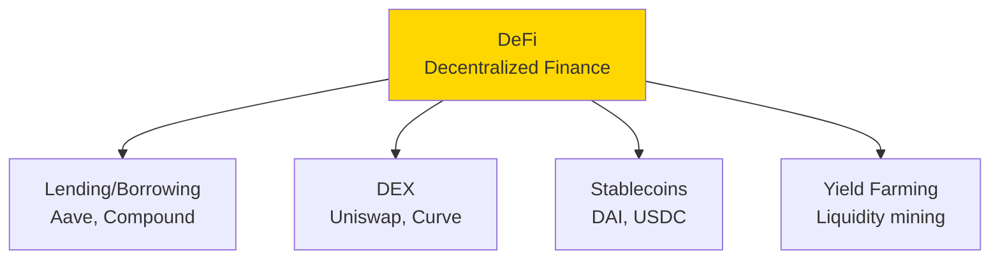

### DeFi Stack

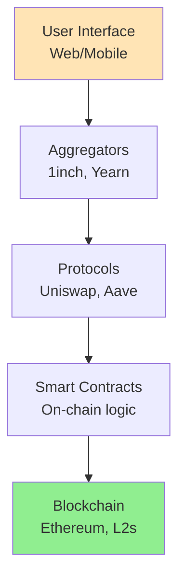

### Automated Market Maker (AMM)

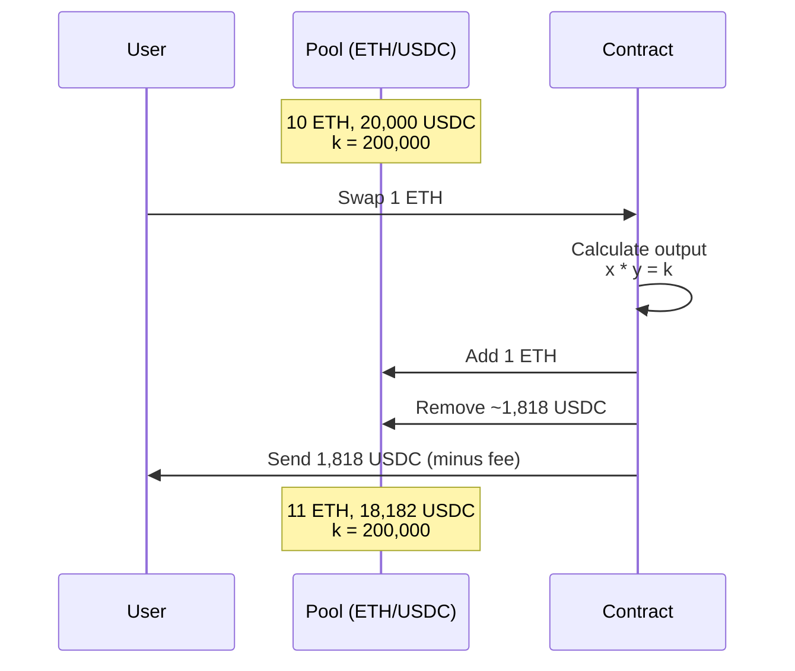

**Constant Product Formula**: $x \times y = k$

---

## Q2: What are Solidity modifiers and function visibility?

**Answer**:

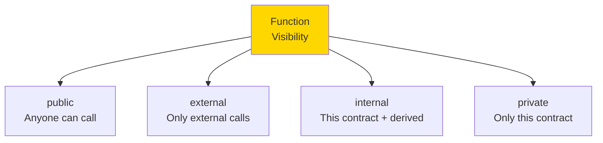

### Modifiers

```solidity
contract AccessControl {
    address public owner;
    mapping(address => bool) public admins;
    
    constructor() {
        owner = msg.sender;
    }
    
    // Modifier: reusable check
    modifier onlyOwner() {
        require(msg.sender == owner, "Not owner");
        _; // Continue execution
    }
    
    modifier onlyAdmin() {
        require(admins[msg.sender], "Not admin");
        _;
    }
    
    modifier validAddress(address _addr) {
        require(_addr != address(0), "Invalid address");
        _;
    }
    
    // Using modifiers
    function transferOwnership(address newOwner) 
        public 
        onlyOwner 
        validAddress(newOwner) 
    {
        owner = newOwner;
    }
    
    function addAdmin(address admin) public onlyOwner {
        admins[admin] = true;
    }
    
    function restrictedFunction() public onlyAdmin {
        // Admin-only logic
    }
}
```

### Function Types

```solidity
contract FunctionTypes {
    uint256 public value;
    
    // public: Can be called internally and externally
    function publicFunction() public returns (uint256) {
        return value;
    }
    
    // external: Only external calls (more gas efficient)
    function externalFunction() external returns (uint256) {
        return value;
    }
    
    // internal: This contract and derived contracts
    function internalFunction() internal returns (uint256) {
        return value * 2;
    }
    
    // private: Only this contract
    function privateFunction() private returns (uint256) {
        return value * 3;
    }
    
    // view: Reads state, doesn't modify
    function viewFunction() public view returns (uint256) {
        return value;
    }
    
    // pure: Doesn't read or modify state
    function pureFunction(uint256 a, uint256 b) public pure returns (uint256) {
        return a + b;
    }
    
    // payable: Can receive ETH
    function payableFunction() public payable {
        // msg.value contains sent ETH
    }
}
```

---

## Q3: Explain reentrancy attacks and how to prevent them.

**Answer**:

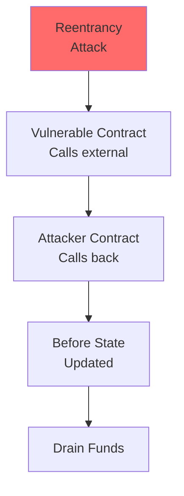

### Vulnerable Contract

```solidity
// ❌ VULNERABLE to reentrancy
contract VulnerableBank {
    mapping(address => uint256) public balances;
    
    function deposit() public payable {
        balances[msg.sender] += msg.value;
    }
    
    function withdraw(uint256 amount) public {
        require(balances[msg.sender] >= amount, "Insufficient balance");
        
        // DANGER: External call before state update
        (bool success, ) = msg.sender.call{value: amount}("");
        require(success, "Transfer failed");
        
        // State updated AFTER external call
        balances[msg.sender] -= amount;
    }
}
```

### Attack Contract

```solidity
contract Attacker {
    VulnerableBank public bank;
    
    constructor(address _bank) {
        bank = VulnerableBank(_bank);
    }
    
    function attack() public payable {
        bank.deposit{value: 1 ether}();
        bank.withdraw(1 ether);
    }
    
    // Fallback function called when receiving ETH
    receive() external payable {
        if (address(bank).balance >= 1 ether) {
            bank.withdraw(1 ether); // Reenter!
        }
    }
}
```

### Attack Flow

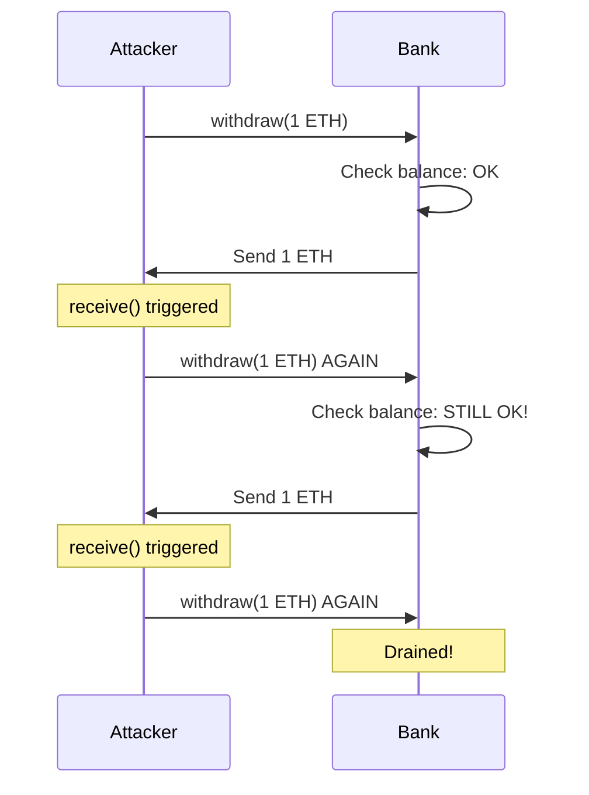

### Prevention Methods

```solidity
// ✅ Method 1: Checks-Effects-Interactions Pattern
contract SafeBank1 {
    mapping(address => uint256) public balances;
    
    function withdraw(uint256 amount) public {
        require(balances[msg.sender] >= amount, "Insufficient balance");
        
        // Update state BEFORE external call
        balances[msg.sender] -= amount;
        
        // External call last
        (bool success, ) = msg.sender.call{value: amount}("");
        require(success, "Transfer failed");
    }
}

// ✅ Method 2: ReentrancyGuard
import "@openzeppelin/contracts/security/ReentrancyGuard.sol";

contract SafeBank2 is ReentrancyGuard {
    mapping(address => uint256) public balances;
    
    function withdraw(uint256 amount) public nonReentrant {
        require(balances[msg.sender] >= amount, "Insufficient balance");
        
        balances[msg.sender] -= amount;
        (bool success, ) = msg.sender.call{value: amount}("");
        require(success, "Transfer failed");
    }
}

// ✅ Method 3: Pull over Push
contract SafeBank3 {
    mapping(address => uint256) public balances;
    mapping(address => uint256) public pendingWithdrawals;
    
    function initiateWithdrawal(uint256 amount) public {
        require(balances[msg.sender] >= amount, "Insufficient balance");
        balances[msg.sender] -= amount;
        pendingWithdrawals[msg.sender] += amount;
    }
    
    function completeWithdrawal() public {
        uint256 amount = pendingWithdrawals[msg.sender];
        require(amount > 0, "No pending withdrawal");
        
        pendingWithdrawals[msg.sender] = 0;
        (bool success, ) = msg.sender.call{value: amount}("");
        require(success, "Transfer failed");
    }
}
```

---

## Q4: What are proxy patterns and upgradeable contracts?

**Answer**:

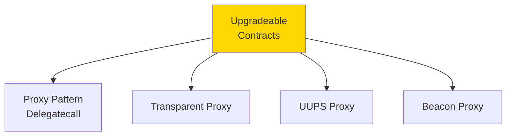

### Proxy Architecture

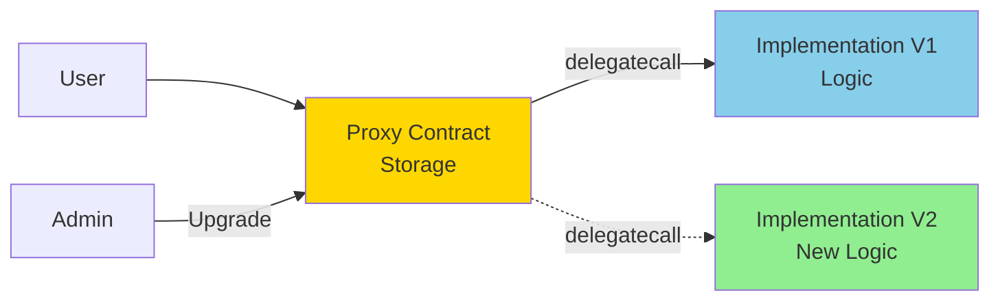

### Transparent Proxy Pattern

```solidity
// Proxy contract (never changes)
contract TransparentProxy {
    address public implementation;
    address public admin;
    
    constructor(address _implementation) {
        implementation = _implementation;
        admin = msg.sender;
    }
    
    modifier onlyAdmin() {
        require(msg.sender == admin, "Not admin");
        _;
    }
    
    function upgradeTo(address newImplementation) external onlyAdmin {
        implementation = newImplementation;
    }
    
    fallback() external payable {
        address impl = implementation;
        
        assembly {
            // Copy calldata
            calldatacopy(0, 0, calldatasize())
            
            // Delegatecall to implementation
            let result := delegatecall(gas(), impl, 0, calldatasize(), 0, 0)
            
            // Copy return data
            returndatacopy(0, 0, returndatasize())
            
            switch result
            case 0 { revert(0, returndatasize()) }
            default { return(0, returndatasize()) }
        }
    }
}

// Implementation V1
contract ImplementationV1 {
    uint256 public value;
    
    function setValue(uint256 _value) public {
        value = _value;
    }
    
    function getValue() public view returns (uint256) {
        return value;
    }
}

// Implementation V2 (upgraded)
contract ImplementationV2 {
    uint256 public value;
    
    function setValue(uint256 _value) public {
        value = _value;
    }
    
    function getValue() public view returns (uint256) {
        return value;
    }
    
    // New function
    function increment() public {
        value++;
    }
}
```

### Storage Collision

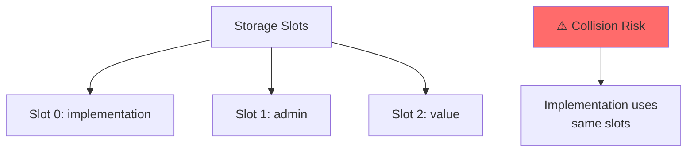

**Solution**: Use storage gaps or structured storage

```solidity
contract ImplementationV1 {
    // Reserve slots for proxy
    bytes32 private constant IMPLEMENTATION_SLOT = 
        bytes32(uint256(keccak256("eip1967.proxy.implementation")) - 1);
    bytes32 private constant ADMIN_SLOT = 
        bytes32(uint256(keccak256("eip1967.proxy.admin")) - 1);
    
    // Implementation storage starts here
    uint256 public value;
}
```

---

## Q5: Explain oracles and Chainlink.

**Answer**:

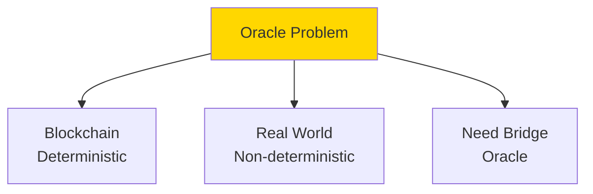

### Oracle Architecture

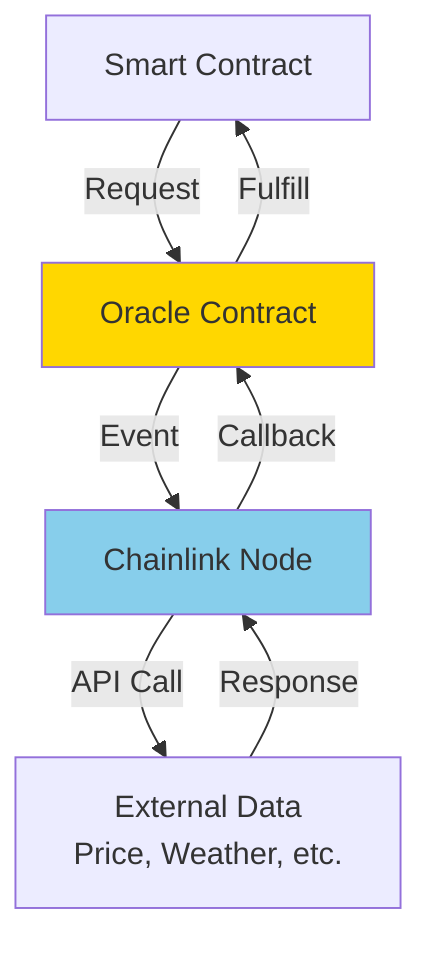

### Chainlink Price Feed

```solidity
import "@chainlink/contracts/src/v0.8/interfaces/AggregatorV3Interface.sol";

contract PriceConsumer {
    AggregatorV3Interface internal priceFeed;
    
    constructor() {
        // ETH/USD price feed on Ethereum mainnet
        priceFeed = AggregatorV3Interface(
            0x5f4eC3Df9cbd43714FE2740f5E3616155c5b8419
        );
    }
    
    function getLatestPrice() public view returns (int) {
        (
            uint80 roundId,
            int price,
            uint startedAt,
            uint updatedAt,
            uint80 answeredInRound
        ) = priceFeed.latestRoundData();
        
        return price; // Returns price with 8 decimals
    }
    
    function getDecimals() public view returns (uint8) {
        return priceFeed.decimals();
    }
}
```

### Custom Oracle Request

```solidity
import "@chainlink/contracts/src/v0.8/ChainlinkClient.sol";

contract APIConsumer is ChainlinkClient {
    using Chainlink for Chainlink.Request;
    
    uint256 public volume;
    address private oracle;
    bytes32 private jobId;
    uint256 private fee;
    
    constructor() {
        setPublicChainlinkToken();
        oracle = 0x...; // Oracle address
        jobId = "..."; // Job ID
        fee = 0.1 * 10 ** 18; // 0.1 LINK
    }
    
    function requestVolumeData() public returns (bytes32 requestId) {
        Chainlink.Request memory request = buildChainlinkRequest(
            jobId,
            address(this),
            this.fulfill.selector
        );
        
        // Set the URL to perform the GET request on
        request.add("get", "https://api.example.com/volume");
        request.add("path", "data.volume");
        
        // Sends the request
        return sendChainlinkRequestTo(oracle, request, fee);
    }
    
    function fulfill(bytes32 _requestId, uint256 _volume) public recordChainlinkFulfillment(_requestId) {
        volume = _volume;
    }
}
```

---

## Q6: What are Layer 2 solutions?

**Answer**:

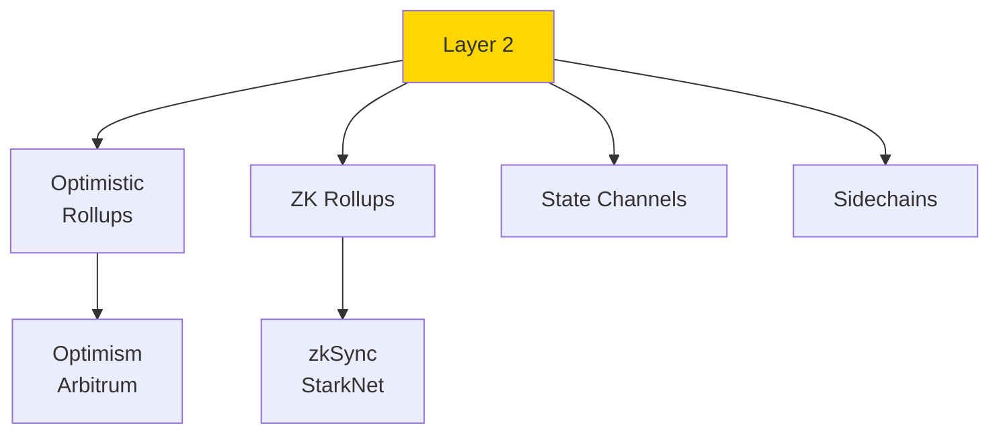

### Rollup Architecture

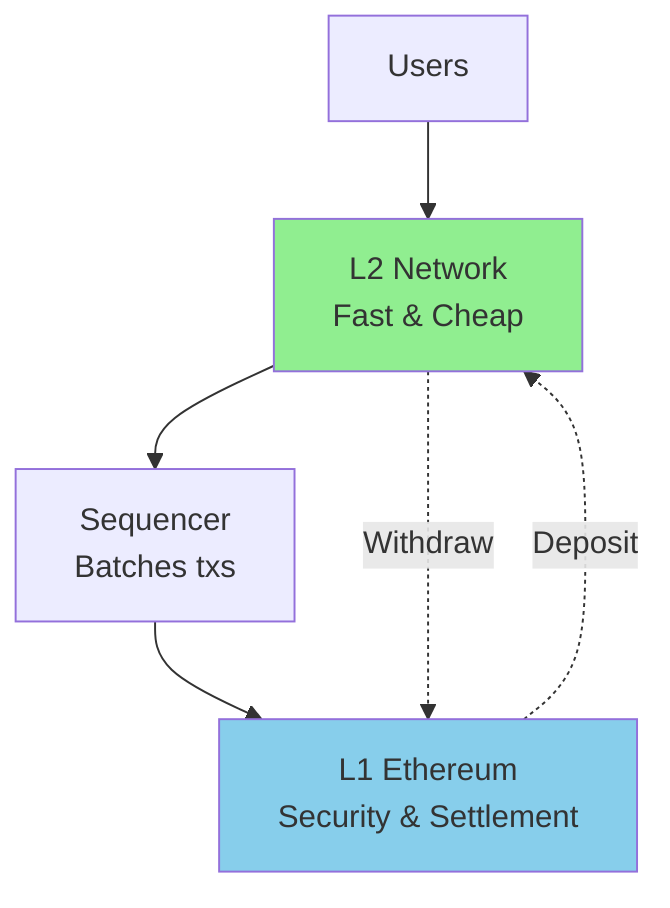

### Optimistic vs ZK Rollups

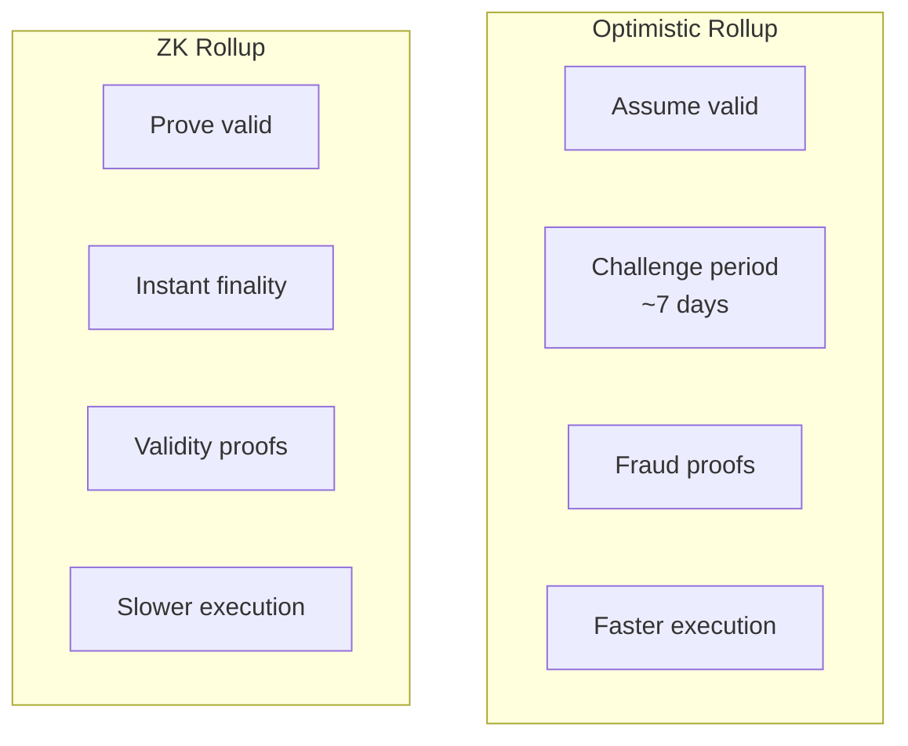

### Bridge Contract

```solidity
// Simplified L1 → L2 bridge
contract L1Bridge {
    address public l2Bridge;
    
    event DepositInitiated(
        address indexed from,
        address indexed to,
        uint256 amount
    );
    
    function depositETH(address to) public payable {
        require(msg.value > 0, "Must send ETH");
        
        emit DepositInitiated(msg.sender, to, msg.value);
        
        // L2 sequencer watches this event
        // and mints equivalent on L2
    }
    
    function finalizeWithdrawal(
        address to,
        uint256 amount,
        bytes memory proof
    ) public {
        // Verify proof from L2
        require(verifyProof(proof), "Invalid proof");
        
        // Transfer ETH
        (bool success, ) = to.call{value: amount}("");
        require(success, "Transfer failed");
    }
    
    function verifyProof(bytes memory proof) internal view returns (bool) {
        // Verify Merkle proof or fraud proof
        // Implementation depends on L2 type
        return true;
    }
}
```

---

## Q7: Explain EIP-1559 and gas optimization.

**Answer**:

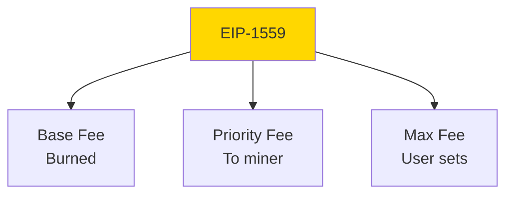

### Gas Calculation (EIP-1559)

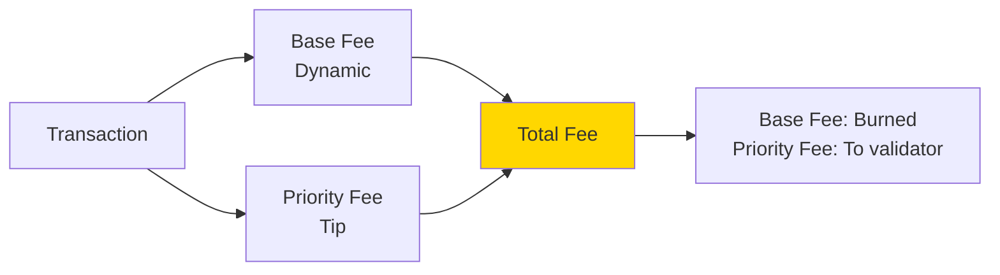

**Formula**:
$$\text{Total Fee} = \text{Gas Used} \times (\text{Base Fee} + \text{Priority Fee})$$

### Gas Optimization Techniques

```solidity
contract GasOptimization {
    // ❌ Expensive: Storage writes
    uint256 public counter;
    
    function incrementBad() public {
        counter = counter + 1; // ~5,000 gas
    }
    
    // ✅ Better: Use += operator
    function incrementGood() public {
        counter += 1; // ~5,000 gas (same, but clearer)
    }
    
    // ✅ Best: Cache in memory
    function incrementBest() public {
        uint256 temp = counter;
        temp += 1;
        counter = temp;
    }
    
    // ❌ Expensive: Dynamic array in storage
    uint256[] public numbers;
    
    function sumBad() public view returns (uint256) {
        uint256 total = 0;
        for (uint256 i = 0; i < numbers.length; i++) {
            total += numbers[i]; // Each read: ~2,100 gas
        }
        return total;
    }
    
    // ✅ Better: Cache length
    function sumGood() public view returns (uint256) {
        uint256 total = 0;
        uint256 length = numbers.length; // Cache length
        for (uint256 i = 0; i < length; i++) {
            total += numbers[i];
        }
        return total;
    }
    
    // ✅ Use calldata for external functions
    function processBad(uint256[] memory data) public pure returns (uint256) {
        return data.length;
    }
    
    function processGood(uint256[] calldata data) external pure returns (uint256) {
        return data.length; // Cheaper: no copy to memory
    }
    
    // ✅ Pack variables
    struct Inefficient {
        uint8 a;    // Slot 0
        uint256 b;  // Slot 1
        uint8 c;    // Slot 2
    }
    
    struct Efficient {
        uint8 a;    // Slot 0
        uint8 c;    // Slot 0 (packed)
        uint256 b;  // Slot 1
    }
    
    // ✅ Use events instead of storage
    event DataStored(uint256 indexed id, string data);
    
    function storeInEvent(uint256 id, string memory data) public {
        emit DataStored(id, data); // Much cheaper than storage
    }
    
    // ✅ Short-circuit conditions
    function checkBad(uint256 a, uint256 b) public pure returns (bool) {
        return expensiveCheck(a) && cheapCheck(b);
    }
    
    function checkGood(uint256 a, uint256 b) public pure returns (bool) {
        return cheapCheck(b) && expensiveCheck(a); // Cheap first
    }
    
    function cheapCheck(uint256 x) internal pure returns (bool) {
        return x > 0;
    }
    
    function expensiveCheck(uint256 x) internal pure returns (bool) {
        // Expensive computation
        return x % 2 == 0;
    }
}
```

---

## Q8: What are signatures and how to verify them on-chain?

**Answer**:

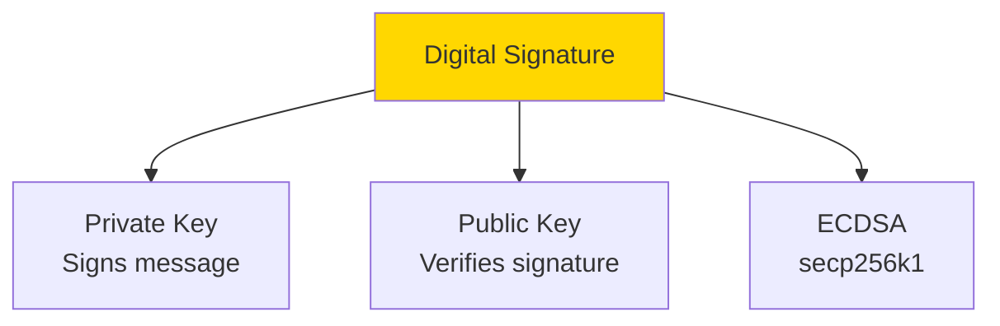

### Signature Process

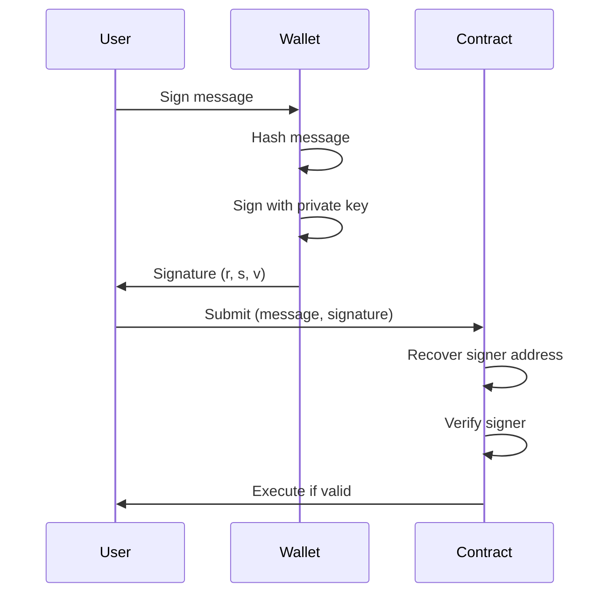

### Off-chain Signing

```javascript
const { ethers } = require('ethers');

// Sign message off-chain
async function signMessage(wallet, message) {
  // Create message hash
  const messageHash = ethers.utils.id(message);
  
  // Sign
  const signature = await wallet.signMessage(ethers.utils.arrayify(messageHash));
  
  // Split signature
  const sig = ethers.utils.splitSignature(signature);
  
  return {
    message,
    messageHash,
    signature,
    r: sig.r,
    s: sig.s,
    v: sig.v
  };
}

// Example
const wallet = new ethers.Wallet('0x...');
const signed = await signMessage(wallet, "Hello World");
```

### On-chain Verification

```solidity
contract SignatureVerifier {
    function verifySignature(
        address signer,
        string memory message,
        bytes memory signature
    ) public pure returns (bool) {
        bytes32 messageHash = keccak256(abi.encodePacked(message));
        bytes32 ethSignedMessageHash = getEthSignedMessageHash(messageHash);
        
        address recoveredSigner = recoverSigner(ethSignedMessageHash, signature);
        return recoveredSigner == signer;
    }
    
    function getEthSignedMessageHash(bytes32 messageHash) 
        internal 
        pure 
        returns (bytes32) 
    {
        return keccak256(
            abi.encodePacked("\x19Ethereum Signed Message:\n32", messageHash)
        );
    }
    
    function recoverSigner(bytes32 ethSignedMessageHash, bytes memory signature)
        internal
        pure
        returns (address)
    {
        (bytes32 r, bytes32 s, uint8 v) = splitSignature(signature);
        return ecrecover(ethSignedMessageHash, v, r, s);
    }
    
    function splitSignature(bytes memory sig)
        internal
        pure
        returns (bytes32 r, bytes32 s, uint8 v)
    {
        require(sig.length == 65, "Invalid signature length");
        
        assembly {
            r := mload(add(sig, 32))
            s := mload(add(sig, 64))
            v := byte(0, mload(add(sig, 96)))
        }
    }
}

// Usage: Meta-transactions
contract MetaTransaction {
    mapping(address => uint256) public nonces;
    
    function executeMetaTransaction(
        address user,
        bytes memory functionSignature,
        bytes32 r,
        bytes32 s,
        uint8 v
    ) public returns (bytes memory) {
        bytes32 messageHash = keccak256(
            abi.encodePacked(user, functionSignature, nonces[user])
        );
        
        address signer = ecrecover(messageHash, v, r, s);
        require(signer == user, "Invalid signature");
        
        nonces[user]++;
        
        (bool success, bytes memory returnData) = address(this).call(
            functionSignature
        );
        require(success, "Function call failed");
        
        return returnData;
    }
}
```

---

## Q9: Explain flash loans and how they work.

**Answer**:

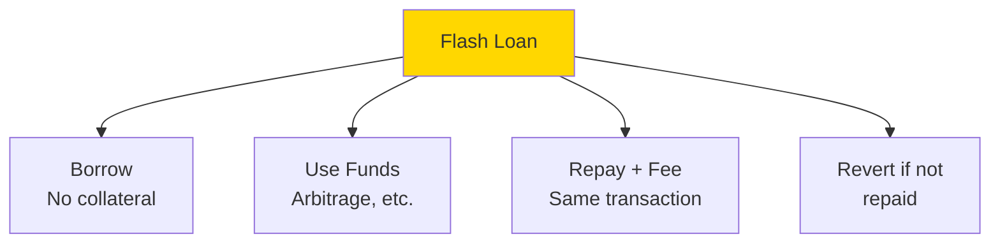

### Flash Loan Flow

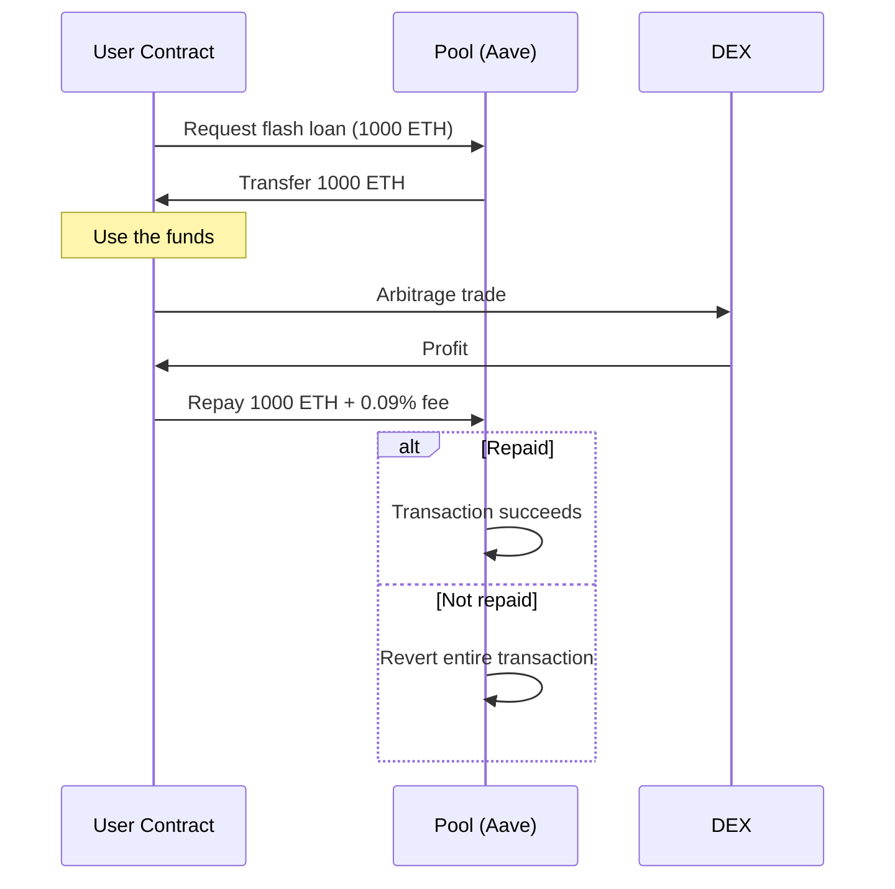

### Flash Loan Implementation

```solidity
// Aave flash loan interface
interface IFlashLoanReceiver {
    function executeOperation(
        address[] calldata assets,
        uint256[] calldata amounts,
        uint256[] calldata premiums,
        address initiator,
        bytes calldata params
    ) external returns (bool);
}

contract FlashLoanArbitrage is IFlashLoanReceiver {
    ILendingPool public lendingPool;
    
    constructor(address _lendingPool) {
        lendingPool = ILendingPool(_lendingPool);
    }
    
    function executeFlashLoan(address asset, uint256 amount) public {
        address[] memory assets = new address[](1);
        assets[0] = asset;
        
        uint256[] memory amounts = new uint256[](1);
        amounts[0] = amount;
        
        uint256[] memory modes = new uint256[](1);
        modes[0] = 0; // 0 = no debt, flash loan
        
        lendingPool.flashLoan(
            address(this),
            assets,
            amounts,
            modes,
            address(this),
            "",
            0
        );
    }
    
    function executeOperation(
        address[] calldata assets,
        uint256[] calldata amounts,
        uint256[] calldata premiums,
        address initiator,
        bytes calldata params
    ) external override returns (bool) {
        // This function is called by the lending pool
        // You have the borrowed funds here
        
        // 1. Perform arbitrage or other operations
        performArbitrage(assets[0], amounts[0]);
        
        // 2. Approve the lending pool to pull the funds back
        uint256 amountOwed = amounts[0] + premiums[0];
        IERC20(assets[0]).approve(address(lendingPool), amountOwed);
        
        // 3. Return true to indicate success
        return true;
    }
    
    function performArbitrage(address asset, uint256 amount) internal {
        // Example: Buy low on DEX1, sell high on DEX2
        
        // Buy on Uniswap
        address[] memory path = new address[](2);
        path[0] = asset;
        path[1] = address(USDC);
        
        IUniswapV2Router(uniswapRouter).swapExactTokensForTokens(
            amount,
            0,
            path,
            address(this),
            block.timestamp
        );
        
        // Sell on Sushiswap (if price is higher)
        path[0] = address(USDC);
        path[1] = asset;
        
        IUniswapV2Router(sushiswapRouter).swapExactTokensForTokens(
            USDC.balanceOf(address(this)),
            amount, // Must get back at least what we borrowed + fee
            path,
            address(this),
            block.timestamp
        );
    }
}
```

**Use Cases**:
- Arbitrage between DEXes
- Collateral swap
- Self-liquidation
- Debt refinancing

---

## Q10: What are common smart contract vulnerabilities?

**Answer**:

```mermaid
graph TB
    A[Smart Contract<br/>Vulnerabilities] --> B[Reentrancy]
    A --> C[Integer Overflow]
    A --> D[Access Control]
    A --> E[Front-Running]
    A --> F[Timestamp Dependence]
    A --> G[Denial of Service]
    
    style A fill:#FFD700
    style B fill:#FF6B6B
    style C fill:#FF6B6B
    style D fill:#FF6B6B
```

### Integer Overflow (Pre-Solidity 0.8)

```solidity
// ❌ Vulnerable (Solidity < 0.8)
contract Vulnerable {
    uint8 public count = 255;
    
    function increment() public {
        count++; // Overflows to 0
    }
}

// ✅ Fixed: Use SafeMath or Solidity 0.8+
import "@openzeppelin/contracts/utils/math/SafeMath.sol";

contract Safe {
    using SafeMath for uint8;
    uint8 public count = 255;
    
    function increment() public {
        count = count.add(1); // Reverts on overflow
    }
}

// ✅ Solidity 0.8+ has built-in overflow checks
contract SafeModern {
    uint8 public count = 255;
    
    function increment() public {
        count++; // Automatically reverts on overflow
    }
}
```

### Access Control Vulnerability

```solidity
// ❌ Vulnerable: Missing access control
contract VulnerableWallet {
    function withdraw(uint256 amount) public {
        // Anyone can call this!
        payable(msg.sender).transfer(amount);
    }
}

// ✅ Fixed: Proper access control
contract SafeWallet {
    address public owner;
    
    constructor() {
        owner = msg.sender;
    }
    
    modifier onlyOwner() {
        require(msg.sender == owner, "Not owner");
        _;
    }
    
    function withdraw(uint256 amount) public onlyOwner {
        payable(msg.sender).transfer(amount);
    }
}
```

### Front-Running

```solidity
// ❌ Vulnerable to front-running
contract VulnerableAuction {
    uint256 public highestBid;
    address public highestBidder;
    
    function bid() public payable {
        require(msg.value > highestBid, "Bid too low");
        
        // Refund previous bidder
        payable(highestBidder).transfer(highestBid);
        
        highestBid = msg.value;
        highestBidder = msg.sender;
    }
}

// ✅ Better: Commit-reveal scheme
contract SafeAuction {
    mapping(address => bytes32) public commitments;
    mapping(address => uint256) public bids;
    
    // Phase 1: Commit
    function commit(bytes32 commitment) public {
        commitments[msg.sender] = commitment;
    }
    
    // Phase 2: Reveal
    function reveal(uint256 bid, bytes32 secret) public payable {
        require(
            keccak256(abi.encodePacked(bid, secret)) == commitments[msg.sender],
            "Invalid reveal"
        );
        require(msg.value == bid, "Incorrect payment");
        
        bids[msg.sender] = bid;
    }
}
```

### Denial of Service

```solidity
// ❌ Vulnerable: Unbounded loop
contract VulnerableDistributor {
    address[] public recipients;
    
    function distribute() public {
        for (uint256 i = 0; i < recipients.length; i++) {
            payable(recipients[i]).transfer(1 ether);
            // If one transfer fails, entire function fails
            // If array is too large, runs out of gas
        }
    }
}

// ✅ Fixed: Pull over push
contract SafeDistributor {
    mapping(address => uint256) public balances;
    
    function allocate(address[] memory recipients) public {
        for (uint256 i = 0; i < recipients.length; i++) {
            balances[recipients[i]] += 1 ether;
        }
    }
    
    function withdraw() public {
        uint256 amount = balances[msg.sender];
        require(amount > 0, "No balance");
        
        balances[msg.sender] = 0;
        payable(msg.sender).transfer(amount);
    }
}
```

---

## Summary

Medium Web3 topics:
- **DeFi**: Lending, DEX, AMM, yield farming
- **Solidity Advanced**: Modifiers, visibility, function types
- **Reentrancy**: Attack vectors and prevention
- **Proxy Patterns**: Upgradeable contracts, delegatecall
- **Oracles**: Chainlink, price feeds, external data
- **Layer 2**: Rollups, sidechains, bridges
- **EIP-1559**: Gas optimization techniques
- **Signatures**: ECDSA, on-chain verification, meta-transactions
- **Flash Loans**: Uncollateralized borrowing, arbitrage
- **Security**: Common vulnerabilities and fixes

These concepts are essential for building secure DeFi protocols.

