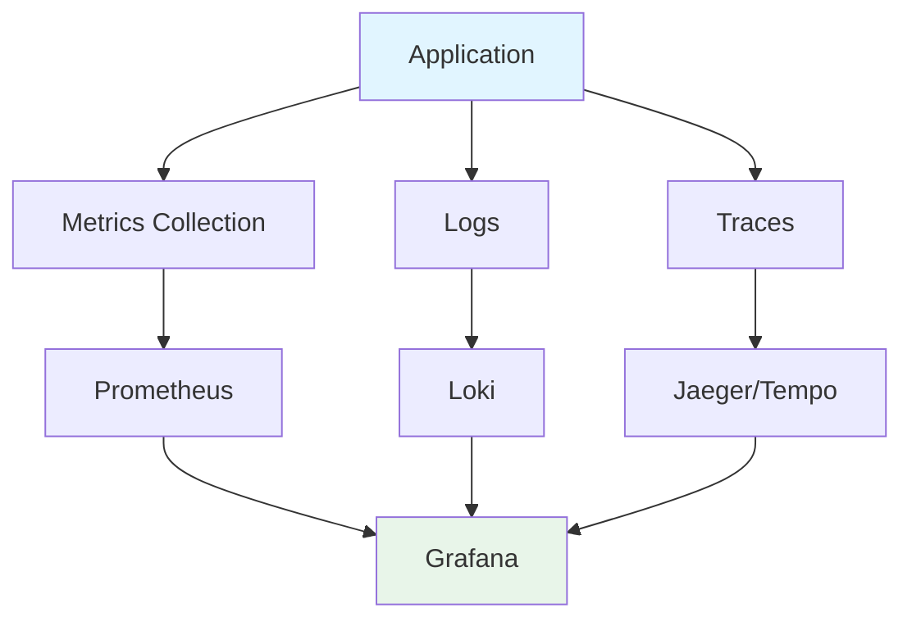

Essential tools for measuring network and computer performance. Quick reference for performance analysis.

---

## Network Performance

### iperf3 - Network Bandwidth Testing

```bash
# Install
sudo apt install iperf3  # Linux
brew install iperf3      # macOS
scoop install iperf3     # Windows

# Server mode
iperf3 -s

# Client mode (test to server)
iperf3 -c server_ip

# Test for 30 seconds
iperf3 -c server_ip -t 30

# Test UDP
iperf3 -c server_ip -u -b 100M

# Reverse mode (server sends)
iperf3 -c server_ip -R

# Parallel streams
iperf3 -c server_ip -P 4

# JSON output
iperf3 -c server_ip -J > results.json
```

### netstat - Network Statistics

```bash
# Show all connections
netstat -a

# Show listening ports
netstat -l
netstat -tuln  # TCP/UDP numeric

# Show statistics
netstat -s

# Show routing table
netstat -r

# Show with process info
netstat -tulpn  # Linux
netstat -anv    # macOS

# Continuous monitoring
netstat -c

# Show specific port
netstat -an | grep :8080
```

### tcpdump - Packet Capture

```bash
# Capture on interface
sudo tcpdump -i eth0

# Capture specific host
sudo tcpdump host 192.168.1.1

# Capture specific port
sudo tcpdump port 80

# Capture and save to file
sudo tcpdump -i eth0 -w capture.pcap

# Read from file
tcpdump -r capture.pcap

# Capture HTTP traffic
sudo tcpdump -i eth0 'tcp port 80'

# Capture with verbose output
sudo tcpdump -i eth0 -vv

# Capture first 100 packets
sudo tcpdump -i eth0 -c 100

# Filter by protocol
sudo tcpdump -i eth0 icmp
sudo tcpdump -i eth0 tcp
```

### ping & traceroute

```bash
# Ping
ping google.com
ping -c 10 google.com  # 10 packets
ping -i 0.2 google.com # Fast ping

# Traceroute
traceroute google.com
traceroute -n google.com  # No DNS lookup

# Windows
tracert google.com

# MTR (better traceroute)
mtr google.com
mtr -r -c 100 google.com  # Report mode
```

---

## CPU Performance

### top - Process Monitor

```bash
# Start top
top

# Sort by CPU
top -o %CPU

# Sort by memory
top -o %MEM

# Show specific user
top -u username

# Batch mode (for scripts)
top -b -n 1

# Show threads
top -H
```

### htop - Interactive Process Viewer

```bash
# Install
sudo apt install htop  # Linux
brew install htop      # macOS

# Start htop
htop

# Keyboard shortcuts:
# F2 - Setup
# F3 - Search
# F4 - Filter
# F5 - Tree view
# F6 - Sort by
# F9 - Kill process
# F10 - Quit
```

### perf - Linux Performance Analysis

```bash
# Install
sudo apt install linux-tools-common linux-tools-generic

# Record CPU profile
sudo perf record -g ./myapp

# View report
sudo perf report

# Record for specific duration
sudo perf record -g -a sleep 30

# Record specific process
sudo perf record -g -p <PID>

# CPU statistics
sudo perf stat ./myapp

# Top-like view
sudo perf top

# Flamegraph generation
sudo perf record -g -a sleep 30
sudo perf script > out.perf
./flamegraph.pl out.perf > flamegraph.svg
```

---

## Memory Performance

### free - Memory Usage

```bash
# Show memory usage
free

# Human-readable
free -h

# Show in MB
free -m

# Continuous monitoring
free -h -s 2  # Every 2 seconds
```

### vmstat - Virtual Memory Statistics

```bash
# Show statistics
vmstat

# Update every 2 seconds
vmstat 2

# Show 10 updates
vmstat 2 10

# Show in MB
vmstat -S M 2
```

### ps - Process Status

```bash
# Show all processes
ps aux

# Show process tree
ps auxf

# Show specific user
ps -u username

# Sort by memory
ps aux --sort=-%mem | head

# Sort by CPU
ps aux --sort=-%cpu | head

# Show threads
ps -eLf

# Custom format
ps -eo pid,ppid,cmd,%mem,%cpu --sort=-%mem | head
```

---

## Disk Performance

### iostat - I/O Statistics

```bash
# Install
sudo apt install sysstat

# Show I/O statistics
iostat

# Update every 2 seconds
iostat 2

# Show extended statistics
iostat -x 2

# Show specific device
iostat -x sda 2

# Human-readable
iostat -h 2
```

### iotop - I/O Monitor

```bash
# Install
sudo apt install iotop

# Start iotop
sudo iotop

# Show only processes doing I/O
sudo iotop -o

# Batch mode
sudo iotop -b -n 5
```

### df & du - Disk Usage

```bash
# Show disk space
df -h

# Show inodes
df -i

# Show specific filesystem
df -h /home

# Show directory size
du -sh /path/to/dir

# Show top 10 largest directories
du -h /path | sort -rh | head -10

# Show all subdirectories
du -h --max-depth=1 /path
```

---

## Application Profiling

### Go

```go
import (
    _ "net/http/pprof"
    "net/http"
)

func main() {
    go func() {
        http.ListenAndServe("localhost:6060", nil)
    }()
    // Your application code
}
```

```bash
# CPU profile
go tool pprof http://localhost:6060/debug/pprof/profile?seconds=30

# Memory profile
go tool pprof http://localhost:6060/debug/pprof/heap

# Goroutine profile
go tool pprof http://localhost:6060/debug/pprof/goroutine

# Generate flamegraph
go tool pprof -http=:8080 profile.pb.gz
```

### Python

```python
# cProfile
python -m cProfile -o output.prof script.py

# View results
python -m pstats output.prof

# line_profiler
@profile
def my_function():
    pass

# Run with
kernprof -l -v script.py

# memory_profiler
@profile
def my_function():
    pass

# Run with
python -m memory_profiler script.py
```

### Node.js

```bash
# CPU profiling
node --prof app.js
node --prof-process isolate-*-v8.log > processed.txt

# Inspect
node --inspect app.js
# Open chrome://inspect

# Clinic.js
npm install -g clinic
clinic doctor -- node app.js
clinic flame -- node app.js
clinic bubbleprof -- node app.js
```

---

## Flamegraphs

```bash
# Install FlameGraph
git clone https://github.com/brendangregg/FlameGraph
cd FlameGraph

# Generate from perf data
sudo perf record -F 99 -a -g -- sleep 30
sudo perf script > out.perf
./stackcollapse-perf.pl out.perf > out.folded
./flamegraph.pl out.folded > flamegraph.svg

# Open in browser
firefox flamegraph.svg
```

---

## Benchmarking

### Apache Bench (ab)

```bash
# Install
sudo apt install apache2-utils

# Basic test
ab -n 1000 -c 10 http://localhost:8080/

# With keep-alive
ab -n 1000 -c 10 -k http://localhost:8080/

# POST request
ab -n 1000 -c 10 -p data.json -T application/json http://localhost:8080/api

# With authentication
ab -n 1000 -c 10 -H "Authorization: Bearer token" http://localhost:8080/
```

### wrk - HTTP Benchmarking

```bash
# Install
sudo apt install wrk

# Basic test
wrk -t12 -c400 -d30s http://localhost:8080/

# With script
wrk -t12 -c400 -d30s -s script.lua http://localhost:8080/

# Example script (script.lua)
wrk.method = "POST"
wrk.body   = '{"key":"value"}'
wrk.headers["Content-Type"] = "application/json"
```

### hey - HTTP Load Generator

```bash
# Install
go install github.com/rakyll/hey@latest

# Basic test
hey -n 1000 -c 10 http://localhost:8080/

# With custom headers
hey -n 1000 -c 10 -H "Authorization: Bearer token" http://localhost:8080/

# POST request
hey -n 1000 -c 10 -m POST -d '{"key":"value"}' http://localhost:8080/api
```

---

## Monitoring Dashboard



---

## Quick Reference

```bash
# Network
iperf3 -c server_ip              # Bandwidth test
netstat -tuln                    # Listening ports
tcpdump -i eth0 port 80          # Capture HTTP

# CPU
top                              # Process monitor
htop                             # Interactive monitor
perf record -g ./app             # Profile app

# Memory
free -h                          # Memory usage
vmstat 2                         # VM stats
ps aux --sort=-%mem | head       # Top memory processes

# Disk
iostat -x 2                      # I/O stats
df -h                            # Disk space
du -sh /path                     # Directory size

# Benchmarking
ab -n 1000 -c 10 http://url      # Apache Bench
wrk -t12 -c400 -d30s http://url  # wrk
hey -n 1000 -c 10 http://url     # hey
```

---