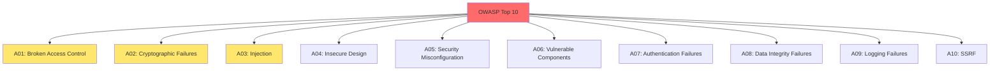

Security best practices, OWASP Top 10, secure coding practices, and security testing tools.

---

## OWASP Top 10 (2021)



---

## A01: Broken Access Control

### Vulnerability

```python
# ❌ Insecure Direct Object Reference (IDOR)
@app.route('/api/users/<user_id>')
def get_user(user_id):
    user = db.query(f"SELECT * FROM users WHERE id = {user_id}")
    return jsonify(user)

# Attacker can access any user: /api/users/123
```

### Mitigation

```python
# ✅ Check authorization
@app.route('/api/users/<user_id>')
@login_required
def get_user(user_id):
    current_user = get_current_user()
    
    # Check if user can access this resource
    if current_user.id != user_id and not current_user.is_admin:
        abort(403)
    
    user = db.query("SELECT * FROM users WHERE id = ?", [user_id])
    return jsonify(user)

# ✅ Use UUIDs instead of sequential IDs
import uuid

user_id = str(uuid.uuid4())  # e.g., '550e8400-e29b-41d4-a716-446655440000'
```

---

## A02: Cryptographic Failures

### Vulnerability

```python
# ❌ Storing passwords in plain text
user.password = request.form['password']
db.save(user)

# ❌ Using weak hashing
import hashlib
user.password = hashlib.md5(password.encode()).hexdigest()
```

### Mitigation

```python
# ✅ Use bcrypt for password hashing
import bcrypt

# Hash password
password = "user_password"
hashed = bcrypt.hashpw(password.encode('utf-8'), bcrypt.gensalt())

# Verify password
if bcrypt.checkpw(password.encode('utf-8'), hashed):
    print("Password matches")

# ✅ Use strong encryption for sensitive data
from cryptography.fernet import Fernet

# Generate key
key = Fernet.generate_key()
cipher = Fernet(key)

# Encrypt
encrypted = cipher.encrypt(b"sensitive data")

# Decrypt
decrypted = cipher.decrypt(encrypted)
```

---

## A03: Injection

### SQL Injection

```python
# ❌ Vulnerable to SQL injection
username = request.form['username']
query = f"SELECT * FROM users WHERE username = '{username}'"
db.execute(query)

# Attack: username = "admin' OR '1'='1"
# Result: SELECT * FROM users WHERE username = 'admin' OR '1'='1'
```

```python
# ✅ Use parameterized queries
username = request.form['username']
query = "SELECT * FROM users WHERE username = ?"
db.execute(query, [username])

# ✅ Use ORM
from sqlalchemy import select

stmt = select(User).where(User.username == username)
result = session.execute(stmt)
```

### Command Injection

```python
# ❌ Vulnerable to command injection
filename = request.form['filename']
os.system(f'cat {filename}')

# Attack: filename = "file.txt; rm -rf /"
```

```python
# ✅ Use safe alternatives
import subprocess

filename = request.form['filename']
# Validate filename
if not re.match(r'^[a-zA-Z0-9_.-]+$', filename):
    abort(400)

# Use subprocess with list
result = subprocess.run(['cat', filename], capture_output=True)
```

### XSS (Cross-Site Scripting)

```python
# ❌ Vulnerable to XSS
@app.route('/search')
def search():
    query = request.args.get('q')
    return f'<h1>Results for: {query}</h1>'

# Attack: /search?q=<script>alert('XSS')</script>
```

```python
# ✅ Escape user input
from markupsafe import escape

@app.route('/search')
def search():
    query = request.args.get('q')
    return f'<h1>Results for: {escape(query)}</h1>'

# ✅ Use templating engines (auto-escape)
return render_template('search.html', query=query)

# ✅ Content Security Policy
@app.after_request
def set_csp(response):
    response.headers['Content-Security-Policy'] = "default-src 'self'"
    return response
```

---

## A04: Insecure Design

### Mitigation

```python
# ✅ Implement rate limiting
from flask_limiter import Limiter

limiter = Limiter(
    app,
    key_func=lambda: request.remote_addr,
    default_limits=["200 per day", "50 per hour"]
)

@app.route('/api/login')
@limiter.limit("5 per minute")
def login():
    # Login logic
    pass

# ✅ Implement account lockout
class User:
    failed_login_attempts = 0
    locked_until = None
    
    def check_login(self, password):
        if self.locked_until and datetime.now() < self.locked_until:
            raise AccountLockedException()
        
        if self.verify_password(password):
            self.failed_login_attempts = 0
            return True
        else:
            self.failed_login_attempts += 1
            if self.failed_login_attempts >= 5:
                self.locked_until = datetime.now() + timedelta(minutes=15)
            return False
```

---

## A05: Security Misconfiguration

### Checklist

```bash
# ✅ Disable debug mode in production
DEBUG = False

# ✅ Remove default credentials
# Change default admin/admin, root/root, etc.

# ✅ Disable directory listing
# Apache: Options -Indexes
# Nginx: autoindex off;

# ✅ Remove unnecessary services
sudo systemctl disable <service>

# ✅ Keep software updated
sudo apt update && sudo apt upgrade

# ✅ Configure HTTPS
# Use Let's Encrypt
sudo certbot --nginx -d example.com

# ✅ Set secure headers
@app.after_request
def set_security_headers(response):
    response.headers['X-Content-Type-Options'] = 'nosniff'
    response.headers['X-Frame-Options'] = 'DENY'
    response.headers['X-XSS-Protection'] = '1; mode=block'
    response.headers['Strict-Transport-Security'] = 'max-age=31536000; includeSubDomains'
    return response
```

---

## A06: Vulnerable and Outdated Components

### Tools

```bash
# Python
pip install safety
safety check

# Node.js
npm audit
npm audit fix

# Go
go list -json -m all | nancy sleuth

# Docker
docker scan myimage:latest

# Snyk
npm install -g snyk
snyk test
```

---

## A07: Identification and Authentication Failures

### Best Practices

```python
# ✅ Implement MFA
from pyotp import TOTP

# Generate secret
secret = pyotp.random_base32()

# Verify TOTP
totp = TOTP(secret)
if totp.verify(user_code):
    print("Valid code")

# ✅ Secure password reset
import secrets

def generate_reset_token():
    return secrets.token_urlsafe(32)

def send_reset_email(user):
    token = generate_reset_token()
    # Store token with expiration
    user.reset_token = token
    user.reset_token_expires = datetime.now() + timedelta(hours=1)
    # Send email with token
    send_email(user.email, f"Reset link: /reset?token={token}")

# ✅ Implement session timeout
@app.before_request
def check_session_timeout():
    if 'last_activity' in session:
        last_activity = session['last_activity']
        if datetime.now() - last_activity > timedelta(minutes=30):
            session.clear()
            return redirect('/login')
    session['last_activity'] = datetime.now()
```

---

## A08: Software and Data Integrity Failures

### Mitigation

```python
# ✅ Verify file uploads
ALLOWED_EXTENSIONS = {'png', 'jpg', 'jpeg', 'gif'}

def allowed_file(filename):
    return '.' in filename and \
           filename.rsplit('.', 1)[1].lower() in ALLOWED_EXTENSIONS

@app.route('/upload', methods=['POST'])
def upload_file():
    file = request.files['file']
    
    if not allowed_file(file.filename):
        abort(400)
    
    # Verify file content (not just extension)
    import magic
    mime = magic.from_buffer(file.read(1024), mime=True)
    if mime not in ['image/png', 'image/jpeg', 'image/gif']:
        abort(400)
    
    # Save with secure filename
    from werkzeug.utils import secure_filename
    filename = secure_filename(file.filename)
    file.save(os.path.join(app.config['UPLOAD_FOLDER'], filename))

# ✅ Use Subresource Integrity (SRI)
<script src="https://cdn.example.com/lib.js"
        integrity="sha384-oqVuAfXRKap7fdgcCY5uykM6+R9GqQ8K/uxy9rx7HNQlGYl1kPzQho1wx4JwY8wC"
        crossorigin="anonymous"></script>
```

---

## A09: Security Logging and Monitoring Failures

### Implementation

```python
import logging
from logging.handlers import RotatingFileHandler

# Configure logging
handler = RotatingFileHandler('security.log', maxBytes=10000000, backupCount=5)
handler.setLevel(logging.INFO)

formatter = logging.Formatter(
    '%(asctime)s - %(name)s - %(levelname)s - %(message)s'
)
handler.setFormatter(formatter)

security_logger = logging.getLogger('security')
security_logger.addHandler(handler)

# Log security events
@app.route('/login', methods=['POST'])
def login():
    username = request.form['username']
    password = request.form['password']
    
    user = User.query.filter_by(username=username).first()
    
    if user and user.verify_password(password):
        security_logger.info(f"Successful login: {username} from {request.remote_addr}")
        return redirect('/dashboard')
    else:
        security_logger.warning(f"Failed login attempt: {username} from {request.remote_addr}")
        return redirect('/login')

# Monitor for suspicious activity
def detect_brute_force(username, ip_address):
    """Detect brute force attempts"""
    recent_attempts = FailedLogin.query.filter(
        FailedLogin.username == username,
        FailedLogin.ip_address == ip_address,
        FailedLogin.timestamp > datetime.now() - timedelta(minutes=5)
    ).count()
    
    if recent_attempts > 5:
        security_logger.critical(f"Brute force detected: {username} from {ip_address}")
        # Send alert
        send_alert(f"Brute force attack detected from {ip_address}")
```

---

## A10: Server-Side Request Forgery (SSRF)

### Vulnerability

```python
# ❌ Vulnerable to SSRF
@app.route('/fetch')
def fetch_url():
    url = request.args.get('url')
    response = requests.get(url)
    return response.content

# Attack: /fetch?url=http://localhost:6379/
# Can access internal services
```

### Mitigation

```python
# ✅ Whitelist allowed domains
ALLOWED_DOMAINS = ['api.example.com', 'cdn.example.com']

def is_safe_url(url):
    from urllib.parse import urlparse
    parsed = urlparse(url)
    return parsed.netloc in ALLOWED_DOMAINS

@app.route('/fetch')
def fetch_url():
    url = request.args.get('url')
    
    if not is_safe_url(url):
        abort(400)
    
    response = requests.get(url, timeout=5)
    return response.content

# ✅ Block private IP ranges
import ipaddress

def is_private_ip(hostname):
    try:
        ip = ipaddress.ip_address(hostname)
        return ip.is_private or ip.is_loopback
    except ValueError:
        return False
```

---

## Security Testing Tools

### Static Analysis

```bash
# Python - Bandit
pip install bandit
bandit -r ./myproject

# JavaScript - ESLint Security
npm install --save-dev eslint-plugin-security
eslint --plugin security .

# Go - Gosec
go install github.com/securego/gosec/v2/cmd/gosec@latest
gosec ./...
```

### Dynamic Analysis

```bash
# OWASP ZAP
docker run -t owasp/zap2docker-stable zap-baseline.py -t https://example.com

# Burp Suite
# GUI tool for web application security testing

# Nikto
nikto -h https://example.com
```

### Dependency Scanning

```bash
# Python
pip install safety
safety check

# Node.js
npm audit

# Snyk (multi-language)
snyk test
```

---

## Security Checklist

```
□ Use HTTPS everywhere
□ Implement proper authentication
□ Use strong password hashing (bcrypt, Argon2)
□ Validate and sanitize all input
□ Use parameterized queries (prevent SQL injection)
□ Implement CSRF protection
□ Set secure HTTP headers
□ Implement rate limiting
□ Log security events
□ Keep dependencies updated
□ Use environment variables for secrets
□ Implement proper error handling (don't leak info)
□ Use Content Security Policy
□ Implement account lockout
□ Use secure session management
□ Validate file uploads
□ Implement proper authorization checks
□ Use security scanning tools
□ Conduct regular security audits
□ Have an incident response plan
```

---