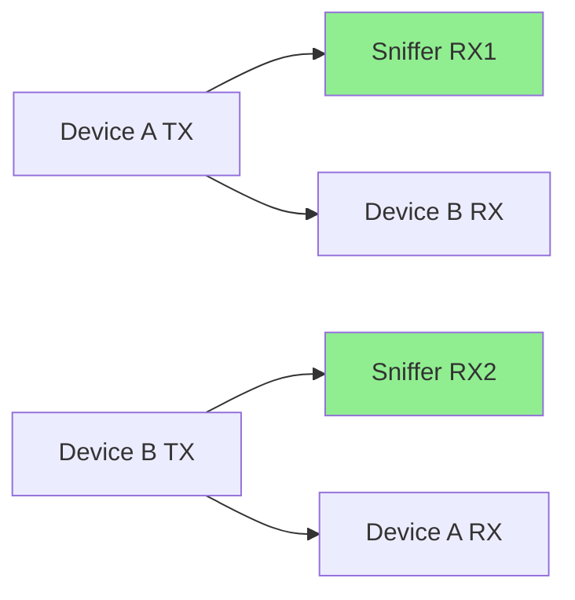

Tools and techniques for capturing and analyzing serial port communication (UART, RS-232, RS-485).

## Overview

**Serial port sniffing** captures data transmitted over serial connections for debugging, reverse engineering, or monitoring.

**Common Use Cases:**
- Debugging embedded systems
- Reverse engineering protocols
- Monitoring industrial equipment
- IoT device analysis
- Hardware hacking

---

## Serial Communication Basics

### UART Parameters

```text
Baud Rate: 9600, 19200, 38400, 57600, 115200, etc.
Data Bits: 5, 6, 7, 8
Parity:    None, Even, Odd, Mark, Space
Stop Bits: 1, 1.5, 2
Flow Control: None, Hardware (RTS/CTS), Software (XON/XOFF)
```

### Common Configurations

```text
9600 8N1:  9600 baud, 8 data bits, No parity, 1 stop bit
115200 8N1: Most common for embedded systems
19200 7E1: 19200 baud, 7 data bits, Even parity, 1 stop bit
```

---

## Hardware Sniffing Methods

### 1. Y-Cable (Passive Sniffing)



**Wiring:**

```text
Device A          Sniffer          Device B
--------          -------          --------
TX (Pin 3) -----> RX1 (Pin 2) ---> RX (Pin 2)
RX (Pin 2) <----- RX2 (Pin 3) <--- TX (Pin 3)
GND (Pin 5) <---> GND (Pin 5) <--> GND (Pin 5)
```

**Advantages:**
- Non-intrusive
- No timing impact
- Captures both directions

**Disadvantages:**
- Requires two UART ports on sniffer
- Cannot modify traffic

### 2. Logic Analyzer

```text
Channels:
- CH0: Device A TX
- CH1: Device B TX (Device A RX)
- GND: Common ground

Capture both TX lines simultaneously
```

**Popular Logic Analyzers:**
- Saleae Logic (8-channel, up to 100 MHz)
- DSLogic (USB logic analyzer)
- Sigrok-compatible devices

### 3. USB-to-Serial Adapter

```bash
# Connect USB-to-serial adapter to target TX line
# Adapter RX -> Target TX
# Adapter GND -> Target GND

# Read on Linux
cat /dev/ttyUSB0

# Read on Windows
# Use PuTTY, RealTerm, or similar
```

---

## Software Tools

### 1. screen (Linux/macOS)

```bash
# Basic connection
screen /dev/ttyUSB0 115200

# With specific settings (8N1)
screen /dev/ttyUSB0 115200,cs8,-parenb,-cstopb

# Exit: Ctrl+A, then K (kill)

# Log to file
screen -L -Logfile serial.log /dev/ttyUSB0 115200
```

### 2. minicom (Linux)

```bash
# Install
sudo apt-get install minicom

# Configure
sudo minicom -s

# Connect
minicom -D /dev/ttyUSB0 -b 115200

# Enable logging: Ctrl+A, L
# Exit: Ctrl+A, X
```

**Configuration file** (`~/.minirc.dfl`):

```text
pu port             /dev/ttyUSB0
pu baudrate         115200
pu bits             8
pu parity           N
pu stopbits         1
pu rtscts           No
pu xonxoff          No
```

### 3. picocom (Linux)

```bash
# Install
sudo apt-get install picocom

# Connect
picocom -b 115200 /dev/ttyUSB0

# With logging
picocom -b 115200 --logfile serial.log /dev/ttyUSB0

# Exit: Ctrl+A, Ctrl+X
```

### 4. PuTTY (Windows/Linux)

```text
Connection Type: Serial
Serial line: COM3 (Windows) or /dev/ttyUSB0 (Linux)
Speed: 115200

Session -> Logging:
- Session logging: All session output
- Log file name: C:\serial.log
```

### 5. RealTerm (Windows)

**Features:**
- Hex display
- Timestamp logging
- Multiple display formats
- Capture to file

**Configuration:**
```text
Port: COM3
Baud: 115200
Data Bits: 8
Parity: None
Stop Bits: 1
Hardware Flow Control: None
```

### 6. interceptty (Linux)

**Intercept serial communication between two programs:**

```bash
# Install
git clone https://github.com/geoffmeyers/interceptty
cd interceptty && make

# Usage: Create virtual serial ports
./interceptty -s 'ispeed 115200 ospeed 115200' \
              /dev/ttyUSB0 /dev/pts/2

# Now connect your application to /dev/pts/2
# All traffic is logged to stdout
```

### 7. Python pySerial

```python
import serial
import time
from datetime import datetime

def sniff_serial(port, baudrate=115200, logfile='serial.log'):
    """Sniff serial port and log to file"""
    ser = serial.Serial(
        port=port,
        baudrate=baudrate,
        bytesize=serial.EIGHTBITS,
        parity=serial.PARITY_NONE,
        stopbits=serial.STOPBITS_ONE,
        timeout=1
    )
    
    print(f"Sniffing {port} at {baudrate} baud...")
    print(f"Logging to {logfile}")
    
    with open(logfile, 'ab') as f:
        try:
            while True:
                if ser.in_waiting > 0:
                    data = ser.read(ser.in_waiting)
                    timestamp = datetime.now().isoformat()
                    
                    # Log with timestamp
                    log_entry = f"[{timestamp}] ".encode() + data + b'\n'
                    f.write(log_entry)
                    f.flush()
                    
                    # Print to console
                    print(f"[{timestamp}] {data.hex()} | {data}")
                
                time.sleep(0.01)
        except KeyboardInterrupt:
            print("\nStopping...")
        finally:
            ser.close()

# Usage
sniff_serial('/dev/ttyUSB0', 115200)
```

### 8. Advanced Python Sniffer (Dual Port)

```python
import serial
import threading
import time
from datetime import datetime

class DualSerialSniffer:
    def __init__(self, port1, port2, baudrate=115200):
        self.port1 = serial.Serial(port1, baudrate, timeout=0.1)
        self.port2 = serial.Serial(port2, baudrate, timeout=0.1)
        self.running = False
    
    def sniff_port(self, ser, name, logfile):
        """Sniff single port"""
        with open(logfile, 'ab') as f:
            while self.running:
                if ser.in_waiting > 0:
                    data = ser.read(ser.in_waiting)
                    timestamp = datetime.now().isoformat()
                    
                    # Log
                    log_entry = f"[{timestamp}] {name}: ".encode() + data + b'\n'
                    f.write(log_entry)
                    f.flush()
                    
                    # Console output
                    print(f"[{timestamp}] {name}: {data.hex()}")
                    print(f"  ASCII: {data.decode('ascii', errors='replace')}")
                
                time.sleep(0.01)
    
    def start(self):
        """Start sniffing both ports"""
        self.running = True
        
        # Create threads for each port
        t1 = threading.Thread(
            target=self.sniff_port,
            args=(self.port1, "Port1", "port1.log")
        )
        t2 = threading.Thread(
            target=self.sniff_port,
            args=(self.port2, "Port2", "port2.log")
        )
        
        t1.start()
        t2.start()
        
        try:
            while True:
                time.sleep(1)
        except KeyboardInterrupt:
            print("\nStopping...")
            self.running = False
            t1.join()
            t2.join()
        finally:
            self.port1.close()
            self.port2.close()

# Usage
sniffer = DualSerialSniffer('/dev/ttyUSB0', '/dev/ttyUSB1', 115200)
sniffer.start()
```

---

## Protocol Analysis

### Hex Dump Analysis

```python
def analyze_hex_dump(data):
    """Analyze captured serial data"""
    print("Offset   Hex                                          ASCII")
    print("-" * 70)
    
    for i in range(0, len(data), 16):
        chunk = data[i:i+16]
        
        # Hex representation
        hex_str = ' '.join(f'{b:02x}' for b in chunk)
        hex_str = hex_str.ljust(48)
        
        # ASCII representation
        ascii_str = ''.join(chr(b) if 32 <= b < 127 else '.' for b in chunk)
        
        print(f"{i:08x}  {hex_str}  {ascii_str}")

# Example
data = b'\x01\x02\x03Hello World\x0d\x0a\xff\xfe'
analyze_hex_dump(data)
```

### Pattern Detection

```python
import re

def detect_patterns(data):
    """Detect common patterns in serial data"""
    patterns = {
        'AT Commands': rb'AT[+\w]*',
        'Hex Addresses': rb'0x[0-9A-Fa-f]+',
        'JSON': rb'\{[^}]+\}',
        'Checksums': rb'[\*#][0-9A-Fa-f]{2}',
        'Delimiters': rb'[\r\n]+',
    }
    
    results = {}
    for name, pattern in patterns.items():
        matches = re.findall(pattern, data)
        if matches:
            results[name] = matches
    
    return results

# Example
data = b'AT+CGMI\r\nOK\r\n{"temp":25.5}\r\n*A5\r\n'
patterns = detect_patterns(data)
for name, matches in patterns.items():
    print(f"{name}: {matches}")
```

### Baud Rate Detection

```python
def detect_baud_rate(data, common_rates=None):
    """
    Attempt to detect baud rate by looking for valid ASCII
    
    Note: This is heuristic and may not always work
    """
    if common_rates is None:
        common_rates = [9600, 19200, 38400, 57600, 115200]
    
    scores = {}
    for rate in common_rates:
        # Count valid ASCII characters
        valid_chars = sum(1 for b in data if 32 <= b < 127 or b in [9, 10, 13])
        score = valid_chars / len(data) if data else 0
        scores[rate] = score
    
    # Return rate with highest score
    best_rate = max(scores, key=scores.get)
    return best_rate, scores[best_rate]

# Example
data = b'Hello World\r\n'
rate, confidence = detect_baud_rate(data)
print(f"Detected baud rate: {rate} (confidence: {confidence:.2%})")
```

---

## Advanced Techniques

### 1. Logic Analyzer with Sigrok

```bash
# Install
sudo apt-get install sigrok-cli pulseview

# List devices
sigrok-cli --scan

# Capture UART
sigrok-cli -d fx2lafw --config samplerate=1M \
           --channels 0=TX,1=RX \
           --protocol-decoders uart:baudrate=115200 \
           --samples 1M \
           -o capture.sr

# Analyze with PulseView
pulseview capture.sr
```

### 2. Wireshark for Serial

**Using socat to create virtual serial ports:**

```bash
# Create virtual serial port pair
socat -d -d pty,raw,echo=0 pty,raw,echo=0

# Connect one end to target, other to Wireshark
# Use extcap interface or pipe data
```

### 3. Bus Pirate

```bash
# Enter UART mode
m  # Mode menu
3  # UART

# Configure
# Baud: 115200
# Data bits: 8
# Parity: None
# Stop bits: 1

# Macro to sniff
(1)  # Transparent UART bridge

# Exit: #
```

### 4. Arduino as Serial Sniffer

```cpp
// Arduino sketch for dual-port sniffing
void setup() {
  Serial.begin(115200);   // USB connection to PC
  Serial1.begin(9600);    // Target device
  
  Serial.println("Serial sniffer ready");
}

void loop() {
  // Forward from target to PC
  if (Serial1.available()) {
    char c = Serial1.read();
    Serial.print("RX: 0x");
    Serial.print(c, HEX);
    Serial.print(" '");
    Serial.print(c);
    Serial.println("'");
  }
  
  // Optional: Forward from PC to target
  if (Serial.available()) {
    char c = Serial.read();
    Serial1.write(c);
    Serial.print("TX: 0x");
    Serial.print(c, HEX);
    Serial.print(" '");
    Serial.print(c);
    Serial.println("'");
  }
}
```

---

## Common Protocols

### AT Commands (Modems, GSM)

```text
AT          -> OK
AT+CGMI     -> Manufacturer
AT+CGMM     -> Model
AT+CGSN     -> Serial number
ATD1234567  -> Dial number
```

### NMEA (GPS)

```text
$GPGGA,123519,4807.038,N,01131.000,E,1,08,0.9,545.4,M,46.9,M,,*47
  |     |      |         |          | |  |   |      |     |
  |     |      |         |          | |  |   |      |     Checksum
  |     |      |         |          | |  |   |      Geoidal separation
  |     |      |         |          | |  |   Altitude
  |     |      |         |          | |  HDOP
  |     |      |         |          | Satellites
  |     |      |         |          Fix quality
  |     |      |         Longitude
  |     |      Latitude
  |     Time (UTC)
  Message type
```

### Modbus RTU

```text
Frame: [Device ID][Function][Data][CRC]
Example: 01 03 00 00 00 0A C5 CD
  01: Device address
  03: Read holding registers
  00 00: Starting address
  00 0A: Quantity (10 registers)
  C5 CD: CRC-16
```

---

## Troubleshooting

### Permission Issues (Linux)

```bash
# Add user to dialout group
sudo usermod -a -G dialout $USER

# Or change permissions (temporary)
sudo chmod 666 /dev/ttyUSB0

# List serial devices
ls -l /dev/tty*
```

### Finding Serial Devices

```bash
# Linux
dmesg | grep tty
ls /dev/ttyUSB* /dev/ttyACM*

# macOS
ls /dev/cu.*

# Windows (PowerShell)
Get-WmiObject Win32_SerialPort | Select-Object Name,DeviceID
```

### Baud Rate Mismatch

**Symptoms:**
- Garbage characters
- Random symbols
- No readable data

**Solution:**
```bash
# Try common baud rates
for baud in 9600 19200 38400 57600 115200; do
    echo "Trying $baud..."
    timeout 2 cat /dev/ttyUSB0 | head -n 5
done
```

### Buffer Overruns

```python
# Increase buffer size
ser = serial.Serial(
    port='/dev/ttyUSB0',
    baudrate=115200,
    timeout=0.1
)

# Read frequently to prevent buffer overflow
while True:
    if ser.in_waiting > 0:
        data = ser.read(ser.in_waiting)
        process_data(data)
    time.sleep(0.001)  # Small delay
```

---

## Security Considerations

```text
⚠️ WARNING:
- Serial sniffing may violate laws/regulations
- Only sniff devices you own or have permission to monitor
- Industrial systems: Consult with system owner
- Medical devices: May be regulated (FDA, etc.)
- Automotive: May void warranty

✅ LEGAL USE:
- Your own embedded projects
- Authorized security testing
- Educational purposes with owned equipment
- Debugging your own products
```

---

## Best Practices

```text
✅ DO:
- Document baud rate and settings
- Use timestamps in logs
- Capture both TX and RX
- Save raw data before processing
- Note hardware connections
- Use proper ESD protection

❌ DON'T:
- Connect 5V to 3.3V devices directly
- Forget common ground connection
- Ignore voltage levels
- Mix up TX/RX connections
- Sniff high-voltage RS-232 without protection
```

---

## Further Reading

- [PySerial Documentation](https://pyserial.readthedocs.io/)
- [Sigrok Protocol Decoders](https://sigrok.org/wiki/Protocol_decoders)
- [Bus Pirate Guide](http://dangerousprototypes.com/docs/Bus_Pirate)
- [Logic Analyzer Tutorial](https://learn.sparkfun.com/tutorials/using-logic-analyzers)
- [UART Protocol](https://en.wikipedia.org/wiki/Universal_asynchronous_receiver-transmitter)

