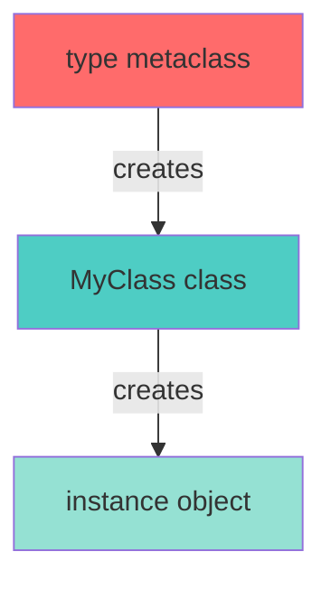
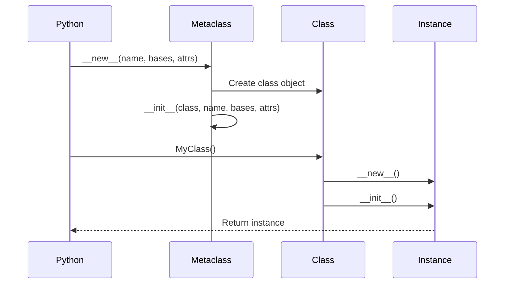
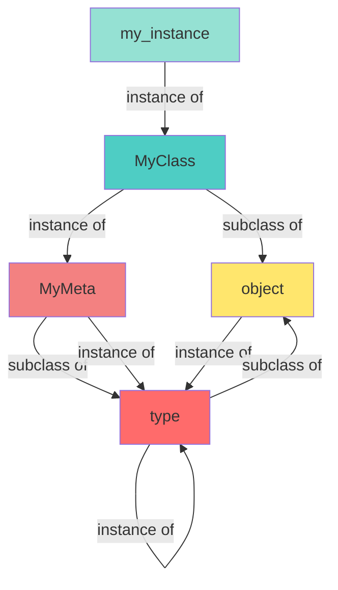
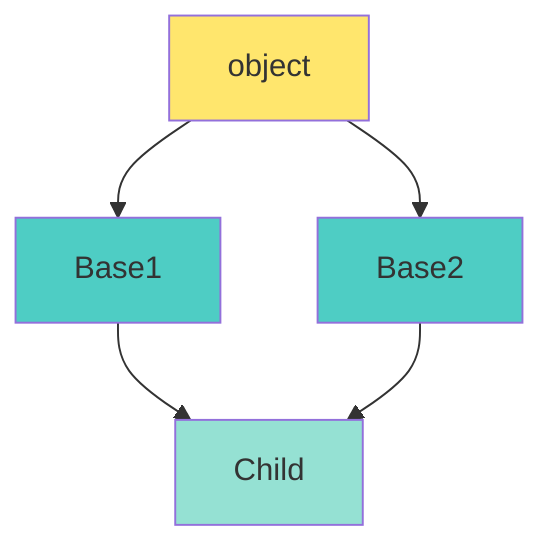
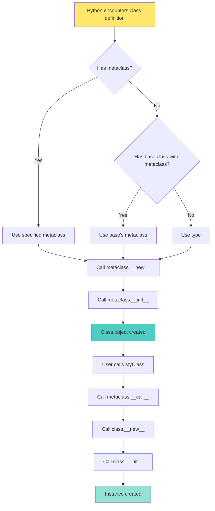

Python metaclasses with visual explanations using Mermaid diagrams.

---

## What are Metaclasses?

**Metaclasses are classes that create classes.**



In Python, everything is an object, including classes:

$$
\text{type}(\text{instance}) = \text{class}
$$

$$
\text{type}(\text{class}) = \text{metaclass}
$$

---

## Class Creation Flow



---

## Basic Example

```python
# Every class is an instance of type
class MyClass:
    pass

print(type(MyClass))  # <class 'type'>
print(type(type))     # <class 'type'>

# type is its own metaclass!
```

---

## Creating Classes Dynamically

```python
# Method 1: Normal class definition
class Dog:
    def bark(self):
        return "Woof!"

# Method 2: Using type() directly
Dog = type('Dog', (), {'bark': lambda self: "Woof!"})

# Both are equivalent!
dog = Dog()
print(dog.bark())  # Woof!
```

---

## Custom Metaclass

```python
class Meta(type):
    """Custom metaclass"""
    
    def __new__(mcs, name, bases, attrs):
        print(f"Creating class: {name}")
        # Modify class before creation
        attrs['created_by'] = 'Meta'
        return super().__new__(mcs, name, bases, attrs)
    
    def __init__(cls, name, bases, attrs):
        print(f"Initializing class: {name}")
        super().__init__(name, bases, attrs)
    
    def __call__(cls, *args, **kwargs):
        print(f"Creating instance of: {cls.__name__}")
        return super().__call__(*args, **kwargs)

# Use metaclass
class MyClass(metaclass=Meta):
    def __init__(self, value):
        self.value = value

# Output:
# Creating class: MyClass
# Initializing class: MyClass

obj = MyClass(42)
# Output:
# Creating instance of: MyClass

print(obj.created_by)  # Meta
```

---

## Metaclass Hierarchy



---

## Practical Example: Singleton

```python
class SingletonMeta(type):
    """Metaclass that creates a Singleton"""
    _instances = {}
    
    def __call__(cls, *args, **kwargs):
        if cls not in cls._instances:
            cls._instances[cls] = super().__call__(*args, **kwargs)
        return cls._instances[cls]

class Database(metaclass=SingletonMeta):
    def __init__(self):
        print("Connecting to database...")
        self.connection = "Connected"

# Test
db1 = Database()  # Connecting to database...
db2 = Database()  # (no output)
print(db1 is db2)  # True
```

---

## Practical Example: Auto-Registration

```python
class RegistryMeta(type):
    """Automatically register all subclasses"""
    registry = {}
    
    def __new__(mcs, name, bases, attrs):
        cls = super().__new__(mcs, name, bases, attrs)
        if name != 'Plugin':  # Don't register base class
            mcs.registry[name] = cls
        return cls

class Plugin(metaclass=RegistryMeta):
    """Base plugin class"""
    pass

class AudioPlugin(Plugin):
    def process(self):
        return "Processing audio"

class VideoPlugin(Plugin):
    def process(self):
        return "Processing video"

# All plugins automatically registered
print(RegistryMeta.registry)
# {'AudioPlugin': <class 'AudioPlugin'>, 'VideoPlugin': <class 'VideoPlugin'>}

# Use registry
for name, plugin_class in RegistryMeta.registry.items():
    plugin = plugin_class()
    print(f"{name}: {plugin.process()}")
```

---

## Practical Example: Validation

```python
class ValidatedMeta(type):
    """Metaclass that validates class attributes"""
    
    def __new__(mcs, name, bases, attrs):
        # Check for required methods
        required_methods = ['validate', 'save']
        for method in required_methods:
            if method not in attrs:
                raise TypeError(f"Class {name} must implement {method}()")
        
        return super().__new__(mcs, name, bases, attrs)

class Model(metaclass=ValidatedMeta):
    def validate(self):
        pass
    
    def save(self):
        pass

# This works
class User(Model):
    def validate(self):
        return True
    
    def save(self):
        print("Saving user...")

# This fails
try:
    class InvalidModel(Model):
        def validate(self):
            pass
        # Missing save() method!
except TypeError as e:
    print(e)  # Class InvalidModel must implement save()
```

---

## Practical Example: ORM-like Behavior

```python
class Field:
    def __init__(self, field_type):
        self.field_type = field_type
    
    def __set_name__(self, owner, name):
        self.name = name
    
    def __get__(self, obj, objtype=None):
        if obj is None:
            return self
        return obj.__dict__.get(self.name)
    
    def __set__(self, obj, value):
        if not isinstance(value, self.field_type):
            raise TypeError(f"{self.name} must be {self.field_type}")
        obj.__dict__[self.name] = value

class ModelMeta(type):
    """ORM-like metaclass"""
    
    def __new__(mcs, name, bases, attrs):
        # Collect fields
        fields = {}
        for key, value in list(attrs.items()):
            if isinstance(value, Field):
                fields[key] = value
        
        attrs['_fields'] = fields
        return super().__new__(mcs, name, bases, attrs)

class Model(metaclass=ModelMeta):
    def __init__(self, **kwargs):
        for name, value in kwargs.items():
            setattr(self, name, value)
    
    def to_dict(self):
        return {name: getattr(self, name) for name in self._fields}

class User(Model):
    name = Field(str)
    age = Field(int)
    email = Field(str)

# Usage
user = User(name="Alice", age=30, email="alice@example.com")
print(user.to_dict())
# {'name': 'Alice', 'age': 30, 'email': 'alice@example.com'}

# Type validation
try:
    user.age = "invalid"  # TypeError
except TypeError as e:
    print(e)  # age must be <class 'int'>
```

---

## Method Resolution Order (MRO)



```python
class Meta1(type):
    def method(cls):
        return "Meta1"

class Meta2(type):
    def method(cls):
        return "Meta2"

class CombinedMeta(Meta1, Meta2):
    pass

class MyClass(metaclass=CombinedMeta):
    pass

# MRO determines which method is called
print(MyClass.method())  # Meta1
print(CombinedMeta.__mro__)
# (<class 'CombinedMeta'>, <class 'Meta1'>, <class 'Meta2'>, <class 'type'>, <class 'object'>)
```

---

## When to Use Metaclasses

✅ **Good use cases:**
- Framework development (Django ORM, SQLAlchemy)
- Plugin systems
- API clients with auto-generated methods
- Validation and type checking
- Singleton patterns
- Automatic registration

❌ **Avoid for:**
- Simple inheritance (use regular classes)
- Decorators can solve it (use decorators instead)
- Class decorators work (simpler alternative)

**Quote**: "Metaclasses are deeper magic than 99% of users should ever worry about." - Tim Peters

---

## Alternatives to Metaclasses

### Class Decorators

```python
def singleton(cls):
    instances = {}
    def get_instance(*args, **kwargs):
        if cls not in instances:
            instances[cls] = cls(*args, **kwargs)
        return instances[cls]
    return get_instance

@singleton
class Database:
    def __init__(self):
        self.connection = "Connected"

# Simpler than metaclass!
```

### `__init_subclass__` (Python 3.6+)

```python
class Plugin:
    registry = {}
    
    def __init_subclass__(cls, **kwargs):
        super().__init_subclass__(**kwargs)
        cls.registry[cls.__name__] = cls

class AudioPlugin(Plugin):
    pass

class VideoPlugin(Plugin):
    pass

print(Plugin.registry)
# {'AudioPlugin': <class 'AudioPlugin'>, 'VideoPlugin': <class 'VideoPlugin'>}
```

---

## Complete Flow Diagram



---