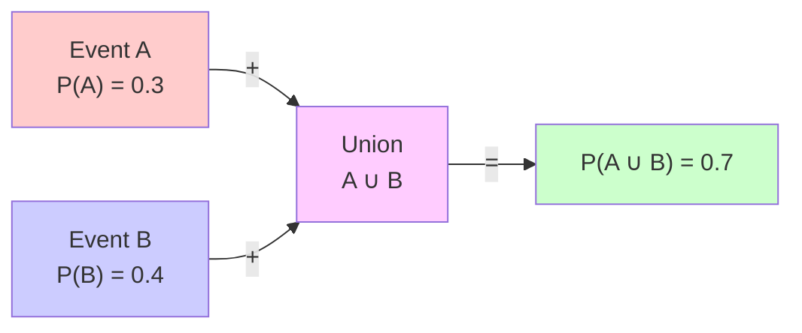
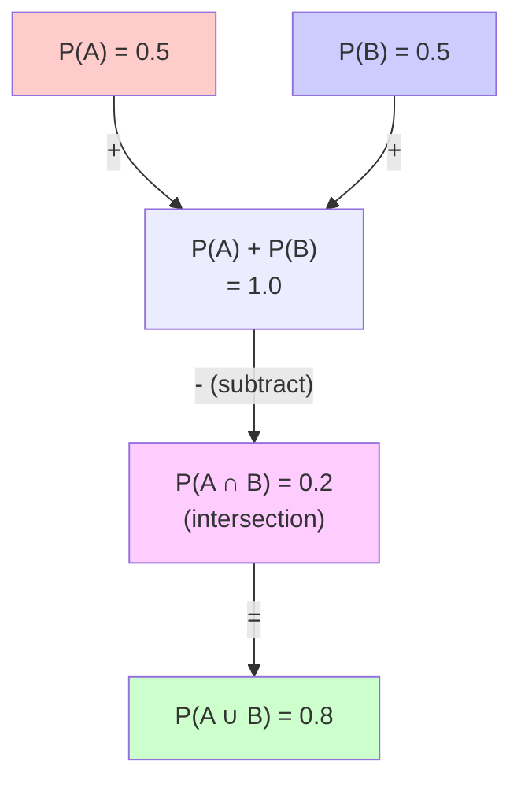
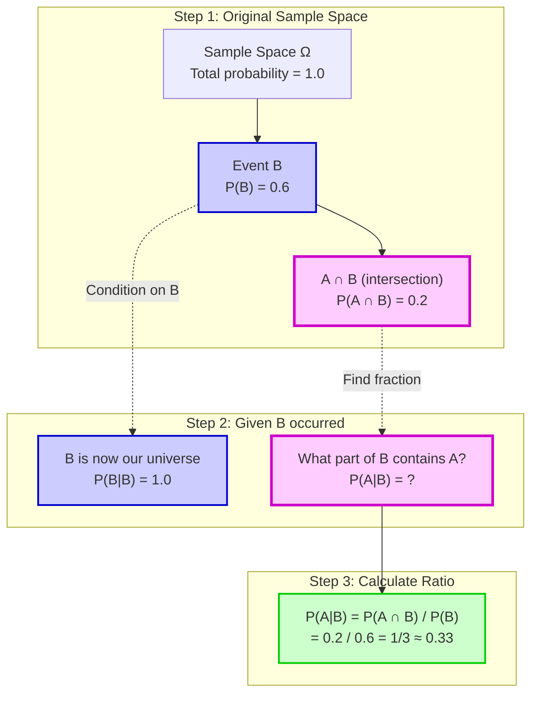
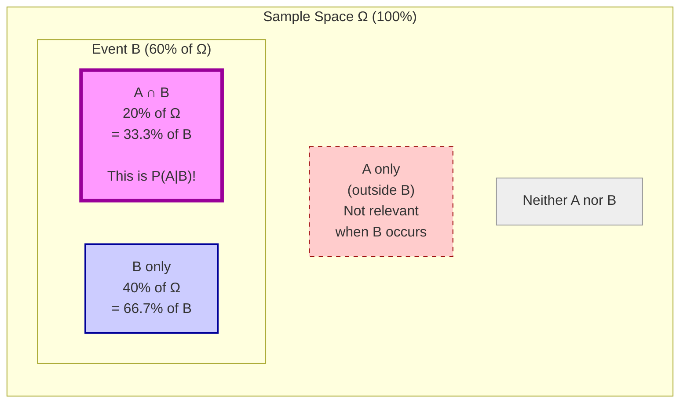

Visual guide to probability fundamentals and axioms.

---

## Axioms of Probability

### Axiom 1: Non-Negativity

$$0 \leq P(A) \leq 1 \text{ for any event } A$$

Probabilities are always between 0 (impossible) and 1 (certain).

<svg width="800" height="200" xmlns="http://www.w3.org/2000/svg">
  <!-- Title -->
  <text x="400" y="30" text-anchor="middle" font-size="16" font-weight="bold">Axiom 1: Probability Range [0, 1]</text>
  
  <!-- Scale line -->
  <line x1="100" y1="100" x2="700" y2="100" stroke="black" stroke-width="3"/>
  
  <!-- Markers -->
  <line x1="100" y1="90" x2="100" y2="110" stroke="black" stroke-width="2"/>
  <text x="100" y="130" text-anchor="middle" font-size="12">0.0</text>
  <text x="100" y="70" text-anchor="middle" font-size="12">Impossible</text>
  
  <line x1="400" y1="90" x2="400" y2="110" stroke="black" stroke-width="2"/>
  <text x="400" y="130" text-anchor="middle" font-size="12">0.5</text>
  <text x="400" y="70" text-anchor="middle" font-size="12">Equally Likely</text>
  
  <line x1="700" y1="90" x2="700" y2="110" stroke="black" stroke-width="2"/>
  <text x="700" y="130" text-anchor="middle" font-size="12">1.0</text>
  <text x="700" y="70" text-anchor="middle" font-size="12">Certain</text>
  
  <!-- Examples -->
  <circle cx="100" cy="100" r="10" fill="rgb(200,200,200)" stroke="black" stroke-width="2"/>
  <text x="100" y="160" text-anchor="middle" font-size="11">Impossible</text>
  
  <circle cx="250" cy="100" r="10" fill="rgb(255,200,150)" stroke="black" stroke-width="2"/>
  <text x="250" y="160" text-anchor="middle" font-size="11">Unlikely (0.25)</text>
  
  <circle cx="400" cy="100" r="10" fill="rgb(255,255,100)" stroke="black" stroke-width="2"/>
  <text x="400" y="160" text-anchor="middle" font-size="11">50-50 (0.5)</text>
  
  <circle cx="550" cy="100" r="10" fill="rgb(150,255,150)" stroke="black" stroke-width="2"/>
  <text x="550" y="160" text-anchor="middle" font-size="11">Likely (0.75)</text>
  
  <circle cx="700" cy="100" r="10" fill="rgb(100,255,100)" stroke="black" stroke-width="2"/>
  <text x="700" y="160" text-anchor="middle" font-size="11">Certain</text>
</svg>

### Axiom 2: Certainty

$$P(\Omega) = 1$$

The probability of the entire sample space (all possible outcomes) is 1.

<svg width="800" height="400" xmlns="http://www.w3.org/2000/svg">
  <!-- Title -->
  <text x="400" y="30" text-anchor="middle" font-size="16" font-weight="bold">Axiom 2: Total Probability = 1</text>
  
  <!-- Sample space -->
  <circle cx="400" cy="220" r="150" fill="rgb(240,240,255)" stroke="black" stroke-width="3"/>
  <text x="400" y="40" text-anchor="middle" font-size="20">Ω (Sample Space)</text>
  <text x="400" y="60" text-anchor="middle" font-size="16">P(Ω) = 1</text>
  
  <!-- Events inside -->
  <circle cx="350" cy="190" r="40" fill="rgba(255,200,200,0.6)" stroke="rgb(200,0,0)" stroke-width="2"/>
  <text x="350" y="195" text-anchor="middle" font-size="14">A</text>
  
  <circle cx="450" cy="190" r="40" fill="rgba(200,200,255,0.6)" stroke="rgb(0,0,200)" stroke-width="2"/>
  <text x="450" y="195" text-anchor="middle" font-size="14">B</text>
  
  <circle cx="400" cy="260" r="40" fill="rgba(200,255,200,0.6)" stroke="rgb(0,200,0)" stroke-width="2"/>
  <text x="400" y="265" text-anchor="middle" font-size="14">C</text>
  
  <!-- Explanation -->
  <text x="400" y="360" text-anchor="middle" font-size="13">All events A, B, C, ... are subsets of Ω</text>
  <text x="400" y="380" text-anchor="middle" font-size="13">P(A) + P(B) + P(C) + ... = P(Ω) = 1</text>
</svg>

### Axiom 3: Additivity

$$P(A \cup B) = P(A) + P(B) \text{ for mutually exclusive events}$$

For events that cannot occur simultaneously, probabilities add.



**Note**: When events don't overlap (mutually exclusive), their probabilities add directly.

---

## Overlapping Events (General Addition Rule)

For events that can occur together:

$$P(A \cup B) = P(A) + P(B) - P(A \cap B)$$



**Why subtract?** The intersection $P(A \cap B)$ is counted twice when we add $P(A) + P(B)$, so we must subtract it once to avoid double-counting.

---

## Conditional Probability

$$
P(A|B) = \frac{P(A \cap B)}{P(B)}
$$

**Meaning**: Probability of $A$ happening, given that $B$ has already occurred.

### Visual Explanation

**Intuition**: Once we know $B$ occurred, $B$ becomes our new "universe". We ask: what fraction of $B$ also contains $A$?

#### Step-by-Step Process



#### Proportional Area Representation



**Key Insight**: Among the 60% of outcomes where $B$ occurs, the intersection $A \cap B$ represents 20% of all outcomes. Therefore:

$$
P(A|B) = \frac{\text{intersection size}}{\text{condition size}} = \frac{0.2}{0.6} = \frac{1}{3}
$$

This means **33.3% of event B also contains event A**.

### Real-World Example

**Scenario**: Drawing cards from a deck

- $P(\text{King}) = \frac{4}{52}$
- $P(\text{King | Heart}) = \frac{1}{13}$

Given that we drew a heart (13 cards), only 1 of those 13 is a king.

## Independence

Events $A$ and $B$ are independent if:

$$
P(A \cap B) = P(A) \cdot P(B)
$$

Or equivalently: $P(A|B) = P(A)$

## Law of Total Probability

$$
P(A) = \sum_i P(A|B_i) P(B_i)
$$

## Bayes' Theorem

$$
P(A|B) = \frac{P(B|A) P(A)}{P(B)}
$$

## Python Examples

```python
import numpy as np

# Simulate coin flips
flips = np.random.choice(['H', 'T'], size=1000)
p_heads = np.mean(flips == 'H')

# Conditional probability
# P(A|B) = P(A and B) / P(B)
def conditional_prob(data, event_a, event_b):
    p_b = np.mean(event_b(data))
    p_a_and_b = np.mean(event_a(data) & event_b(data))
    return p_a_and_b / p_b if p_b > 0 else 0
```

## Further Reading

- [Probability Theory - Wikipedia](https://en.wikipedia.org/wiki/Probability_theory)
