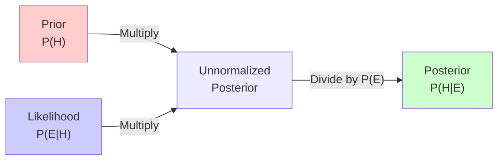
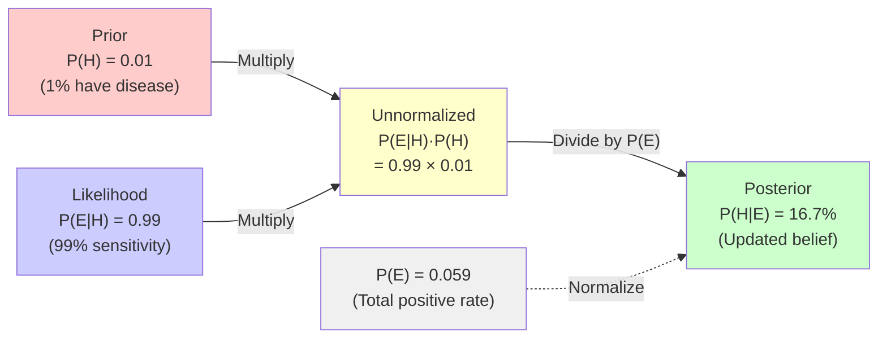

Visual guide to Bayesian reasoning and updating beliefs with evidence.

---

## Formula

$$
P(H|E) = \frac{P(E|H) \cdot P(H)}{P(E)}
$$

- $P(H|E)$: **Posterior** (probability of hypothesis given evidence)
- $P(E|H)$: **Likelihood** (probability of evidence given hypothesis)
- $P(H)$: **Prior** (initial probability of hypothesis)
- $P(E)$: **Marginal likelihood** (total probability of evidence)

---

## Visual Representation



### Bayes Rule as Information Flow



**Key Insight**: P(E) = P(E|H)·P(H) + P(E|¬H)·P(¬H) = 0.99×0.01 + 0.05×0.99 = 0.059

This normalizing constant ensures probabilities sum to 1.

---

## Intuitive Example: Medical Test

```p5js
sketch.setup = function() {
  sketch.createCanvas(800, 600);
  sketch.noLoop();
}

sketch.draw = function() {
  sketch.background(255);
  
  // Population
  const total = 1000;
  const diseaseRate = 0.01;  // 1% have disease
  const sensitivity = 0.99;  // 99% true positive rate
  const specificity = 0.95;  // 95% true negative rate
  
  const withDisease = total * diseaseRate;  // 10
  const withoutDisease = total * (1 - diseaseRate);  // 990
  
  const truePositive = withDisease * sensitivity;  // 9.9
  const falsePositive = withoutDisease * (1 - specificity);  // 49.5
  const totalPositive = truePositive + falsePositive;  // 59.4
  
  const posterior = truePositive / totalPositive;  // 0.167 = 16.7%
  
  // Title
  sketch.fill(0);
  sketch.textSize(18);
  sketch.textAlign(sketch.CENTER);
  sketch.text("Medical Test: Why Positive ≠ Certain", sketch.width/2, 30);
  
  // Draw population
  const boxSize = 8;
  const cols = 40;
  let x = 50;
  let y = 80;
  
  sketch.textSize(14);
  sketch.text("Population of 1000 people", sketch.width/2, 60);
  
  for (let i = 0; i < total; i++) {
    if (i % cols === 0 && i > 0) {
      x = 50;
      y += boxSize + 2;
    }
    
    const hasDis = i < withDisease;
    const testPos = hasDis ? (sketch.random() < sensitivity) : (sketch.random() > specificity);
    
    if (hasDis && testPos) {
      sketch.fill(255, 0, 0);  // True positive
    } else if (hasDis && !testPos) {
      sketch.fill(255, 200, 200);  // False negative
    } else if (!hasDis && testPos) {
      sketch.fill(255, 150, 0);  // False positive
    } else {
      sketch.fill(200, 255, 200);  // True negative
    }
    
    sketch.noStroke();
    sketch.rect(x, y, boxSize, boxSize);
    x += boxSize + 2;
  }
  
  // Legend
  y += 40;
  const legendY = y + 20;
  
  sketch.fill(255, 0, 0);
  sketch.rect(100, legendY, 20, 20);
  sketch.fill(0);
  sketch.text("True Positive (~10)", 180, legendY + 10);
  
  sketch.fill(255, 150, 0);
  sketch.rect(100, legendY + 30, 20, 20);
  sketch.fill(0);
  sketch.text("False Positive (~50)", 180, legendY + 40);
  
  sketch.fill(255, 200, 200);
  sketch.rect(100, legendY + 60, 20, 20);
  sketch.fill(0);
  sketch.text("False Negative (~0)", 180, legendY + 70);
  
  sketch.fill(200, 255, 200);
  sketch.rect(100, legendY + 90, 20, 20);
  sketch.fill(0);
  sketch.text("True Negative (~940)", 180, legendY + 100);
  
  // Calculation
  sketch.fill(0);
  sketch.textAlign(sketch.LEFT);
  sketch.textSize(14);
  const calcX = 400;
  sketch.text("Bayes' Calculation:", calcX, legendY);
  sketch.text(`Prior: P(Disease) = ${diseaseRate}`, calcX, legendY + 25);
  sketch.text(`Likelihood: P(+|Disease) = ${sensitivity}`, calcX, legendY + 45);
  sketch.text(`P(+|No Disease) = ${1-specificity}`, calcX, legendY + 65);
  
  sketch.textSize(16);
  sketch.fill(200, 0, 0);
  sketch.text(`P(Disease|+) = ${(posterior * 100).toFixed(1)}%`, calcX, legendY + 95);
  
  sketch.fill(0);
  sketch.textSize(12);
  sketch.text("Even with 99% accurate test,", calcX, legendY + 120);
  sketch.text("only 16.7% of positive results", calcX, legendY + 135);
  sketch.text("actually have the disease!", calcX, legendY + 150);
  sketch.text("(Because disease is rare)", calcX, legendY + 165);
}
```

## Example: Medical Test

```python
# Disease prevalence (prior)
p_disease = 0.01

# Test accuracy
p_positive_given_disease = 0.99  # Sensitivity
p_negative_given_no_disease = 0.95  # Specificity

# P(positive)
p_positive = (p_positive_given_disease * p_disease + 
              (1 - p_negative_given_no_disease) * (1 - p_disease))

# Bayes: P(disease | positive test)
p_disease_given_positive = (p_positive_given_disease * p_disease) / p_positive

print(f"P(disease | positive test) = {p_disease_given_positive:.3f}")
```

## Bayesian Updating

```python
def bayesian_update(prior, likelihood, evidence):
    """Update belief based on new evidence"""
    posterior = (likelihood * prior) / evidence
    return posterior
```

## Further Reading

- [Bayes' Theorem - Wikipedia](https://en.wikipedia.org/wiki/Bayes%27_theorem)

