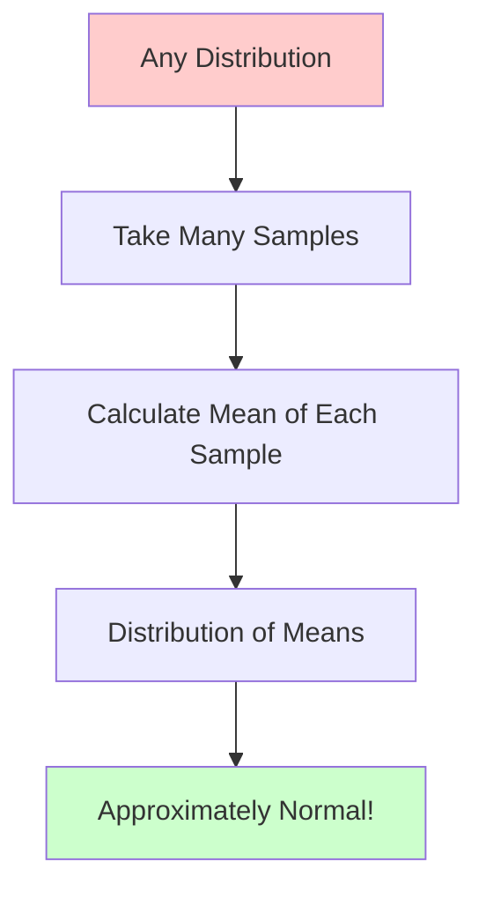

Visual demonstration of the Central Limit Theorem - why averages are normally distributed.

---

## Statement

The sum (or average) of many independent random variables tends toward a normal distribution, **regardless of the original distribution**.

$$
\frac{\bar{X} - \mu}{\sigma/\sqrt{n}} \xrightarrow{d} N(0, 1) \quad \text{as } n \to \infty
$$

---

## Visual Demonstration

```p5js
let sampleSize = 30;
let numSamples = 5000;
let means = [];
let sourceType = 'uniform';

sketch.setup = function() {
  sketch.createCanvas(800, 600);
  
  // Buttons
  let uniformBtn = sketch.createButton('Uniform');
  uniformBtn.position(20, 620);
  uniformBtn.mousePressed(() => { sourceType = 'uniform'; reset(); });
  
  let expBtn = sketch.createButton('Exponential');
  expBtn.position(100, 620);
  expBtn.mousePressed(() => { sourceType = 'exponential'; reset(); });
  
  let bimodalBtn = sketch.createButton('Bimodal');
  bimodalBtn.position(210, 620);
  bimodalBtn.mousePressed(() => { sourceType = 'bimodal'; reset(); });
  
  // Sample size slider
  let slider = sketch.createSlider(1, 100, 30);
  slider.position(350, 620);
  slider.style('width', '200px');
  slider.input(() => { sampleSize = slider.value(); reset(); });
  
  reset();
}

function reset() {
  means = [];
  sketch.loop();
}

sketch.draw = function() {
  sketch.background(255);
  
  // Generate samples
  if (means.length < numSamples) {
    let sample = [];
    for (let i = 0; i < sampleSize; i++) {
      if (sourceType === 'uniform') {
        sample.push(sketch.random(0, 1));
      } else if (sourceType === 'exponential') {
        sample.push(-Math.log(sketch.random()) * 0.5);
      } else if (sourceType === 'bimodal') {
        sample.push(sketch.random() < 0.5 ? sketch.random(0, 0.3) : sketch.random(0.7, 1));
      }
    }
    let mean = sample.reduce((a, b) => a + b, 0) / sample.length;
    means.push(mean);
  } else {
    sketch.noLoop();
  }
  
  // Draw source distribution
  sketch.fill(0);
  sketch.textSize(16);
  sketch.textAlign(sketch.LEFT);
  sketch.text('Source Distribution', 50, 30);
  
  drawSourceDist(50, 50, 350, 150);
  
  // Draw distribution of means
  sketch.text(`Distribution of Sample Means (n=${sampleSize})`, 50, 250);
  
  drawMeansHist(50, 270, 700, 250);
  
  // Info
  sketch.textSize(12);
  sketch.fill(100);
  sketch.text(`Samples collected: ${means.length}/${numSamples}`, 50, sketch.height - 60);
  sketch.text('Sample size (n): ' + sampleSize, 350, sketch.height - 35);
  
  // Key insight
  if (means.length >= numSamples) {
    sketch.fill(200, 0, 0);
    sketch.textSize(14);
    sketch.textAlign(sketch.CENTER);
    sketch.text('Notice: Distribution of means is approximately NORMAL!', sketch.width/2, sketch.height - 10);
  }
}

function drawSourceDist(x, y, w, h) {
  sketch.fill(200, 200, 255, 150);
  sketch.stroke(0, 0, 200);
  sketch.strokeWeight(2);
  
  sketch.beginShape();
  for (let i = 0; i <= 100; i++) {
    let t = i / 100;
    let px = x + t * w;
    let density;
    
    if (sourceType === 'uniform') {
      density = 1;
    } else if (sourceType === 'exponential') {
      density = 2 * Math.exp(-2 * t);
    } else if (sourceType === 'bimodal') {
      density = (t < 0.3 || t > 0.7) ? 2 : 0.2;
    }
    
    let py = y + h - density * h * 0.8;
    sketch.vertex(px, py);
  }
  sketch.vertex(x + w, y + h);
  sketch.vertex(x, y + h);
  sketch.endShape(sketch.CLOSE);
}

function drawMeansHist(x, y, w, h) {
  if (means.length === 0) return;
  
  // Create histogram
  let bins = 50;
  let minVal = sketch.min(means);
  let maxVal = sketch.max(means);
  let range = maxVal - minVal;
  let hist = new Array(bins).fill(0);
  
  for (let m of means) {
    let bin = sketch.floor(((m - minVal) / range) * (bins - 1));
    hist[bin]++;
  }
  
  let maxCount = sketch.max(hist);
  
  // Draw histogram
  sketch.fill(200, 255, 200, 150);
  sketch.stroke(0, 200, 0);
  sketch.strokeWeight(1);
  
  let barWidth = w / bins;
  for (let i = 0; i < bins; i++) {
    let barHeight = (hist[i] / maxCount) * h * 0.9;
    let px = x + i * barWidth;
    let py = y + h - barHeight;
    sketch.rect(px, py, barWidth - 1, barHeight);
  }
  
  // Draw normal curve overlay
  if (means.length >= 100) {
    let meanOfMeans = means.reduce((a, b) => a + b, 0) / means.length;
    let variance = means.reduce((sum, m) => sum + Math.pow(m - meanOfMeans, 2), 0) / means.length;
    let stdDev = Math.sqrt(variance);
    
    sketch.stroke(255, 0, 0);
    sketch.strokeWeight(3);
    sketch.noFill();
    
    sketch.beginShape();
    for (let i = 0; i <= 100; i++) {
      let t = minVal + (i / 100) * range;
      let z = (t - meanOfMeans) / stdDev;
      let density = (1 / (stdDev * Math.sqrt(sketch.TWO_PI))) * Math.exp(-0.5 * z * z);
      let px = x + ((t - minVal) / range) * w;
      let py = y + h - (density * stdDev * 3) * h * 0.9;
      sketch.vertex(px, py);
    }
    sketch.endShape();
    
    // Label
    sketch.fill(255, 0, 0);
    sketch.noStroke();
    sketch.textSize(12);
    sketch.textAlign(sketch.RIGHT);
    sketch.text('Normal curve', x + w - 10, y + 20);
  }
}
```

---

## Why It Matters



## Demonstration

```python
import numpy as np
import matplotlib.pyplot as plt

# Sample from uniform distribution (not normal!)
n_samples = 1000
sample_size = 30

means = []
for _ in range(n_samples):
    sample = np.random.uniform(0, 1, sample_size)
    means.append(np.mean(sample))

# Distribution of means is approximately normal!
plt.hist(means, bins=50, density=True)
plt.title('Distribution of Sample Means (CLT)')
plt.show()
```

## Practical Importance

- Justifies using normal distribution in many applications
- Foundation for confidence intervals and hypothesis testing
- Explains why measurement errors are often normal

## Further Reading

- [Central Limit Theorem - Wikipedia](https://en.wikipedia.org/wiki/Central_limit_theorem)

