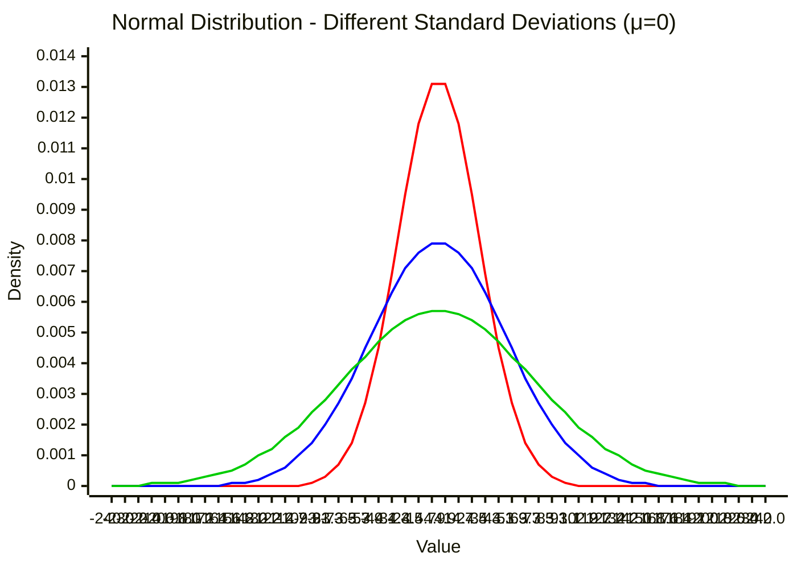
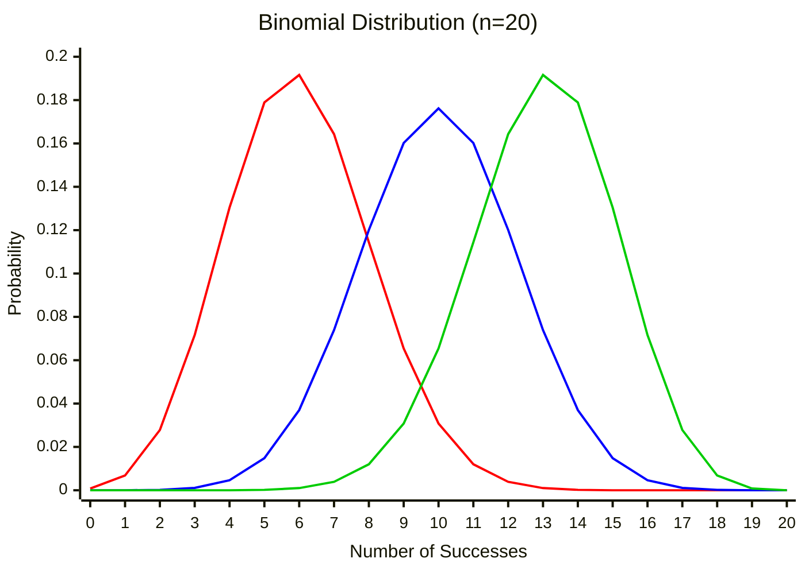
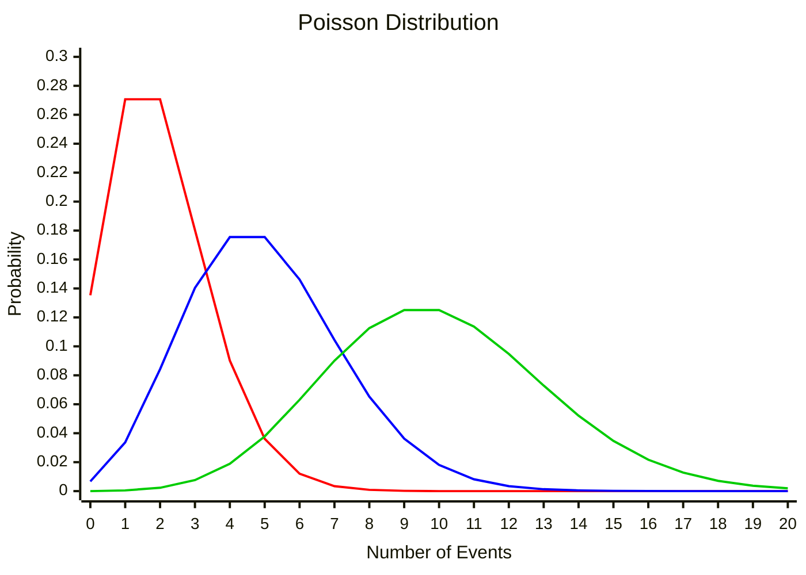
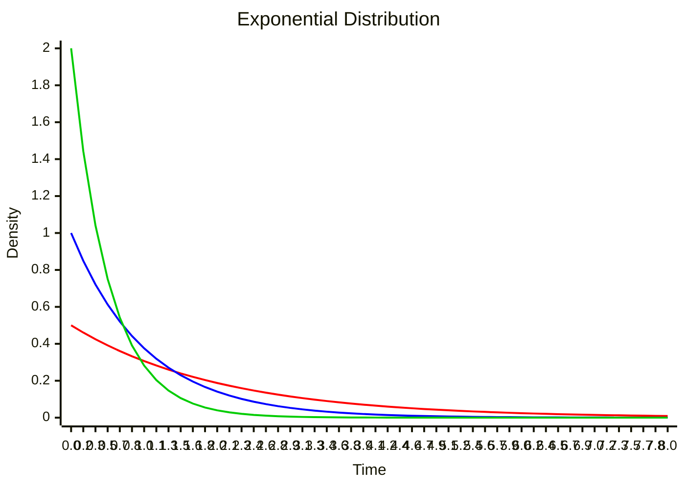
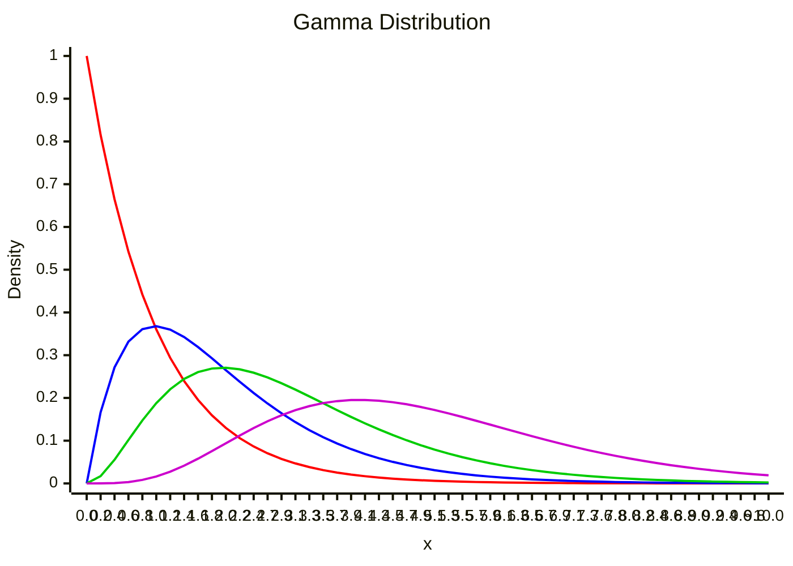
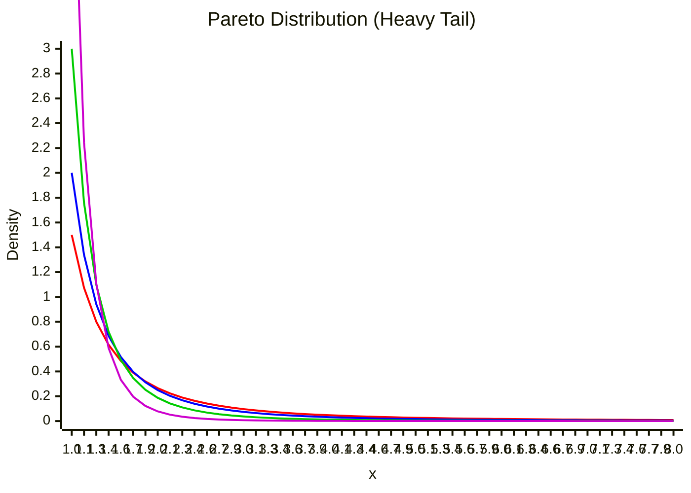
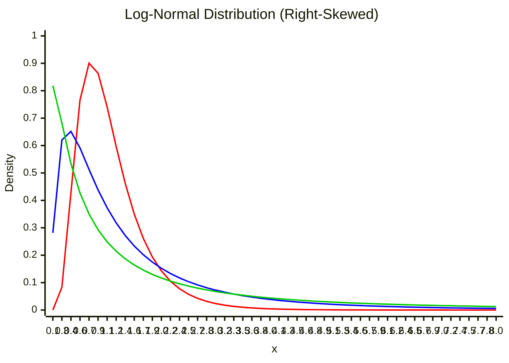

Visual guide to common probability distributions with their properties and use cases.

---

## Normal (Gaussian) Distribution

**Symmetric bell curve** - most common distribution in nature.

$$
f(x) = \frac{1}{\sigma\sqrt{2\pi}} e^{-\frac{(x-\mu)^2}{2\sigma^2}}
$$

- Mean: $\mu$
- Variance: $\sigma^2$
- Symmetric around mean
- 68-95-99.7 rule (1σ, 2σ, 3σ)



```python
from scipy import stats
import numpy as np

# Generate samples
samples = np.random.normal(mu=0, sigma=1, size=1000)

# PDF
x = np.linspace(-4, 4, 100)
pdf = stats.norm.pdf(x, loc=0, scale=1)

# CDF
cdf = stats.norm.cdf(x, loc=0, scale=1)
```

---

## Binomial Distribution

**Discrete** - number of successes in $n$ independent trials.

$$
P(X = k) = \binom{n}{k} p^k (1-p)^{n-k}
$$

- Parameters: $n$ (trials), $p$ (success probability)
- Mean: $np$
- Variance: $np(1-p)$



```python
# Binomial: n=10 trials, p=0.5 success probability
samples = np.random.binomial(n=10, p=0.5, size=1000)
```

---

## Poisson Distribution

**Discrete** - number of events in fixed interval (rare events).

$$
P(X = k) = \frac{\lambda^k e^{-\lambda}}{k!}
$$

- Parameter: $\lambda$ (average rate)
- Mean: $\lambda$
- Variance: $\lambda$
- Models: arrivals, defects, calls per hour



```python
# Poisson: lambda=3 average events
samples = np.random.poisson(lam=3, size=1000)
```

---

## Exponential Distribution

**Continuous** - time between events (memoryless property).

$$
f(x) = \lambda e^{-\lambda x}, \quad x \geq 0
$$

- Parameter: $\lambda$ (rate)
- Mean: $1/\lambda$
- Variance: $1/\lambda^2$
- Memoryless: $P(X > s+t | X > s) = P(X > t)$



```python
# Exponential: lambda=0.5
samples = np.random.exponential(scale=1/0.5, size=1000)
```

---

## Gamma Distribution

**Continuous** - sum of exponential random variables, waiting time for $k$ events.

$$
f(x) = \frac{\beta^\alpha}{\Gamma(\alpha)} x^{\alpha-1} e^{-\beta x}, \quad x \geq 0
$$

- Parameters: $\alpha$ (shape), $\beta$ (rate)
- Mean: $\alpha/\beta$
- Variance: $\alpha/\beta^2$
- Special case: $\alpha=1$ gives Exponential



```python
from scipy import stats

# Gamma distribution
alpha, beta = 2, 1
samples = np.random.gamma(alpha, 1/beta, size=1000)

# Or using scipy
x = np.linspace(0, 10, 100)
pdf = stats.gamma.pdf(x, a=alpha, scale=1/beta)
```

---

## Pareto Distribution

**Heavy-tailed** - power law distribution (80/20 rule, wealth distribution).

$$
f(x) = \frac{\alpha x_m^\alpha}{x^{\alpha+1}}, \quad x \geq x_m
$$

- Parameters: $\alpha$ (shape), $x_m$ (scale/minimum)
- Mean: $\frac{\alpha x_m}{\alpha - 1}$ for $\alpha > 1$
- Heavy tail: $P(X > x) \propto x^{-\alpha}$



**Note**: Heavy tail means rare extreme events are more likely than in normal distribution.

```python
from scipy import stats

# Pareto distribution
alpha, xm = 2, 1
samples = (np.random.pareto(alpha, size=1000) + 1) * xm

# Or using scipy
x = np.linspace(xm, 10, 100)
pdf = stats.pareto.pdf(x, alpha, scale=xm)
```

---

## Skewed Distributions

### Log-Normal Distribution

**Right-skewed** - exponential of normal distribution.

$$
f(x) = \frac{1}{x\sigma\sqrt{2\pi}} e^{-\frac{(\ln x - \mu)^2}{2\sigma^2}}, \quad x > 0
$$



```python
# Log-normal distribution
mu, sigma = 0, 1
samples = np.random.lognormal(mu, sigma, size=1000)
```

---

## Distribution Comparison

| Distribution | Type | Parameters | Mean | Use Case |
|--------------|------|------------|------|----------|
| **Normal** | Continuous | $\mu, \sigma$ | $\mu$ | Natural phenomena, errors |
| **Binomial** | Discrete | $n, p$ | $np$ | Success/failure trials |
| **Poisson** | Discrete | $\lambda$ | $\lambda$ | Rare events, arrivals |
| **Exponential** | Continuous | $\lambda$ | $1/\lambda$ | Time between events |
| **Gamma** | Continuous | $\alpha, \beta$ | $\alpha/\beta$ | Waiting times |
| **Pareto** | Continuous | $\alpha, x_m$ | $\frac{\alpha x_m}{\alpha-1}$ | Power laws, wealth |
| **Log-Normal** | Continuous | $\mu, \sigma$ | $e^{\mu + \sigma^2/2}$ | Multiplicative processes |

---

## Further Reading

- [Probability Distribution - Wikipedia](https://en.wikipedia.org/wiki/Probability_distribution)
- [Distribution Explorer](https://distribution-explorer.github.io/)
