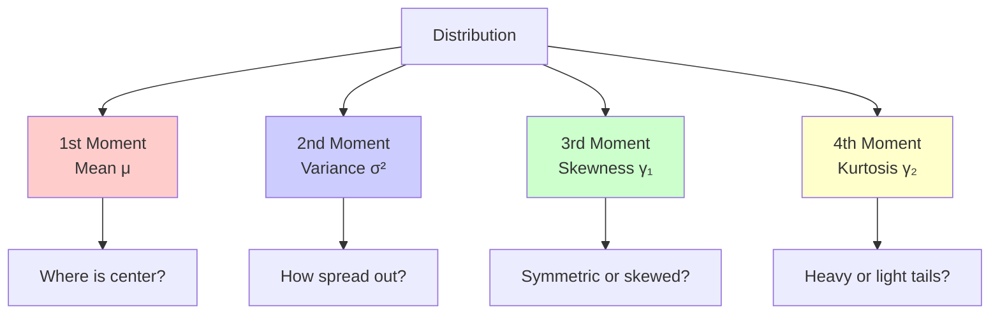

Visual guide to the four statistical moments that describe a distribution's shape.

---

## The Four Moments

Statistical moments describe different aspects of a probability distribution:

1. **First Moment**: Mean (location/center)
2. **Second Moment**: Variance (spread/dispersion)
3. **Third Moment**: Skewness (asymmetry)
4. **Fourth Moment**: Kurtosis (tail heaviness)



---

## First Moment: Mean (μ)

**Mean**: The average value, center of mass of the distribution.

$$
\mu = E[X] = \frac{1}{n}\sum_{i=1}^n x_i
$$

**Interpretation:** The mean is the "balance point" of the distribution - where it would balance if placed on a fulcrum.

---

## Second Moment: Variance (σ²)

**Variance**: Average squared deviation from the mean.

$$
\sigma^2 = E[(X - \mu)^2] = \frac{1}{n}\sum_{i=1}^n (x_i - \mu)^2
$$

**Standard Deviation**: $\sigma = \sqrt{\sigma^2}$

**Interpretation:** Variance measures the spread or dispersion of data around the mean. Higher variance means data is more spread out.

---

## Third Moment: Skewness (γ₁)

**Skewness**: Measure of asymmetry of the distribution.

$$
\gamma_1 = E\left[\left(\frac{X - \mu}{\sigma}\right)^3\right] = \frac{E[(X - \mu)^3]}{\sigma^3}
$$

- **γ₁ = 0**: Symmetric (normal distribution)
- **γ₁ > 0**: Right-skewed (tail on right, mean > median)
- **γ₁ < 0**: Left-skewed (tail on left, mean < median)

**Interpretation:** Skewness measures asymmetry. Positive skew means the tail extends to the right; negative skew means the tail extends to the left.

---

## Fourth Moment: Kurtosis (γ₂)

**Kurtosis**: Measure of "tailedness" - how heavy or light the tails are.

$$
\gamma_2 = E\left[\left(\frac{X - \mu}{\sigma}\right)^4\right] - 3
$$

- **γ₂ = 0**: Mesokurtic (normal distribution)
- **γ₂ > 0**: Leptokurtic (heavy tails, sharp peak, more outliers)
- **γ₂ < 0**: Platykurtic (light tails, flat peak, fewer outliers)

**Interpretation:** Kurtosis measures tail heaviness. High kurtosis means more extreme outliers; low kurtosis means fewer outliers.

---

## Interactive Moment Explorer

```p5js
let meanSlider, stdSlider, skewSlider, kurtSlider;
let data = [];

function setup() {
  createCanvas(800, 650);
  
  // Sliders
  meanSlider = createSlider(0, 100, 50, 1);
  meanSlider.position(150, 670);
  meanSlider.style('width', '150px');
  
  stdSlider = createSlider(5, 30, 15, 1);
  stdSlider.position(150, 700);
  stdSlider.style('width', '150px');
  
  skewSlider = createSlider(-2, 2, 0, 0.1);
  skewSlider.position(500, 670);
  skewSlider.style('width', '150px');
  
  kurtSlider = createSlider(-1, 3, 0, 0.1);
  kurtSlider.position(500, 700);
  kurtSlider.style('width', '150px');
  
  generateData();
}

function generateData() {
  data = [];
  const mean = meanSlider.value();
  const std = stdSlider.value();
  const skew = skewSlider.value();
  const kurt = kurtSlider.value();
  
  // Generate data with approximate moments
  for (let i = 0; i < 1000; i++) {
    let x = randomGaussian(0, 1);
    
    // Add skewness
    if (skew !== 0) {
      x = x + skew * (x * x - 1) / 2;
    }
    
    // Add kurtosis
    if (kurt !== 0) {
      x = x * (1 + kurt * (x * x - 3) / 12);
    }
    
    // Scale and shift
    x = x * std + mean;
    data.push(x);
  }
}

function draw() {
  background(255);
  
  if (frameCount % 10 === 0) {
    generateData();
  }
  
  // Title
  fill(0);
  textSize(18);
  textAlign(CENTER);
  text('Interactive Moment Explorer', width/2, 30);
  
  // Calculate actual moments
  const actualMean = data.reduce((a, b) => a + b) / data.length;
  const variance = data.reduce((sum, x) => sum + pow(x - actualMean, 2), 0) / data.length;
  const actualStd = sqrt(variance);
  
  const skewness = data.reduce((sum, x) => sum + pow((x - actualMean) / actualStd, 3), 0) / data.length;
  const kurtosis = data.reduce((sum, x) => sum + pow((x - actualMean) / actualStd, 4), 0) / data.length - 3;
  
  // Draw histogram
  const bins = 50;
  const minVal = min(data);
  const maxVal = max(data);
  const range = maxVal - minVal;
  
  let hist = new Array(bins).fill(0);
  for (let d of data) {
    let bin = floor(((d - minVal) / range) * (bins - 1));
    if (bin >= 0 && bin < bins) hist[bin]++;
  }
  
  const maxCount = max(hist);
  const histWidth = 700;
  const histHeight = 400;
  const histX = 50;
  const histY = 80;
  
  for (let i = 0; i < bins; i++) {
    const x = histX + (i / bins) * histWidth;
    const w = histWidth / bins;
    const h = (hist[i] / maxCount) * histHeight;
    const y = histY + histHeight - h;
    
    fill(100, 150, 255, 150);
    noStroke();
    rect(x, y, w, h);
  }
  
  // Mean line
  const meanX = histX + ((actualMean - minVal) / range) * histWidth;
  stroke(255, 0, 0);
  strokeWeight(3);
  line(meanX, histY, meanX, histY + histHeight);
  
  // Display moments
  fill(0);
  noStroke();
  textSize(14);
  textAlign(LEFT);
  
  text(`Mean (μ): ${actualMean.toFixed(2)}`, 50, histY + histHeight + 50);
  text(`Std Dev (σ): ${actualStd.toFixed(2)}`, 50, histY + histHeight + 70);
  text(`Skewness (γ₁): ${skewness.toFixed(3)}`, 50, histY + histHeight + 90);
  text(`Kurtosis (γ₂): ${kurtosis.toFixed(3)}`, 50, histY + histHeight + 110);
  
  // Slider labels
  textAlign(LEFT);
  textSize(12);
  text('Target Mean:', 20, 685);
  text('Target Std:', 20, 715);
  text('Target Skew:', 370, 685);
  text('Target Kurt:', 370, 715);
}
```

---

## Summary Table

| Moment | Formula | Measures | Typical Values |
|--------|---------|----------|----------------|
| **1st: Mean** | $E[X]$ | Location/Center | Any real number |
| **2nd: Variance** | $E[(X-\mu)^2]$ | Spread/Dispersion | ≥ 0 |
| **3rd: Skewness** | $E[((X-\mu)/\sigma)^3]$ | Asymmetry | 0 = symmetric |
| **4th: Kurtosis** | $E[((X-\mu)/\sigma)^4] - 3$ | Tail heaviness | 0 = normal |

---

## Python Implementation

```python
import numpy as np
from scipy import stats

# Generate data
data = np.random.normal(100, 15, 1000)

# Calculate moments
mean = np.mean(data)
variance = np.var(data)
std = np.std(data)
skewness = stats.skew(data)
kurtosis = stats.kurtosis(data)

print(f"Mean: {mean:.2f}")
print(f"Variance: {variance:.2f}")
print(f"Std Dev: {std:.2f}")
print(f"Skewness: {skewness:.3f}")
print(f"Kurtosis: {kurtosis:.3f}")

# Interpretation
if abs(skewness) < 0.5:
    print("Distribution is approximately symmetric")
elif skewness > 0:
    print("Distribution is right-skewed")
else:
    print("Distribution is left-skewed")

if abs(kurtosis) < 0.5:
    print("Distribution has normal tail heaviness")
elif kurtosis > 0:
    print("Distribution has heavy tails (more outliers)")
else:
    print("Distribution has light tails (fewer outliers)")
```

---

## Key Takeaways

1. **Moments describe shape**: Each moment captures a different aspect of the distribution

2. **Order matters**: Higher moments depend on lower moments

3. **Standardization**: Skewness and kurtosis use standardized values (z-scores)

4. **Normal distribution**: Mean = any, Variance = any, Skewness = 0, Kurtosis = 0

5. **Robustness**: Mean and variance are sensitive to outliers; median and IQR are more robust

---

## Further Reading

- [Moment (mathematics) - Wikipedia](https://en.wikipedia.org/wiki/Moment_(mathematics))
- [Skewness - Wikipedia](https://en.wikipedia.org/wiki/Skewness)
- [Kurtosis - Wikipedia](https://en.wikipedia.org/wiki/Kurtosis)

