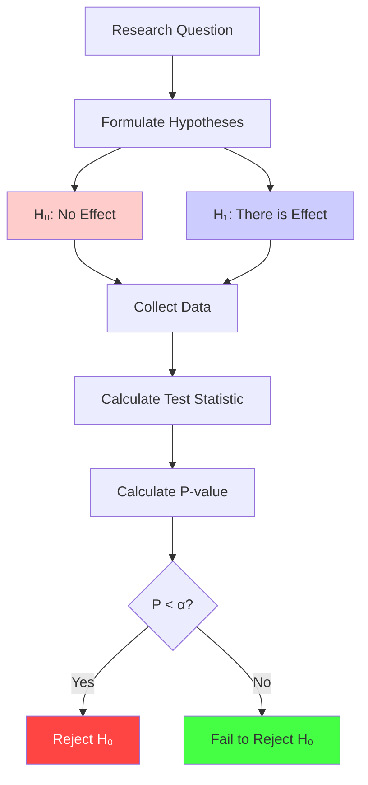

Visual guide to null hypothesis testing and the scientific method of statistical inference.

---

## What is a Null Hypothesis?

**Null Hypothesis (H₀)**: A statement of "no effect" or "no difference" that we test against.

**Alternative Hypothesis (H₁ or Hₐ)**: What we suspect might be true instead.



---

## Visual Representation

### Error Types

| Reality → | H₀ is True | H₁ is True |
|-----------|------------|------------|
| **Reject H₀** | ❌ Type I Error<br/>(False Positive)<br/>Probability = α | ✅ Correct Decision<br/>(True Positive)<br/>Probability = Power |
| **Fail to Reject H₀** | ✅ Correct Decision<br/>(True Negative)<br/>Probability = 1 - α | ❌ Type II Error<br/>(False Negative)<br/>Probability = β |

**Key Points:**
- **Type I Error (α)**: Rejecting H₀ when it's actually true (false alarm)
- **Type II Error (β)**: Failing to reject H₀ when H₁ is true (missed detection)
- **Power (1 - β)**: Probability of correctly detecting an effect when it exists

---

## Types of Hypotheses

### Two-Tailed Test

$$
\begin{aligned}
H_0 &: \mu = \mu_0 \\
H_1 &: \mu \neq \mu_0
\end{aligned}
$$

**Critical regions in both tails:**
- Reject H₀ if test statistic is too far from center in either direction
- α is split between both tails (α/2 each)
- For α = 0.05: critical values at ±1.96 standard deviations

### One-Tailed Test (Right)

$$
\begin{aligned}
H_0 &: \mu \leq \mu_0 \\
H_1 &: \mu > \mu_0
\end{aligned}
$$

### One-Tailed Test (Left)

$$
\begin{aligned}
H_0 &: \mu \geq \mu_0 \\
H_1 &: \mu < \mu_0
\end{aligned}
$$

---

## Decision Making

See the error types table above for the complete decision matrix.

---

## Common Examples

### Example 1: Drug Testing

```
H₀: Drug has no effect (μ_drug = μ_placebo)
H₁: Drug has an effect (μ_drug ≠ μ_placebo)

Type I Error: Approve ineffective drug
Type II Error: Reject effective drug
```

### Example 2: Quality Control

```
H₀: Product meets specifications
H₁: Product is defective

Type I Error: Reject good product
Type II Error: Accept defective product
```

### Example 3: Criminal Trial

```
H₀: Defendant is innocent
H₁: Defendant is guilty

Type I Error: Convict innocent person
Type II Error: Acquit guilty person
```

---

## Power Analysis

**Statistical Power** = Probability of correctly rejecting H₀ when H₁ is true

$$
\text{Power} = 1 - \beta
$$

```p5js
sketch.setup = function() {
  sketch.createCanvas(800, 450);
  sketch.noLoop();
}

sketch.draw = function() {
  sketch.background(255);
  
  // Title
  sketch.fill(0);
  sketch.textSize(18);
  sketch.textAlign(sketch.CENTER);
  sketch.text('Statistical Power Visualization', sketch.width/2, 30);
  
  const y = 250;
  const sigma = 60;
  
  // H₀ distribution
  sketch.fill(255, 200, 200, 150);
  sketch.stroke(200, 0, 0);
  sketch.strokeWeight(2);
  sketch.beginShape();
  for (let x = 50; x < 500; x++) {
    const z = (x - 200) / sigma;
    const py = y - 120 * Math.exp(-0.5 * z * z);
    sketch.vertex(x, py);
  }
  sketch.vertex(500, y + 50);
  sketch.vertex(50, y + 50);
  sketch.endShape(sketch.CLOSE);
  
  // H₁ distribution (shifted right)
  sketch.fill(200, 200, 255, 150);
  sketch.stroke(0, 0, 200);
  sketch.strokeWeight(2);
  sketch.beginShape();
  for (let x = 200; x < 750; x++) {
    const z = (x - 500) / sigma;
    const py = y - 120 * Math.exp(-0.5 * z * z);
    sketch.vertex(x, py);
  }
  sketch.vertex(750, y + 50);
  sketch.vertex(200, y + 50);
  sketch.endShape(sketch.CLOSE);
  
  // Critical value
  const critX = 200 + 1.645 * sigma;
  sketch.stroke(0, 200, 0);
  sketch.strokeWeight(3);
  sketch.line(critX, y - 130, critX, y + 50);
  
  // Shade power region
  sketch.fill(0, 255, 0, 100);
  sketch.noStroke();
  sketch.beginShape();
  for (let x = critX; x < 750; x++) {
    const z = (x - 500) / sigma;
    const py = y - 120 * Math.exp(-0.5 * z * z);
    sketch.vertex(x, py);
  }
  sketch.vertex(750, y + 50);
  sketch.vertex(critX, y + 50);
  sketch.endShape(sketch.CLOSE);
  
  // Shade β region
  sketch.fill(0, 0, 255, 100);
  sketch.beginShape();
  for (let x = 200; x < critX; x++) {
    const z = (x - 500) / sigma;
    const py = y - 120 * Math.exp(-0.5 * z * z);
    sketch.vertex(x, py);
  }
  sketch.vertex(critX, y + 50);
  sketch.vertex(200, y + 50);
  sketch.endShape(sketch.CLOSE);
  
  // Labels
  sketch.fill(200, 0, 0);
  sketch.noStroke();
  sketch.textSize(14);
  sketch.text('H₀', 200, y - 140);
  
  sketch.fill(0, 0, 200);
  sketch.text('H₁', 500, y - 140);
  
  sketch.fill(0, 200, 0);
  sketch.textSize(12);
  sketch.text('Critical', critX, y - 145);
  sketch.text('Value', critX, y - 130);
  
  sketch.fill(0, 0, 255);
  sketch.text('β (Type II Error)', 350, y - 50);
  
  sketch.fill(0, 200, 0);
  sketch.text('Power = 1 - β', 600, y - 50);
  sketch.text('(Correctly reject H₀)', 600, y - 35);
  
  // Info
  sketch.fill(0);
  sketch.textSize(14);
  sketch.textAlign(sketch.CENTER);
  sketch.text('Larger effect size → More power', sketch.width/2, sketch.height - 60);
  sketch.text('Larger sample size → More power', sketch.width/2, sketch.height - 40);
  sketch.text('Larger α → More power (but more Type I errors)', sketch.width/2, sketch.height - 20);
}
```

---

## Steps in Hypothesis Testing

1. **State hypotheses**: Define H₀ and H₁
2. **Choose significance level**: Usually α = 0.05
3. **Select test**: t-test, z-test, chi-square, etc.
4. **Calculate test statistic**: From sample data
5. **Find p-value**: Probability of observing data under H₀
6. **Make decision**: 
   - If p < α: Reject H₀
   - If p ≥ α: Fail to reject H₀
7. **Interpret**: In context of original question

---

## Key Concepts

### Significance Level (α)

- Probability of Type I error
- Typically 0.05, 0.01, or 0.001
- Set **before** collecting data

### Confidence Level

$$
\text{Confidence Level} = 1 - \alpha
$$

- 95% confidence → α = 0.05
- 99% confidence → α = 0.01

### Critical Region

- Range of test statistic values that lead to rejecting H₀
- Determined by α and test type (one/two-tailed)

---

## Common Pitfalls

1. **Confusing "fail to reject" with "accept"**
   - We never "prove" H₀ is true
   - We only have insufficient evidence against it

2. **P-hacking**
   - Testing multiple hypotheses until finding p < 0.05
   - Use multiple comparison corrections

3. **Ignoring effect size**
   - Statistical significance ≠ practical importance
   - Always report effect sizes

4. **One-sided vs two-sided**
   - Choose before seeing data
   - One-sided has more power but is less conservative

---

## Further Reading

- [Hypothesis Testing - Wikipedia](https://en.wikipedia.org/wiki/Statistical_hypothesis_testing)
- [Type I and Type II Errors](https://en.wikipedia.org/wiki/Type_I_and_type_II_errors)
- See also: P-values, Confidence Intervals, Statistical Power

