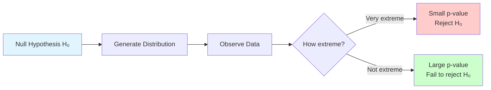
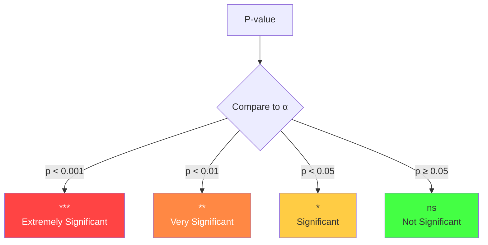
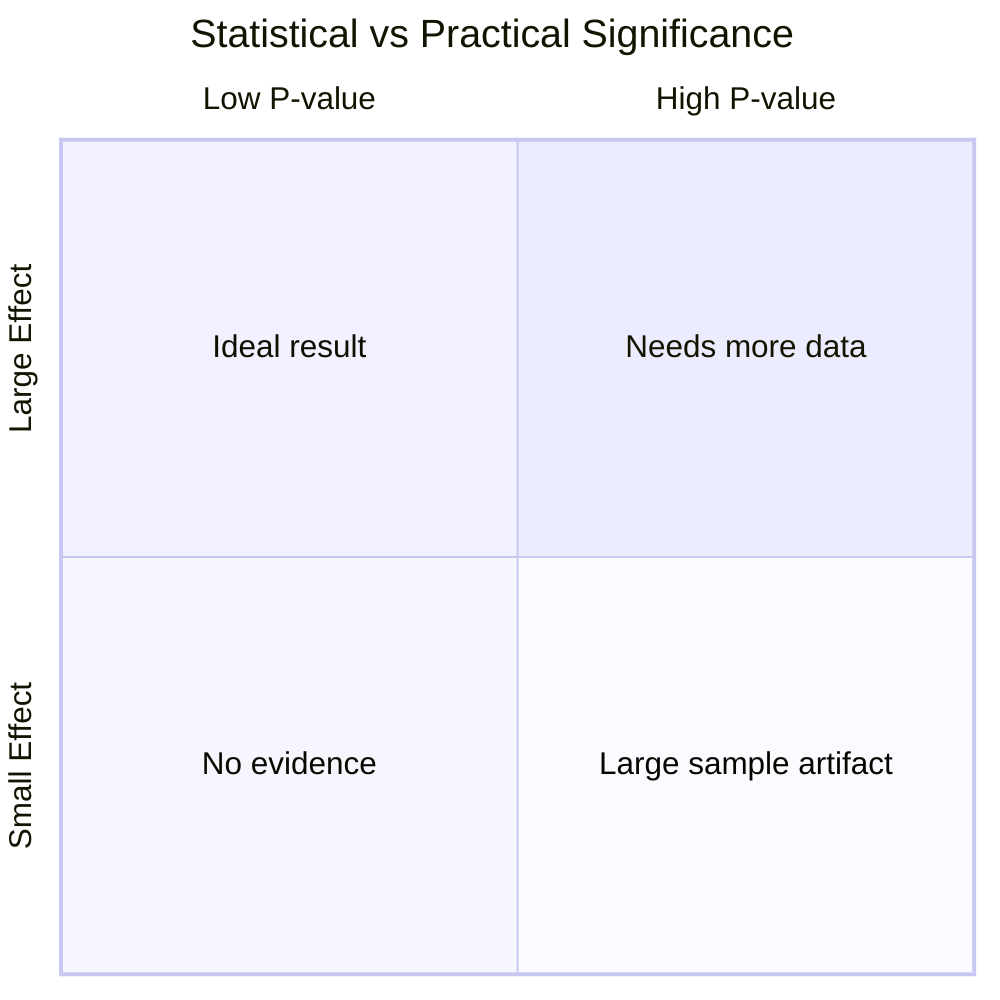

Visual guide to understanding p-values and what they really mean.

---

## What is a P-Value?

**P-value**: The probability of observing data at least as extreme as what we observed, **assuming the null hypothesis is true**.

$$
p = P(\text{data as extreme or more} \mid H_0 \text{ is true})
$$

---

## Visual Intuition

The p-value represents the probability of observing data as extreme or more extreme than what we observed, assuming the null hypothesis is true.



**Conceptual View:**

- **Null Distribution**: The expected distribution if H₀ is true
- **Observed Value**: Your actual measurement
- **P-value**: The area in the tail beyond your observed value
- **α threshold**: Commonly 0.05 (5%)

**Interpretation:**
- Small p-value (< 0.05): Data is unlikely under H₀ → Evidence against H₀
- Large p-value (≥ 0.05): Data is consistent with H₀ → Insufficient evidence against H₀

---

## Interactive P-Value Calculator

```p5js
let observedValue = 2.0;
let slider;

sketch.setup = function() {
  sketch.createCanvas(800, 550);
  
  slider = sketch.createSlider(-4, 4, 2, 0.1);
  slider.position(300, 570);
  slider.style('width', '200px');
  
  sketch.textAlign(sketch.CENTER);
}

sketch.draw = function() {
  sketch.background(255);
  observedValue = slider.value();
  
  // Title
  sketch.fill(0);
  sketch.textSize(18);
  sketch.text('Interactive P-Value Calculator', sketch.width/2, 30);
  
  const centerX = sketch.width / 2;
  const centerY = 300;
  const sigma = 80;
  
  // Draw null distribution
  sketch.fill(200, 200, 255, 150);
  sketch.stroke(0, 0, 200);
  sketch.strokeWeight(2);
  sketch.beginShape();
  for (let x = 50; x < sketch.width - 50; x++) {
    const z = (x - centerX) / sigma;
    const y = centerY - 150 * Math.exp(-0.5 * z * z);
    sketch.vertex(x, y);
  }
  sketch.vertex(sketch.width - 50, centerY + 50);
  sketch.vertex(50, centerY + 50);
  sketch.endShape(sketch.CLOSE);
  
  // Observed value
  const observedX = centerX + observedValue * sigma;
  sketch.stroke(255, 0, 0);
  sketch.strokeWeight(3);
  sketch.line(observedX, centerY - 160, observedX, centerY + 50);
  
  // Calculate p-value (two-tailed)
  const z = sketch.abs(observedValue);
  const pValue = 2 * (1 - normalCDF(z));
  
  // Shade p-value regions (two-tailed)
  sketch.fill(255, 0, 0, 100);
  sketch.noStroke();
  
  // Right tail
  sketch.beginShape();
  for (let x = observedX; x < sketch.width - 50; x++) {
    const zVal = (x - centerX) / sigma;
    const y = centerY - 150 * Math.exp(-0.5 * zVal * zVal);
    sketch.vertex(x, y);
  }
  sketch.vertex(sketch.width - 50, centerY + 50);
  sketch.vertex(observedX, centerY + 50);
  sketch.endShape(sketch.CLOSE);
  
  // Left tail (mirror)
  const mirrorX = centerX - observedValue * sigma;
  sketch.beginShape();
  for (let x = 50; x < mirrorX; x++) {
    const zVal = (x - centerX) / sigma;
    const y = centerY - 150 * Math.exp(-0.5 * zVal * zVal);
    sketch.vertex(x, y);
  }
  sketch.vertex(mirrorX, centerY + 50);
  sketch.vertex(50, centerY + 50);
  sketch.endShape(sketch.CLOSE);
  
  // Mirror line
  sketch.stroke(255, 0, 0);
  sketch.strokeWeight(3);
  sketch.line(mirrorX, centerY - 160, mirrorX, centerY + 50);
  
  // Significance thresholds
  sketch.stroke(0, 200, 0, 150);
  sketch.strokeWeight(2);
  const alpha005X = centerX + 1.96 * sigma;
  sketch.line(alpha005X, centerY - 160, alpha005X, centerY + 50);
  sketch.line(centerX - 1.96 * sigma, centerY - 160, centerX - 1.96 * sigma, centerY + 50);
  
  // Results
  sketch.fill(0);
  sketch.noStroke();
  sketch.textSize(16);
  sketch.textAlign(sketch.LEFT);
  sketch.text(`Z-score: ${observedValue.toFixed(2)}`, 50, 80);
  
  sketch.fill(255, 0, 0);
  sketch.textSize(20);
  sketch.text(`P-value: ${pValue.toFixed(4)}`, 50, 110);
  
  // Interpretation
  sketch.fill(0);
  sketch.textSize(14);
  if (pValue < 0.001) {
    sketch.fill(200, 0, 0);
    sketch.text('Extremely significant (p < 0.001)', 50, 140);
    sketch.text('Very strong evidence against H₀', 50, 160);
  } else if (pValue < 0.01) {
    sketch.fill(200, 100, 0);
    sketch.text('Very significant (p < 0.01)', 50, 140);
    sketch.text('Strong evidence against H₀', 50, 160);
  } else if (pValue < 0.05) {
    sketch.fill(200, 150, 0);
    sketch.text('Significant (p < 0.05)', 50, 140);
    sketch.text('Evidence against H₀', 50, 160);
  } else {
    sketch.fill(0, 150, 0);
    sketch.text('Not significant (p ≥ 0.05)', 50, 140);
    sketch.text('Insufficient evidence against H₀', 50, 160);
  }
  
  // Slider label
  sketch.fill(0);
  sketch.textAlign(sketch.CENTER);
  sketch.textSize(14);
  sketch.text('Drag slider to change observed Z-score', sketch.width/2, sketch.height - 15);
}

function normalCDF(z) {
  // Approximation of standard normal CDF
  const t = 1 / (1 + 0.2316419 * sketch.abs(z));
  const d = 0.3989423 * Math.exp(-z * z / 2);
  const prob = d * t * (0.3193815 + t * (-0.3565638 + t * (1.781478 + t * (-1.821256 + t * 1.330274))));
  return z > 0 ? 1 - prob : prob;
}
```

---

## Common Misconceptions

### ❌ Wrong: "P-value is the probability that H₀ is true"

**No!** P-value assumes H₀ is true and calculates probability of data.

### ❌ Wrong: "P < 0.05 means the result is important"

**No!** Statistical significance ≠ practical significance.

### ❌ Wrong: "P > 0.05 proves H₀ is true"

**No!** Failing to reject H₀ doesn't prove it's true (absence of evidence ≠ evidence of absence).

### ✅ Correct: "P-value measures compatibility of data with H₀"

Small p-value = data is surprising if H₀ were true.

---

## Significance Levels



---

## Example: Coin Flip Test

```python
import numpy as np
from scipy import stats

# Observed: 65 heads out of 100 flips
# H₀: Coin is fair (p = 0.5)
# H₁: Coin is biased (p ≠ 0.5)

n = 100
observed_heads = 65
expected = 0.5

# Binomial test
p_value = stats.binom_test(observed_heads, n, expected, alternative='two-sided')
print(f"P-value: {p_value:.4f}")

# Interpretation
if p_value < 0.05:
    print("Reject H₀: Coin appears biased")
else:
    print("Fail to reject H₀: Coin appears fair")
```

---

## P-Value vs Effect Size

Statistical significance (p-value) and practical significance (effect size) are different concepts:

| Effect Size | P-value < 0.05 | P-value ≥ 0.05 |
|-------------|----------------|----------------|
| **Large** | ✅ Significant & Important<br/>*Best case* | ⚠️ Not significant but Important<br/>*May need more data* |
| **Small** | ⚠️ Significant but Not Important<br/>*Large sample artifact* | ❌ Not significant & Not Important<br/>*No evidence* |



**Key Insight:** With large enough samples, even tiny (unimportant) effects can be statistically significant!

---

## Key Takeaways

1. **P-value ≠ Probability H₀ is true**
   - It's P(data | H₀), not P(H₀ | data)

2. **Threshold α = 0.05 is arbitrary**
   - Not a magical boundary
   - Consider context and field standards

3. **Statistical ≠ Practical significance**
   - Small effects can be "significant" with large samples
   - Large effects can be "non-significant" with small samples

4. **P-values are continuous**
   - Don't just report "p < 0.05"
   - Report exact p-value

5. **Multiple comparisons problem**
   - More tests = higher chance of false positives
   - Use corrections (Bonferroni, FDR)

---

## Relationship to Confidence Intervals

```
If 95% CI excludes H₀ value → p < 0.05
If 95% CI includes H₀ value → p ≥ 0.05
```

Confidence intervals provide more information than p-values alone!

---

## Further Reading

- [P-value - Wikipedia](https://en.wikipedia.org/wiki/P-value)
- [ASA Statement on P-values](https://www.amstat.org/asa/files/pdfs/p-valuestatement.pdf)
- See also: Null Hypothesis, Confidence Intervals, Effect Size

