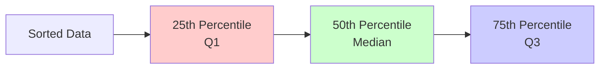

Visual guide to percentiles, quartiles, and quantiles for understanding data distribution.

---

## What are Percentiles?

**Percentile**: The value below which a given percentage of observations fall.

- **50th percentile** = Median (half the data is below)
- **25th percentile** = First quartile (Q1)
- **75th percentile** = Third quartile (Q3)



**Key Concept:** The shaded area under a distribution curve up to a percentile line represents the percentage of data below that value.

---

## Box Plot Representation

A **box plot** (box-and-whisker plot) visualizes the five-number summary and quartiles.

```text
    Min          Q1        Median      Q3          Max
     |           |           |          |           |
     |-----------|===========|==========|-----------|
                    ← IQR →
                 (middle 50%)
```

**Components:**
- **Box**: Contains middle 50% of data (from Q1 to Q3)
- **Line inside box**: Median (Q2)
- **Whiskers**: Extend to minimum and maximum (or 1.5×IQR for outlier detection)
- **IQR (Interquartile Range)**: Q3 - Q1 (measure of spread)

---

## Interactive Percentile Calculator

```p5js
let data = [];
let slider;

function setup() {
  createCanvas(800, 550);
  
  // Generate data
  for (let i = 0; i < 1000; i++) {
    data.push(randomGaussian(50, 15));
  }
  data.sort((a, b) => a - b);
  
  slider = createSlider(0, 100, 50, 1);
  slider.position(300, 570);
  slider.style('width', '200px');
}

function draw() {
  background(255);
  
  const percentile = slider.value();
  const index = floor((percentile / 100) * (data.length - 1));
  const value = data[index];
  
  // Title
  fill(0);
  textSize(18);
  textAlign(CENTER);
  text('Interactive Percentile Explorer', width/2, 30);
  
  // Draw histogram
  const bins = 50;
  const minVal = min(data);
  const maxVal = max(data);
  const range = maxVal - minVal;
  const binWidth = range / bins;
  
  let hist = new Array(bins).fill(0);
  for (let d of data) {
    let bin = floor(((d - minVal) / range) * (bins - 1));
    hist[bin]++;
  }
  
  const maxCount = max(hist);
  const histWidth = 700;
  const histHeight = 300;
  const histX = 50;
  const histY = 100;
  
  // Draw histogram bars
  for (let i = 0; i < bins; i++) {
    const x = histX + (i / bins) * histWidth;
    const w = histWidth / bins;
    const h = (hist[i] / maxCount) * histHeight;
    const y = histY + histHeight - h;
    
    // Color based on percentile
    const binValue = minVal + (i / bins) * range;
    if (binValue <= value) {
      fill(255, 0, 0, 150);
    } else {
      fill(200, 200, 200, 150);
    }
    noStroke();
    rect(x, y, w, h);
  }
  
  // Draw percentile line
  const px = histX + ((value - minVal) / range) * histWidth;
  stroke(255, 0, 0);
  strokeWeight(3);
  line(px, histY, px, histY + histHeight);
  
  // Labels
  fill(0);
  noStroke();
  textSize(16);
  textAlign(LEFT);
  text(`Percentile: ${percentile}%`, 50, histY + histHeight + 50);
  text(`Value: ${value.toFixed(2)}`, 50, histY + histHeight + 75);
  text(`Count below: ${index} / ${data.length}`, 50, histY + histHeight + 100);
  
  fill(255, 0, 0);
  text(`${percentile}% of data is below ${value.toFixed(2)}`, 50, histY + histHeight + 125);
  
  // Slider label
  fill(0);
  textAlign(CENTER);
  textSize(14);
  text('Drag slider to change percentile', width/2, height - 15);
}
```

---

## Common Percentiles

| Percentile | Name | Meaning |
|------------|------|---------|
| 0th | Minimum | Smallest value |
| 25th | Q1 (First Quartile) | 25% below, 75% above |
| 50th | Q2 (Median) | Middle value |
| 75th | Q3 (Third Quartile) | 75% below, 25% above |
| 100th | Maximum | Largest value |

### Special Percentiles

- **Deciles**: 10th, 20th, ..., 90th (divide into 10 parts)
- **Quintiles**: 20th, 40th, 60th, 80th (divide into 5 parts)
- **Quartiles**: 25th, 50th, 75th (divide into 4 parts)

---

## Interquartile Range (IQR)

$$
\text{IQR} = Q_3 - Q_1
$$

**Use**: Measure of spread that's robust to outliers.

**Outlier Detection**:
- Lower fence: $Q_1 - 1.5 \times \text{IQR}$
- Upper fence: $Q_3 + 1.5 \times \text{IQR}$

```python
import numpy as np

data = np.random.normal(100, 15, 1000)

# Calculate percentiles
q1 = np.percentile(data, 25)
q2 = np.percentile(data, 50)  # median
q3 = np.percentile(data, 75)

iqr = q3 - q1

# Outlier detection
lower_fence = q1 - 1.5 * iqr
upper_fence = q3 + 1.5 * iqr

outliers = data[(data < lower_fence) | (data > upper_fence)]
print(f"Found {len(outliers)} outliers")
```

---

## Percentile Rank

**Percentile Rank**: The percentage of scores that fall below a given value.

$$
\text{Percentile Rank} = \frac{\text{Number of values below}}{\text{Total number of values}} \times 100
$$

```python
def percentile_rank(data, value):
    """Calculate percentile rank of a value"""
    below = sum(x < value for x in data)
    return (below / len(data)) * 100

# Example
data = [10, 20, 30, 40, 50, 60, 70, 80, 90, 100]
rank = percentile_rank(data, 55)
print(f"55 is at the {rank}th percentile")  # 50th percentile
```

---

## Quantiles

**Quantile**: Generalization of percentiles.

- **p-quantile**: Value that divides data so proportion p is below it
- Percentiles are quantiles expressed as percentages

$$
Q(p) = \text{value such that } P(X \leq Q(p)) = p
$$

```python
import numpy as np

data = np.random.normal(100, 15, 1000)

# Quantiles (0 to 1)
q_25 = np.quantile(data, 0.25)  # Same as 25th percentile
q_50 = np.quantile(data, 0.50)  # Median
q_75 = np.quantile(data, 0.75)  # Same as 75th percentile

# Percentiles (0 to 100)
p_25 = np.percentile(data, 25)
p_50 = np.percentile(data, 50)
p_75 = np.percentile(data, 75)

# They're the same!
assert q_25 == p_25
```

---

## Applications

### 1. Growth Charts

Children's height/weight percentiles show where a child falls relative to peers.

### 2. Test Scores

SAT/GRE scores often reported as percentiles.

### 3. Income Distribution

Median income = 50th percentile of income distribution.

### 4. Performance Metrics

Website load time: "95th percentile < 2 seconds" means 95% of requests are faster than 2s.

### 5. Outlier Detection

Values beyond 1.5×IQR from quartiles are potential outliers.

---

## Percentiles vs Mean

| Measure | Pros | Cons | Best For |
|---------|------|------|----------|
| **Mean** | Uses all data<br/>Mathematically convenient | Sensitive to outliers<br/>Can be misleading for skewed data | Symmetric distributions<br/>No outliers |
| **Median (50th percentile)** | Robust to outliers<br/>Represents "typical" value | Ignores magnitude of extremes<br/>Less efficient statistically | Skewed distributions<br/>Data with outliers |

**Key Insight:**
- **Right-skewed data**: Mean > Median (pulled right by high outliers)
- **Left-skewed data**: Mean < Median (pulled left by low outliers)
- **Symmetric data**: Mean ≈ Median

**Example:** Income distribution is right-skewed, so median income is more representative than mean income.

---

## Further Reading

- [Percentile - Wikipedia](https://en.wikipedia.org/wiki/Percentile)
- [Quantile - Wikipedia](https://en.wikipedia.org/wiki/Quantile)
- [Box Plot - Wikipedia](https://en.wikipedia.org/wiki/Box_plot)

